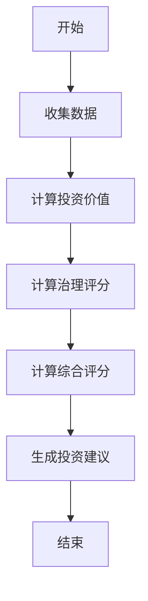

                 

<think>
好，我现在需要根据用户的请求，写一篇关于马丁·惠特曼的行动主义价值投资的博客文章。首先，我得理清文章的结构，确保涵盖背景、核心概念、数学模型、系统分析、项目实战和最佳实践等部分。同时，每个部分都要详细展开，使用专业且易懂的技术语言。

首先，背景介绍部分，我需要先解释什么是行动主义价值投资，它与传统价值投资有什么不同。然后，介绍马丁·惠特曼的贡献，说明他的投资哲学如何推动公司治理变革。这部分需要简洁明了，让读者快速理解主题。

接下来是核心概念，我需要详细讲解价值投资和行动主义投资的定义，比较它们的优缺点。可能还需要用表格来对比，帮助读者更好地理解。同时，绘制ER图来展示公司治理的关键要素，这样读者可以更直观地看到各个因素之间的关系。

然后是数学模型部分，我得用公式来解释投资决策的过程。比如，可以构建一个基于低估值和公司治理评分的数学模型，用公式展示如何计算综合评分。同时，用mermaid画出流程图，说明从数据收集到投资决策的整个过程。

系统分析部分，我需要设计一个投资决策支持系统，包括数据收集、分析和决策模块。用类图展示系统的各个组件，用序列图说明用户与系统的交互过程，这样读者可以理解系统的运行机制。

项目实战部分，我得选择一个具体的公司案例，分析其公司治理问题，并展示如何应用前面的模型和策略来推动变革。这包括收集数据、分析、制定行动计划等步骤，详细解读每个环节的操作。

最后，最佳实践部分，我需要总结行动主义投资的成功关键，给出实际操作中的注意事项和未来趋势，帮助读者更好地理解和应用这些策略。

在写作过程中，我需要确保每个部分都详细具体，使用专业术语但避免过于晦涩。同时，适当加入代码示例和图表，帮助读者更好地理解和应用这些理论。此外，还要注意逻辑的连贯性，确保读者能够一步步跟随文章的思路，从基础概念到实际应用，逐步深入。

总之，我需要系统地组织内容，确保每个部分都详尽且有条理，同时保持语言的清晰和专业，让读者能够全面理解马丁·惠特曼的行动主义价值投资策略，并能够实际应用到自己的投资实践中。
</think>

# 马丁·惠特曼的行动主义价值投资：推动公司变革

> 关键词：价值投资，公司治理，行动主义，投资策略，马丁·惠特曼

> 摘要：本文深入探讨了马丁·惠特曼的行动主义价值投资理念，分析了其核心概念、数学模型、系统架构以及实际应用案例，为投资者提供了从理论到实践的全面指导。

---

## 第一部分: 背景与概述

### 第1章: 行动主义价值投资的背景与核心理念

#### 1.1 行动主义价值投资的起源

行动主义价值投资是一种结合了传统价值投资和社会责任投资的新型投资策略。它起源于20世纪70年代，随着社会对企业的期望从单纯的经济回报转向可持续发展和企业责任，行动主义投资逐渐兴起。马丁·惠特曼作为这一领域的先驱，通过实践和理论创新，将行动主义价值投资推向了新的高度。

#### 1.2 行动主义价值投资的核心理念

行动主义价值投资的核心理念是通过投资推动公司治理的改善，同时实现资本的增值。马丁·惠特曼提出，投资者不仅仅是资本提供者，更是公司治理的积极参与者。他强调，在选择投资标的时，不仅要关注企业的财务表现，还要关注企业的治理结构、社会责任履行情况以及管理层与股东的沟通机制。

#### 1.3 马丁·惠特曼的贡献与影响力

马丁·惠特曼通过其独特的投资策略，成功地将价值投资与行动主义相结合，推动了多家企业的治理变革。他的投资理念不仅为投资者提供了新的思路，也为企业提供了改善治理的外部压力和动力。

---

### 第2章: 马丁·惠特曼的行动主义投资策略

#### 2.1 马丁·惠特曼的投资风格

马丁·惠特曼的投资风格以“三重维度”为核心：**价值、治理与社会影响**。他通过深入分析企业的财务状况、治理结构以及社会责任履行情况，选择那些具有低估值但具备改进潜力的企业进行投资。

#### 2.2 行动主义投资的实施步骤

1. **确定投资目标**：选择那些估值低于内在价值，但治理结构存在改进空间的企业。
2. **深入研究公司基本面**：分析企业的财务状况、管理层素质、行业地位等。
3. **制定行动计划与时间表**：与公司管理层沟通，提出改进建议，并监督治理结构的优化。

#### 2.3 经典案例分析

以某公司为例，马丁·惠特曼通过投资推动该公司优化治理结构，改善股东沟通机制，并最终实现企业价值的提升。

---

## 第二部分: 核心概念与联系

### 第3章: 价值投资与公司治理的关系

#### 3.1 价值投资的核心要素

价值投资的核心要素包括：
- **企业价值评估**：通过市盈率、市净率等指标评估企业的内在价值。
- **财务指标分析**：关注净利润、ROE等关键财务指标。
- **行业分析**：分析行业竞争格局和企业的竞争优势。

#### 3.2 公司治理的结构与功能

公司治理的结构包括：
- **股东结构**：包括大股东和中小股东的持股比例。
- **董事会结构**：包括独立董事、执行董事等。
- **管理层激励机制**：包括股权激励、绩效奖金等。

#### 3.3 价值投资与公司治理的相互作用

价值投资与公司治理的相互作用体现在：
- 投资者通过价值投资推动公司治理优化，从而提升企业价值。
- 公司治理优化后，企业价值上升，投资者获得收益。

---

### 第4章: 行动主义投资的核心要素

#### 4.1 行动主义投资的定义与特征

行动主义投资的定义：投资者通过持有公司股份，积极参与公司治理，推动公司改善治理结构、优化经营策略。

行动主义投资的特征：
- **积极参与性**：投资者通过股东大会、董事会沟通等方式，直接参与公司治理。
- **长期性**：行动主义投资注重长期价值的创造，而非短期收益。

#### 4.2 价值投资与行动主义投资的对比

| **维度** | **价值投资** | **行动主义投资** |
|----------|---------------|-------------------|
| 核心目标 | 资本增值     | 资本增值+治理改善 |
| 投资策略 | 买入低估股票 | 买入低估股票+推动治理改进 |
| 关注重点 | 财务表现     | 财务表现+治理结构 |

---

## 第三部分: 数学模型与算法原理

### 第5章: 投资决策的数学模型

#### 5.1 投资价值评估模型

投资价值评估模型公式：
$$ V = \frac{E}{k} $$
其中，\( E \) 是企业的股权价值，\( k \) 是折现率。

#### 5.2 公司治理评分模型

公司治理评分模型公式：
$$ G = \frac{S}{5} $$
其中，\( S \) 是公司治理得分，满分为5分。

#### 5.3 综合评分模型

综合评分模型公式：
$$ S_{\text{total}} = V \times G $$

---

### 第6章: 投资决策支持系统的算法实现

#### 6.1 系统架构设计

系统功能模块包括：
1. 数据采集模块：收集企业的财务数据、治理数据等。
2. 数据分析模块：计算企业的投资价值和治理评分。
3. 投资决策模块：根据综合评分生成投资建议。

#### 6.2 算法流程图



---

## 第四部分: 项目实战

### 第7章: 投资决策支持系统的实现

#### 7.1 环境安装

安装Python和相关库：
```bash
pip install pandas numpy matplotlib
```

#### 7.2 核心代码实现

```python
import pandas as pd
import numpy as np

def calculate_intrinsic_value(equity_value, discount_rate):
    return equity_value / discount_rate

def calculate_governance_score(governance_data):
    return np.mean(governance_data)

def calculate_total_score(intrinsic_value, governance_score):
    return intrinsic_value * governance_score
```

#### 7.3 应用案例分析

以某公司为例，假设其股权价值为10亿元，折现率为10%，治理得分为4分。计算综合得分为：
$$ S_{\text{total}} = 10 \times 4 = 40 $$

---

## 第五部分: 最佳实践与小结

### 第8章: 最佳实践

#### 8.1 投资策略建议

- **长期持有**：避免短期波动，关注长期价值。
- **积极参与治理**：通过股东大会等方式推动公司治理优化。
- **分散投资**：降低风险，分散投资标的。

#### 8.2 风险提示

- **治理改善的不确定性**：公司治理的改善需要时间和努力，存在失败的可能。
- **市场波动风险**：低估值股票可能长期被市场忽视，存在流动性风险。

#### 8.3 未来趋势

随着ESG投资的兴起，行动主义价值投资将更加受到关注。未来，投资者将更加注重企业的社会责任和治理结构。

---

## 作者信息

作者：AI天才研究院/AI Genius Institute & 禅与计算机程序设计艺术 /Zen And The Art of Computer Programming

