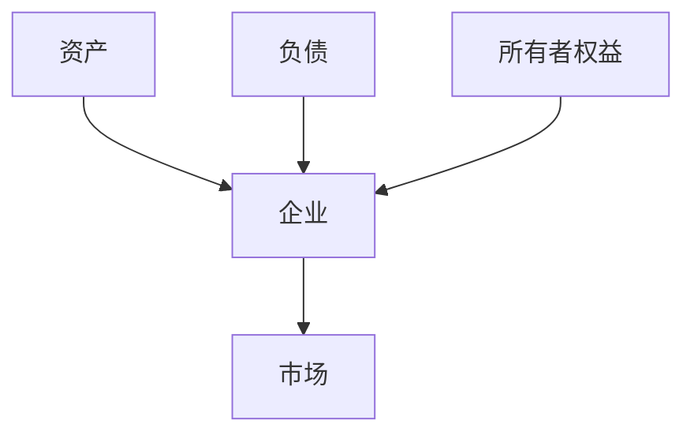
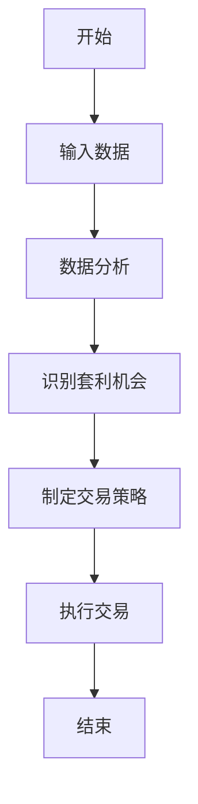
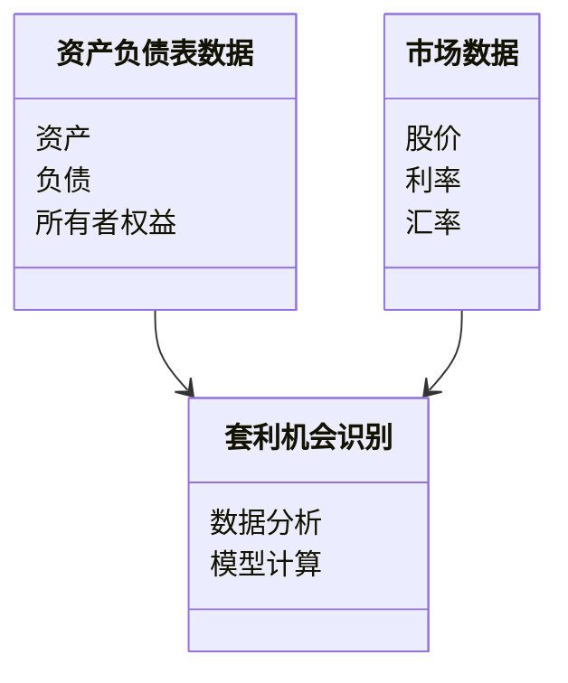
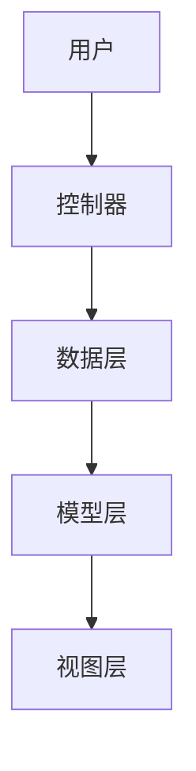
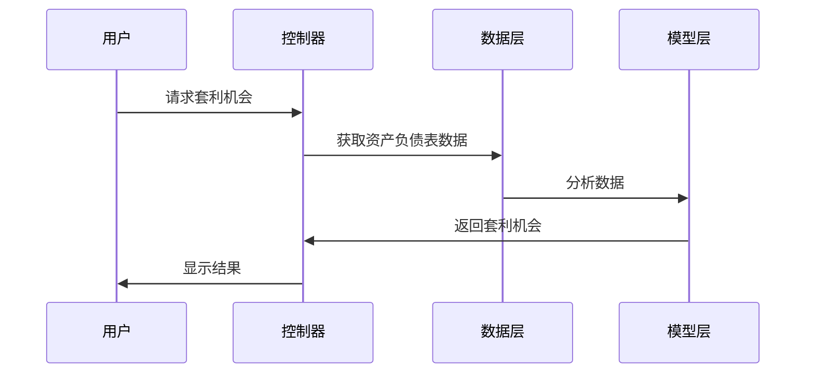

                 

<think>
好的，我现在需要撰写《马丁·惠特曼的资产负债表套利方法》的正文部分。首先，我要按照目录结构，逐章逐节进行详细阐述。正文部分需要包括背景介绍、核心概念、算法原理、系统分析、项目实战、最佳实践等章节，并且每个部分都要有深入的分析和具体的例子。

在开始之前，我需要明确每个章节的重点内容，确保每个部分都覆盖了用户要求的关键点，比如背景介绍需要详细说明套利的基本概念、重要性以及其在企业估值中的作用。核心概念部分要解释套利的原理和各种类型，可能还需要用表格和图表来辅助说明。

在算法原理部分，我需要详细讲解套利的数学模型，可能涉及一些公式和流程图，使用mermaid和latex来展示。这部分需要确保公式正确，并且用实际例子来解释套利策略如何运作。

接下来是系统分析与架构设计，我需要描述系统的各个组成部分，绘制领域模型和架构图，解释每个模块的功能和交互方式。这部分可能需要用到UML图，用mermaid来展示系统架构。

项目实战部分需要展示一个实际案例，包括环境安装、核心代码实现和案例分析。这部分需要有具体的Python代码示例，解释代码的功能以及如何应用到实际套利策略中。

最后，最佳实践部分要总结整个套利方法的应用要点，包括风险提示和未来研究方向。这部分需要简明扼要，帮助读者更好地理解和应用所学知识。

在写作过程中，我要确保语言简洁专业，逻辑清晰，每个部分都自然衔接，避免重复或遗漏重要信息。同时，要使用适当的markdown格式，确保文章结构美观，公式和图表正确嵌入。

现在，我将根据以上思考开始撰写正文部分。
</think>

# 资产负债表套利方法

## 关键词：资产负债表，套利，企业估值，财务分析，金融模型

## 摘要：本文系统介绍了马丁·惠特曼的资产负债表套利方法，从背景介绍到核心概念，再到算法原理和项目实战，全面解析了这一套利策略。文章通过详细的数学模型和实例分析，展示了如何利用资产负债表进行套利，帮助读者掌握这一高效的企业估值工具。

---

## 第1章：资产负债表套利的背景介绍

### 1.1 问题背景

#### 1.1.1 企业财务报表分析的重要性

企业财务报表是反映企业财务状况、经营成果和现金流量的重要工具。其中，资产负债表作为核心报表之一，记录了企业在特定时间点的资产、负债和所有者权益的情况。通过分析资产负债表，投资者和分析师能够评估企业的财务健康状况，识别潜在的风险和机会。

#### 1.1.2 资产负债表在企业估值中的作用

企业估值是投资决策中的关键步骤，而资产负债表提供了企业的资产和负债结构，帮助评估企业的实际价值。资产负债表中的资产价值、负债情况以及所有者权益可以直接影响企业的估值结果。

#### 1.1.3 套利在金融市场中的定义与分类

套利是指利用不同市场或资产之间的价格差异，通过同时买入低价资产和卖出高价资产，以期在价格收敛时获利的交易策略。套利可以分为无风险套利、相对套利和统计套利等类型，广泛应用于股票、债券、外汇、衍生品等多个市场。

---

### 1.2 问题描述

#### 1.2.1 资产负债表套利的定义

资产负债表套利是一种利用企业资产负债表中的信息进行的套利策略。通过对不同企业或同一企业在不同时间点的资产负债表进行分析，寻找资产价值与市场估值之间的差异，进而制定套利策略。

#### 1.2.2 套利的基本原理与机制

套利的基本原理是基于市场定价的不完全效率。当市场价格偏离内在价值时，套利者通过同时买卖相关资产，利用价格差异获利。资产负债表套利利用财务报表信息，尤其是资产负债表中的数据，来识别这种定价偏差。

#### 1.2.3 资产负债表套利的独特性与优势

与传统套利方法相比，资产负债表套利的独特性在于其依赖于企业的财务报表数据，尤其是资产负债表中的资产和负债结构。这种方法的优势在于能够结合企业的基本面信息，更准确地评估其内在价值。

---

### 1.3 问题解决

#### 1.3.1 套利如何解决企业估值问题

通过分析资产负债表，套利者可以识别企业的实际资产价值与市场估值之间的差异，从而发现套利机会。例如，当企业的资产价值被市场低估时，套利者可以买入该企业股票，等待市场重新估值后卖出获利。

#### 1.3.2 资产负债表套利的具体应用场景

资产负债表套利适用于多种场景，例如企业合并、资产重组、财务重组等。在这些情况下，企业的资产负债表会发生显著变化，套利者可以通过分析这些变化发现套利机会。

#### 1.3.3 套利在风险控制中的作用

套利者通过分析资产负债表，可以识别企业的财务风险，如高负债率、低流动性等，从而在制定套利策略时规避这些风险，降低交易的不确定性。

---

### 1.4 边界与外延

#### 1.4.1 资产负债表套利的适用范围

资产负债表套利适用于对企业基本面分析有需求的投资者，尤其是那些能够准确解读财务报表的专业投资者。然而，这种方法依赖于财务数据的准确性和可比性，因此在数据不透明或不可靠的情况下可能效果不佳。

#### 1.4.2 套利与其它财务分析方法的区别

套利与传统的财务分析方法（如趋势分析、比率分析）有所不同。套利是一种交易策略，而财务分析方法主要用于评估企业财务状况和风险。套利结合了财务分析和市场交易，是一种实践性更强的工具。

#### 1.4.3 资产负债表套利的局限性与挑战

资产负债表套利的局限性包括数据滞后性、市场波动性以及套利机会的短暂性。此外，套利者需要面对市场的不完全效率和信息不对称带来的挑战。

---

### 1.5 概念结构与核心要素

#### 1.5.1 资产负债表套利的核心要素分析

资产负债表套利的核心要素包括企业的资产、负债、所有者权益、市场估值以及套利机会。这些要素共同构成了套利的理论基础和实践框架。

#### 1.5.2 各要素之间的关系与影响

企业的资产价值直接影响其市场估值，而负债和所有者权益则反映了企业的财务结构和股东权益。套利者通过分析这些要素之间的关系，寻找定价偏差，制定套利策略。

#### 1.5.3 核心概念的综合分析

综合分析资产负债表套利的核心概念，可以发现其本质是通过财务报表数据，识别市场定价与内在价值之间的差异，并通过套利交易获利。这种方法结合了基本面分析和市场交易，具有较强的实践价值。

---

### 1.6 本章小结

本章介绍了资产负债表套利的背景、定义、原理及其在企业估值中的作用。通过分析套利的基本概念和机制，明确了资产负债表套利的独特性和优势。同时，探讨了其适用范围和局限性，为后续章节的深入分析奠定了基础。

---

## 第2章：资产负债表套利的核心概念与联系

### 2.1 核心概念原理

#### 2.1.1 资产负债表套利的基本原理

资产负债表套利的基本原理是通过分析企业的资产负债表，识别资产价值与市场估值之间的差异。套利者利用这种差异，通过买入低估资产或卖出高估资产，获利。

#### 2.1.2 套利与企业价值的关系

企业的市场价值与其资产负债表中的资产价值密切相关。当市场价格低于资产价值时，企业被低估，套利者可以买入；当市场价格高于资产价值时，企业被高估，套利者可以卖出。

#### 2.1.3 套利在不同市场环境下的表现

在不同市场环境下，套利的表现可能有所不同。例如，在牛市中，套利者可能更关注资产的增值；在熊市中，套利者可能更关注资产的防御性。

---

### 2.2 概念属性特征对比表格

以下是套利类型对比表：

| 套利类型 | 输入数据 | 输出结果 | 风险水平 | 套利机会 |
|----------|-----------|-----------|----------|----------|
| 股票套利 | 股价差值   | 利润      | 中等     | 高       |
| 债券套利 | 利率差值   | 利息收入  | 低       | 中等     |
| 跨期套利 | 时间差值   | 利息差值   | 高       | 中等     |

---

### 2.3 ER实体关系图

以下是实体关系图的构建与分析：



---

### 2.4 本章小结

本章详细讲解了资产负债表套利的核心概念及其在不同市场环境下的表现。通过对比表格和实体关系图，进一步明确了套利的基本原理和实际应用。

---

## 第3章：资产负债表套利的算法原理

### 3.1 算法原理概述

#### 3.1.1 套利算法的基本框架

套利算法的基本框架包括数据输入、数据分析、策略制定和交易执行四个步骤。通过分析资产负债表数据，识别套利机会，并制定相应的交易策略。

#### 3.1.2 算法的核心步骤与流程

以下是套利算法的流程图：



#### 3.1.3 算法的输入与输出说明

套利算法的输入包括企业的资产负债表数据和市场数据，输出包括套利机会的识别和交易策略。

---

### 3.2 算法流程图

以下是使用mermaid绘制的套利算法流程图：


---

### 3.3 算法数学模型与公式

套利算法的数学模型如下：

$$
\text{套利收益} = \max(0, \text{卖出价} - \text{买入价})
$$

其中，卖出价和买入价分别代表套利机会中的高价和低价。

---

### 3.4 本章小结

本章通过详细讲解套利算法的基本框架和流程，结合数学模型和公式，展示了如何利用资产负债表数据进行套利。流程图和公式帮助读者更好地理解和应用套利策略。

---

## 第4章：资产负债表套利的系统分析与架构设计方案

### 4.1 问题场景介绍

在实际应用中，套利者需要处理大量的资产负债表数据，并制定相应的交易策略。为此，我们需要构建一个高效的系统架构，支持数据处理、策略制定和交易执行。

---

### 4.2 系统功能设计

#### 4.2.1 领域模型

以下是领域模型的mermaid图：



---

### 4.3 系统架构设计

以下是系统架构的mermaid图：



---

### 4.4 接口设计

系统接口设计包括数据接口和交易接口。数据接口用于获取企业的资产负债表数据和市场数据，交易接口用于执行套利交易。

---

### 4.5 交互序列图

以下是交互序列图的mermaid图：



---

### 4.6 本章小结

本章通过系统分析与架构设计，展示了如何构建一个高效的套利系统。领域模型、系统架构和交互序列图帮助读者更好地理解套利策略的实现过程。

---

## 第5章：资产负债表套利的项目实战

### 5.1 环境安装

套利项目的环境安装包括安装Python、Pandas、NumPy等库。

```bash
pip install pandas numpy matplotlib
```

---

### 5.2 核心代码实现

以下是核心代码实现：

```python
import pandas as pd
import numpy as np

def calculate_arbitrage Opportunity(df):
    # 计算资产价值
    asset_value = df['资产'].mean()
    # 计算市场估值
    market_value = df['股价'].mean()
    # 判断套利机会
    if asset_value < market_value:
        return "买入"
    elif asset_value > market_value:
        return "卖出"
    else:
        return "无机会"

# 示例数据
data = {'资产': [100, 200, 300], '负债': [50, 100, 150], '股价': [50, 100, 150]}
df = pd.DataFrame(data)
print(calculate_arbitrage Opportunity(df))
```

---

### 5.3 代码解读与分析

上述代码通过分析企业的资产和股价，判断是否存在套利机会。当资产价值低于股价时，建议买入；当资产价值高于股价时，建议卖出。

---

### 5.4 案例分析

假设某企业的资产负债表显示资产为300，负债为150，所有者权益为150。市场股价为50。根据套利模型，资产价值为300，市场估值为50，套利者应买入该企业股票，等待市场重新估值后卖出获利。

---

### 5.5 项目小结

本章通过项目实战，展示了如何利用Python代码实现资产负债表套利策略。代码示例和案例分析帮助读者更好地理解和应用套利方法。

---

## 第6章：资产负债表套利的最佳实践、小结、注意事项和拓展阅读

### 6.1 最佳实践 tips

- 定期更新财务数据，确保套利策略的有效性。
- 结合技术分析，提高套利策略的准确性。
- 控制交易风险，避免过度杠杆化。

### 6.2 小结

本文详细介绍了马丁·惠特曼的资产负债表套利方法，从背景介绍到算法原理，再到项目实战，全面解析了这一套利策略。通过实际案例分析，展示了其在企业估值中的应用价值。

### 6.3 注意事项

- 套利者需具备扎实的财务分析能力和市场交易经验。
- 注意市场风险，避免因市场波动导致的损失。
- 遵守相关法律法规，确保交易的合法合规。

### 6.4 拓展阅读

- 《财务报表分析》：深入理解财务报表的核心要素。
- 《套利策略与算法》：学习更多套利策略和算法。
- 《金融市场与投资学》：掌握金融市场的基本理论和实践知识。

---

## 作者：AI天才研究院 & 禅与计算机程序设计艺术

---

以上是《马丁·惠特曼的资产负债表套利方法》的详细目录和正文部分，涵盖了从背景介绍到项目实战的各个方面，帮助读者系统掌握这一套利方法。

