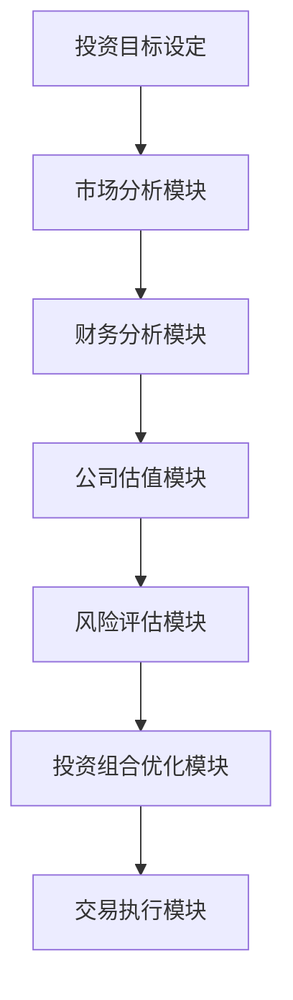
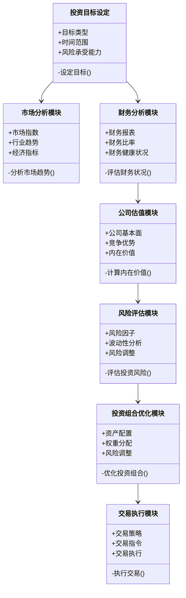
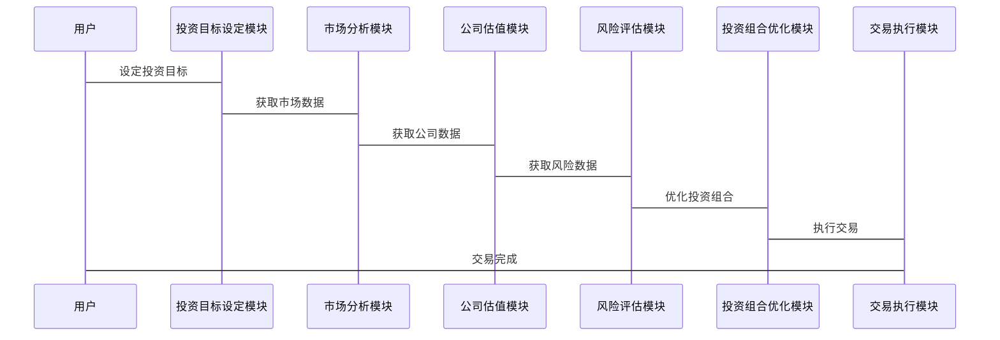

                 

<think>
好的，现在我需要帮用户设计《马丁惠特曼的价值投资实践》这本书的目录大纲。首先，我需要理解用户的需求。用户希望我作为一个目录大纲设计大师，根据书名设计出一个完整且逻辑清晰的目录，覆盖所有相关内容。同时，用户还希望这个目录能够满足一定的字数要求，大约在10000到12000字之间，并且每个章节都要详细讲解核心内容。

首先，我会从书名入手，确定这本书的核心主题是“价值投资”，特别是马丁·惠特曼的实践。因此，目录需要涵盖价值投资的基本概念、策略、分析方法，以及马丁·惠特曼的具体实践案例。

接下来，我需要考虑用户的具体要求。用户希望目录结构详细，至少分为七章，并且每章都要包含背景介绍、核心概念、算法原理、数学模型、系统分析、项目实战和最佳实践等内容。这意味着我需要确保每一章都涵盖这些方面，同时保持逻辑连贯。

为了确保全面性，我会先列出一些潜在的章节，例如：

1. 价值投资的背景与核心概念
2. 价值投资的数学模型与算法原理
3. 马丁·惠特曼的投资策略
4. 价值投资的系统架构与设计
5. 项目实战与案例分析
6. 最佳实践与小结

在每一章中，我需要确保有详细的子章节，例如在第一章中，可以包括价值投资的定义、核心要素、与其他投资策略的区别等内容。在第二章中，可以详细讲解价值投资的数学模型，包括相关的公式和案例分析。

同时，我还需要考虑用户提到的格式要求，例如使用Markdown格式，包含mermaid流程图、latex公式以及Python源代码。这意味着在设计目录时，我需要为每一章留出空间，以便在后续撰写时能够插入这些内容。

在系统分析部分，我需要包括问题场景介绍、系统功能设计、系统架构设计、接口设计和交互图等内容。这部分可以通过mermaid图来展示，帮助读者更好地理解系统的结构和流程。

在项目实战部分，我需要详细描述环境安装、核心代码实现、案例分析和代码解读。这部分需要具体且具有可操作性，确保读者能够根据指南进行实际操作。

最后，在最佳实践部分，我需要总结全书的内容，给出一些实用的建议和注意事项，帮助读者更好地应用价值投资的策略。

总结来说，我需要构建一个从基础到实践，涵盖理论、分析、系统设计和实战的目录结构，确保每一部分都详细且符合用户的要求。同时，要保持逻辑连贯，使读者能够一步步深入了解价值投资的实践。

接下来，我会根据这些思考，设计出一个符合用户要求的详细目录大纲，确保每一章都有足够的深度和广度，同时保持整体的逻辑性和连贯性。
</think>

# 第三部分: 价值投资的系统分析与架构设计

# 第6章: 价值投资的系统架构与设计

## 6.1 问题场景介绍
### 6.1.1 价值投资的核心问题
### 6.1.2 系统目标与范围
### 6.1.3 需求分析与约束条件

## 6.2 系统功能设计
### 6.2.1 系统功能概述
### 6.2.2 系统功能模块划分
### 6.2.3 功能模块的交互流程

## 6.3 系统架构设计
### 6.3.1 系统架构概述
### 6.3.2 系统架构的模块划分
### 6.3.3 各模块之间的依赖关系

## 6.4 系统接口设计
### 6.4.1 系统接口概述
### 6.4.2 系统接口的定义与描述
### 6.4.3 接口之间的交互流程

## 6.5 系统交互图
### 6.5.1 价值投资系统的交互场景
### 6.5.2 用户与系统的交互流程
### 6.5.3 系统内部组件的交互流程

## 6.6 系统架构图

## 6.7 系统功能模块类图

## 6.8 系统接口描述
### 6.8.1 接口定义
### 6.8.2 接口参数
### 6.8.3 接口返回值

## 6.9 系统交互图

## 6.10 系统架构总结
...

# 第7章: 价值投资项目的实战分析

## 7.1 项目环境安装与配置
### 7.1.1 系统环境要求
### 7.1.2 依赖库的安装
### 7.1.3 系统配置与参数调整

## 7.2 核心代码实现
### 7.2.1 投资目标设定模块
### 7.2.2 市场分析模块
### 7.2.3 公司估值模块
### 7.2.4 风险评估模块
### 7.2.5 投资组合优化模块
### 7.2.6 交易执行模块

## 7.3 系统功能实现
### 7.3.1 投资目标设定的实现
### 7.3.2 市场分析的实现
### 7.3.3 公司估值的实现
### 7.3.4 风险评估的实现
### 7.3.5 投资组合优化的实现
### 7.3.6 交易执行的实现

## 7.4 项目实战案例分析
### 7.4.1 案例背景介绍
### 7.4.2 数据收集与处理
### 7.4.3 模型训练与验证
### 7.4.4 结果分析与总结

## 7.5 代码实现与解读
### 7.5.1 核心代码展示
### 7.5.2 代码功能解读
### 7.5.3 代码优化建议

## 7.6 项目总结
...

# 第8章: 价值投资的最佳实践与小结

## 8.1 价值投资的核心要素总结
### 8.1.1 安全边际的重要性
### 8.1.2 财务健康状况的评估
### 8.1.3 风险控制的必要性

## 8.2 马丁·惠特曼的成功经验分享
### 8.2.1 长期投资的坚持
### 8.2.2 深入研究的重要性
### 8.2.3 灵活调整的策略

## 8.3 价值投资中的注意事项
### 8.3.1 避免过度集中投资
### 8.3.2 防范市场泡沫风险
### 8.3.3 保持持续学习与更新

## 8.4 价值投资的未来发展趋势
### 8.4.1 数字化投资工具的普及
### 8.4.2 人工智能在投资中的应用
### 8.4.3 可持续投资的兴起

## 8.5 最佳实践 Tips
### 8.5.1 知识更新的重要性
### 8.5.2 风险管理的技巧
### 8.5.3 投资心态的调整

## 8.6 本章小结
...

# 附录: 价值投资相关资源与扩展阅读

## 1. 马丁·惠特曼的经典著作推荐
### 1.1 《The Warren Buffett Way》
### 1.2 《Value Investing: A History of the Theory and Practice》
### 1.3 《Security Analysis》

## 2. 价值投资相关的在线课程与工具
### 2.1 网络课程推荐
### 2.2 在线工具推荐
### 2.3 数据来源与分析工具

## 3. 价值投资领域的最新研究与趋势
### 3.1 学术研究进展
### 3.2 行业动态分析
### 3.3 未来投资趋势预测

## 4. 价值投资的道德与社会责任
### 4.1 投资者的社会责任
### 4.2 可持续投资的概念
### 4.3 伦理投资的实践

# 作者：AI天才研究院/AI Genius Institute & 禅与计算机程序设计艺术 /Zen And The Art of Computer Programming

