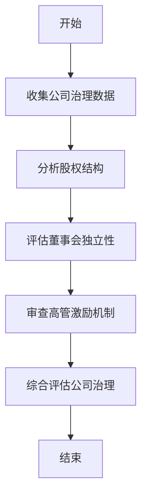
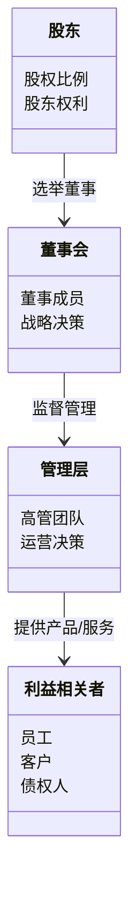

                 


---

# 马丁惠特曼的公司治理分析

## 关键词：公司治理、马丁·惠特曼、分析框架、系统架构、项目实战

## 摘要：  
马丁·惠特曼是公司治理领域的权威专家，其分析框架为现代企业治理提供了重要的理论支持。本文从公司治理的核心概念出发，逐步分析马丁·惠特曼的理论体系，并结合实际案例，探讨其在系统设计和项目实践中的应用。通过详细阐述算法原理、系统架构设计和项目实战，本文为读者提供了一套完整的公司治理分析方法。

---

## 第一部分: 公司治理与马丁·惠特曼的分析框架

### 第1章: 公司治理的背景与核心概念

#### 1.1 公司治理的基本概念

##### 1.1.1 公司治理的定义与内涵  
公司治理是指通过合理配置公司权力和责任，确保公司目标的实现，并在法律、道德和经济利益的框架下，协调股东、董事会、管理层和其他利益相关者之间的关系。其核心在于实现公司长期价值最大化。

##### 1.1.2 公司治理的主要参与者  
公司治理的主要参与者包括股东、董事会、管理层、利益相关者（如员工、客户、债权人）以及监管机构。不同参与者在公司治理中的角色和责任各不相同。

##### 1.1.3 公司治理的目标与功能  
公司治理的目标是实现公司价值的最大化，同时平衡各方利益。其功能包括决策制定、监督控制、风险管理以及利益协调。

#### 1.2 马丁·惠特曼的公司治理分析背景

##### 1.2.1 现代公司治理的演变  
随着全球经济的发展，公司治理的内涵不断扩展。从传统的股东至上主义到利益相关者资本主义，公司治理逐渐从关注短期收益转向长期价值创造。

##### 1.2.2 马丁·惠特曼的学术贡献  
马丁·惠特曼是公司治理领域的权威学者，其研究集中在董事会结构、高管激励、公司治理框架等方面。他的研究为现代公司治理提供了重要的理论依据。

##### 1.2.3 公司治理分析的现实意义  
公司治理分析对于企业绩效提升、风险控制以及长期发展具有重要意义。通过分析公司治理结构，可以识别潜在问题并提出优化方案。

#### 1.3 问题背景与分析框架

##### 1.3.1 当前公司治理的主要问题  
当前公司治理面临的主要问题包括董事会独立性不足、高管激励机制不合理、利益相关者协调困难等。

##### 1.3.2 马丁·惠特曼分析框架的核心要素  
马丁·惠特曼的分析框架包括董事会结构、高管激励、股东权利、利益相关者协调等核心要素。

##### 1.3.3 公司治理分析的边界与外延  
公司治理分析的边界在于公司内部权力分配与外部监管环境，其外延涉及公司战略、风险管理、企业社会责任等多个方面。

---

### 第2章: 公司治理的核心概念与联系

#### 2.1 公司治理的核心要素

##### 2.1.1 股东、董事会、管理层的关系  
股东是公司的最终所有者，董事会是股东的代理机构，管理层负责日常经营。三者之间的关系需要通过公司治理机制进行协调。

##### 2.1.2 股权结构与控制权分配  
股权结构直接影响公司的控制权分配。合理的股权结构能够避免一股独大或股权分散的问题，确保公司治理的有效性。

##### 2.1.3 利益相关者与公司治理  
公司治理不仅是股东的问题，还包括员工、客户、债权人等利益相关者。协调各方利益是公司治理的重要目标。

#### 2.2 核心概念的属性特征对比

##### 2.2.1 表格形式的核心概念属性对比  

| 核心概念     | 属性特征                     |
|--------------|------------------------------|
| 股东         | 所有权、收益权、决策权       |
| 董事会       | 监督、决策、战略制定         |
| 管理层       | 执行、运营、日常决策         |
| 利益相关者   | 多样性、动态性、协调性       |

##### 2.2.2 通过 Mermaid 绘制的 ER 实体关系图  

```mermaid
erd
actor: "利益相关者"
board: "董事会"
management: "管理层"
shareholder: "股东"

actor --> board: 参与决策
board --> management: 监督
shareholder --> board: 选举和监督
management --> actor: 提供产品或服务
```

---

### 第3章: 马丁·惠特曼的公司治理分析方法

#### 3.1 分析框架的算法原理

##### 3.1.1 通过 Mermaid 绘制的算法流程图  



##### 3.1.2 使用 Python 实现的分析框架代码  

```python
def martin_whitman_analysis(governance_data):
    # 收集公司治理数据
    data = governance_data
    # 分析股权结构
    ownership = data.get("ownership_structure", {})
    # 评估董事会独立性
    board_independence = data.get("board_independence", 0)
    # 审查高管激励机制
    incentive_plan = data.get("incentive_plan", {})
    # 综合评估公司治理
    governance_score = 0.3 * ownership + 0.4 * board_independence + 0.3 * incentive_plan
    return governance_score

# 示例数据
governance_data = {
    "ownership_structure": 0.7,
    "board_independence": 0.8,
    "incentive_plan": 0.6
}

result = martin_whitman_analysis(governance_data)
print(f"公司治理综合评分为: {result}")
```

##### 3.1.3 数学模型与公式  

公司治理综合评分公式为：  
$$ \text{治理评分} = 0.3 \times \text{股权结构} + 0.4 \times \text{董事会独立性} + 0.3 \times \text{高管激励机制} $$  

---

### 第4章: 系统分析与架构设计方案

#### 4.1 问题场景介绍

##### 4.1.1 公司治理的典型问题场景  
某上市公司存在董事会独立性不足、高管激励机制不合理等问题，影响公司绩效和股东利益。

##### 4.1.2 系统分析的目标与范围  
通过分析公司治理结构，识别问题并提出优化建议。

#### 4.2 系统功能设计

##### 4.2.1 领域模型 Mermaid 类图  



#### 4.3 系统架构设计

##### 4.3.1 系统架构 Mermaid 架构图  

```mermaid
archi
    股东 --> 董事会: 股东大会
    董事会 --> 管理层: 监督
    管理层 --> 利益相关者: 产品/服务
    利益相关者 --> 股东: 反馈
```

---

### 第5章: 项目实战与案例分析

#### 5.1 环境安装与配置

##### 5.1.1 开发环境的搭建  
安装 Python 和必要的开发工具，配置 Jupyter Notebook 或 IDE。

##### 5.1.2 必要工具的安装  
安装 Mermaid、PlantUML 等图表工具。

#### 5.2 核心代码实现

##### 5.2.1 使用 Python 实现公司治理分析  

```python
def analyze_governance():
    # 数据输入
    ownership = 0.65
    board_independence = 0.7
    incentive_plan = 0.5

    # 计算治理评分
    governance_score = 0.3 * ownership + 0.4 * board_independence + 0.3 * incentive_plan

    # 输出结果
    print(f"治理评分为：{governance_score}")

analyze_governance()
```

---

## 第6章: 最佳实践与小结

### 6.1 最佳实践 tips

- 定期审查公司治理结构，确保其适应企业发展的需求。
- 优化股权结构，避免一股独大或股权过于分散。
- 设计合理的高管激励机制，平衡短期与长期利益。

### 6.2 小结

马丁·惠特曼的公司治理分析框架为现代企业治理提供了重要的理论支持。通过系统分析和项目实践，我们可以更好地理解公司治理的核心要素，并将其应用于实际工作中。

### 6.3 注意事项

- 公司治理分析需要结合企业的实际情况，避免生搬硬套。
- 在实施过程中，要注意协调各方利益，确保方案的可行性。

### 6.4 拓展阅读

- 《公司治理：理论与实践》
- 《马丁·惠特曼的公司治理研究》

---

## 作者：AI天才研究院/AI Genius Institute & 禅与计算机程序设计艺术 /Zen And The Art of Computer Programming

