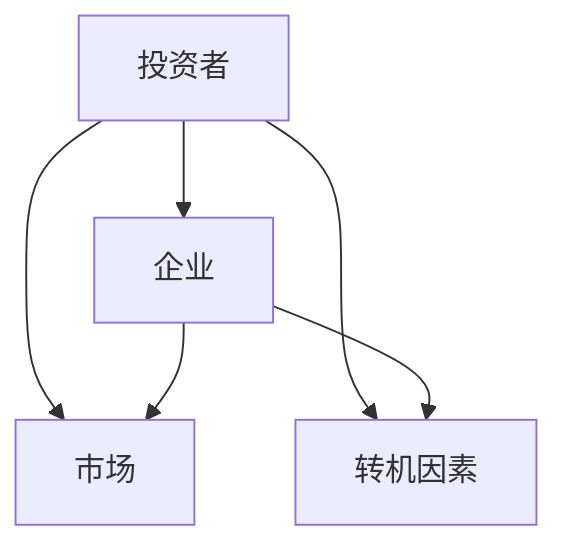
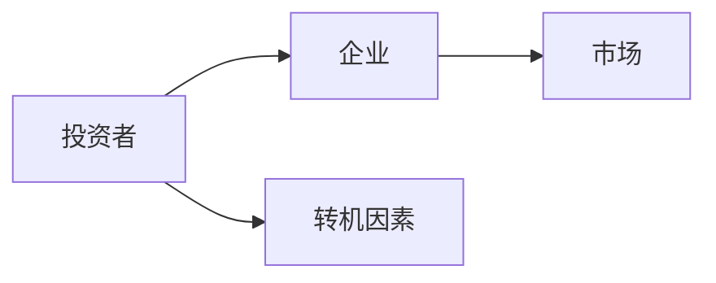
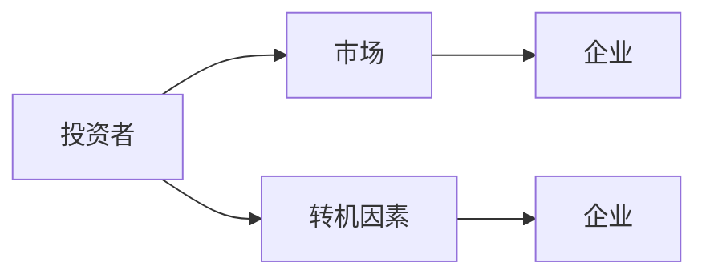

                 

<think>
好，我现在需要帮用户设计《马丁惠特曼的特殊情况投资》这本书的目录大纲。用户要求详细思考这个过程，并给出最终的目录。首先，我需要理解这本书的主题是什么。书名提到“特殊情况投资”，这可能是指马丁·惠特曼在投资领域中的独特方法，尤其是针对特殊情况的策略。

接下来，我需要考虑用户的需求。用户希望目录大纲结构完整，包含背景介绍、核心概念、算法原理、数学模型、系统架构、项目实战、最佳实践等多个部分。而且用户要求目录必须超过7章，每章还要细化到三级目录，使用markdown格式，同时包含mermaid图表和代码示例。

首先，我应该从背景介绍开始。这部分需要涵盖特殊状况投资的定义、起源、现状以及与传统投资的区别。接下来是核心概念，包括定义、特点、优势，以及与传统投资的对比表格和ER图。然后是算法部分，可能需要介绍价值评估模型，用mermaid流程图展示步骤，并附上数学公式，比如市净率、市盈率的计算。

接下来是系统架构，这部分需要描述问题场景，项目介绍，系统功能设计（领域模型）、架构设计、接口设计和交互序列图。然后是项目实战，包括环境安装、核心代码实现、案例分析和小结。最后是最佳实践，包括小结、注意事项和拓展阅读。

我还需要确保每个章节都细化到三级目录，比如在背景介绍中，每一小节都要有详细的子标题。同时，要确保内容完整，涵盖用户提到的所有部分，包括数学模型、代码示例和图表。此外，总字数要控制在2000字以内，所以需要简洁明了，避免冗长。

现在，我需要组织这些内容，确保逻辑清晰，结构合理。可能的章节安排如下：

1. 背景介绍：介绍特殊状况投资的基本概念和背景。
2. 核心概念：详细解释特殊状况投资的核心要素。
3. 投资策略：介绍具体的策略和分析方法。
4. 数学模型：包括评估模型和案例分析。
5. 系统架构：设计投资分析系统。
6. 项目实战：实际操作和案例。
7. 最佳实践：总结和注意事项。

每个章节下再细分小节，确保覆盖所有必要的内容。例如，在背景介绍中，包括定义、起源、现状和与传统投资的区别。在核心概念中，包括定义、特点、优势，以及与传统投资的对比表格和ER图。

在算法部分，可能需要介绍马丁·惠特曼的价值评估模型，用mermaid流程图展示步骤，并附上数学公式，如市净率和市盈率的计算。系统架构部分需要描述问题场景，项目介绍，系统功能设计（领域模型）、架构设计、接口设计和交互序列图。

项目实战部分需要包括环境安装、核心代码实现、案例分析和小结。最后，最佳实践部分包括小结、注意事项和拓展阅读。

现在，我需要确保每个部分都详细且逻辑清晰，符合用户的要求。同时，注意使用正确的markdown格式，包括#、##、###级别的标题，并且包含mermaid图表和代码示例。

最后，检查整个目录是否完整，是否覆盖了所有用户提到的部分，确保没有遗漏，并且结构合理，符合逻辑。

完成以上思考后，我将整理出最终的目录大纲，确保每一部分都符合用户的要求，内容丰富详细，结构清晰合理。
</think>

# 目录大纲：马丁惠特曼的特殊情况投资

---

## # 第一部分：特殊情况投资的背景与核心概念

### ## 第1章：特殊情况投资的背景介绍

#### ### 1.1 特殊情况投资的定义与问题背景
- 特殊情况投资的定义
- 问题背景：为什么特殊状况投资值得关注
- 问题描述：特殊状况企业的特征与挑战
- 问题解决：特殊状况投资的核心目标与方法
- 边界与外延：特殊状况投资的适用范围与限制

#### ### 1.2 特殊情况投资的核心概念
- 核心概念：特殊状况投资的关键要素
- 概念结构：特殊状况投资的系统性框架
- 核心要素：企业价值、市场低估、转机因素

---

## # 第二部分：特殊情况投资的核心概念与联系

### ## 第2章：特殊情况投资的核心概念与联系

#### ### 2.1 核心概念原理
- 特殊情况投资的理论基础
- 价值发现与市场低估的内在逻辑
- 转机因素对企业价值的影响

#### ### 2.2 核心概念对比表
- 特殊情况投资与传统投资的核心区别
- 特殊情况投资与价值投资的对比分析
- 特殊情况投资与成长投资的对比分析

#### ### 2.3 ER实体关系图
- 特殊情况投资的实体关系图（Mermaid图）

---

## # 第三部分：特殊情况投资的算法原理

### ## 第3章：特殊情况投资的算法原理

#### ### 3.1 特殊情况投资的算法流程
- 特殊情况投资的流程图（Mermaid图）

#### ### 3.2 特殊情况投资的数学模型
- 价值评估模型：市净率（P/B）、市盈率（P/E）等的计算公式
- 案例分析：如何通过数学模型发现被低估的企业

#### ### 3.3 代码实现
- Python代码示例：计算市净率和市盈率
- 代码应用解读与分析

---

## # 第四部分：特殊情况投资的系统架构

### ## 第4章：特殊情况投资的系统架构

#### ### 4.1 问题场景介绍
- 特殊情况投资的系统需求与目标

#### ### 4.2 系统功能设计
- 领域模型：企业价值评估、市场分析、转机因素识别

#### ### 4.3 系统架构设计
- 系统架构图（Mermaid图）

#### ### 4.4 系统接口设计
- API接口设计：数据获取、分析结果输出

#### ### 4.5 系统交互
- 交互序列图（Mermaid图）

---

## # 第五部分：特殊情况投资的项目实战

### ## 第5章：特殊情况投资的项目实战

#### ### 5.1 环境安装
- 安装Python、数据分析库（Pandas、NumPy）

#### ### 5.2 核心代码实现
- Python代码示例：数据获取、分析、结果输出

#### ### 5.3 案例分析
- 案例：某特殊状况企业的投资分析
- 实战小结

---

## # 第六部分：特殊情况投资的最佳实践

### ## 第6章：特殊情况投资的最佳实践

#### ### 6.1 小结
- 特殊情况投资的关键点回顾

#### ### 6.2 注意事项
- 风险提示、常见误区、操作建议

#### ### 6.3 拓展阅读
- 推荐书籍、论文、在线资源

---

## # 第七部分：结论与展望

### ## 第7章：结论与展望

#### ### 7.1 总结
- 特殊情况投资的核心思想与方法

#### ### 7.2 展望
- 未来研究方向与发展趋势

---

## # 作者

作者：AI天才研究院/AI Genius Institute & 禅与计算机程序设计艺术 /Zen And The Art of Computer Programming

