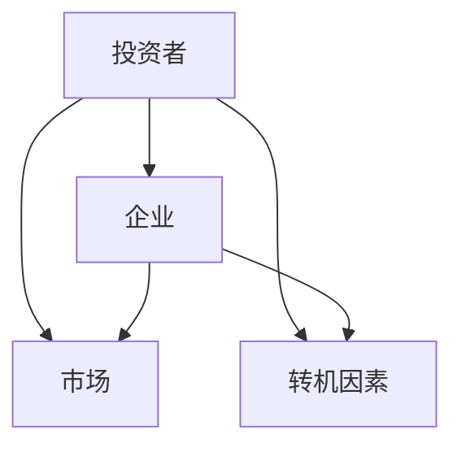
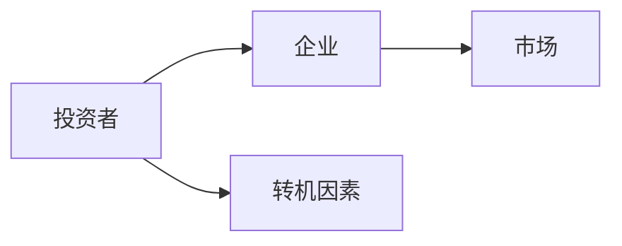
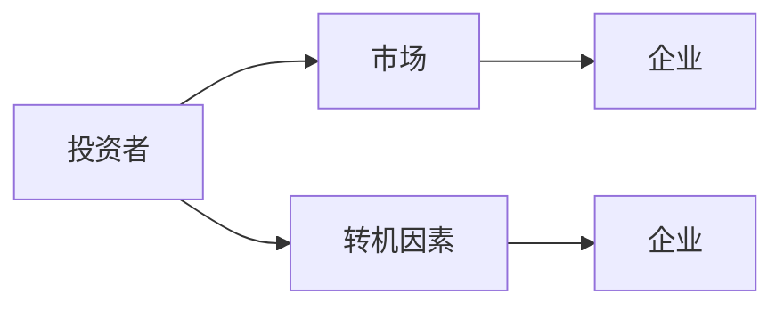

                 

# 目录大纲：马丁惠特曼的特殊情况投资

---

## # 第一部分：特殊情况投资的背景与核心概念

### ## 第1章：特殊情况投资的背景介绍

#### ### 1.1 特殊情况投资的定义与问题背景
- 特殊情况投资的定义
- 问题背景：为什么特殊状况投资值得关注
- 问题描述：特殊状况企业的特征与挑战
- 问题解决：特殊状况投资的核心目标与方法
- 边界与外延：特殊状况投资的适用范围与限制

#### ### 1.2 特殊情况投资的核心概念
- 核心概念：特殊状况投资的关键要素
- 概念结构：特殊状况投资的系统性框架
- 核心要素：企业价值、市场低估、转机因素

---

## # 第二部分：特殊情况投资的核心概念与联系

### ## 第2章：特殊情况投资的核心概念与联系

#### ### 2.1 核心概念原理
- 特殊情况投资的理论基础
- 价值发现与市场低估的内在逻辑
- 转机因素对企业价值的影响

#### ### 2.2 核心概念对比表
- 特殊情况投资与传统投资的核心区别
- 特殊情况投资与价值投资的对比分析
- 特殊情况投资与成长投资的对比分析

#### ### 2.3 ER实体关系图
- 特殊情况投资的实体关系图（Mermaid图）

---

## # 第三部分：特殊情况投资的算法原理

### ## 第3章：特殊情况投资的算法原理

#### ### 3.1 特殊情况投资的算法流程
- 特殊情况投资的流程图（Mermaid图）

#### ### 3.2 特殊情况投资的数学模型
- 价值评估模型：市净率（P/B）、市盈率（P/E）等的计算公式
- 案例分析：如何通过数学模型发现被低估的企业

#### ### 3.3 代码实现
- Python代码示例：计算市净率和市盈率
- 代码应用解读与分析

---

## # 第四部分：特殊情况投资的系统架构

### ## 第4章：特殊情况投资的系统架构

#### ### 4.1 问题场景介绍
- 特殊情况投资的系统需求与目标

#### ### 4.2 系统功能设计
- 领域模型：企业价值评估、市场分析、转机因素识别

#### ### 4.3 系统架构设计
- 系统架构图（Mermaid图）

#### ### 4.4 系统接口设计
- API接口设计：数据获取、分析结果输出

#### ### 4.5 系统交互
- 交互序列图（Mermaid图）

---

## # 第五部分：特殊情况投资的项目实战

### ## 第5章：特殊情况投资的项目实战

#### ### 5.1 环境安装
- 安装Python、数据分析库（Pandas、NumPy）

#### ### 5.2 核心代码实现
- Python代码示例：数据获取、分析、结果输出

#### ### 5.3 案例分析
- 案例：某特殊状况企业的投资分析
- 实战小结

---

## # 第六部分：特殊情况投资的最佳实践

### ## 第6章：特殊情况投资的最佳实践

#### ### 6.1 小结
- 特殊情况投资的关键点回顾

#### ### 6.2 注意事项
- 风险提示、常见误区、操作建议

#### ### 6.3 拓展阅读
- 推荐书籍、论文、在线资源

---

## # 第七部分：结论与展望

### ## 第7章：结论与展望

#### ### 7.1 总结
- 特殊情况投资的核心思想与方法

#### ### 7.2 展望
- 未来研究方向与发展趋势

---

## # 作者

作者：AI天才研究院/AI Genius Institute & 禅与计算机程序设计艺术 /Zen And The Art of Computer Programming

