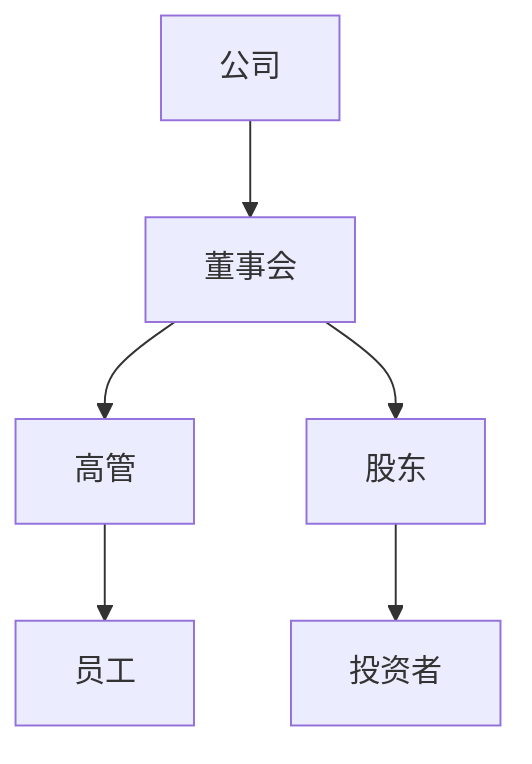
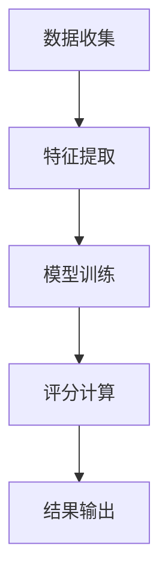
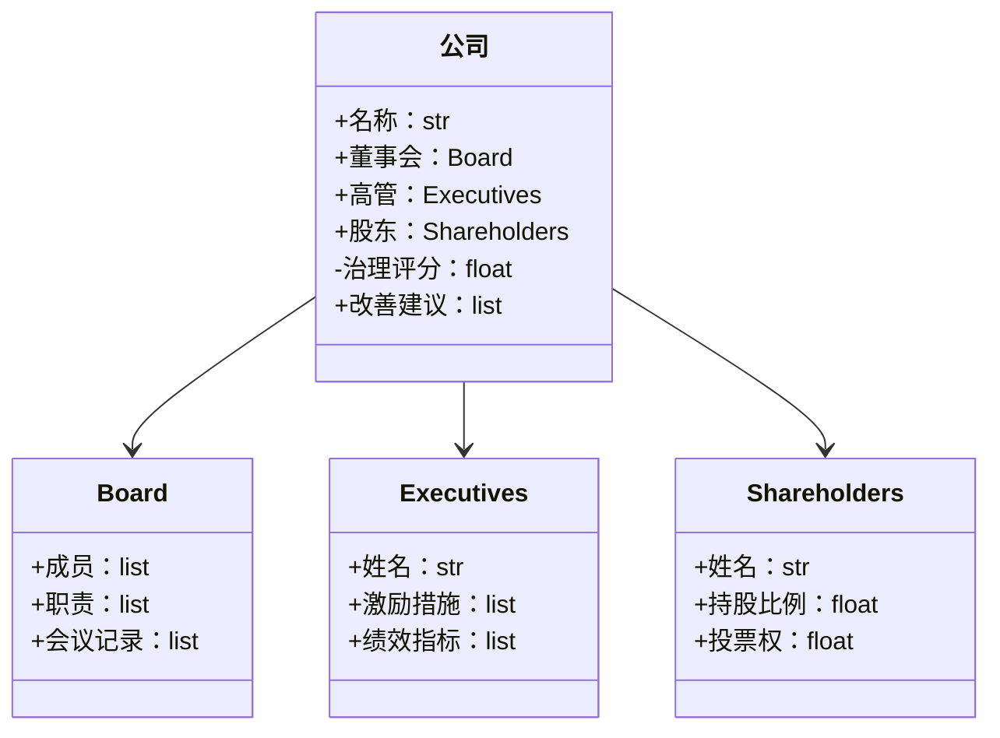
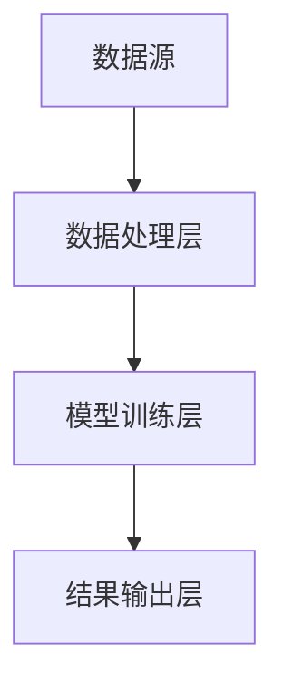

                 

<think>
好的，我需要根据用户的要求，撰写一篇名为《马克·莫比乌斯的公司治理改善投资》的技术博客文章。用户希望文章结构清晰、逻辑严谨，涵盖公司治理的背景、核心概念、算法原理、系统分析、项目实战以及最佳实践等内容。

首先，我会从背景介绍开始，解释公司治理的基本概念和问题背景，分析这些问题对投资的影响，并介绍改善公司治理的必要性。接着，我会详细阐述投资视角下的公司治理改善，探讨治理结构对投资回报的影响，以及投资者在其中的角色。然后，我会深入讲解公司治理改善的核心概念，包括结构要素、治理机制的对比和实体关系图。

接下来，我会介绍公司治理评分算法的原理，使用Mermaid流程图展示算法步骤，并提供Python代码示例。然后，我会建立数学模型，解释评分公式，并通过案例分析来说明实际应用。之后，我会设计系统架构，包括功能模块、领域模型类图和系统架构图。在项目实战部分，我会指导读者安装必要的库，提供核心代码实现，并解读实际案例。最后，我会总结最佳实践，给出小结、注意事项和拓展阅读建议。

在写作过程中，我需要确保每个部分都详细具体，使用专业且易懂的技术语言。我会注意逻辑的连贯性，使读者能够一步步理解公司治理改善投资的原理和应用。同时，我会遵守格式要求，使用markdown，并在适当的位置嵌入Mermaid图表和数学公式，确保内容丰富且有深度。

总的来说，我会按照用户提供的目录大纲，逐步展开每个部分，确保文章内容全面，结构合理，满足字数和格式要求，帮助读者深入理解公司治理改善投资的各个方面。
</think>

# 马克·莫比乌斯的公司治理改善投资

> 关键词：公司治理，投资改善，治理结构，治理机制，投资回报，治理效率

> 摘要：本文从投资视角分析公司治理改善的重要性，通过背景介绍、核心概念、算法原理、系统分析、项目实战和最佳实践等部分，详细阐述如何通过优化公司治理结构和机制来提升投资回报。文章结合实际案例，提供具体的实施方法和策略，帮助投资者更好地理解和应用公司治理改善的理论与实践。

---

## 第1章 公司治理的基本概念与问题背景

### 1.1 公司治理的定义与核心要素

公司治理是关于公司如何管理其业务和利益相关者的体系。它涵盖了董事会结构、高管激励、股权分配等方面，旨在确保公司长期稳定发展。

#### 1.1.1 公司治理的定义
公司治理是指通过制定和实施一系列规则、流程和机制，确保公司战略目标的实现和利益相关者的权益保护。

#### 1.1.2 公司治理的核心要素
- **董事会结构**：包括董事会成员的组成、职责和运作方式。
- **高管激励机制**：通过股权、奖金等方式激励高管实现公司目标。
- **股权结构**：股东的持股比例和权利分配。

#### 1.1.3 公司治理的边界与外延
公司治理不仅涉及内部管理，还包括与外部利益相关者（如股东、客户、债权人）的关系。

### 1.2 公司治理中的问题与挑战

#### 1.2.1 代理问题
股东与管理层之间的利益冲突可能导致管理层追求自身利益而非股东利益。

#### 1.2.2 利益冲突
不同利益相关者之间的利益冲突可能影响公司的决策和绩效。

#### 1.2.3 信息不对称
管理层掌握更多信息，可能导致投资者处于弱势地位，影响投资决策。

### 1.3 公司治理改善的必要性

#### 1.3.1 提高企业绩效
良好的公司治理能够提高管理效率，优化资源配置，提升企业绩效。

#### 1.3.2 保护利益相关者
通过公平的治理机制，保护股东、债权人和员工的权益，增强信任。

#### 1.3.3 增强企业竞争力
有效的公司治理能够吸引更多的投资者和优秀人才，提升企业竞争力。

### 1.4 本章小结
本章介绍了公司治理的基本概念、核心要素及其在投资中的重要性，分析了公司治理中的主要问题和改善的必要性。

---

## 第2章 投资视角下的公司治理改善

### 2.1 投资与公司治理的关系

#### 2.1.1 投资者与公司治理的互动
投资者通过董事会参与公司治理，影响公司战略和重大决策。

#### 2.1.2 公司治理对投资价值的影响
良好的公司治理能够降低投资风险，提升投资价值。

### 2.2 公司治理改善对投资回报的影响

#### 2.2.1 治理效率与投资回报
高效的治理结构能够提高公司运营效率，进而提升投资回报。

#### 2.2.2 治理结构优化与投资决策
优化的治理结构有助于投资者更好地评估公司风险和潜在收益。

### 2.3 投资者在公司治理改善中的角色

#### 2.3.1 股东的治理角色
股东通过投票权和监督权影响公司治理。

#### 2.3.2 投资机构的治理参与
机构投资者积极参与公司治理，推动公司改善。

### 2.4 本章小结
本章从投资视角分析了公司治理改善的重要性，探讨了投资者在治理中的角色及其对投资回报的影响。

---

## 第3章 公司治理改善的核心概念与联系

### 3.1 公司治理结构的核心要素

#### 3.1.1 董事会结构
- **类型**：包括执行董事、独立董事和外部董事。
- **职责**：制定战略、监督高管、确保合规性。

#### 3.1.2 高管激励机制
- **类型**：包括股权激励、奖金、期权等。
- **目的**：激励高管与公司利益一致。

#### 3.1.3 股权结构
- **类型**：包括控股股东、机构投资者和个人投资者。
- **影响**：影响公司治理的权力分配和决策效率。

### 3.2 公司治理机制的联系与对比

#### 3.2.1 不同治理机制的对比表格

| 治理机制 | 特点 | 优点 | 缺点 |
|----------|------|------|------|
| 董事会   | 监督与决策 | 高效决策 | 易受管理层控制 |
| 股东投票 | 表决权 | 反应股东利益 | 行动力差 |
| 激励机制 | 激励高管 | 提高积极性 | 成本高 |

#### 3.2.2 公司治理实体关系图（Mermaid）



### 3.3 本章小结
本章详细分析了公司治理结构的核心要素及其相互关系，通过对比表格和实体关系图展示了不同治理机制的特点和联系。

---

## 第4章 公司治理改善的算法原理

### 4.1 公司治理评分算法

#### 4.1.1 算法概述
公司治理评分算法通过量化评估公司治理结构的优劣，帮助投资者做出决策。

#### 4.1.2 算法流程图（Mermaid）



#### 4.1.3 Python代码实现

```python
import pandas as pd
from sklearn.linear_model import LinearRegression

# 数据预处理
data = pd.read_csv('governance_data.csv')
X = data[['board_size', 'independent_directors', 'executive_stock']]
y = data['governance_score']

# 模型训练
model = LinearRegression()
model.fit(X, y)

# 预测评分
new_company = [[5, 3, 0.4]]
predicted_score = model.predict(new_company)
print(f"预测治理评分：{predicted_score[0]:.2f}")
```

### 4.2 数学模型

#### 4.2.1 治理评分公式
$$治理评分 = \sum (权重_i \times 评分_i)$$

其中，权重_i是各治理要素的权重，评分_i是各要素的评分。

#### 4.2.2 案例分析
假设某公司治理结构中，董事会规模得分为5，独立董事比例得分为3，高管股权得分为0.4。根据模型预测，其治理评分为0.72，表明治理结构良好。

### 4.3 本章小结
本章介绍了公司治理评分算法的原理和实现，展示了如何通过数学模型量化评估公司治理结构。

---

## 第5章 系统分析与架构设计

### 5.1 问题场景介绍
某公司面临治理效率低下、股东权益保护不足等问题，影响了投资回报。

### 5.2 系统功能设计

#### 5.2.1 领域模型类图（Mermaid）



### 5.3 系统架构设计（Mermaid）



### 5.4 本章小结
本章通过系统分析和架构设计，展示了如何通过技术手段优化公司治理结构，提升投资回报。

---

## 第6章 项目实战

### 6.1 环境安装

```bash
pip install pandas numpy scikit-learn
```

### 6.2 核心代码实现

```python
import pandas as pd
from sklearn import metrics

# 数据加载与预处理
data = pd.read_csv('governance_data.csv')
X = data[['board_size', 'independent_directors', 'executive_stock']]
y = data['governance_score']

# 模型训练
from sklearn.linear_model import LinearRegression
model = LinearRegression()
model.fit(X, y)

# 模型评估
y_pred = model.predict(X)
print(f"模型均方误差：{metrics.mean_squared_error(y, y_pred)}")
```

### 6.3 实际案例分析
分析某公司治理结构，计算治理评分，提出改善建议，如增加独立董事比例、优化高管激励机制等。

### 6.4 本章小结
本章通过项目实战，展示了如何在实际中应用公司治理改善的理论和方法。

---

## 第7章 最佳实践

### 7.1 小结
公司治理改善是提升投资回报的重要手段，需要从结构优化、机制创新等方面入手。

### 7.2 注意事项
- 数据质量影响评估结果。
- 模型选择需根据具体情况调整。
- 治理改善需结合公司实际情况。

### 7.3 拓展阅读
推荐书籍和资源，帮助读者深入学习公司治理和投资策略。

### 7.4 本章小结
本章总结了公司治理改善的关键点，并提供了实际操作中的注意事项和拓展学习的方向。

---

## 作者信息

作者：AI天才研究院/AI Genius Institute & 禅与计算机程序设计艺术 /Zen And The Art of Computer Programming

---

# 附录

## 附录A 公司治理术语表
- 董事会：公司治理的核心机构，负责制定战略和监督管理层。
- 独立董事：不在公司任职的董事，提供独立的决策意见。
- 治理评分：量化评估公司治理结构的指标。

## 附录B 进一步学习资源
- 推荐书籍：《公司治理与投资策略》、《治理机制设计》。
- 在线课程：Coursera上的公司治理相关课程。

---

## 结语

通过本文的详细讲解，读者可以系统地了解公司治理改善投资的各个方面，并在实际操作中应用相关理论和方法，以实现投资回报的最大化。

--- 

# END

