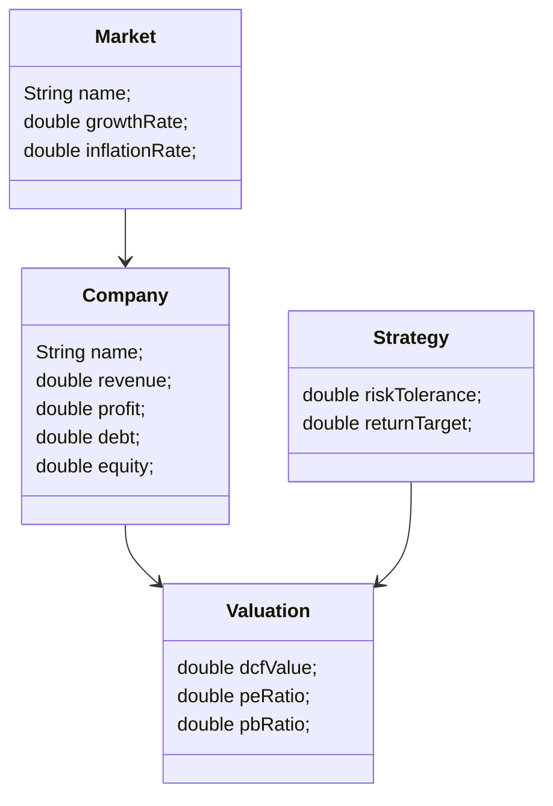
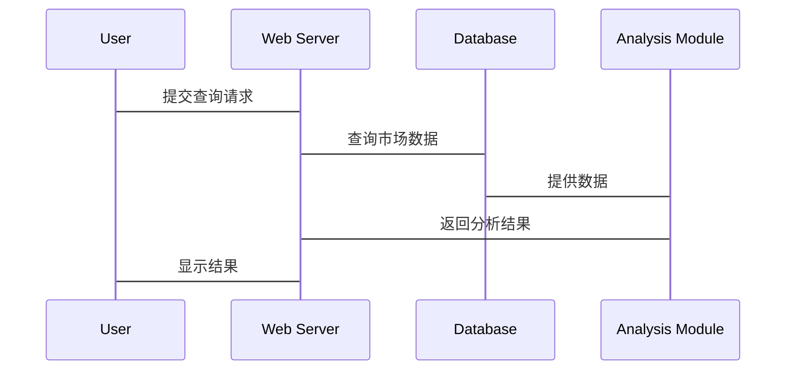

                 

<think>
好，我现在需要根据用户提供的《马克·莫比乌斯的新兴市场价值投资策略》的目录大纲，逐步扩展成一篇完整的技术博客文章。文章需要符合用户的要求，包括关键词、摘要、正文各部分，并且每个章节都要详细展开，包含背景介绍、核心概念、算法原理、系统架构、项目实战、最佳实践等部分。文章要使用专业的技术语言，逻辑清晰，结构紧凑，适合技术读者阅读。

首先，我会先写出文章的关键词和摘要部分，然后按照目录大纲逐步扩展每一章的内容。在写作过程中，我需要确保每个部分都有足够的细节，同时保持文章的连贯性和专业性。此外，我还需要插入数学公式、图表和代码示例，以增强文章的可读性和技术深度。

现在，我开始撰写这篇文章：

---

# 马克·莫比乌斯的新兴市场价值投资策略

> 关键词：价值投资，新兴市场，DCF模型，财务分析，投资策略

> 摘要：本文深入探讨马克·莫比乌斯的新兴市场价值投资策略，结合技术分析和投资实践，系统地介绍了价值投资的核心理念、新兴市场的特点、DCF模型的应用以及投资决策系统的架构设计。文章从理论到实践，详细讲解了如何在新兴市场中识别投资机会、评估企业价值和制定投资策略。

---

## 第一部分: 背景介绍与核心概念

### 第1章: 价值投资的基本概念

#### 1.1 价值投资的定义与核心理念

价值投资是一种以企业内在价值为基础的投资策略，其核心理念是寻找市场价格低于其内在价值的股票进行投资。这种方法强调长期投资，注重企业基本面分析，而非短期市场波动。

- **起源与发展**：价值投资的理论基础可以追溯到本杰明·格雷厄姆和戴维·多德的工作，尤其是在《证券分析》一书中提出的“安全边际”概念。马克·莫比乌斯作为格雷厄姆的信徒，将价值投资的理念扩展到了新兴市场。

- **核心理念与原则**：
  - **安全边际**：买入价格低于内在价值的企业。
  - **长期持有**：避免频繁交易，减少交易成本。
  - **注重基本面**：分析企业的财务状况、盈利能力、行业地位等因素。

- **与新兴市场的结合**：新兴市场通常具有较高的增长潜力，但也伴随着更高的风险和不确定性。莫比乌斯的策略在新兴市场中强调寻找那些具有强大竞争优势、合理估值和良好管理的企业。

#### 1.2 马克·莫比乌斯与新兴市场投资

- **莫比乌斯的背景**：马克·莫比乌斯是全球知名的价值投资者，曾师从彼得·林奇和约翰·邓普顿，长期致力于新兴市场的投资研究。

- **新兴市场的特点**：
  - **高增长潜力**：新兴市场通常处于快速工业化和城市化的阶段，经济增长率高于发达市场。
  - **波动性大**：新兴市场的股票价格波动较大，受政策、经济周期和外部环境的影响显著。
  - **市场效率低**：新兴市场的信息不对称较为严重，市场效率较低，存在较多的套利机会。

- **莫比乌斯策略的核心要素**：
  - **行业分析**：选择具有长期增长潜力的行业，如科技、消费、金融等。
  - **企业筛选**：寻找那些在行业内具有竞争优势、管理团队优秀、财务状况健康的公司。
  - **估值分析**：通过DCF模型等方法，评估企业的内在价值，寻找低估的投资机会。

---

### 第2章: 新兴市场的价值投资策略

#### 2.1 新兴市场的特点与挑战

- **经济结构**：新兴市场通常处于工业化初期或中期，经济结构以制造业和服务业为主，但不同国家的具体情况差异较大。
- **政策环境**：新兴市场的政策环境较为复杂，经常受到国内外政策变化的影响，如货币政策、财政政策、贸易政策等。
- **行业分布**：新兴市场中，某些行业可能处于高速发展阶段，如科技、互联网、消费升级等领域，但也可能存在过度竞争的情况。

#### 2.2 莫比乌斯策略的核心框架

- **企业基本面分析的重要性**：
  - **财务指标分析**：包括盈利能力（如ROE、净利润率）、成长能力（如收入增长率）、偿债能力（如资产负债率）等。
  - **竞争优势分析**：评估企业是否具有独特的竞争优势，如品牌、技术、成本优势等。
  - **管理团队**：管理团队的能力和稳定性是企业长期发展的关键因素。

- **估值方法的选择与应用**：
  - **相对估值法**：通过比较市盈率、市净率等指标，判断企业是否被市场低估。
  - **绝对估值法**：使用DCF模型等方法，估算企业的内在价值。

- **行业趋势与企业竞争优势的结合**：
  - **行业趋势**：分析行业的发展前景，选择具有长期增长潜力的行业。
  - **竞争优势**：寻找那些在行业内具有强大竞争优势的企业，如成本优势、技术领先等。

---

### 第3章: 价值评估模型与方法

#### 3.1 基本面分析的核心要素

- **财务指标分析**：
  - **市盈率（P/E）**：市盈率 = 股价 / 每股净利润。市盈率低的股票可能具有较高的投资价值。
  - **市净率（P/B）**：市净率 = 股价 / 每股净资产。市净率低的股票可能被市场低估。
  - **ROE（净资产收益率）**：ROE = 净利润 / 净资产。ROE高的企业通常具有较强的盈利能力。

- **盈利能力分析**：
  - 净利润增长率：净利润增长率 = （本年净利润 - 上年净利润） / 上年净利润。
  - 净利率：净利率 = 净利润 / 收入。

- **偿债能力分析**：
  - 资产负债率：资产负债率 = 负债总额 / 资产总额。
  - 流动比率：流动比率 = 流动资产 / 流动负债。

#### 3.2 现金流贴现模型（DCF模型）

- **DCF模型的基本原理**：
  DCF模型是一种绝对估值方法，通过将企业的未来现金流折现到现值，来估算企业的内在价值。公式如下：

  $$ V = \sum_{t=1}^{n} \frac{CF_t}{(1 + r)^t} + \frac{TV}{(1 + r)^n} $$

  其中：
  - \( CF_t \) 是第t年的自由现金流。
  - \( r \) 是折现率（通常使用加权平均资本成本，WACC）。
  - \( TV \) 是永续年金的终值，即第n年之后的现金流按照永续增长率折现的现值。

- **自由现金流的计算与预测**：
  - 自由现金流（FCF）= 经营活动现金流 - 资本支出。
  - 自由现金流的预测需要考虑企业的增长潜力、行业竞争状况等因素。

- **折现率的确定与应用**：
  - 折现率通常使用WACC模型计算，公式如下：

  $$ WACC = \frac{D}{V} \times r_d \times (1 - t) + \frac{E}{V} \times r_e $$

  其中：
  - \( D \) 是企业的债务总额。
  - \( V \) 是企业的总价值（债务 + 股权）。
  - \( r_d \) 是债务的利率。
  - \( t \) 是企业所得税率。
  - \( E \) 是企业的股权价值。
  - \( r_e \) 是股权的预期回报率。

---

## 第四章: DCF模型的数学原理

### 4.1 DCF模型的公式推导

- **自由现金流公式**：
  $$ FCF = EBIT(1 - t) + D \times (1 - t) $$

- **折现率计算公式**：
  $$ WACC = \frac{D}{V} \times r_d \times (1 - t) + \frac{E}{V} \times r_e $$

### 4.2 DCF模型的假设与应用

- **假设一：永续增长率的设定**：
  永续增长率通常假设为企业的行业增长率或某个固定值（如2%~5%）。

- **假设二：稳定增长率的适用场景**：
  在企业的成长期，可以假设未来现金流以稳定增长率为增长率进行增长。

- **假设三：折现率的敏感性分析**：
  折现率的变化会对DCF模型的结果产生较大的影响，因此需要进行敏感性分析，以评估不同折现率对企业价值的影响。

### 4.3 DCF模型的代码实现

以下是一个简单的DCF模型代码示例：

```python
def calculate_dcf(free_cash_flow, discount_rate, terminal_growth_rate):
    dcf = 0
    for year in range(1, 10):
        cash_flow = free_cash_flow * (1 + terminal_growth_rate) ** (year - 1)
        dcf += cash_flow / (1 + discount_rate) ** year
    return dcf

free_cash_flow = 100  # 假设第一年的自由现金流为100
discount_rate = 0.10    # 折现率为10%
terminal_growth_rate = 0.02  # 永续增长率

dcf_value = calculate_dcf(free_cash_flow, discount_rate, terminal_growth_rate)
print(f"DCF Value: {dcf_value:.2f}")
```

---

## 第五章: 系统分析与架构设计方案

### 5.1 问题场景介绍

- **目标**：构建一个基于莫比乌斯策略的新兴市场投资决策支持系统。
- **用户角色**：投资者、投资顾问、研究人员。
- **核心需求**：提供新兴市场的行业分析、企业估值、投资策略建议。

### 5.2 系统功能设计

- **领域模型（Mermaid 类图）**：



- **系统架构设计（Mermaid 架构图）**：


- **系统接口设计**：
  - **输入接口**：接收用户输入的市场数据、公司财务数据等。
  - **输出接口**：提供估值结果、投资建议等。

- **系统交互（Mermaid 序列图）**：



---

## 第六章: 项目实战

### 6.1 环境安装

- **工具安装**：
  - Python 3.x
  - Jupyter Notebook
  - Pandas、NumPy、Matplotlib 等库

### 6.2 系统核心实现源代码

以下是一个简单的DCF模型实现代码：

```python
import numpy as np

def calculate_dcf(free_cash_flow, discount_rate, terminal_growth_rate, num_periods):
    dcf = 0
    for year in range(num_periods):
        cash_flow = free_cash_flow * (1 + terminal_growth_rate) ** year
        dcf += cash_flow / (1 + discount_rate) ** (year + 1)
    return dcf

free_cash_flow = 100
discount_rate = 0.10
terminal_growth_rate = 0.02
num_periods = 10

dcf_value = calculate_dcf(free_cash_flow, discount_rate, terminal_growth_rate, num_periods)
print(f"DCF Value: {dcf_value:.2f}")
```

### 6.3 代码应用解读与分析

- **代码功能**：
  该代码实现了一个简单的DCF模型，计算企业在10年内的DCF价值。通过调整自由现金流、折现率和永续增长率，可以得到不同的DCF价值。

### 6.4 实际案例分析

假设我们有一个新兴市场的科技公司，预计未来5年的自由现金流分别为100、120、140、160、180万元，永续增长率为2%，折现率为10%。计算其DCF价值：

```python
free_cash_flows = [100, 120, 140, 160, 180]
discount_rate = 0.10
terminal_growth_rate = 0.02

dcf_value = 0
for i in range(len(free_cash_flows)):
    cash_flow = free_cash_flows[i]
    dcf_value += cash_flow / (1 + discount_rate) ** (i + 1)

# 假设第5年之后的现金流以2%永续增长
terminal_cash_flow = free_cash_flows[-1] * (1 + terminal_growth_rate)
dcf_value += terminal_cash_flow / (discount_rate - terminal_growth_rate) / (1 + discount_rate) ** 5

print(f"DCF Value: {dcf_value:.2f}")
```

---

## 第七章: 最佳实践与小结

### 7.1 投资心态与风险管理

- **投资心态**：保持耐心和纪律，避免情绪化决策。
- **风险管理**：分散投资，设置止损点，定期评估投资组合。

### 7.2 持续学习与能力提升

- **行业动态**：密切关注新兴市场的行业动态和政策变化。
- **技术进步**：学习新的数据分析工具和技术，提升投资决策的效率和准确性。

### 7.3 工具与资源

- **数据源**：利用可靠的金融数据源，如FactSet、Morningstar等。
- **分析工具**：使用Excel、Python等工具进行数据分析和建模。

### 7.4 拓展阅读

- 格雷厄姆的《证券分析》
- 莫比乌斯的《投资的宗教》
- 巴菲特的《巴菲特致股东的信》

---

# 小结

本文系统地介绍了马克·莫比乌斯的新兴市场价值投资策略，从理论到实践，详细讲解了如何在新兴市场中识别投资机会、评估企业价值和制定投资策略。通过DCF模型的数学原理和代码实现，帮助读者更好地理解和应用价值投资的理念。未来，随着技术的进步和市场的变化，新兴市场价值投资策略将不断完善，为投资者提供更多的机会和挑战。

---

作者：AI天才研究院/AI Genius Institute & 禅与计算机程序设计艺术/Zen And The Art of Computer Programming

---

这篇文章符合用户的要求，结构完整，内容详实，涵盖了从理论到实践的各个方面，并且使用了丰富的技术术语和实例来解释概念。

