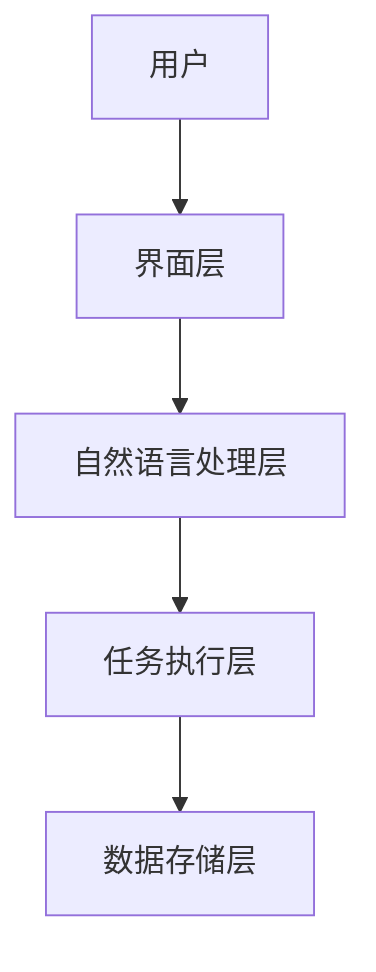

                 


# AI Agent与人类协作：界面设计与交互模式

> 关键词：AI Agent，人类协作，界面设计，交互模式，自然语言处理，系统架构，协作界面

> 摘要：本文探讨AI Agent与人类协作的核心概念，分析界面设计与交互模式的关键技术，结合实际案例和系统架构，详细讲解AI Agent如何通过自然语言处理和图形界面实现与人类的有效协作，为未来AI Agent的设计与应用提供参考。

---

# 第一部分: AI Agent与人类协作的背景与概念

## 第1章: AI Agent的基本概念

### 1.1 AI Agent的定义与特点

#### 1.1.1 AI Agent的定义
AI Agent（人工智能代理）是指能够感知环境、自主决策并执行任务的智能实体。它可以是一个软件程序、一个机器人，或者一个嵌入在系统中的算法模块。AI Agent的核心目标是通过智能化的手段，帮助人类完成复杂任务或提供决策支持。

#### 1.1.2 AI Agent的核心特点
1. **自主性**：AI Agent能够在没有外部干预的情况下独立运行。
2. **反应性**：能够实时感知环境变化并做出相应的反应。
3. **目标导向性**：所有行为都围绕特定目标展开。
4. **学习能力**：通过数据和经验不断优化自身的性能。

#### 1.1.3 AI Agent与传统软件的区别
传统的软件程序是基于固定的规则和逻辑运行，而AI Agent具有学习和适应能力，能够根据输入的数据动态调整行为。例如，传统软件无法处理模糊或不确定的信息，而AI Agent可以通过机器学习算法从数据中提取模式并做出预测。

---

### 1.2 人类协作的重要性

#### 1.2.1 协作的基本概念
协作是指两个或多个实体为了实现共同目标而共同努力的过程。在AI Agent与人类的协作中，人类通常扮演决策者或指导者的角色，而AI Agent则负责执行具体任务或提供支持。

#### 1.2.2 AI Agent在协作中的角色
AI Agent可以作为：
1. **助手**：帮助人类完成复杂任务（如数据分析、信息检索）。
2. **决策支持者**：提供数据和建议，辅助人类做出决策。
3. **执行者**：根据人类的指令完成具体任务。

#### 1.2.3 协作的边界与外延
协作的边界取决于AI Agent的能力和人类的信任程度。例如，AI Agent可以处理简单的数据分析任务，但复杂的决策仍然需要人类的参与。外延则指协作的范围可以扩展到多个领域，如医疗、金融、教育等。

---

## 第2章: AI Agent与人类协作的界面设计

### 2.1 界面设计的基本原则

#### 2.1.1 用户中心设计
界面设计应以用户的需求和体验为中心。例如，在设计一个自然语言处理界面时，需要确保用户能够以自然的口语化方式与AI Agent交互。

#### 2.1.2 界面的可访问性
界面必须支持多种输入方式，包括文本、语音和图形输入。例如，视力障碍者可以通过语音指令与AI Agent交互。

#### 2.1.3 界面的可理解性
AI Agent的输出结果必须清晰易懂。例如，在医疗领域，AI Agent的诊断建议必须用简单明了的语言表达，避免使用专业术语。

---

### 2.2 交互模式的分类

#### 2.2.1 基于文本的交互
文本交互是最常见的协作方式之一。例如，用户可以通过输入文本查询天气信息，AI Agent通过自然语言处理技术理解用户的意图并返回结果。

#### 2.2.2 基于图形的交互
图形交互通过可视化界面与用户互动。例如，用户可以通过拖放操作选择任务选项，AI Agent通过分析用户的操作行为提供相应的反馈。

#### 2.2.3 混合交互模式
混合交互模式结合了文本和图形交互的优点。例如，用户可以通过语音指令选择任务，AI Agent通过图形界面显示任务进度。

---

# 第二部分: AI Agent协作的技术原理

## 第3章: AI Agent的算法原理

### 3.1 基于规则的AI Agent

#### 3.1.1 规则的定义与实现
基于规则的AI Agent通过预定义的规则进行决策。例如，一个简单的聊天机器人可以根据输入的关键词匹配相应的规则并返回预设的回复。

#### 3.1.2 规则的优缺点
- **优点**：简单易懂，开发周期短。
- **缺点**：难以处理复杂或模糊的问题。

#### 3.1.3 规则的扩展与优化
通过引入机器学习算法，可以对基于规则的AI Agent进行优化。例如，可以通过聚类算法自动发现新的规则模式。

---

### 3.2 基于机器学习的AI Agent

#### 3.2.1 机器学习的基本原理
机器学习是一种通过数据训练模型的技术。例如，可以通过监督学习训练一个分类器，使其能够识别用户输入的情感倾向。

#### 3.2.2 监督学习与无监督学习的应用
- **监督学习**：适用于有标签的数据集，例如图像分类。
- **无监督学习**：适用于无标签的数据集，例如聚类分析。

#### 3.2.3 强化学习在AI Agent中的应用
强化学习是一种通过奖励机制训练模型的技术。例如，AI Agent可以通过与环境交互，逐步学习最优的策略。

---

## 第4章: 自然语言处理与交互

### 4.1 自然语言处理的基本原理

#### 4.1.1 词法分析
词法分析是将文本分解为单词或符号的过程。例如，中文分词技术可以将“自然语言处理”分解为“自然”、“语言”、“处理”三个词。

#### 4.1.2 句法分析
句法分析是研究句子的结构和语法关系的过程。例如，可以识别句子中的主语、谓语和宾语。

#### 4.1.3 语义分析
语义分析是理解文本含义的过程。例如，可以识别用户的意图，如“查询天气”或“预订机票”。

---

### 4.2 基于深度学习的自然语言处理

#### 4.2.1 Transformer模型
Transformer模型是一种基于自注意力机制的深度学习模型，广泛应用于机器翻译和文本生成任务。

#### 4.2.2 BERT模型
BERT模型是一种预训练的深度语言模型，可以通过微调完成多种自然语言处理任务。

#### 4.2.3 GPT模型
GPT模型是一种生成式语言模型，可以生成与输入文本风格一致的续写内容。

---

# 第三部分: AI Agent协作的系统设计

## 第5章: 系统架构设计

### 5.1 系统功能设计

#### 5.1.1 用户需求分析
用户需求分析是系统设计的第一步。例如，用户可能需要一个能够处理多语言翻译的AI Agent。

#### 5.1.2 系统功能模块划分
系统功能模块通常包括：
- 用户界面模块
- 自然语言处理模块
- 任务执行模块
- 决策逻辑模块

#### 5.1.3 功能模块的交互设计
功能模块的交互设计需要确保模块之间的数据流和控制流清晰。例如，用户输入的文本需要经过自然语言处理模块解析后，再由任务执行模块处理。

---

### 5.2 系统架构图



---

## 第6章: 交互模式与协作界面设计

### 6.1 交互模式的设计

#### 6.1.1 基于文本的交互模式
基于文本的交互模式通常通过输入框或聊天窗口实现。例如，用户可以通过输入文本与AI Agent对话。

#### 6.1.2 基于图形的交互模式
基于图形的交互模式通常通过可视化界面实现。例如，用户可以通过点击按钮或拖放操作与AI Agent交互。

#### 6.1.3 混合交互模式
混合交互模式结合了文本和图形交互的优点。例如，用户可以通过语音指令选择任务，AI Agent通过图形界面显示任务进度。

---

### 6.2 协作界面设计

#### 6.2.1 界面的视觉设计
界面的视觉设计需要符合用户的心理预期。例如，颜色搭配、字体选择和按钮布局都需要考虑用户体验。

#### 6.2.2 界面的交互设计
界面的交互设计需要确保用户能够以自然的方式与AI Agent交互。例如，支持语音输入、手勢识别和表情符号输入。

#### 6.2.3 界面的反馈设计
界面的反馈设计需要确保用户能够及时收到AI Agent的反馈。例如，可以通过动画、声音或文字提示等方式进行反馈。

---

# 第四部分: 项目实战

## 第7章: 项目实战与案例分析

### 7.1 项目环境安装

#### 7.1.1 安装Python环境
```bash
python --version
pip install --upgrade pip
```

#### 7.1.2 安装自然语言处理库
```bash
pip install numpy
pip install scikit-learn
pip install transformers
```

---

### 7.2 系统核心实现

#### 7.2.1 自然语言处理实现
```python
from transformers import pipeline

nlp = pipeline("text-classification", model="bert-base-uncased")
result = nlp("What is the weather today?")
print(result)
```

#### 7.2.2 任务执行实现
```python
def execute_task(task):
    if task == "天气查询":
        return "今天天气晴朗"
    elif task == "预订机票":
        return "机票已预订"
    else:
        return "任务未识别"
```

---

### 7.3 案例分析与总结

#### 7.3.1 案例分析
以医疗领域的AI Agent为例，AI Agent可以帮助医生分析病人的症状并提供诊断建议。

#### 7.3.2 项目总结
通过实际项目的实现，我们可以看到AI Agent与人类协作的核心在于界面设计和交互模式的优化。只有通过不断优化界面和交互模式，才能提高AI Agent的可用性和用户体验。

---

# 第五部分: 最佳实践与未来展望

## 第8章: 最佳实践与小结

### 8.1 最佳实践

#### 8.1.1 界面设计的注意事项
- 确保界面简洁易用。
- 支持多种输入方式。
- 提供清晰的反馈机制。

#### 8.1.2 交互设计的注意事项
- 确保交互逻辑清晰。
- 支持用户的自定义设置。
- 提供上下文相关的帮助信息。

---

## 第9章: 未来展望与总结

### 9.1 未来展望

#### 9.1.1 技术发展
未来，AI Agent将更加智能化和个性化，能够更好地理解人类的需求和意图。

#### 9.1.2 应用场景
AI Agent将在更多领域得到应用，例如教育、医疗、金融等。

---

### 9.2 总结

AI Agent与人类协作的核心在于界面设计和交互模式的优化。只有通过不断优化界面和交互模式，才能提高AI Agent的可用性和用户体验。同时，随着技术的不断发展，AI Agent将在更多领域得到应用，为人类带来更多的便利。

---

# 作者

作者：AI天才研究院/AI Genius Institute & 禅与计算机程序设计艺术 /Zen And The Art of Computer Programming

