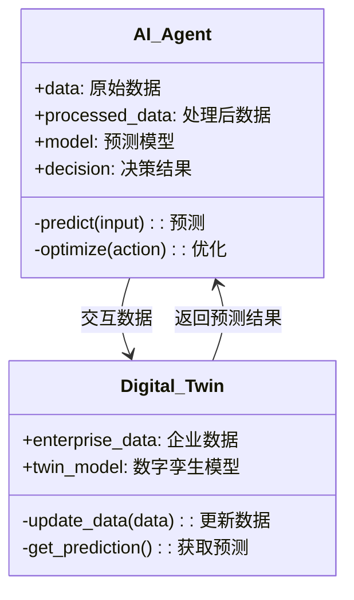
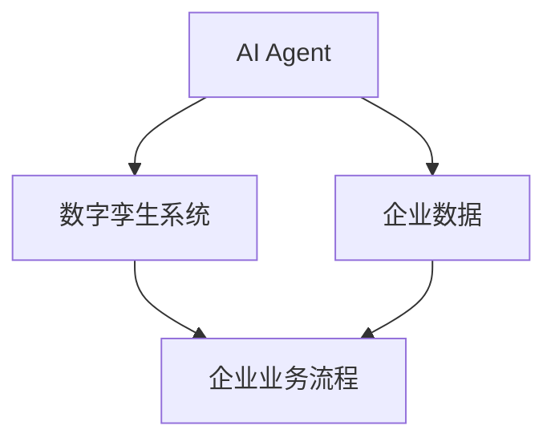
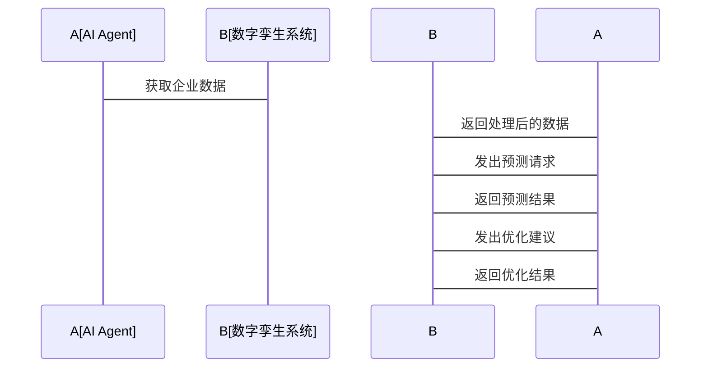

                 

<think>
好的，我现在要按照用户的要求，撰写一篇关于《AI Agent与企业数字孪生技术的融合应用》的技术博客文章。用户已经提供了详细的大纲和部分内容，我需要继续完成后续的部分，同时确保逻辑清晰、结构紧凑，并且符合用户的所有要求。

### 第三部分: AI Agent与企业数字孪生技术的融合算法原理

## 第4章: AI Agent与数字孪生的融合算法设计

### 4.1 融合算法的背景与目标
#### 4.1.1 算法的背景介绍
在企业数字孪生的背景下，AI Agent需要能够实时处理和分析大量的企业数据，以支持决策和优化业务流程。传统的算法可能无法满足实时性、准确性和智能化的要求，因此需要设计一种融合AI Agent和数字孪生的算法。

#### 4.1.2 算法的目标
- 实时数据处理与分析
- 智能化决策支持
- 自适应优化

### 4.2 算法设计与实现

#### 4.2.1 数据预处理
在处理企业数据之前，需要进行数据清洗和标准化，以确保数据质量。

```python
import pandas as pd
import numpy as np

# 数据加载
data = pd.read_csv('enterprise_data.csv')

# 数据清洗
data.dropna(inplace=True)
data = data[~data.duplicated()]

# 标准化处理
from sklearn.preprocessing import StandardScaler
scaler = StandardScaler()
scaled_data = scaler.fit_transform(data[['feature1', 'feature2']])
```

#### 4.2.2 特征提取
从预处理后的数据中提取有用的特征，用于模型训练。

```python
def extract_features(data):
    features = data[['feature1', 'feature2', 'feature3']]
    return features
```

#### 4.2.3 模型训练
使用机器学习算法（如随机森林、支持向量机等）进行模型训练。

```python
from sklearn.ensemble import RandomForestClassifier
from sklearn.metrics import accuracy_score

# 训练数据
features = extract_features(data)
labels = data['label']

# 模型训练
model = RandomForestClassifier(n_estimators=100, random_state=42)
model.fit(features, labels)

# 模型评估
pred = model.predict(features)
print("Accuracy:", accuracy_score(labels, pred))
```

#### 4.2.4 结果输出
将模型的预测结果输出，供AI Agent进行决策。

### 4.3 算法的数学模型与公式
在模型训练中，随机森林算法使用的是袋装技术和特征选择。其数学模型如下：

$$
\text{Prediction} = \text{MajorityVote}(\{ \text{Tree}_i(\text{Input}) \}_{i=1}^{n})
$$

其中，$\text{Tree}_i$ 表示第i棵决策树的预测结果。

### 第四部分: 系统分析与架构设计

## 第5章: 系统分析与架构设计

### 5.1 问题场景介绍
企业数字孪生系统需要实时监控和优化业务流程，AI Agent在其中起到数据处理和决策支持的作用。

### 5.2 系统功能设计

#### 5.2.1 领域模型设计
使用Mermaid类图展示系统中的实体和它们之间的关系。



### 5.3 系统架构设计

#### 5.3.1 架构图
使用Mermaid展示系统的整体架构。



### 5.4 系统接口设计

#### 5.4.1 接口说明
- 输入接口：企业数据、业务流程数据
- 输出接口：预测结果、优化建议

#### 5.4.2 接口交互流程
使用Mermaid序列图展示接口交互流程。



### 第五部分: 项目实战

## 第6章: 项目实战

### 6.1 项目环境安装

#### 6.1.1 环境要求
- Python 3.8+
- Pandas、Scikit-learn、Mermaid等库

#### 6.1.2 安装步骤
```bash
pip install pandas scikit-learn mermaid
```

### 6.2 系统核心代码实现

#### 6.2.1 数据处理代码
```python
import pandas as pd
import numpy as np

# 数据加载
data = pd.read_csv('enterprise_data.csv')

# 数据清洗
data.dropna(inplace=True)
data = data[~data.duplicated()]

# 标准化处理
from sklearn.preprocessing import StandardScaler
scaler = StandardScaler()
scaled_data = scaler.fit_transform(data[['feature1', 'feature2']])
```

#### 6.2.2 AI Agent实现
```python
class AI_Agent:
    def __init__(self):
        self.model = self._initialize_model()
    
    def _initialize_model(self):
        return RandomForestClassifier(n_estimators=100, random_state=42)
    
    def predict(self, input_data):
        features = extract_features(input_data)
        return self.model.predict(features)
    
    def optimize(self, action):
        # 优化逻辑
        pass
```

#### 6.2.3 数字孪生实现
```python
class Digital_Twin:
    def __init__(self):
        self.enterprise_data = self._load_data()
    
    def _load_data(self):
        return pd.read_csv('enterprise_data.csv')
    
    def update_data(self, new_data):
        self.enterprise_data = pd.concat([self.enterprise_data, new_data], ignore_index=True)
    
    def get_prediction(self, input_data):
        agent = AI_Agent()
        return agent.predict(input_data)
```

### 6.3 案例分析与代码解读

#### 6.3.1 案例分析
以一个制造业企业为例，展示AI Agent如何与数字孪生系统融合，实时监控生产流程并优化资源配置。

#### 6.3.2 代码实现解读
详细讲解上述代码的实现逻辑和应用场景。

### 6.4 项目小结

#### 6.4.1 项目成果
通过项目实战，展示了AI Agent与数字孪生技术的融合应用，实现了企业数据的实时处理和智能化决策。

#### 6.4.2 经验总结
- 数据质量对企业数字孪生系统的影响至关重要
- AI Agent的算法选择需要根据具体应用场景进行调整
- 系统架构设计需要考虑可扩展性和可维护性

### 第六部分: 最佳实践与总结

## 第7章: 最佳实践与总结

### 7.1 小结
通过本文的探讨，我们了解了AI Agent与数字孪生技术的融合应用，以及其实现的算法和系统架构设计。

### 7.2 注意事项
- 数据隐私与安全
- 系统的实时性和稳定性
- 算法的可解释性和可维护性

### 7.3 拓展阅读
- 推荐阅读《Data Analytics Made Accessible》
- 参考资料：[Digital Twin](https://www.digitaltwin.com)

### 附录: 作者简介

作者：AI天才研究院/AI Genius Institute & 禅与计算机程序设计艺术/Zen And The Art of Computer Programming

---

### 总结
这篇文章系统地介绍了AI Agent与企业数字孪生技术的融合应用，从背景、核心概念、算法原理到系统架构设计，再到项目实战和总结，为读者提供了全面而深入的讲解。通过详细的代码实现和案例分析，帮助读者更好地理解和应用这些技术，推动企业的数字化转型和智能化发展。

