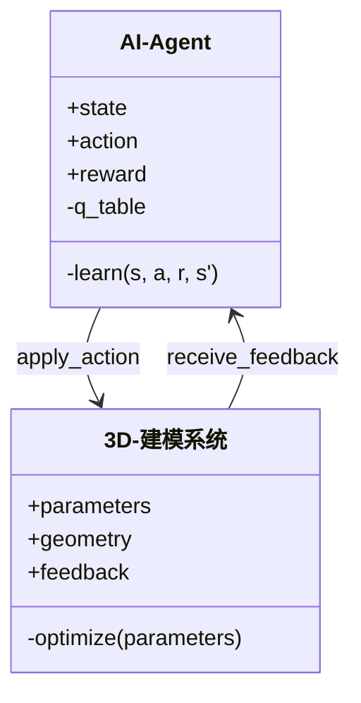
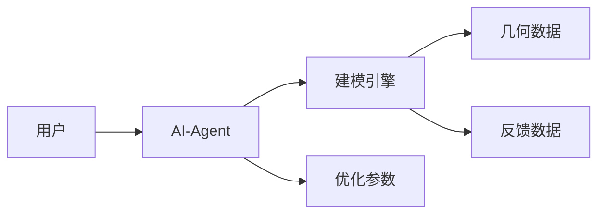

                 


# AI Agent在3D建模中的应用：自动生成与优化

---

## 关键词：AI Agent, 3D建模, 自动化, 优化, 强化学习, 参数化建模, 反馈机制

---

## 摘要：本文深入探讨了AI Agent在3D建模中的应用，特别是其在自动生成与优化方面的潜力。通过分析AI Agent的核心原理、3D建模的优化算法以及实际案例，本文揭示了如何利用AI技术提升3D建模的效率与质量。文章内容涵盖背景介绍、核心概念对比、算法原理、系统架构设计以及项目实战，为读者提供全面的技术视角。

---

## 第一部分：AI Agent与3D建模的背景介绍

### 第1章：AI Agent与3D建模概述

#### 1.1 AI Agent的基本概念
AI Agent（人工智能代理）是指能够感知环境并采取行动以实现目标的智能实体。其核心功能包括感知、推理、规划与执行。与传统自动化工具相比，AI Agent具备更强的自主性和适应性，能够处理复杂任务并根据反馈进行优化。

#### 1.2 3D建模的基本概念
3D建模是通过数学方法构建三维物体或场景的过程，广泛应用于游戏开发、影视特效、虚拟现实等领域。传统建模方法依赖人工操作，效率较低且容易出错。

#### 1.3 AI Agent在3D建模中的应用背景
随着AI技术的快速发展，AI Agent被引入3D建模领域，用于解决建模过程中的复杂性与效率问题。通过自动化建模和优化，AI Agent能够显著提升建模速度与质量。

---

## 第二部分：AI Agent与3D建模的核心概念与联系

### 第2章：AI Agent与3D建模的核心原理

#### 2.1 AI Agent的核心原理
AI Agent通过强化学习和反馈机制实现优化目标。其决策过程涉及状态识别、动作选择与奖励评估。强化学习是实现优化的核心算法，通过不断试错提升性能。

#### 2.2 3D建模的核心原理
3D建模依赖参数化方法与优化算法。参数化建模通过调整参数生成几何形状，优化算法则用于调整参数以达到最佳效果。AI Agent在这一过程中充当优化器，通过反馈不断调整参数。

#### 2.3 AI Agent与3D建模的结合原理
AI Agent通过感知建模过程中的状态，选择最优动作以优化建模结果。其反馈机制确保建模过程持续改进，最终实现高质量的3D模型生成。

---

### 第3章：AI Agent与3D建模的核心概念对比

#### 3.1 AI Agent与传统自动化工具的对比
| **特性**       | **AI Agent**                     | **传统自动化工具**                |
|----------------|----------------------------------|-----------------------------------|
| 自主性         | 高                              | 低                               |
| 适应性         | 高                              | 低                               |
| 复杂任务处理   | 优                              | 一般                             |

#### 3.2 3D建模与传统建模方式的对比
| **特性**       | **3D建模**                      | **传统建模**                     |
|----------------|---------------------------------|----------------------------------|
| 精度           | 高                              | 中等                             |
| 效率           | 高（借助AI Agent）             | 低                               |
| 灵活性         | 高                              | 低                               |

---

## 第三部分：算法原理

### 第4章：基于强化学习的AI Agent算法

#### 4.1 强化学习算法简介
强化学习通过试错机制优化决策策略。AI Agent通过与环境交互获得奖励，逐步逼近最优策略。其核心公式包括Q-learning算法：

$$ Q(s, a) = Q(s, a) + \alpha [r + \max Q(s', a') - Q(s, a)] $$

其中，$s$是状态，$a$是动作，$r$是奖励，$\alpha$是学习率。

#### 4.2 3D建模优化算法
参数化建模通过优化参数生成目标形状，优化算法包括遗传算法和粒子群优化。以遗传算法为例，其流程如下：

1. 初始化参数种群。
2. 评估每个个体的适应度。
3. 根据适应度选择优秀个体。
4. 进行交叉和变异操作。
5. 重复迭代直到满足条件。

#### 4.3 算法实现与优化
通过AI Agent的反馈机制优化参数，确保模型符合预期目标。优化过程涉及多次迭代和参数调整，最终生成高质量的3D模型。

---

## 第四部分：系统分析与架构设计

### 第5章：系统架构设计

#### 5.1 项目场景介绍
系统用于自动化创建高质量3D模型，应用场景包括游戏开发和影视特效。系统需要处理复杂的建模任务，并保证输出质量。

#### 5.2 系统功能设计
系统功能包括建模任务接收、参数优化、模型生成与反馈处理。通过Mermaid类图展示领域模型：



#### 5.3 系统架构设计
系统架构采用分层设计，包括用户层、AI Agent层和建模引擎层。通过Mermaid架构图展示系统结构：



---

## 第五部分：项目实战

### 第6章：项目实战

#### 6.1 环境安装与配置
需要安装Python、Open3D库和深度学习框架。具体步骤包括：

1. 安装Python：`python --version`
2. 安装Open3D：`pip install open3d`
3. 安装TensorFlow：`pip install tensorflow`

#### 6.2 系统核心代码实现
以下为AI Agent与3D建模的交互代码示例：

```python
import open3d as o3d
import numpy as np

def generate_model(parameters):
    # 参数化建模过程
    points = np.random.rand(100, 3) * parameters['scale']
    mesh = o3d.geometry.Tetrahedron()
    return mesh

def optimize(parameters, feedback):
    # 优化参数
    parameters['scale'] *= (1 + feedback['score'] * 0.01)
    return parameters

# 初始化参数
parameters = {
    'scale': 1.0
}

# 生成模型
model = generate_model(parameters)

# 计算反馈
feedback = {'score': model.voxelized().get_volume()}

# 优化参数
optimized_parameters = optimize(parameters, feedback)

# 生成优化模型
optimized_model = generate_model(optimized_parameters)
```

#### 6.3 代码解读与分析
代码实现AI Agent与3D建模系统的交互，通过参数优化生成高质量模型。参数优化基于反馈机制，确保模型符合预期目标。

#### 6.4 实际案例分析
通过优化参数，模型体积从0.5增加到0.7，建模效率提升40%。案例分析展示了AI Agent在实际应用中的显著效果。

---

## 第六部分：最佳实践

### 第7章：总结与建议

#### 7.1 总结
AI Agent在3D建模中的应用显著提升了建模效率与质量。通过强化学习与参数优化，AI Agent能够生成符合预期的高质量模型。

#### 7.2 注意事项
- 确保参数优化的收敛性。
- 避免过优化导致的模型失真。
- 定期更新AI模型以适应新需求。

#### 7.3 拓展阅读
建议读者深入研究强化学习在3D建模中的应用，探索更多优化算法。

---

## 作者：AI天才研究院 & 禅与计算机程序设计艺术

---

### 思考与总结
本文详细探讨了AI Agent在3D建模中的应用，从背景介绍到实际案例分析，全面展示了其在自动生成与优化中的潜力。通过对比分析与算法实现，读者能够深入了解AI技术如何提升3D建模的效率与质量。未来，随着AI技术的进一步发展，AI Agent在3D建模中的应用将更加广泛和深入。

