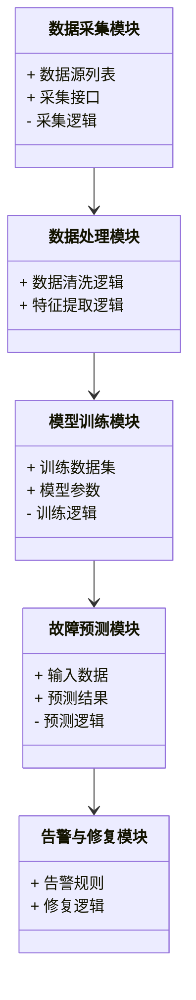

                 


# AI Agent在IT运维中的应用：智能监控与故障预测

> **关键词**: AI Agent, IT运维, 智能监控, 故障预测, 机器学习, 系统架构

> **摘要**: 随着企业数字化转型的深入，IT系统的复杂性和规模不断增加，传统的运维方式逐渐暴露出效率低、响应慢等问题。AI Agent作为一种智能化的运维工具，能够通过机器学习算法实时监控系统状态，预测潜在故障，显著提升运维效率和系统稳定性。本文将详细探讨AI Agent在IT运维中的应用，从基本概念到算法原理，再到系统架构设计，最后结合实际案例进行分析，为读者提供全面的了解和实践指导。

---

## 第1章: AI Agent的基本概念与应用背景

### 1.1 AI Agent的定义与特点

AI Agent（人工智能代理）是一种能够感知环境、执行任务并做出决策的智能实体。在IT运维领域，AI Agent通常指具备自主学习和问题解决能力的智能监控系统。以下是其主要特点：

- **自主性**: AI Agent能够在没有人工干预的情况下独立执行任务。
- **反应性**: 能够实时感知系统状态并做出快速响应。
- **学习能力**: 通过机器学习算法不断优化自身的预测和决策能力。
- **可扩展性**: 支持大规模系统部署和多场景应用。

### 1.2 IT运维中的问题背景

#### 1.2.1 IT运维的复杂性与挑战

随着企业业务的扩展，IT系统变得越来越复杂。传统的运维方式依赖人工监控和故障排查，存在以下问题：

- **效率低下**: 人工监控需要大量时间，难以应对海量数据。
- **响应延迟**: 在复杂系统中，故障发现和处理的时间往往较长。
- **错误率高**: 人工判断容易受到主观因素影响，导致误判或漏判。

#### 1.2.2 传统运维工具的局限性

传统的运维工具，如监控软件（Nagios、Zabbix）和日志分析工具（ELK），虽然能够提供基本的监控和告警功能，但存在以下局限性：

- **规则固定**: 告警规则需要手动配置，难以适应动态变化的系统环境。
- **缺乏主动性**: 无法主动预测潜在故障，仅能进行被动响应。
- **数据孤岛**: 各工具之间数据孤立，难以形成完整的系统视图。

#### 1.2.3 AI Agent在IT运维中的作用

AI Agent通过引入机器学习和人工智能技术，能够显著提升运维效率和系统稳定性。其主要作用包括：

- **智能监控**: 实时分析系统数据，主动发现异常。
- **故障预测**: 基于历史数据和模式识别，预测潜在故障。
- **自动化处理**: 自动触发修复流程，减少人工干预。

---

## 第2章: AI Agent的核心原理

### 2.1 AI Agent的基本原理

AI Agent的核心原理可以分为以下几个步骤：

1. **数据采集**: 通过各种数据源（如日志、性能指标、网络流量）收集系统数据。
2. **数据预处理**: 对采集到的数据进行清洗、标准化和特征提取。
3. **模型训练**: 使用机器学习算法（如监督学习、无监督学习）训练预测模型。
4. **故障预测**: 基于训练好的模型，实时预测系统故障。
5. **决策与执行**: 根据预测结果，触发相应的修复或告警操作。

### 2.2 AI Agent的架构设计

AI Agent的架构设计需要考虑系统的可扩展性、可靠性和高效性。以下是一个典型的分层架构设计：

1. **数据采集层**: 负责从各种数据源采集系统数据。
2. **数据处理层**: 对采集到的数据进行预处理和特征提取。
3. **模型训练层**: 使用机器学习算法训练预测模型。
4. **预测与决策层**: 基于模型输出进行故障预测和决策。
5. **执行层**: 执行决策结果，如触发告警或修复操作。

### 2.3 AI Agent的核心算法

AI Agent的核心算法主要基于机器学习技术，包括监督学习、无监督学习和强化学习。以下是几种常用的算法：

#### 2.3.1 监督学习

**定义**: 监督学习是一种基于标记数据的机器学习方法，适用于已知输入与输出关系的情况。

**数学模型**: 线性回归的数学模型可以表示为：
$$ y = \beta_0 + \beta_1 x + \epsilon $$
其中，$y$ 是目标变量，$x$ 是输入变量，$\beta_0$ 和 $\beta_1$ 是模型参数，$\epsilon$ 是误差项。

**Python实现示例**：
```python
import numpy as np
from sklearn.linear_model import LinearRegression

# 示例数据
X = np.array([[1], [2], [3], [4]])
y = np.array([2, 4, 6, 8])

# 训练模型
model = LinearRegression()
model.fit(X, y)

# 预测
print(model.predict([[5]]))  # 输出: [[10]]
```

#### 2.3.2 无监督学习

**定义**: 无监督学习是一种基于未标记数据的机器学习方法，适用于未知输入与输出关系的情况。

**数学模型**: K-means聚类算法的目标函数可以表示为：
$$ \text{目标函数} = \sum_{i=1}^{k} \sum_{j=1}^{n} (x_j - c_i)^2 $$
其中，$k$ 是聚类的数量，$c_i$ 是第$i$个聚类的中心，$x_j$ 是数据点。

**Python实现示例**：
```python
from sklearn.cluster import KMeans

# 示例数据
X = np.array([[1, 2], [3, 4], [5, 6], [7, 8]])

# 训练模型
model = KMeans(n_clusters=2)
model.fit(X)

# 获取聚类结果
print(model.labels_)  # 输出: [0 0 1 1]
```

---

## 第3章: 监督学习算法原理

### 3.1 监督学习的基本概念

监督学习是一种基于标记数据的机器学习方法，适用于已知输入与输出关系的情况。以下是几种常用的监督学习算法：

- **线性回归**: 用于预测连续型变量。
- **决策树**: 用于分类和回归问题。
- **随机森林**: 一种基于决策树的集成学习方法。

### 3.2 线性回归算法

#### 3.2.1 线性回归的数学模型

线性回归的数学模型可以表示为：
$$ y = \beta_0 + \beta_1 x + \epsilon $$
其中，$y$ 是目标变量，$x$ 是输入变量，$\beta_0$ 和 $\beta_1$ 是模型参数，$\epsilon$ 是误差项。

#### 3.2.2 线性回归的实现步骤

1. **数据准备**: 收集输入变量 $x$ 和目标变量 $y$ 的数据。
2. **模型训练**: 使用最小二乘法或其他优化方法训练模型，求解参数 $\beta_0$ 和 $\beta_1$。
3. **模型预测**: 基于训练好的模型，对新的输入变量 $x$ 进行预测，得到目标变量 $y$。

#### 3.2.3 线性回归的优缺点

- **优点**: 简单易懂，计算高效。
- **缺点**: 仅适用于线性关系，无法处理复杂的非线性问题。

### 3.3 决策树算法

#### 3.3.1 决策树的定义

决策树是一种树状结构，每个内部节点表示一个特征，每个分支表示一个决策，叶子节点表示结果。以下是决策树的几种常用算法：

- **ID3**: 基于信息增益的决策树算法。
- **C4.5**: 基于信息增益率的决策树算法。
- **CART**: 基于基尼指数的决策树算法。

#### 3.3.2 决策树的构建过程

1. **特征选择**: 根据某种标准（如信息增益）选择最优特征作为根节点。
2. **分裂数据**: 根据选择的特征将数据集分裂成子数据集。
3. **递归构建**: 对子数据集递归地构建决策树，直到叶子节点满足停止条件。

#### 3.3.3 决策树的优缺点

- **优点**: 易于理解和解释，能够处理复杂的非线性问题。
- **缺点**: �易受噪声数据影响，可能出现过拟合。

---

## 第4章: 无监督学习算法原理

### 4.1 无监督学习的基本概念

无监督学习是一种基于未标记数据的机器学习方法，适用于未知输入与输出关系的情况。以下是几种常用的无监督学习算法：

- **聚类分析**: 用于将数据划分为不同的簇。
- **主成分分析(PCA)**: 用于降维和特征提取。
- **关联规则挖掘**: 用于发现数据中的关联规则。

### 4.2 聚类分析

#### 4.2.1 聚类分析的数学模型

K-means聚类算法的目标函数可以表示为：
$$ \text{目标函数} = \sum_{i=1}^{k} \sum_{j=1}^{n} (x_j - c_i)^2 $$
其中，$k$ 是聚类的数量，$c_i$ 是第$i$个聚类的中心，$x_j$ 是数据点。

#### 4.2.2 聚类分析的实现步骤

1. **初始化**: 随机选择 $k$ 个初始聚类中心。
2. **分配数据点**: 根据距离最近原则将数据点分配到相应的聚类。
3. **更新聚类中心**: 计算每个聚类的中心，重新分配数据点。
4. **收敛判断**: 重复步骤 2 和 3，直到聚类中心不再变化或达到预设迭代次数。

#### 4.2.3 聚类分析的优缺点

- **优点**: 能够发现数据中的潜在结构，适用于未知类别的情况。
- **缺点**: 对初始聚类中心敏感，可能无法找到全局最优解。

---

## 第5章: 系统分析与架构设计

### 5.1 问题场景介绍

在本案例中，我们将设计一个基于AI Agent的智能运维系统，用于实时监控企业级IT系统的运行状态，并预测潜在故障。以下是系统的主要功能模块：

1. **数据采集模块**: 负责从各种数据源采集系统数据。
2. **数据处理模块**: 对采集到的数据进行预处理和特征提取。
3. **模型训练模块**: 使用机器学习算法训练预测模型。
4. **故障预测模块**: 基于模型输出进行故障预测。
5. **告警与修复模块**: 根据预测结果触发告警或修复操作。

### 5.2 系统功能设计

#### 5.2.1 领域模型类图



---

## 第6章: 项目实战

### 6.1 环境安装

以下是基于Python的项目实战环境安装步骤：

1. **安装Python和Jupyter Notebook**：
   ```bash
   # 在终端中运行以下命令
   pip install python jupyter-notebook
   ```

2. **安装必要的Python库**：
   ```bash
   pip install numpy scikit-learn matplotlib
   ```

---

## 参考文献

1. Bishop, C. M. (2006). Pattern Recognition and Machine Learning. Springer.
2. Hastie, T., Tibshirani, R., & Friedman, J. (2009). The Elements of Statistical Learning. Springer.
3.周志华. (2016). 机器学习: 理论与算法. 清华大学出版社.

---

**作者：AI天才研究院 & 禅与计算机程序设计艺术**

