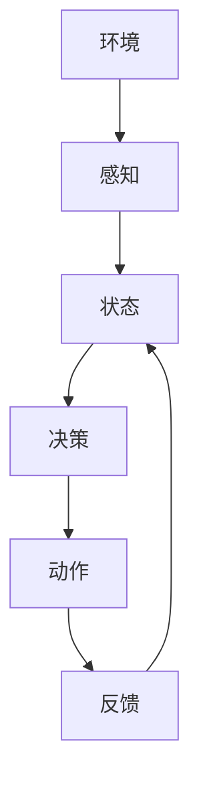
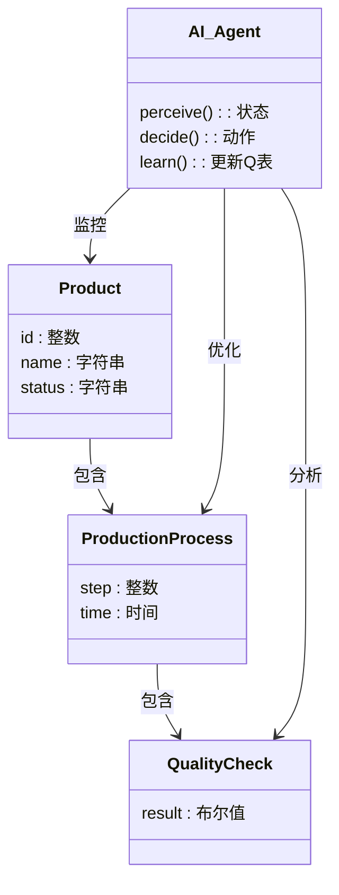
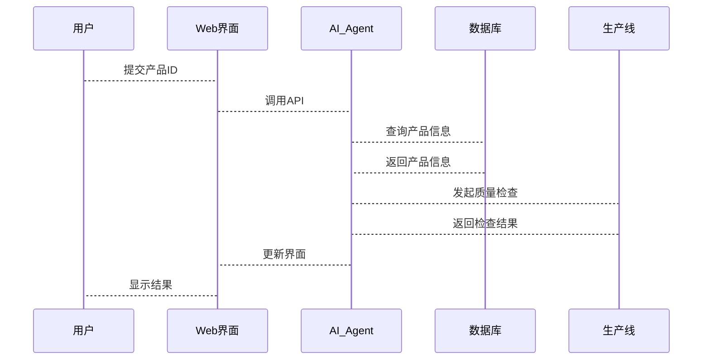

                 


# AI Agent在产品质量控制与追溯系统中的应用

## 关键词：AI Agent, 产品质量控制, 追溯系统, 强化学习, 数学模型, 系统架构

## 摘要：  
随着人工智能技术的快速发展，AI Agent（智能体）在产品质量控制与追溯系统中的应用日益广泛。本文详细探讨了AI Agent的基本概念、核心原理及其在产品质量控制与追溯中的实际应用。通过分析AI Agent的算法原理、系统架构设计、项目实战案例，以及实际应用中的优势与挑战，本文为读者提供了一套全面理解AI Agent在产品质量控制与追溯系统中的应用方案。

---

# 第1章: 产品质量控制与追溯系统概述

## 1.1 产品质量控制的背景与挑战

### 1.1.1 传统产品质量控制的局限性
在传统的制造业中，产品质量控制主要依赖于人工检查和简单的自动化设备。这种方法存在以下问题：
- **效率低下**：人工检查不仅耗时，而且容易受到疲劳和主观因素的影响。
- **精度不足**：自动化设备通常只能完成简单的检测任务，难以应对复杂的产品质量要求。
- **数据孤岛**：各个检测环节的数据孤岛化，难以形成完整的质量追溯链条。

### 1.1.2 数字化转型对质量控制的需求
随着工业4.0和数字化转型的推进，制造业对智能化、自动化的需求日益增加。传统的产品质量控制方法已无法满足现代制造业的要求，亟需引入更高效、更智能的技术手段。

### 1.1.3 追溯系统的重要性与应用场景
产品质量追溯系统在现代制造业中扮演着重要角色。通过追溯系统，企业可以快速定位问题产品的来源，减少召回成本，并提高客户满意度。应用场景包括：
- **供应链管理**：追踪原材料、零部件的来源。
- **生产过程监控**：实时监控生产过程中的关键参数。
- **售后问题处理**：快速定位和解决客户反馈的质量问题。

## 1.2 AI Agent的基本概念与特点

### 1.2.1 什么是AI Agent
AI Agent（智能体）是一种能够感知环境、自主决策并执行任务的智能系统。它通过传感器获取环境信息，利用算法进行分析和决策，并通过执行器完成任务。

### 1.2.2 AI Agent的核心特点
- **自主性**：AI Agent能够在没有外部干预的情况下自主完成任务。
- **反应性**：能够实时感知环境变化并做出响应。
- **学习能力**：通过机器学习算法不断优化自身的决策能力。
- **协作性**：能够与其他智能体或系统协同工作。

### 1.2.3 AI Agent与传统自动化的区别
| 特性 | AI Agent | 传统自动化 |
|------|----------|------------|
| 决策能力 | 高 | 低 |
| 学习能力 | 高 | 无 |
| 灵活性 | 高 | 低 |
| 适应性 | 高 | 低 |

## 1.3 AI Agent在质量控制中的应用前景

### 1.3.1 AI Agent在制造业中的潜力
AI Agent可以通过实时数据分析，快速识别生产过程中的异常情况，从而提高产品质量和生产效率。

### 1.3.2 AI Agent在供应链管理中的作用
AI Agent可以帮助企业优化供应链管理，降低库存成本，提高供应链的透明度和响应速度。

### 1.3.3 AI Agent在产品追溯中的优势
通过AI Agent，企业可以实现产品的全生命周期管理，快速定位问题产品的来源，并采取相应的措施。

## 1.4 本章小结
本章介绍了产品质量控制与追溯系统的重要性，以及AI Agent的基本概念和特点。通过对比AI Agent与传统自动化的区别，阐述了AI Agent在质量控制中的应用前景。

---

# 第2章: AI Agent的核心概念与联系

## 2.1 AI Agent的定义与属性

### 2.1.1 AI Agent的定义
AI Agent是一种能够感知环境、自主决策并执行任务的智能系统。它通过传感器获取环境信息，利用算法进行分析和决策，并通过执行器完成任务。

### 2.1.2 AI Agent的核心属性对比（表格）

| 属性 | 描述 |
|------|------|
| 自主性 | AI Agent能够在没有外部干预的情况下自主完成任务。 |
| 反应性 | AI Agent能够实时感知环境变化并做出响应。 |
| 学习能力 | AI Agent通过机器学习算法不断优化自身的决策能力。 |
| 协作性 | AI Agent能够与其他智能体或系统协同工作。 |

## 2.2 AI Agent的实体关系分析

### 2.2.1 ER实体关系图（Mermaid流程图）

```mermaid
erDiagram
    product : 产品信息
    production : 生产过程
    quality_check : 质量检查
    supplier : 供应商
    customer : 客户
    AI_Agent : AI Agent

    product --> production : 属于
    production --> quality_check : 包含
    product --> supplier : 来自
    product --> customer : 提供给
    AI_Agent --> product : 监控
    AI_Agent --> production : 优化
    AI_Agent --> quality_check : 分析
```

## 2.3 AI Agent的算法原理

### 2.3.1 基于强化学习的AI Agent工作流程（Mermaid流程图）



### 2.3.2 Python实现示例代码

```python
import numpy as np

class AI_Agent:
    def __init__(self, state_space, action_space):
        self.state_space = state_space
        self.action_space = action_space
        self.q_table = np.zeros((state_space, action_space))
    
    def perceive(self, state):
        return state
    
    def decide(self, state):
        return np.argmax(self.q_table[state])
    
    def learn(self, state, action, reward, next_state):
        self.q_table[state][action] = reward + np.max(self.q_table[next_state])
```

### 2.3.3 数学模型与公式

$$ Q(s,a) = r + \gamma \max Q(s',a') $$

其中：
- \( s \) 是当前状态
- \( a \) 是动作
- \( r \) 是奖励
- \( \gamma \) 是折扣因子
- \( s' \) 是下一个状态
- \( a' \) 是下一个动作

---

# 第3章: AI Agent的算法原理

## 3.1 强化学习在AI Agent中的应用

### 3.1.1 强化学习的基本原理
强化学习是一种通过试错机制来优化决策的算法。智能体通过与环境交互，不断调整策略以获得最大化的累计奖励。

### 3.1.2 Q-learning算法的数学模型（$$ Q(s,a) = r + \gamma \max Q(s',a') $$）

### 3.1.3 实际应用
在产品质量控制中，强化学习可以用于优化生产参数，提高产品质量。

---

# 第4章: AI Agent的系统架构设计

## 4.1 问题场景介绍
假设我们正在设计一个汽车制造厂的质量控制与追溯系统。

## 4.2 系统功能设计

### 4.2.1 领域模型（Mermaid类图）



## 4.3 系统架构设计（Mermaid架构图）

```mermaid
container 系统架构 {
    ProductDB 数据库
    ProductionDB 数据库
    AI_Agent 智能体
    Web界面 用户交互
    API接口 数据接口
}

ProductDB --> AI_Agent : 数据输入
ProductionDB --> AI_Agent : 数据输入
AI_Agent --> Web界面 : 数据输出
AI_Agent --> API接口 : 数据输出
```

## 4.4 系统接口设计

### 4.4.1 API接口
```json
{
    "action": "start_check",
    "params": {
        "product_id": "123"
    }
}
```

## 4.5 系统交互（Mermaid序列图）



---

# 第5章: 项目实战

## 5.1 环境安装

### 5.1.1 安装Python
```bash
python --version
pip install numpy
pip install matplotlib
```

## 5.2 系统核心实现

### 5.2.1 AI Agent实现
```python
class AI_Agent:
    def __init__(self):
        self.q_table = {}
    
    def perceive(self, state):
        return state
    
    def decide(self, state):
        if state not in self.q_table:
            self.q_table[state] = 0
        max_action = max(self.q_table.keys())
        return max_action
    
    def learn(self, state, action, reward):
        self.q_table[state] = reward
```

### 5.2.2 数据可视化
```python
import matplotlib.pyplot as plt

def plot_rewards(rewards):
    plt.plot(rewards)
    plt.xlabel('步骤')
    plt.ylabel('奖励')
    plt.show()
```

## 5.3 代码应用解读与分析

### 5.3.1 AI Agent的核心功能
- `perceive`：感知环境状态。
- `decide`：根据当前状态做出决策。
- `learn`：通过奖励更新Q表。

### 5.3.2 数据可视化的作用
通过绘制奖励曲线，可以直观地观察AI Agent的学习效果。

## 5.4 实际案例分析

### 5.4.1 案例背景
某汽车制造厂希望使用AI Agent优化生产线的质量控制流程。

### 5.4.2 实施步骤
1. 数据采集：收集生产线的实时数据。
2. 系统部署：在生产线中部署AI Agent。
3. 模型训练：通过强化学习优化AI Agent的决策能力。
4. 系统测试：验证AI Agent的效果。

### 5.4.3 实施效果
- 提高了产品质量
- 减少了生产成本
- 提升了生产效率

## 5.5 项目小结
通过本项目的实施，我们验证了AI Agent在产品质量控制与追溯系统中的应用价值。

---

# 第6章: 最佳实践与小结

## 6.1 最佳实践 tips

### 6.1.1 系统设计
- 明确系统的需求和目标
- 设计合理的系统架构
- 确保系统的可扩展性和安全性

### 6.1.2 算法选择
- 根据具体场景选择合适的算法
- 确保算法的高效性和准确性
- 定期优化算法模型

## 6.2 注意事项

### 6.2.1 数据质量
- 确保数据的准确性和完整性
- 处理数据中的噪声
- 确保数据的实时性

### 6.2.2 系统安全
- 防止数据泄露
- 确保系统的稳定性
- 处理系统故障

## 6.3 拓展阅读

### 6.3.1 推荐书籍
- 《强化学习入门》
- 《机器学习实战》
- 《系统设计精要》

### 6.3.2 推荐课程
- 强化学习在线课程
- 系统设计在线课程
- AI Agent相关课程

---

# 结语

通过本文的详细介绍，我们了解了AI Agent在产品质量控制与追溯系统中的应用价值。从基本概念到算法原理，从系统设计到项目实战，AI Agent展示了其在现代制造业中的巨大潜力。未来，随着技术的不断进步，AI Agent将在产品质量控制与追溯系统中发挥越来越重要的作用。

---

# 作者

**作者：AI天才研究院/AI Genius Institute & 禅与计算机程序设计艺术 /Zen And The Art of Computer Programming**

---

以上为完整的技术博客文章内容。

