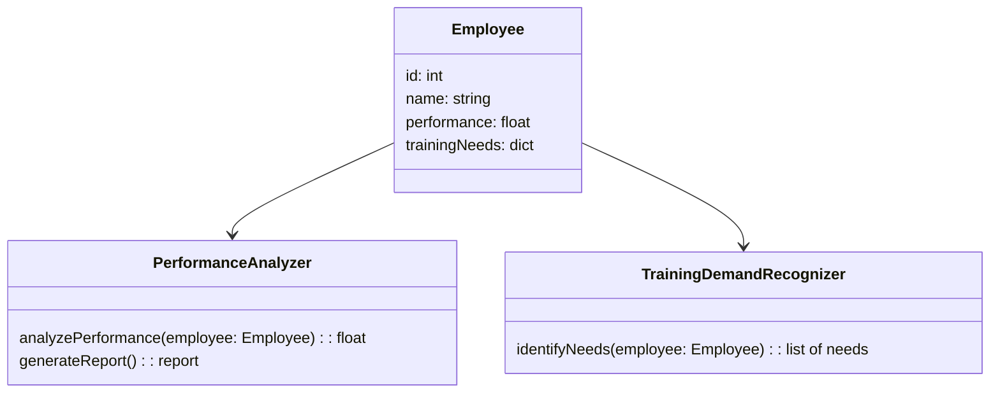
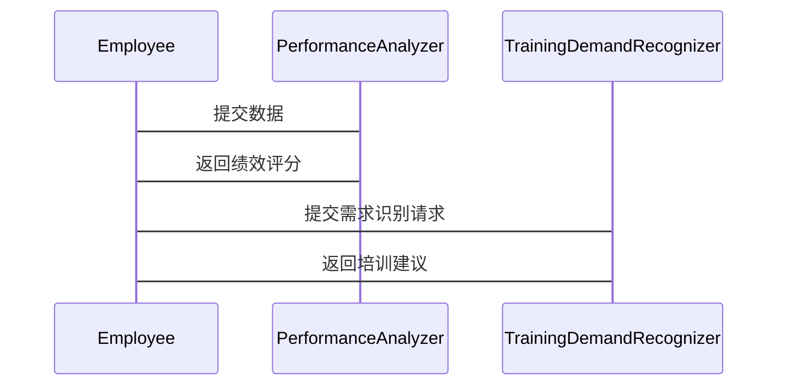

                 


# AI Agent在人力资源管理中的应用：员工绩效分析与培训需求识别

## 关键词：
AI Agent, 人力资源管理, 员工绩效, 培训需求, 数据分析, 人工智能

## 摘要：
本文探讨了AI Agent在人力资源管理中的应用，特别是如何通过员工绩效分析和培训需求识别优化人力资源管理。文章详细介绍了AI Agent的基本概念、在绩效分析和培训需求识别中的应用优势，分析了相关的算法原理和系统架构设计，提供了实际项目案例，并总结了最佳实践和注意事项。

---

## 第一部分: AI Agent在人力资源管理中的应用背景

### 第1章: AI Agent与人力资源管理概述

#### 1.1 AI Agent的基本概念
##### 1.1.1 AI Agent的定义与特点
AI Agent（人工智能代理）是指能够感知环境、执行任务并做出决策的智能实体。其特点包括自主性、反应性、目标导向和社会能力。

##### 1.1.2 AI Agent在企业管理中的作用
AI Agent能够自动化处理任务、优化决策、提高效率，并通过数据分析提供个性化支持。

##### 1.1.3 人力资源管理中的AI Agent应用前景
AI Agent在招聘、绩效管理、培训等方面具有广阔的应用前景，能够显著提升HR工作的智能化水平。

#### 1.2 人力资源管理中的挑战与痛点
##### 1.2.1 员工绩效评估的传统方法与局限性
传统绩效评估方法主观性强、效率低，难以全面反映员工表现。

##### 1.2.2 培训需求识别的难点与现状
培训需求识别存在数据不足、个性化需求难以满足等问题。

##### 1.2.3 传统方法与AI Agent的结合需求
通过AI Agent整合数据和智能分析，解决传统方法的不足，提升HR管理的效率和精准度。

---

## 第二部分: 核心概念与联系

### 第2章: 绩效分析的核心概念
#### 2.1 绩效分析的定义与目标
绩效分析旨在通过数据量化员工表现，识别其优势与不足。

#### 2.2 数据来源与处理方法
数据来源包括考勤记录、任务完成情况、客户反馈等。数据处理方法包括清洗、特征提取和建模。

#### 2.3 绩效分析的指标体系
指标体系包括定量指标（如任务完成率）和定性指标（如团队协作能力）。

### 第3章: 培训需求识别的核心概念
#### 3.1 培训需求的定义与分类
培训需求是指员工在工作中需要提升的知识或技能，可分为技能提升型和知识更新型。

#### 3.2 数据驱动的培训需求识别方法
通过数据分析识别员工的知识缺口和技能不足，制定个性化培训计划。

#### 3.3 绩效分析与培训需求识别的关系
绩效分析为培训需求识别提供数据支持，培训需求识别反过来促进绩效提升。

---

## 第三部分: 算法原理

### 第4章: 数据预处理与特征提取
#### 4.1 数据清洗
去除噪声数据，确保数据质量。

#### 4.2 特征提取
从原始数据中提取关键特征，如任务完成时间、错误率等。

### 第5章: 绩效预测模型
#### 5.1 线性回归模型
通过线性回归预测员工绩效，公式为：
$$ y = \beta_0 + \beta_1x_1 + \beta_2x_2 + ... + \beta_nx_n $$

#### 5.2 聚类算法
使用聚类算法将员工分为不同绩效等级，便于针对性管理。

### 第6章: 培训需求预测模型
#### 6.1 决策树模型
通过决策树分析员工的培训需求，选择合适的培训方案。

---

## 第四部分: 系统分析与架构设计

### 第7章: 系统功能设计
#### 7.1 领域模型（Mermaid类图）


#### 7.2 系统架构设计（Mermaid架构图）


### 第8章: 系统交互设计
#### 8.1 交互流程（Mermaid序列图）


---

## 第五部分: 项目实战

### 第9章: 环境安装与代码实现
#### 9.1 环境安装
安装Python、Pandas、Scikit-learn等工具。

#### 9.2 绩效分析代码实现
```python
import pandas as pd
from sklearn.linear_model import LinearRegression

# 数据加载与预处理
data = pd.read_csv('performance_data.csv')
X = data[['task_completion_time', 'errors']]
y = data['performance_score']

# 模型训练
model = LinearRegression()
model.fit(X, y)

# 预测绩效
new_employee = [[15, 2]]
predicted_score = model.predict(new_employee)
print(predicted_score)
```

### 第10章: 培训需求识别代码实现
```python
from sklearn.cluster import KMeans

# 数据加载与预处理
data = pd.read_csv('training_data.csv')
X = data[['skill_gap', 'knowledge_gap']]

# 模型训练
model = KMeans(n_clusters=3)
model.fit(X)

# 预测需求
new_employee = [[10, 5]]
predicted_cluster = model.predict([new_employee])
print(predicted_cluster)
```

### 第11章: 实际案例分析
通过实际案例分析AI Agent在绩效分析和培训需求识别中的应用效果，展示系统的实际价值。

---

## 第六部分: 最佳实践与总结

### 第12章: 最佳实践
#### 12.1 数据隐私保护
确保员工数据的安全性和隐私性。

#### 12.2 模型调优
定期更新模型，保持其预测能力。

### 第13章: 小结与注意事项
AI Agent的应用能够显著提升HR管理的效率和精准度，但需注意数据质量和模型维护。

### 第14章: 拓展阅读
推荐相关书籍和论文，鼓励读者深入研究。

---

## 作者信息：
作者：AI天才研究院 & 禅与计算机程序设计艺术

---

通过本文的详细讲解，读者可以全面了解AI Agent在人力资源管理中的应用，掌握相关的算法原理和系统设计方法，并能够在实际工作中应用这些技术优化HR管理。

