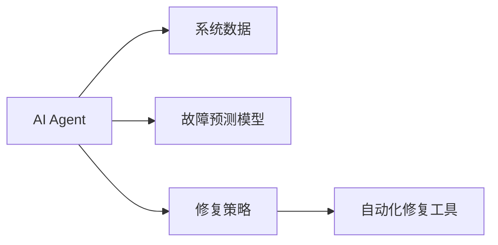
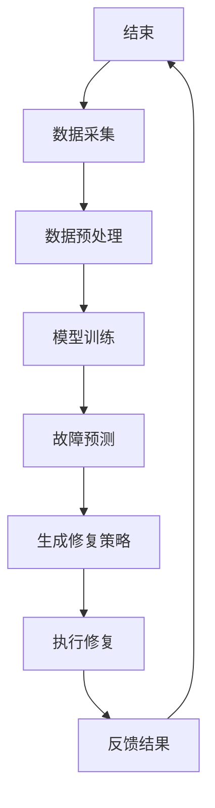
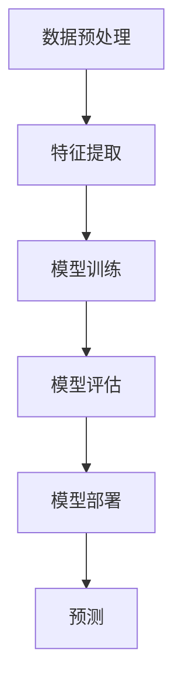
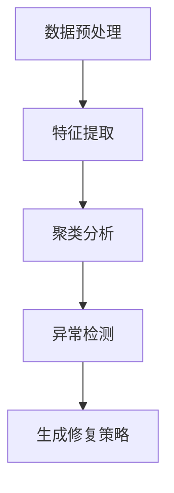
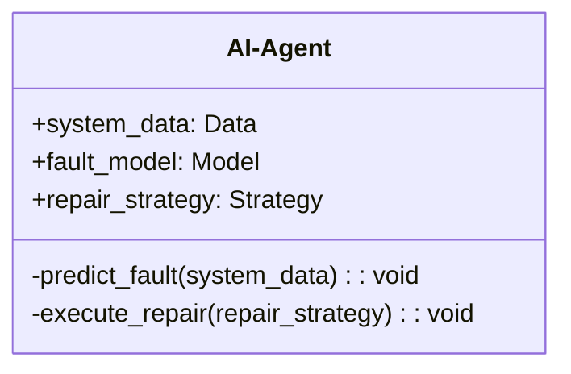
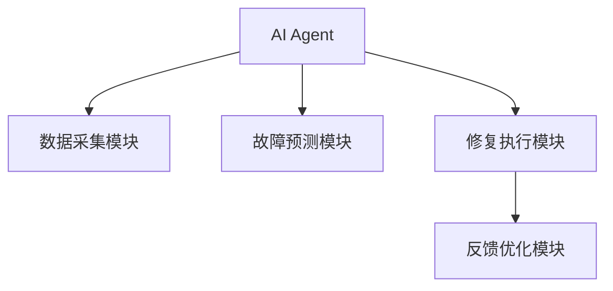

                 


# AI Agent在企业IT运维中的应用：故障预测与修复

> 关键词：AI Agent, 企业IT运维, 故障预测, 自动化修复, 机器学习, 系统架构

> 摘要：本文探讨了AI Agent在企业IT运维中的应用，重点分析了故障预测与修复的核心原理、系统架构及实际案例。通过结合理论与实践，详细阐述了AI Agent如何利用机器学习算法优化运维流程，为企业提供高效、智能的运维解决方案。

---

# 第1章: AI Agent与企业IT运维概述

## 1.1 AI Agent的基本概念

### 1.1.1 什么是AI Agent
AI Agent（人工智能代理）是一种能够感知环境、自主决策并执行任务的智能实体。它通过数据驱动的方法，结合机器学习算法，实现对复杂系统的监控、分析和优化。

### 1.1.2 AI Agent的核心特点
- **自主性**：无需人工干预，自动完成任务。
- **反应性**：能够实时感知环境变化并做出响应。
- **学习能力**：通过历史数据不断优化自身的决策模型。
- **可扩展性**：能够适应不同规模和复杂度的系统。

### 1.1.3 AI Agent在企业IT运维中的应用价值
- 提高系统稳定性：通过故障预测和自动化修复，降低系统故障率。
- 减少人力成本：AI Agent能够自动化处理大量重复性工作，降低运维成本。
- 提升运维效率：通过智能化决策，缩短故障响应时间，优化资源分配。

## 1.2 企业IT运维的挑战与需求

### 1.2.1 传统IT运维的痛点
- **故障响应慢**：依赖人工监控，故障发现和处理时间长。
- **误报与漏报**：传统监控工具容易出现误报或漏报，影响运维质量。
- **复杂性增加**：随着系统规模扩大，运维复杂性呈指数级增长。

### 1.2.2 现代企业对智能运维的需求
- **智能化监控**：实时分析系统状态，精准预测故障。
- **自动化修复**：在发现故障后，快速定位并自动化修复。
- **数据驱动决策**：通过历史数据优化运维策略。

### 1.2.3 故障预测与修复的重要性
故障预测与修复是企业IT运维的核心任务之一。通过AI Agent实现智能化故障预测，能够提前发现潜在问题，避免故障发生；自动化修复则能够在故障发生时快速响应，减少 downtime。

## 1.3 AI Agent在故障预测与修复中的作用

### 1.3.1 AI Agent如何实现故障预测
AI Agent通过收集系统运行数据（如CPU、内存、磁盘使用情况等），利用机器学习算法（如XGBoost、LSTM）建立预测模型，分析历史数据中的模式，预测未来可能出现的故障。

### 1.3.2 AI Agent如何优化修复过程
AI Agent在预测到故障后，能够快速调用自动化修复工具（如Ansible、Puppet）执行修复操作。同时，通过持续学习，优化修复策略，提高修复效率和成功率。

### 1.3.3 AI Agent与传统运维工具的区别
| 特性               | AI Agent                         | 传统运维工具                     |
|--------------------|----------------------------------|----------------------------------|
| 智能性             | 强大的学习和推理能力             | 依赖预定义规则和脚本           |
| 自主性             | 能够自主决策和执行               | 需要人工干预                   |
| 适应性             | 能够适应复杂和动态的环境         | 适应性较弱                   |

---

# 第2章: AI Agent的核心概念与原理

## 2.1 AI Agent的核心概念

### 2.1.1 感知层：数据采集与分析
AI Agent通过传感器、日志文件和API接口等方式采集系统运行数据，并利用自然语言处理（NLP）和时间序列分析等技术对数据进行清洗和预处理。

### 2.1.2 决策层：故障预测与修复策略
基于感知层提供的数据，AI Agent利用监督学习、无监督学习和强化学习等算法，构建预测模型，并生成修复策略。

### 2.1.3 执行层：自动化修复与反馈
AI Agent通过调用自动化工具执行修复操作，并将修复结果反馈到决策层，用于优化预测模型。

## 2.2 AI Agent与相关技术的对比

### 2.2.1 AI Agent与规则引擎的对比
| 特性               | AI Agent                         | 规则引擎                         |
|--------------------|----------------------------------|----------------------------------|
| 决策方式           | 基于机器学习模型                 | 基于预定义规则                   |
| 灵活性             | 高，能够适应复杂场景             | 较低，依赖规则编写               |
| 学习能力           | 强大，能够从数据中自动学习       | 无，依赖人工编写规则             |

### 2.2.2 AI Agent与传统脚本自动化工具的对比
| 特性               | AI Agent                         | 传统脚本工具                     |
|--------------------|----------------------------------|----------------------------------|
| 智能性             | 强大的学习和推理能力             | 无，仅能执行预定义脚本           |
| 自主性             | 能够自主决策和执行               | 需要人工触发或配置               |
| 适应性             | 能够适应复杂和动态的环境         | 适应性较弱                   |

## 2.3 AI Agent的实体关系与流程图

### 2.3.1 实体关系图


### 2.3.2 流程图


---

# 第3章: AI Agent的算法原理

## 3.1 监督学习算法

### 3.1.1 算法流程图


### 3.1.2 核心代码示例
```python
import pandas as pd
from sklearn.model_selection import train_test_split
from sklearn.linear_model import LinearRegression

# 数据预处理
data = pd.read_csv('system_data.csv')
X = data[['CPU_usage', 'Memory_usage']]
y = data['fault_flag']

# 数据分割
X_train, X_test, y_train, y_test = train_test_split(X, y, test_size=0.2)

# 模型训练
model = LinearRegression()
model.fit(X_train, y_train)

# 预测
y_pred = model.predict(X_test)
```

### 3.1.3 数学公式
$$
y = wx + b
$$

## 3.2 无监督学习算法

### 3.2.1 算法流程图


### 3.2.2 核心代码示例
```python
from sklearn.cluster import KMeans

# 数据预处理
data = pd.read_csv('system_data.csv')
X = data[['CPU_usage', 'Memory_usage']]

# 聚类分析
model = KMeans(n_clusters=2)
model.fit(X)

# 异常检测
outliers = model.predict(X)
```

---

# 第4章: 系统分析与架构设计

## 4.1 问题场景介绍

### 4.1.1 项目介绍
某企业IT系统包含多个服务器和网络设备，每天产生大量运维数据。传统运维方式依赖人工监控，故障响应时间长，修复效率低。

### 4.1.2 系统功能设计
- 数据采集模块：实时采集系统运行数据。
- 故障预测模块：基于机器学习模型预测潜在故障。
- 修复执行模块：调用自动化工具执行修复操作。
- 反馈优化模块：根据修复结果优化预测模型。

## 4.2 系统架构设计

### 4.2.1 领域模型设计


### 4.2.2 系统架构图


### 4.2.3 接口设计
- 数据采集接口：提供REST API用于数据上传。
- 模型训练接口：提供训练数据和模型参数的配置接口。
- 修复执行接口：提供修复操作的调用接口。

---

# 第5章: 项目实战

## 5.1 环境安装

### 5.1.1 安装Python和相关库
```bash
pip install numpy pandas scikit-learn
```

## 5.2 核心代码实现

### 5.2.1 数据预处理
```python
import pandas as pd

data = pd.read_csv('system_data.csv')
data = data.dropna()
```

### 5.2.2 模型训练
```python
from sklearn.ensemble import RandomForestClassifier

model = RandomForestClassifier()
model.fit(X_train, y_train)
```

### 5.2.3 模型部署
```python
import joblib

joblib.dump(model, 'fault_prediction_model.pkl')
```

## 5.3 实际案例分析

### 5.3.1 案例背景
某企业的Web服务器出现频繁的500错误，传统监控工具未能及时发现。

### 5.3.2 数据分析
通过AI Agent采集的数据发现，服务器内存使用率在高峰时段急剧上升，导致系统崩溃。

### 5.3.3 模型预测
AI Agent预测到内存泄漏问题将在接下来的2小时内触发系统崩溃。

### 5.3.4 自动化修复
AI Agent调用自动化工具关闭非必要的服务，释放内存资源，成功避免了系统崩溃。

---

# 第6章: 最佳实践与总结

## 6.1 小结
AI Agent通过智能化的故障预测和自动化修复，显著提升了企业IT运维的效率和稳定性。通过结合机器学习算法和自动化工具，AI Agent为企业提供了高效、可靠的运维解决方案。

## 6.2 注意事项
- 数据质量：确保数据的完整性和准确性，避免误报和漏报。
- 模型优化：定期更新模型，适应系统变化。
- 安全性：确保AI Agent的权限管理，避免安全漏洞。

## 6.3 拓展阅读
- 《机器学习实战》
- 《深入理解分布式系统》
- 《自动化运维的艺术》

---

作者：AI天才研究院/AI Genius Institute & 禅与计算机程序设计艺术 /Zen And The Art of Computer Programming

