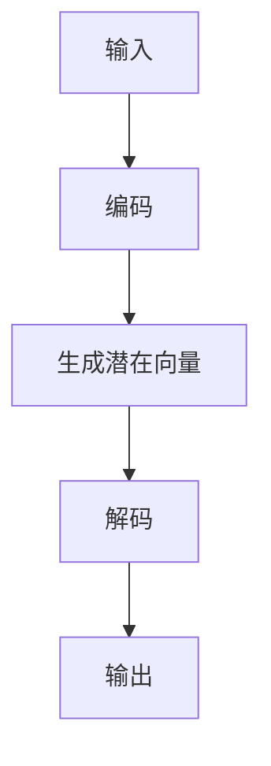
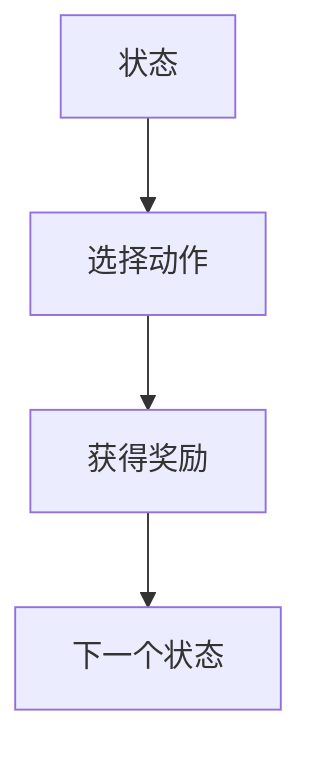
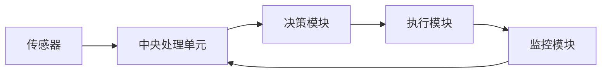
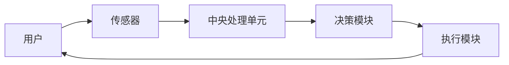

                 


# AI Agent在企业产品开发与创新中的角色

> 关键词：AI Agent，企业产品开发，创新，人工智能，系统架构

> 摘要：本文探讨了AI Agent在企业产品开发与创新中的核心角色，分析了AI Agent的基本概念、算法原理、系统架构设计以及在实际项目中的应用。通过具体案例，本文展示了AI Agent如何助力企业提升效率、优化决策和推动创新，并总结了最佳实践和未来发展方向。

---

## 第1章: AI Agent 的基本概念与背景

### 1.1 AI Agent 的定义与核心要素

#### 1.1.1 什么是AI Agent
AI Agent（人工智能代理）是指能够感知环境、自主决策并执行任务的智能实体。与传统的AI系统不同，AI Agent具有主动性、目标导向性和适应性。它能够根据输入的信息做出决策，并通过行动实现目标。

#### 1.1.2 AI Agent 的核心要素
AI Agent的核心要素包括：
1. **感知能力**：通过传感器或数据输入获取环境信息。
2. **决策能力**：基于感知信息，通过算法做出决策。
3. **行动能力**：根据决策执行具体操作。
4. **学习能力**：通过反馈不断优化自身的行为。

#### 1.1.3 AI Agent 的分类与特点
AI Agent可以根据不同的标准进行分类，常见的分类方式包括：
- **基于智能水平**：分为弱AI Agent（针对特定任务）和强AI Agent（具备广泛智能）。
- **基于决策方式**：分为基于规则的AI Agent和基于学习的AI Agent。
- **基于应用场景**：分为服务型AI Agent（如智能客服）和自主型AI Agent（如自动驾驶系统）。

### 1.2 AI Agent 的发展历程

#### 1.2.1 AI Agent 的起源
AI Agent的概念可以追溯到20世纪60年代，当时的AI研究主要集中在专家系统和自动化控制。随着计算能力的提升和数据的丰富，AI Agent逐渐从理论走向实际应用。

#### 1.2.2 AI Agent 的技术演进
- **第一阶段（20世纪60年代-90年代）**：基于规则的AI Agent，主要用于简单的逻辑推理。
- **第二阶段（20世纪90年代-2010年）**：引入机器学习技术，AI Agent开始具备一定的自适应能力。
- **第三阶段（2010年至今）**：深度学习和强化学习的兴起，使得AI Agent具备更强的感知和决策能力。

#### 1.2.3 当前AI Agent 的主要趋势
- **多模态交互**：支持文本、语音、图像等多种交互方式。
- **实时决策**：基于实时数据快速做出决策。
- **人机协作**：与人类协同工作，提升效率和用户体验。

### 1.3 AI Agent 与传统AI 的区别

#### 1.3.1 传统AI 的局限性
传统AI系统通常是被动的，需要明确的输入和规则，缺乏自主性和适应性。

#### 1.3.2 AI Agent 的创新点
AI Agent具有主动性、目标导向性和自主学习能力，能够根据环境动态调整行为。

#### 1.3.3 AI Agent 的优势与不足
**优势**：  
- 自主决策能力
- 高效性
- 适应性

**不足**：  
- 对环境的依赖性较强
- 可能存在伦理和安全问题

### 1.4 AI Agent 在企业中的应用价值

#### 1.4.1 提升企业效率的潜力
AI Agent可以通过自动化任务、优化流程等方式显著提升企业效率。

#### 1.4.2 优化企业决策的能力
通过分析海量数据，AI Agent能够为企业提供更精准的决策支持。

#### 1.4.3 促进企业创新的可能性
AI Agent可以激发新的想法，推动产品和服务的创新。

---

## 第2章: AI Agent 在企业产品开发中的角色

### 2.1 AI Agent 在产品设计中的应用

#### 2.1.1 需求分析与用户画像
AI Agent可以通过分析用户行为数据，帮助企业更好地理解用户需求，生成用户画像。

#### 2.1.2 功能设计与优化
AI Agent可以辅助设计师生成功能需求文档，并通过模拟用户行为优化产品功能。

#### 2.1.3 界面设计的辅助作用
AI Agent可以通过生成设计草图和交互原型，帮助设计师快速迭代界面设计。

### 2.2 AI Agent 在产品开发中的具体作用

#### 2.2.1 自动化代码生成
AI Agent可以根据需求文档自动生成代码，显著提高开发效率。

#### 2.2.2 测试用例生成与执行
AI Agent可以自动生成测试用例，并执行自动化测试，降低人工成本。

#### 2.2.3 项目管理与进度跟踪
AI Agent可以帮助团队管理项目进度，跟踪任务完成情况。

### 2.3 AI Agent 在产品创新中的应用

#### 2.3.1 竞争对手分析
AI Agent可以通过爬取竞争对手信息，生成竞争分析报告。

#### 2.3.2 创新点挖掘
AI Agent可以分析市场趋势，挖掘潜在的产品创新点。

#### 2.3.3 市场趋势预测
AI Agent可以通过大数据分析，预测未来市场趋势，为企业制定战略提供依据。

---

## 第3章: AI Agent 的核心算法与技术原理

### 3.1 AI Agent 的算法基础

#### 3.1.1 生成式AI 的基本原理
生成式AI（如GPT）通过概率模型生成文本内容，其核心是语言模型的训练与优化。

#### 3.1.2 强化学习的核心机制
强化学习通过奖励机制，使AI Agent在与环境的交互中不断优化决策策略。

#### 3.1.3 转换模型的应用场景
转换模型（如BERT）主要用于文本理解和生成，是AI Agent实现自然语言处理的重要工具。

### 3.2 AI Agent 的数学模型与公式

#### 3.2.1 生成式AI 的数学模型
生成式AI的数学模型可以表示为：
$$ P(y|x) = \text{模型参数} $$
其中，$x$是输入，$y$是输出。

#### 3.2.2 强化学习的数学公式
强化学习的核心公式是：
$$ Q(s, a) = r + \gamma \max_{a'} Q(s', a') $$
其中，$s$是状态，$a$是动作，$r$是奖励，$\gamma$是折扣因子。

#### 3.2.3 模型训练的优化算法
常用的优化算法包括随机梯度下降（SGD）和Adam优化器。

### 3.3 AI Agent 的算法流程

#### 3.3.1 生成式AI 的流程图


#### 3.3.2 强化学习的流程图


### 3.4 AI Agent 的算法实现

#### 3.4.1 生成式AI 的Python代码示例
```python
import torch
import torch.nn as nn

class Generator(nn.Module):
    def __init__(self, input_dim, output_dim):
        super(Generator, self).__init__()
        self.model = nn.Sequential(
            nn.Linear(input_dim, 64),
            nn.ReLU(),
            nn.Linear(64, output_dim)
        )
    
    def forward(self, x):
        return self.model(x)
```

#### 3.4.2 强化学习的Python代码示例
```python
import numpy as np

class AI_Agent:
    def __init__(self, state_space, action_space):
        self.state_space = state_space
        self.action_space = action_space
        self.Q = np.zeros((state_space, action_space))
    
    def take_action(self, state):
        return np.argmax(self.Q[state])
    
    def update_Q(self, state, action, reward, next_state):
        self.Q[state, action] = reward + np.max(self.Q[next_state])
```

---

## 第4章: AI Agent 的系统架构设计

### 4.1 系统架构设计概述

#### 4.1.1 系统目标
设计一个高效的AI Agent系统，支持多任务处理和实时决策。

#### 4.1.2 系统架构图


#### 4.1.3 系统功能模块
- **传感器模块**：负责数据采集。
- **中央处理单元**：负责数据处理和算法运行。
- **决策模块**：负责生成决策。
- **执行模块**：负责执行决策。
- **监控模块**：负责系统监控和反馈。

### 4.2 系统交互流程

#### 4.2.1 交互流程图


#### 4.2.2 系统接口设计
- **输入接口**：接收传感器数据。
- **输出接口**：发送决策指令。
- **通信接口**：与其他系统进行数据交互。

---

## 第5章: AI Agent 的项目实战

### 5.1 项目背景与目标

#### 5.1.1 项目背景
本项目旨在开发一个智能客服系统，利用AI Agent实现自动响应用户咨询。

#### 5.1.2 项目目标
- 实现自动响应功能。
- 提供高效的用户支持。
- 支持多种交互方式。

### 5.2 项目环境配置

#### 5.2.1 系统要求
- 操作系统：Linux/Windows/MacOS
- Python版本：3.8以上
- 需要安装的库：numpy, torch, transformers

#### 5.2.2 环境配置示例
```bash
pip install numpy torch transformers
```

### 5.3 项目核心实现

#### 5.3.1 自然语言处理模块
```python
from transformers import AutoTokenizer, AutoModelForMaskedLM

tokenizer = AutoTokenizer.from_pretrained('bert-base-uncased')
model = AutoModelForMaskedLM.from_pretrained('bert-base-uncased')
```

#### 5.3.2 决策模块
```python
class DecisionModule:
    def decide(self, context):
        # 简单的决策逻辑
        if 'problem' in context.lower():
            return '提供解决方案'
        elif 'question' in context.lower():
            return '回答问题'
        else:
            return '默认响应'
```

#### 5.3.3 执行模块
```python
class Executor:
    def execute(self, action):
        if action == '提供解决方案':
            print('解决方案：...')
        elif action == '回答问题':
            print('回答：...')
        else:
            print('默认响应：...')
```

### 5.4 项目实战案例分析

#### 5.4.1 案例背景
用户输入：“我的订单在哪里？”

#### 5.4.2 系统处理流程
1. **传感器模块**：接收用户输入。
2. **中央处理单元**：解析输入内容。
3. **决策模块**：识别用户需求为订单查询。
4. **执行模块**：调用订单查询接口，返回订单信息。

#### 5.4.3 系统输出
```plaintext
订单信息：订单号：12345，状态：已发货。
```

### 5.5 项目小结

#### 5.5.1 项目总结
通过本项目，我们实现了AI Agent在智能客服系统中的应用，验证了AI Agent在企业产品开发中的潜力。

#### 5.5.2 项目优化方向
- 提升自然语言处理能力。
- 增强决策模块的智能性。
- 优化系统交互流程。

---

## 第6章: AI Agent 的最佳实践与未来展望

### 6.1 最佳实践 tips

#### 6.1.1 技术选型建议
- 根据具体需求选择合适的AI框架。
- 确保数据质量和多样性。

#### 6.1.2 系统设计建议
- 模块化设计，便于维护和扩展。
- 强化系统的容错性和可扩展性。

#### 6.1.3 伦理与安全注意事项
- 确保AI Agent的行为符合伦理规范。
- 加强数据隐私保护。

### 6.2 小结

#### 6.2.1 项目总结
通过本文的分析和实践，我们深入探讨了AI Agent在企业产品开发与创新中的角色。

#### 6.2.2 未来展望
随着技术的进步，AI Agent将在更多领域发挥重要作用，推动企业的数字化转型。

---

## 第7章: 总结与展望

### 7.1 总结

本文全面探讨了AI Agent在企业产品开发与创新中的角色，从理论到实践，详细分析了AI Agent的核心概念、算法原理、系统架构设计以及实际应用案例。通过本文的分析，我们可以看到，AI Agent正在成为企业创新的重要驱动力。

### 7.2 未来展望

随着AI技术的不断进步，AI Agent将在更多领域展现出强大的潜力。未来的研究方向包括：
- 提升AI Agent的自主性和智能性。
- 探索AI Agent在复杂场景中的应用。
- 加强AI Agent的伦理和安全研究。

---

## 作者信息

作者：AI天才研究院/AI Genius Institute & 禅与计算机程序设计艺术 /Zen And The Art of Computer Programming

---

以上是《AI Agent在企业产品开发与创新中的角色》的完整目录大纲和文章内容。如果需要进一步扩展或调整，请随时告知！

