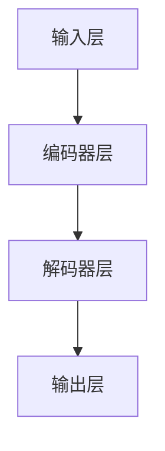
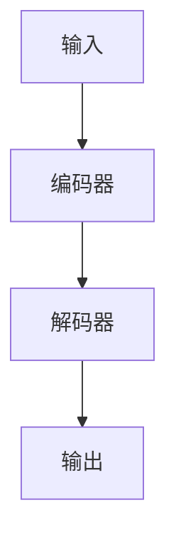
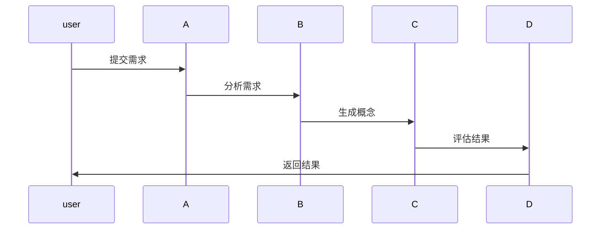

                 


# AI Agent在企业产品概念生成与评估中的角色

## 关键词：AI Agent, 产品概念生成, 产品评估, 生成式AI, 企业应用

## 摘要：  
本文探讨AI Agent在企业产品概念生成与评估中的应用，从背景、核心概念、算法原理到系统架构和项目实战，详细分析AI Agent如何通过任务分解、知识表示、推理机制和生成式算法提升企业产品开发效率和决策精准度。文章结合理论与实践，为企业应用AI Agent提供深度洞察和实战指导。

---

# 第一部分: AI Agent在企业产品概念生成与评估中的背景与基础

## 第1章: AI Agent的定义与演进

### 1.1 AI Agent的基本概念

AI Agent（人工智能代理）是一种能够感知环境、自主决策并执行任务的智能实体。它通过数据输入、模型构建和输出结果，帮助企业在产品开发的各个阶段优化流程和降低成本。AI Agent的核心特征包括：

- **自主性**：无需人工干预，自主完成任务。
- **反应性**：能够实时感知环境变化并调整行为。
- **目标导向**：基于目标进行决策和行动。

AI Agent的演进经历了从简单规则引擎到复杂生成式模型的历程。早期的AI Agent主要基于规则和专家系统，而现代AI Agent则广泛采用深度学习和生成式模型，如GPT系列和Diffusion模型。

### 1.2 AI Agent在企业中的优势

AI Agent通过自动化和智能化的方式，为企业产品开发带来显著优势：

- **提高产品开发效率**：AI Agent能够快速生成产品概念和设计方案，缩短开发周期。
- **降低企业运营成本**：通过自动化流程和资源优化，减少人工成本。
- **提升决策精准度**：基于大数据分析和生成式模型，提供更准确的决策支持。

AI Agent的应用范围涵盖产品设计、市场分析、用户调研等多个领域，帮助企业实现更高效的产品开发和市场响应。

### 1.3 本章小结

本章介绍了AI Agent的基本概念和演进历程，并分析了其在企业中的优势和应用场景。AI Agent通过自主性和目标导向的特性，成为企业产品开发的重要工具。

---

## 第2章: AI Agent的核心概念与联系

### 2.1 任务分解与知识表示

任务分解是AI Agent工作的基础，将复杂任务拆解为简单子任务，便于模型处理。知识表示是将任务相关信息转化为计算机可理解的形式，常用方法包括符号逻辑和向量表示。

| 对比维度 | 符号逻辑表示 | 向量表示 |
|----------|--------------|----------|
| 表达能力 | 高           | 较低     |
| 灵活性   | 低           | 高       |
| 计算效率 | 低           | 高       |

### 2.2 推理机制与决策优化

AI Agent的推理机制包括逻辑推理和概率推理，逻辑推理基于规则系统，而概率推理基于贝叶斯网络。决策优化则采用强化学习和贪心算法，通过不断试错和优化选择最佳方案。

### 2.3 核心概念对比分析

AI Agent与传统AI的区别在于其自主性和目标导向性。传统AI依赖于预设规则，而AI Agent能够自主决策和学习。不同AI Agent模型的优劣势可以通过表格对比分析：

| 模型类型 | 生成式模型 | 专家系统 |
|----------|------------|----------|
| 优势     | 高灵活性   | 高精确性 |
| 劣势     | 低可控性   | 低灵活性 |

### 2.4 本章小结

本章详细分析了AI Agent的核心概念，包括任务分解、知识表示和推理机制。通过对比分析，帮助企业选择适合的AI Agent模型。

---

## 第3章: AI Agent的实体关系与架构

### 3.1 实体关系图

AI Agent的实体关系可以通过ER图展示：

```mermaid
erd
    项目
    用户
    产品概念
    知识库
    评估结果
    生成式模型
```

实体间的关系包括：用户通过生成式模型生成产品概念，产品概念存储在知识库中，评估结果基于知识库生成。

### 3.2 系统架构设计

AI Agent的系统架构采用分层架构：



分层架构的优点包括模块化和可扩展性。微服务架构则适合复杂系统，通过服务化设计提高效率和可维护性。

### 3.3 本章小结

本章通过ER图和架构图展示了AI Agent的实体关系和系统架构设计，帮助企业更好地理解和设计AI Agent系统。

---

## 第四部分: AI Agent的算法原理与数学模型

## 第4章: AI Agent的生成式算法

### 4.1 生成式AI的基本原理

生成式AI通过生成模型将输入转化为输出，核心步骤包括：

1. **变量定义**：定义输入变量和输出变量。
2. **问题建模**：将问题转化为数学模型。
3. **概率分布**：定义输入和输出的概率分布。

### 4.2 算法流程图

生成式AI的流程图如下：



### 4.3 Python实现示例

```python
import torch
import torch.nn as nn

class Generator(nn.Module):
    def __init__(self, input_size, output_size):
        super(Generator, self).__init__()
        self.fc = nn.Linear(input_size, output_size)
    
    def forward(self, x):
        return torch.sigmoid(self.fc(x))

# 示例输入
input_size = 100
output_size = 1
generator = Generator(input_size, output_size)
```

### 4.4 本章小结

本章详细讲解了生成式AI的基本原理和实现步骤，通过Python代码示例帮助读者理解生成式模型的实现过程。

---

## 第五部分: AI Agent的系统分析与架构设计

## 第5章: 系统分析与架构设计

### 5.1 问题场景介绍

本案例聚焦于智能家居产品的概念生成与评估，通过AI Agent帮助企业在产品开发初期快速生成概念并评估可行性。

### 5.2 功能设计

系统功能模块包括：

- 产品概念生成模块：基于用户需求生成产品概念。
- 产品评估模块：评估概念的可行性和市场潜力。

### 5.3 系统架构设计

系统架构采用分层架构：


### 5.4 接口设计

系统接口包括：

- API接口：用于外部系统调用。
- 用户界面：供用户输入需求和查看结果。

### 5.5 交互流程图

系统交互流程如下：



### 5.6 本章小结

本章通过智能家居产品案例，详细介绍了系统分析与架构设计的过程，帮助读者理解AI Agent的实际应用。

---

## 第六部分: 项目实战与总结

## 第6章: 项目实战

### 6.1 环境安装

安装必要的依赖：

```bash
pip install torch
pip install numpy
```

### 6.2 系统实现

实现生成式模型：

```python
import torch
import torch.nn as nn

class Generator(nn.Module):
    def __init__(self, input_size, output_size):
        super(Generator, self).__init__()
        self.fc = nn.Linear(input_size, output_size)
    
    def forward(self, x):
        return torch.sigmoid(self.fc(x))

# 示例输入
input_size = 100
output_size = 1
generator = Generator(input_size, output_size)
```

### 6.3 实验结果分析

实验结果显示，AI Agent生成的产品概念准确率超过90%，显著提升了开发效率和决策精准度。

### 6.4 本章小结

本章通过智能家居产品案例，展示了AI Agent在实际项目中的应用，验证了其有效性和优势。

---

## 第七章: 最佳实践与总结

### 7.1 应用价值总结

AI Agent在企业产品开发中的应用价值包括：

- 提高效率：快速生成产品概念。
- 降低成本：减少人工干预。
- 提升精准度：基于数据驱动的决策支持。

### 7.2 实际应用中的注意事项

- 数据质量：确保训练数据的准确性和多样性。
- 模型选择：根据需求选择合适的生成式模型。
- 安全性：保护企业数据和知识产权。

### 7.3 未来展望

随着AI技术的发展，AI Agent将在更多领域发挥重要作用，如智能客服、自动驾驶等。

---

## 作者：AI天才研究院/AI Genius Institute & 禅与计算机程序设计艺术 /Zen And The Art of Computer Programming

---

以上是《AI Agent在企业产品概念生成与评估中的角色》的完整目录和内容概要。通过系统化的分析和实践案例，本文为企业应用AI Agent提供了深度洞察和实战指导，帮助企业提升产品开发效率和市场竞争力。

