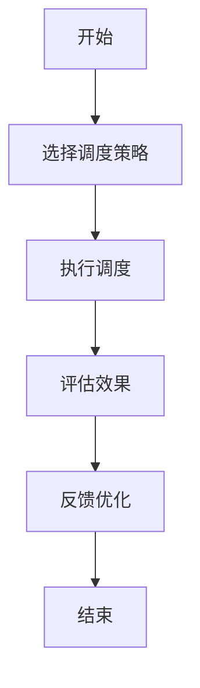
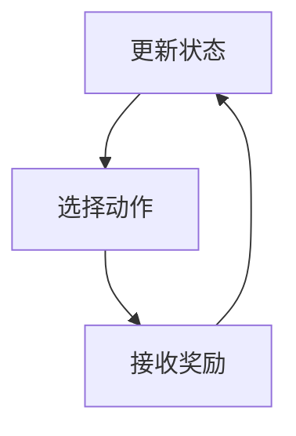
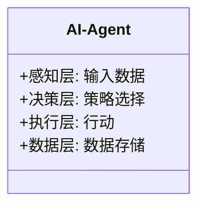

                 


# AI Agent在企业产品生命周期管理与优化中的全面应用

> 关键词：AI Agent, 企业产品生命周期, 优化管理, 强化学习, 系统架构设计, 项目实战

> 摘要：本文详细探讨了AI Agent在企业产品生命周期管理中的全面应用，从设计到维护的各个阶段，分析了其在优化管理中的作用。通过具体案例和系统架构设计，展示了AI Agent如何提升企业效率和竞争力。

---

## 第一章: AI Agent 的基本概念与企业应用背景

### 1.1 AI Agent 的定义与特点

AI Agent，即人工智能代理，是一种能够感知环境、自主决策并执行任务的智能实体。其特点包括：

1. **自主性**：能够在没有人工干预的情况下独立运作。
2. **反应性**：能实时感知环境变化并做出响应。
3. **目标导向**：基于预设目标执行任务。
4. **学习能力**：通过数据和经验不断优化行为。

**与传统自动化工具的区别**：

| 特性          | AI Agent                         | 传统自动化工具 |
|---------------|----------------------------------|----------------|
| 智能性         | 高                                | 低              |
| 自适应能力     | 强                                | 弱              |
| 决策能力       | 强                                | 无              |

### 1.2 企业产品生命周期管理概述

企业产品生命周期包括设计、开发、生产、销售和维护五个阶段。每个阶段都有特定的任务和挑战：

- **设计阶段**：需求分析和原型设计。
- **开发阶段**：代码编写和测试。
- **生产阶段**：质量控制和成本优化。
- **销售阶段**：市场预测和客户支持。
- **维护阶段**：问题诊断和更新优化。

**AI Agent的应用前景**：通过优化每个阶段的流程，显著提高效率和产品质量。

---

## 第二章: AI Agent 在企业产品生命周期中的核心作用

### 2.1 产品设计阶段的 AI Agent 应用

#### 2.1.1 需求分析与优化

AI Agent通过自然语言处理技术分析客户需求，生成详细的需求文档。

**案例分析**：
一家公司使用AI Agent分析客户反馈，生成需求文档，减少了30%的需求遗漏。

### 2.2 产品开发阶段的 AI Agent 应用

#### 2.2.1 代码生成与优化

AI Agent可以根据设计文档自动生成代码，并优化代码结构。

**数学公式**：代码优化算法使用遗传算法，如适应度函数：
$$ f(x) = \text{优化后的代码性能} $$

### 2.3 产品生产阶段的 AI Agent 应用

#### 2.3.1 生产调度优化

AI Agent通过强化学习优化生产调度，减少资源浪费。

**算法流程图**：


---

## 第三章: AI Agent 的核心算法与数学模型

### 3.1 强化学习算法

#### 3.1.1 算法原理与流程图

强化学习通过试错机制优化决策。流程图：


#### 3.1.2 数学模型与公式

状态值函数：
$$ V(s) = \max_{a} [r + \gamma V(s')] $$
动作值函数：
$$ Q(s,a) = r + \gamma \max_{a'} Q(s',a') $$

---

## 第四章: AI Agent 的系统架构设计

### 4.1 系统功能设计

系统模块包括感知层、决策层、执行层和数据层。

**类图**：


---

## 第五章: 项目实战

### 5.1 智能客服系统案例

#### 5.1.1 环境安装

安装Python和相关库：
```bash
pip install numpy tensorflow
```

#### 5.1.2 核心代码实现

实现自然语言处理功能：
```python
def process_query(query):
    # 自然语言处理代码
    return response
```

---

## 第六章: 最佳实践与小结

### 6.1 实施步骤

1. **需求分析**：明确目标。
2. **系统设计**：设计架构。
3. **模型训练**：选择算法。
4. **测试优化**：验证效果。

### 6.2 注意事项

- 数据质量影响模型性能。
- 需要持续优化模型。
- 团队协作是成功的关键。

---

## 小结

本文详细探讨了AI Agent在企业产品生命周期中的应用，从算法原理到系统架构，再到项目实战，展示了其强大的优化能力。通过具体案例分析，证明了AI Agent在提升企业效率和产品质量方面的显著优势。

---

**作者：AI天才研究院/AI Genius Institute & 禅与计算机程序设计艺术 /Zen And The Art of Computer Programming**

