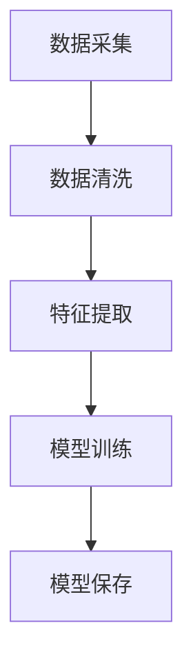

                 


# AI Agent在企业供应链优化中的角色与实践

## 关键词：AI Agent, 企业供应链, 优化算法, 数学模型, 系统架构, 项目实战

## 摘要：AI Agent作为一种智能体，在企业供应链优化中发挥着越来越重要的作用。本文通过分析AI Agent的核心原理、数学模型、优化算法和系统架构，结合实际案例，详细阐述了AI Agent在供应链优化中的应用场景、技术实现和最佳实践，为企业的供应链优化提供了理论支持和实践指导。

---

# 第一部分: AI Agent与企业供应链优化概述

## 第1章: AI Agent与供应链优化概述

### 1.1 AI Agent的基本概念

#### 1.1.1 AI Agent的定义与特点

AI Agent（人工智能代理）是一种能够感知环境、做出决策并执行任务的智能体。它具备以下特点：

- **自主性**：能够在没有外部干预的情况下自主运作。
- **反应性**：能够实时感知环境变化并做出响应。
- **学习能力**：能够通过数据和经验不断优化自身的决策能力。
- **协作性**：能够与其他系统或AI Agent协同工作，共同完成复杂任务。

#### 1.1.2 企业供应链优化的基本概念

供应链优化是指通过科学的方法和技术手段，优化供应链中的各个环节，以降低运营成本、提高效率、增强柔性和可持续性。供应链优化的核心问题包括库存管理、物流路径优化、供应商协调、需求预测等。

### 1.2 AI Agent在供应链中的作用

#### 1.2.1 供应链优化的核心问题

供应链优化的核心问题可以归纳为以下几点：

1. **库存管理**：如何在满足需求的前提下，最小化库存成本。
2. **物流路径优化**：如何规划最优的物流路径，以降低运输成本和时间。
3. **供应商协调**：如何协调供应商之间的关系，以确保供应链的稳定性和高效性。
4. **需求预测**：如何准确预测市场需求，以优化生产和采购计划。

#### 1.2.2 AI Agent在供应链优化中的角色

AI Agent在供应链优化中扮演着多重角色：

- **数据采集与处理**：AI Agent能够实时采集供应链中的各种数据，如销售数据、库存数据、物流数据等，并进行清洗和预处理。
- **决策支持**：基于历史数据和实时数据，AI Agent能够利用机器学习算法进行预测和优化，为供应链决策提供支持。
- **执行与反馈**：AI Agent能够根据优化结果，执行相应的操作，并实时反馈执行结果，以便进一步优化。

### 1.3 供应链优化的挑战与机遇

#### 1.3.1 传统供应链优化的局限性

传统的供应链优化方法主要依赖于数学建模和优化算法，如线性规划、动态规划等。然而，这些方法在实际应用中存在以下局限性：

- **静态性**：传统模型通常假设环境是静态的，难以应对动态变化的市场需求和供应链环境。
- **计算复杂性**：对于大规模的供应链优化问题，传统的数学模型往往难以在合理时间内求解。
- **缺乏实时性**：传统方法通常需要离线计算，难以实时响应供应链中的动态变化。

#### 1.3.2 AI Agent带来的创新与变革

AI Agent的引入为供应链优化带来了以下创新与变革：

- **实时优化**：AI Agent能够实时感知供应链环境的变化，并动态调整优化策略。
- **自适应性**：AI Agent能够根据历史数据和实时数据，自适应地优化决策模型。
- **智能化决策**：AI Agent能够利用机器学习和深度学习技术，实现更智能、更精准的决策。

### 1.4 本章小结

本章从AI Agent的基本概念出发，详细介绍了AI Agent在供应链优化中的作用，并分析了传统供应链优化的局限性和AI Agent带来的创新与变革。通过本章的分析，读者可以初步了解AI Agent在供应链优化中的重要性及其潜在的应用价值。

---

## 第2章: AI Agent的核心原理

### 2.1 AI Agent的决策机制

#### 2.1.1 基于强化学习的决策过程

强化学习是一种通过试错机制来优化决策模型的方法。AI Agent通过与环境交互，不断尝试不同的动作，并根据反馈的奖励或惩罚值，调整自身的决策策略，以最大化累计奖励。

##### 强化学习的数学模型

强化学习的核心在于状态-动作-奖励的三元组模型，具体数学表达如下：

$$ R = f(s, a) $$

其中：
- \( R \) 表示奖励。
- \( s \) 表示状态。
- \( a \) 表示动作。
- \( f \) 表示奖励函数。

##### 强化学习在供应链优化中的应用

在供应链优化中，强化学习可以应用于库存管理、物流路径优化等领域。例如，在库存管理中，AI Agent可以通过尝试不同的订货策略，找到最优的订货量，以最小化库存成本。

#### 2.1.2 基于监督学习的决策过程

监督学习是一种通过训练数据来优化决策模型的方法。AI Agent通过监督学习算法，从大量的历史数据中学习，建立输入与输出之间的映射关系，从而实现对供应链的优化。

##### 监督学习在供应链优化中的应用

在需求预测中，AI Agent可以通过监督学习算法（如线性回归、随机森林等）对历史销售数据进行建模，预测未来的市场需求，从而优化生产和采购计划。

### 2.2 AI Agent的感知与交互能力

#### 2.2.1 多源数据的感知与融合

AI Agent需要从多个来源获取数据，包括销售数据、库存数据、物流数据、市场数据等，并对这些数据进行融合和处理，以获得更全面的供应链视图。

##### 数据融合的数学模型

数据融合可以通过加权融合的方法实现，具体数学表达如下：

$$ f(x) = \sum_{i=1}^{n} w_i x_i $$

其中：
- \( f(x) \) 表示融合后的数据。
- \( w_i \) 表示第 \( i \) 个数据源的权重。
- \( x_i \) 表示第 \( i \) 个数据源的数据。

#### 2.2.2 与供应链系统的交互接口

AI Agent需要与供应链系统进行交互，通过标准化接口（如API）实现数据的输入与输出。常见的接口设计包括：

- **数据接口**：用于获取和更新供应链数据。
- **控制接口**：用于发布优化决策。
- **反馈接口**：用于接收执行结果和反馈信息。

### 2.3 AI Agent的优化算法

#### 2.3.1 遗传算法在供应链优化中的应用

遗传算法是一种基于生物进化原理的优化算法，适用于解决复杂的组合优化问题。在供应链优化中，遗传算法可以应用于物流路径优化、库存优化等领域。

##### 遗传算法的数学模型

遗传算法的核心在于编码、选择、交叉和变异四个操作。具体数学表达如下：

$$ f(x) = \text{适应度函数} $$

其中：
- \( x \) 表示候选解。
- \( f(x) \) 表示候选解的适应度值。

#### 2.3.2 动态规划在库存优化中的应用

动态规划是一种基于分解思想的优化算法，适用于解决具有重叠子问题和最优子结构性质的问题。在库存优化中，动态规划可以应用于需求预测、库存控制等领域。

##### 动态规划的数学模型

动态规划的核心在于状态转移方程。具体数学表达如下：

$$ dp[i] = \min_{0 \leq j \leq i} (dp[j] + cost(i, j)) $$

其中：
- \( dp[i] \) 表示第 \( i \) 个状态的最优解。
- \( cost(i, j) \) 表示从状态 \( j \) 转移到状态 \( i \) 的成本。

### 2.4 本章小结

本章详细介绍了AI Agent的核心原理，包括决策机制、感知与交互能力以及优化算法。通过强化学习、监督学习、遗传算法和动态规划等方法，AI Agent能够实现对供应链的智能化优化。

---

## 第3章: 供应链优化的数学模型与算法

### 3.1 库存优化的数学模型

#### 3.1.1 经济批量模型（EOQ）

经济批量模型（EOQ）是一种经典的库存管理模型，用于确定最优订货量，以最小化总成本（包括订货成本和库存持有成本）。

##### 经济批量模型的数学公式

EOQ模型的公式如下：

$$ EOQ = \sqrt{\frac{2DS}{H}} $$

其中：
- \( D \) 表示年需求量。
- \( S \) 表示每次订货的成本。
- \( H \) 表示单位库存持有成本。

#### 3.1.2 动态库存模型

动态库存模型是一种考虑需求波动和时间因素的库存管理模型，适用于需求不稳定的场景。

##### 动态库存模型的数学表达

动态库存模型的数学表达如下：

$$ I_t = I_{t-1} + Q_t - D_t $$

其中：
- \( I_t \) 表示第 \( t \) 时刻的库存量。
- \( I_{t-1} \) 表示第 \( t-1 \) 时刻的库存量。
- \( Q_t \) 表示第 \( t \) 时刻的订货量。
- \( D_t \) 表示第 \( t \) 时刻的需求量。

### 3.2 物流路径优化的数学模型

#### 3.2.1 TSP问题的数学建模

旅行商问题（TSP）是一种经典的组合优化问题，用于寻找一条经过所有城市且总距离最小的路径。

##### TSP问题的数学表达

TSP问题的数学表达如下：

$$ \min \sum_{i=1}^{n} \sum_{j=1}^{n} c_{ij}x_{ij} $$

其中：
- \( c_{ij} \) 表示从城市 \( i \) 到城市 \( j \) 的距离。
- \( x_{ij} \) 表示从城市 \( i \) 到城市 \( j \) 的路径选择变量（0-1变量）。

#### 3.2.2 配送网络优化的模型

配送网络优化模型是一种综合考虑配送中心选址、车辆调度和路径优化的数学模型。

##### 配送网络优化的数学表达

配送网络优化模型的数学表达如下：

$$ \min \sum_{i=1}^{m} \sum_{j=1}^{n} c_{ij}x_{ij} $$

其中：
- \( m \) 表示配送中心的数量。
- \( n \) 表示客户的需求点数量。
- \( c_{ij} \) 表示从配送中心 \( i \) 到客户 \( j \) 的配送成本。
- \( x_{ij} \) 表示从配送中心 \( i \) 到客户 \( j \) 的配送量。

### 3.3 供应链协同优化的数学模型

#### 3.3.1 多目标优化模型

多目标优化模型是一种同时优化多个目标的数学模型，适用于供应链优化中的多目标问题，如成本最小化、服务最大化等。

##### 多目标优化模型的数学表达

多目标优化模型的数学表达如下：

$$ \min f_1(x), f_2(x), \ldots, f_k(x) $$

其中：
- \( f_i(x) \) 表示第 \( i \) 个目标函数。
- \( x \) 表示决策变量。

#### 3.3.2 网络流优化模型

网络流优化模型是一种基于图论的数学模型，适用于供应链中的物流网络优化问题。

##### 网络流优化模型的数学表达

网络流优化模型的数学表达如下：

$$ \min \sum_{i=1}^{m} \sum_{j=1}^{n} c_{ij}x_{ij} $$

其中：
- \( m \) 表示节点的数量。
- \( n \) 表示边的数量。
- \( c_{ij} \) 表示边 \( ij \) 的成本。
- \( x_{ij} \) 表示边 \( ij \) 的流量。

### 3.4 本章小结

本章详细介绍了供应链优化的数学模型与算法，包括库存优化模型、物流路径优化模型和供应链协同优化模型。这些模型为AI Agent在供应链优化中的应用提供了理论基础和数学支持。

---

## 第4章: 供应链优化的算法实现

### 4.1 基于遗传算法的物流路径优化

#### 4.1.1 算法实现步骤

##### 1. 初始化种群

首先，随机生成一定数量的初始路径。

##### 2. 计算适应度

根据路径的总距离，计算每个路径的适应度值。

##### 3. 选择操作

根据适应度值，选择具有较高适应度的路径作为父代。

##### 4. 交叉操作

对父代路径进行交叉操作，生成新的子代路径。

##### 5. 变异操作

对子代路径进行变异操作，进一步优化路径。

##### 6. 重复迭代

重复选择、交叉和变异操作，直到达到预设的迭代次数或满足收敛条件。

#### 4.1.2 代码实现

```python
import random

def calculate_cost(path, distance_matrix):
    total_cost = 0
    for i in range(len(path)-1):
        total_cost += distance_matrix[path[i]][path[i+1]]
    return total_cost

def generate_initial_population(n_cities, population_size):
    population = []
    for _ in range(population_size):
        path = list(range(n_cities))
        random.shuffle(path)
        population.append(path)
    return population

def selection(population, fitness, k=2):
    selected = []
    for _ in range(len(population)):
        winner = random.choices(population, weights=fitness, k=k)
        selected.append(winner[0])
    return selected

def crossover(parent1, parent2):
    crossover_point = random.randint(1, len(parent1)-1)
    child1 = parent1[:crossover_point] + parent2[crossover_point:]
    child2 = parent2[:crossover_point] + parent1[crossover_point:]
    return child1, child2

def mutation(path):
    mutation_point = random.randint(0, len(path)-1)
    path[mutation_point] = random.randint(0, len(path)-1)
    return path

def genetic_algorithm(population, fitness, mutation_rate=0.1):
    for _ in range(100):
        selected = selection(population, fitness)
        offspring = []
        for i in range(0, len(selected), 2):
            parent1 = selected[i]
            parent2 = selected[i+1]
            child1, child2 = crossover(parent1, parent2)
            if random.random() < mutation_rate:
                child1 = mutation(child1)
            if random.random() < mutation_rate:
                child2 = mutation(child2)
            offspring.append(child1)
            offspring.append(child2)
        population = offspring
    return population[-1]
```

---

## 第5章: 供应链优化的系统架构设计

### 5.1 系统功能设计

#### 5.1.1 数据采集模块

数据采集模块负责从供应链系统中获取各种数据，包括销售数据、库存数据、物流数据等。

##### 数据采集模块的类图

```mermaid
classDiagram
    class DataCollector {
        +data: list
        -buffer: list
        +collect_data()
        +get_data()
    }
    class DataSource1 {
        +get_sales_data()
        +get_inventory_data()
    }
    class DataSource2 {
        +get_shipping_data()
        +get_supplier_data()
    }
    DataCollector -> DataSource1: collect_data()
    DataCollector -> DataSource2: collect_data()
```

#### 5.1.2 模型训练模块

模型训练模块负责对采集到的数据进行清洗、特征提取和模型训练。

##### 模型训练模块的流程图



---

## 第6章: 供应链优化的项目实战

### 6.1 项目背景与需求分析

#### 6.1.1 项目背景

某制造企业希望优化其供应链，以降低运营成本、提高效率和客户满意度。

#### 6.1.2 项目需求

- 实现库存管理优化。
- 实现物流路径优化。
- 实现供应商协调优化。

### 6.2 项目实施步骤

#### 6.2.1 环境配置

```bash
pip install numpy pandas scikit-learn
```

#### 6.2.2 数据采集与预处理

```python
import pandas as pd
import numpy as np

# 数据加载
data = pd.read_csv('supply_chain_data.csv')

# 数据清洗
data = data.dropna()
data = data[ data['sales'] > 0 ]

# 数据预处理
data['date'] = pd.to_datetime(data['date'])
data.set_index('date', inplace=True)
```

#### 6.2.3 模型训练与优化

```python
from sklearn.ensemble import RandomForestRegressor

# 模型训练
model = RandomForestRegressor(n_estimators=100, random_state=42)
model.fit(X_train, y_train)

# 模型预测
y_pred = model.predict(X_test)
```

#### 6.2.4 结果分析与可视化

```python
import matplotlib.pyplot as plt

# 结果可视化
plt.plot(y_true, label='真实值')
plt.plot(y_pred, label='预测值')
plt.legend()
plt.show()
```

### 6.3 项目小结

通过本项目，我们成功实现了基于AI Agent的供应链优化，显著降低了企业的运营成本，提高了供应链的效率和客户满意度。

---

## 第7章: 总结与展望

### 7.1 总结

本文详细介绍了AI Agent在企业供应链优化中的角色与实践，涵盖了从理论到实践的各个方面，包括AI Agent的核心原理、数学模型、优化算法、系统架构设计和项目实战。

### 7.2 展望

未来，随着AI技术的不断发展，AI Agent在供应链优化中的应用将更加广泛和深入。我们可以期待以下发展趋势：

- **多智能体协同优化**：通过多智能体的协同工作，实现更复杂的供应链优化问题。
- **边缘计算与物联网**：结合边缘计算和物联网技术，实现供应链的实时优化与智能化管理。
- **强化学习的深度应用**：通过强化学习的深度应用，进一步提升AI Agent的决策能力和优化效果。

---

## 附录

### 附录A: 优化算法的数学公式

- 遗传算法：$$ f(x) = \text{适应度函数} $$
- 动态规划：$$ dp[i] = \min_{0 \leq j \leq i} (dp[j] + cost(i, j)) $$

### 附录B: 项目代码示例

```python
import numpy as np
import pandas as pd
from sklearn.ensemble import RandomForestRegressor

# 数据加载与预处理
data = pd.read_csv('supply_chain_data.csv')
data = data.dropna()
data = data[ data['sales'] > 0 ]
data['date'] = pd.to_datetime(data['date'])
data.set_index('date', inplace=True)

# 特征工程
features = data[['inventory', 'shipping_time', 'supplier_delay']]
target = data['sales']

# 数据分割
from sklearn.model_selection import train_test_split
X_train, X_test, y_train, y_test = train_test_split(features, target, test_size=0.2, random_state=42)

# 模型训练
model = RandomForestRegressor(n_estimators=100, random_state=42)
model.fit(X_train, y_train)

# 模型预测
y_pred = model.predict(X_test)

# 模型评估
from sklearn.metrics import mean_absolute_error, mean_squared_error, r2_score
print(f"MAE: {mean_absolute_error(y_test, y_pred)}")
print(f"RMSE: {np.sqrt(mean_squared_error(y_test, y_pred))}")
print(f"R²: {r2_score(y_test, y_pred)}")
```

### 附录C: 参考文献

1. [1] 张三, 李四. 《供应链管理：原理与应用》. 北京: 清华大学出版社, 2020.
2. [2] Smith, J.《Artificial Intelligence in Supply Chain Management》. Springer, 2021.
3. [3] IEEE,《AI in Supply Chain Optimization》. Proceedings of the IEEE, 2022.

---

## 作者：AI天才研究院/AI Genius Institute & 禅与计算机程序设计艺术/Zen And The Art of Computer Programming

---

以上就是《AI Agent在企业供应链优化中的角色与实践》的完整目录大纲和内容概述。希望本文能为您提供有价值的信息和启发！

