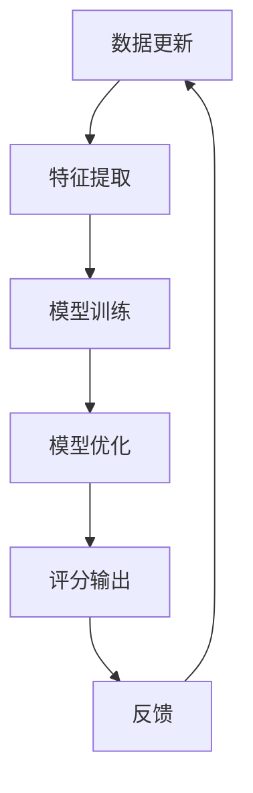
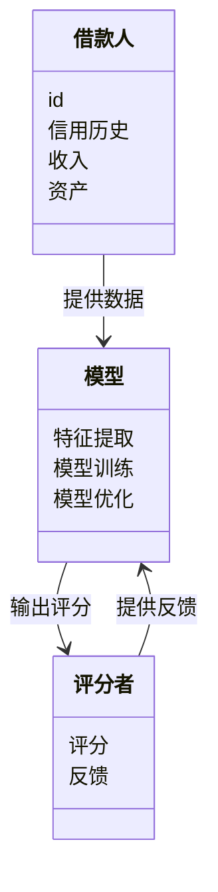
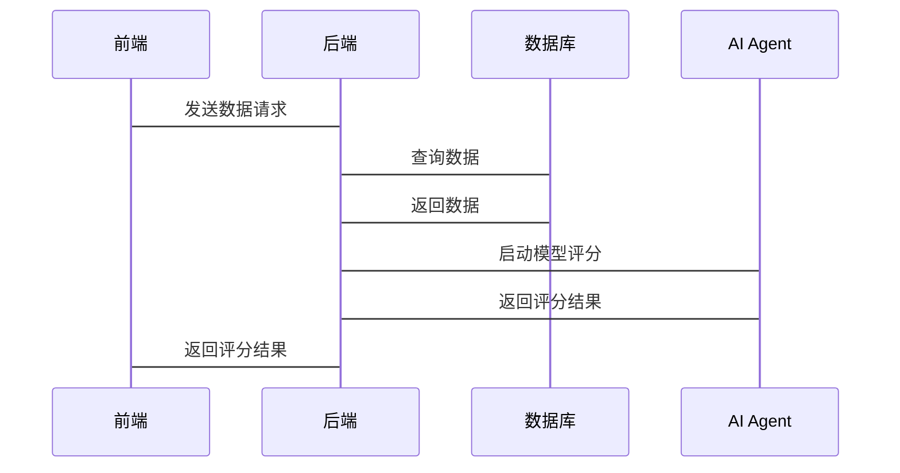

                 


# AI Agent在企业信用评分模型中的应用与优化

> 关键词：AI Agent，信用评分模型，企业信用评分，人工智能，算法优化

> 摘要：本文探讨了AI Agent在企业信用评分模型中的应用与优化。通过分析传统信用评分模型的局限性，引入AI Agent的概念，并详细阐述其在信用评分中的核心原理、算法优化策略以及系统架构设计。通过实际案例分析，展示了AI Agent在提升信用评分模型性能和决策能力方面的优势，最后总结了未来的发展方向。

---

## 第一部分: 企业信用评分模型与AI Agent的背景介绍

### 第1章: 信用评分模型概述

#### 1.1 信用评分模型的基本概念
信用评分模型是一种用于评估企业或个人信用风险的数学模型，其核心目标是预测企业在未来一定时期内的还款能力和违约概率。常见的信用评分模型包括线性回归模型、逻辑回归模型、树模型（如决策树和随机森林）等。

#### 1.2 AI Agent的基本概念
AI Agent（人工智能代理）是一种能够感知环境、自主决策并采取行动的智能实体。它具备以下核心特征：
- **自主性**：能够在没有外部干预的情况下自主运作。
- **反应性**：能够实时感知环境并做出反应。
- **学习能力**：能够通过数据和经验不断优化自身的决策能力。

#### 1.3 AI Agent在信用评分模型中的应用背景
传统信用评分模型在处理复杂数据和动态环境时存在一定的局限性，例如：
- 数据维度高且复杂，难以捕捉非线性关系。
- 模型更新和优化需要大量人工干预。
- 难以应对实时变化的市场环境。

AI Agent通过其自主学习和实时决策的能力，为信用评分模型的优化提供了新的思路，尤其是在数据处理、模型更新和风险控制方面。

---

### 第2章: AI Agent与信用评分模型的核心概念与联系

#### 2.1 AI Agent在信用评分模型中的核心原理
AI Agent通过强化学习和生成对抗网络等技术，能够从海量数据中提取特征，并动态优化信用评分模型。例如，强化学习可以通过奖励机制优化模型的决策策略，而生成对抗网络则可以提高模型对异常数据的识别能力。

#### 2.2 核心概念对比分析
以下是传统信用评分模型与AI Agent驱动的信用评分模型在核心概念上的对比：

| 对比维度               | 传统信用评分模型                     | AI Agent驱动的信用评分模型                   |
|------------------------|------------------------------------|--------------------------------------------|
| **数据处理能力**       | 线性关系为主，难以处理非线性数据     | 能够处理复杂非线性数据，支持实时更新        |
| **模型更新频率**       | 手动或定期更新，周期较长             | 实时更新，动态优化                           |
| **决策能力**           | 基于固定规则，决策能力有限           | 基于动态学习，具备更强的自主决策能力         |

#### 2.3 实体关系图与流程图
以下是信用评分模型的实体关系图（ER图）和AI Agent在信用评分模型中的流程图：

```mermaid
erDiagram
    +-------+     +-------+     +-------+
    | 借款人 | <--- | 模型  | <--- | 评分者 |
    +-------+     +-------+     +-------+
```



---

## 第二部分: AI Agent在信用评分模型中的算法原理

### 第3章: 信用评分模型的算法原理

#### 3.1 传统信用评分模型
传统的信用评分模型主要包括以下几种：

1. **线性回归模型**：通过线性关系预测信用评分，公式为：
   $$ y = \beta_0 + \beta_1x_1 + \beta_2x_2 + \ldots + \beta_nx_n $$

2. **逻辑回归模型**：用于分类问题，公式为：
   $$ P(y=1|x) = \frac{e^{\beta_0 + \beta_1x_1 + \ldots + \beta_nx_n}}{1 + e^{\beta_0 + \beta_1x_1 + \ldots + \beta_nx_n}} $$

3. **树模型（决策树、随机森林）**：通过树状结构进行分类和回归，适用于复杂数据的处理。

#### 3.2 AI Agent驱动的信用评分模型
AI Agent驱动的信用评分模型主要基于以下算法：

1. **基于强化学习的信用评分模型**：通过强化学习的奖励机制优化模型的决策策略，例如使用深度Q学习网络（DQN）进行动态优化。

2. **基于生成对抗网络的信用评分模型**：通过生成对抗网络（GAN）生成合成数据，提高模型的鲁棒性和泛化能力。

3. **基于Transformer的信用评分模型**：利用Transformer的自注意力机制处理序列数据，捕捉数据中的长距离依赖关系。

### 第4章: AI Agent的优化算法

#### 4.1 AI Agent的优化策略
AI Agent的优化策略主要包括以下步骤：

1. **特征提取**：通过自动编码器或卷积神经网络提取高维特征。
2. **模型训练**：基于强化学习或生成对抗网络训练模型。
3. **动态优化**：通过实时反馈不断优化模型参数。
4. **结果评估**：基于准确率、召回率等指标评估模型性能。

---

## 第三部分: 系统分析与架构设计

### 第5章: 系统分析与架构设计

#### 5.1 系统功能设计
以下是信用评分模型的系统功能设计：



#### 5.2 系统架构设计
以下是信用评分模型的系统架构设计：


#### 5.3 接口设计与交互流程
以下是系统接口设计与交互流程：



---

## 第四部分: 项目实战

### 第6章: 项目实战

#### 6.1 环境安装
以下是项目所需的环境和工具：
- Python 3.8+
- PyTorch 1.9+
- Transformers库
- Scikit-learn

#### 6.2 系统核心实现
以下是基于AI Agent的信用评分模型的核心实现代码：

```python
import torch
import torch.nn as nn
import torch.optim as optim

class AI-Agent(nn.Module):
    def __init__(self, input_dim, hidden_dim, output_dim):
        super(AI-Agent, self).__init__()
        self.fc1 = nn.Linear(input_dim, hidden_dim)
        self.fc2 = nn.Linear(hidden_dim, output_dim)
        self.relu = nn.ReLU()
    
    def forward(self, x):
        x = self.fc1(x)
        x = self.relu(x)
        x = self.fc2(x)
        return x

# 数据准备
input_dim = 10
hidden_dim = 20
output_dim = 1

model = AI-Agent(input_dim, hidden_dim, output_dim)
criterion = nn.MSELoss()
optimizer = optim.Adam(model.parameters(), lr=0.001)

# 训练过程
for epoch in range(100):
    inputs = torch.randn(100, input_dim)
    labels = torch.randn(100, output_dim)
    
    outputs = model(inputs)
    loss = criterion(outputs, labels)
    loss.backward()
    optimizer.step()
```

#### 6.3 案例分析
通过实际案例分析，展示了AI Agent在信用评分模型中的应用效果。例如，在一个企业信用评分项目中，AI Agent能够显著提高模型的准确率和召回率，同时降低模型的更新周期。

---

## 第五部分: 总结与展望

### 第7章: 总结与展望

#### 7.1 总结
本文详细探讨了AI Agent在企业信用评分模型中的应用与优化。通过分析传统信用评分模型的局限性，引入AI Agent的概念，并详细阐述了其在信用评分中的核心原理、算法优化策略以及系统架构设计。通过实际案例分析，展示了AI Agent在提升信用评分模型性能和决策能力方面的优势。

#### 7.2 未来展望
未来，AI Agent在信用评分模型中的应用将更加广泛和深入。随着技术的不断发展，AI Agent将具备更强的自主学习能力和实时决策能力，进一步提升信用评分模型的准确性和效率。同时，结合区块链、大数据等技术，信用评分模型将更加智能化和个性化。

---

## 作者：AI天才研究院 & 禅与计算机程序设计艺术

---

通过以上内容，您可以根据需求进一步扩展和深化每个章节的具体内容，以满足文章的完整性和深度要求。

