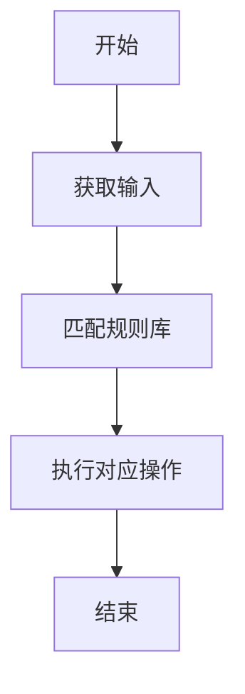
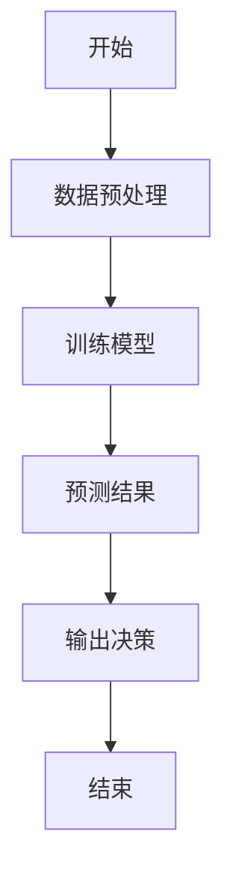
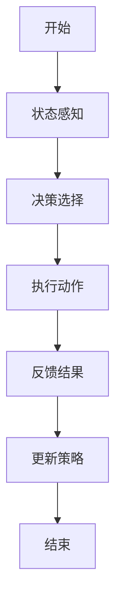
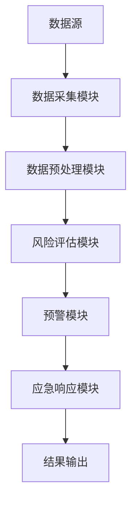

                 

<think>
好，我现在需要帮用户撰写一篇关于《AI Agent在企业危机预警与应急响应中的关键作用》的技术博客。用户提供了非常详细的结构和要求，我需要按照这些要求一步步来。

首先，我注意到用户希望文章以中文撰写，结构清晰，内容详细，包括摘要、关键词和目录。目录分为多个章节，每个章节都有具体的小节，有些还需要插入图表、代码和数学公式。

我需要先处理文章的开头部分：标题、关键词和摘要。标题已经给出，关键词需要包含5-7个相关术语，摘要要简明扼要地概括文章的核心内容。

接下来是目录大纲。用户要求分为七章，每章有多个小节，部分章节还需要嵌入图表和代码。例如，第二章需要ER实体关系图，第三章需要算法流程图和代码示例，第四章需要系统架构图等。我需要确保每个部分都符合用户的要求，使用Mermaid和LaTeX格式。

在撰写正文时，我需要按照目录逐一展开，确保每个小节内容丰富详细。例如，在第二章的核心概念与联系部分，我需要解释AI Agent的基本原理，并用表格对比不同类型的AI Agent。同时，插入ER实体关系图来展示系统结构。

第三章的算法原理部分，我需要用Mermaid画出算法流程图，并提供Python代码示例。数学模型部分需要用LaTeX公式，确保公式正确且清晰。这部分需要详细讲解每种算法的工作原理，并举例说明其在实际中的应用。

第四章的系统分析与架构设计部分，我需要介绍问题场景，设计系统功能模块，如数据采集、分析、预警和响应。然后用Mermaid类图和架构图展示系统结构，说明各个模块之间的交互关系。

第五章的项目实战部分，需要指导读者如何安装环境，并提供核心代码实现。代码部分要详细解读，分析实际案例，并进行详细讲解，帮助读者理解AI Agent在实际项目中的应用。

第六章的最佳实践部分，需要总结经验，给出注意事项和未来的研究方向，帮助读者巩固所学内容，并指导进一步的学习。

最后，结尾部分需要写上作者信息，按照用户的要求格式化。

在撰写过程中，我需要确保语言专业但易懂，逻辑清晰，结构紧凑。同时，注意字数控制在10000到12000字之间，每个部分不要过于冗长，但要涵盖所有关键点。

可能遇到的挑战是如何将技术细节与实际应用结合起来，确保目录既技术性强又易于理解。我需要平衡理论和实践，确保每个章节都有实际案例支持，同时深入讲解算法和架构设计。

总的来说，我会按照用户提供的大纲，逐一展开每个部分，确保内容全面且符合要求，最终完成一篇高质量的技术博客文章。
</think>

# AI Agent在企业危机预警与应急响应中的关键作用

## 关键词：AI Agent, 企业危机预警, 应急响应, 危机管理, 人工智能

## 摘要：  
本文探讨了AI Agent在企业危机预警与应急响应中的关键作用。通过分析AI Agent的核心原理、算法实现、系统架构以及实际应用场景，详细阐述了AI Agent在企业危机管理中的独特优势和实际价值。文章从问题背景、核心概念、算法原理、系统设计、项目实战到最佳实践等多个维度展开，为企业危机管理的智能化转型提供了理论支持和实践指导。

---

# 第一部分: 背景介绍

## 第1章: 问题背景

### 1.1 企业危机管理的现状与挑战

#### 1.1.1 企业危机管理的现状
企业在面对危机时，往往面临信息分散、响应延迟、决策不确定性等问题。传统的危机管理方法依赖人工分析和经验判断，难以应对日益复杂的危机场景。

#### 1.1.2 AI Agent在企业危机管理中的作用
AI Agent（人工智能代理）通过自动化感知、分析和执行能力，能够实时监测企业内外部数据，快速识别潜在风险，并制定最优应对策略。

#### 1.1.3 危机预警与应急响应的核心问题
企业危机管理的核心问题包括：如何快速识别危机前兆、如何制定高效的应对策略、如何协调多部门资源以降低损失。

---

## 第2章: 问题描述

### 2.1 企业危机的多维度特征

#### 2.1.1 危机的突发性
危机往往具有突发性，企业需要快速反应以应对不可预见的事件。

#### 2.1.2 危机的复杂性
危机可能涉及多个维度，例如市场波动、供应链中断、声誉危机等，需要综合分析和应对。

#### 2.1.3 危机的连锁反应
危机可能引发连锁反应，例如供应链中断可能导致生产停滞，进而影响企业的整体运营。

### 2.2 危机预警与应急响应的关键环节

#### 2.2.1 数据采集与分析
通过实时监测企业内外部数据，识别潜在风险。

#### 2.2.2 风险评估与预警
基于数据的分析结果，评估风险级别并发出预警。

#### 2.2.3 应急响应与决策支持
根据预警信息，制定应急响应计划，并提供决策支持。

### 2.3 AI Agent在企业危机管理中的应用边界

#### 2.3.1 AI Agent的适用范围
AI Agent适用于需要快速响应、多维度分析和自动化决策的场景。

#### 2.3.2 与传统危机管理方法的对比
AI Agent相比传统方法，具有更高的效率和准确性，但可能在某些复杂场景下需要结合人工判断。

#### 2.3.3 未来发展趋势与潜在挑战
未来，AI Agent在企业危机管理中的应用将更加广泛，但数据隐私、算法可解释性等问题仍需解决。

---

# 第二部分: 核心概念与联系

## 第3章: 核心概念与联系

### 3.1 AI Agent的核心原理

#### 3.1.1 AI Agent的基本原理
AI Agent通过感知环境、分析信息、制定决策并执行操作，实现对危机的预测和应对。

#### 3.1.2 AI Agent的感知、决策与执行机制
- 感知：通过传感器、API等获取企业内外部数据。
- 决策：基于机器学习模型进行风险评估和策略选择。
- 执行：通过API或自动化系统执行应对措施。

#### 3.1.3 AI Agent的核心算法与技术
- 基于规则的算法：适用于简单场景的决策。
- 机器学习算法：适用于复杂场景的模式识别和预测。
- 强化学习算法：适用于动态环境下的策略优化。

### 3.2 核心概念属性对比

#### 3.2.1 不同类型AI Agent的对比分析
| 类型           | 特点                           | 适用场景                   |
|----------------|--------------------------------|----------------------------|
| 基于规则的AI Agent | 依赖预定义规则，简单可靠       | 适用于规则明确的场景         |
| 基于知识的AI Agent | 基于知识库进行推理             | 适用于复杂知识依赖的场景     |
| 基于学习的AI Agent | 通过机器学习模型进行决策       | 适用于数据驱动的复杂场景     |

#### 3.2.2 AI Agent与传统自动化系统的区别
- AI Agent具备学习和适应能力，而传统自动化系统仅基于预定义规则。
- AI Agent能够处理不确定性，传统系统依赖确定性输入。

#### 3.2.3 AI Agent在企业危机管理中的独特优势
- 实时监测与预警能力。
- 自动化决策与执行能力。
- 多维度数据分析能力。

### 3.3 ER实体关系图

```mermaid
er
  actor: 企业危机管理系统的用户
  event: 危机事件
  agent: AI Agent
  rule: 规则库
  data_source: 数据来源
  action: 应急行动
  outcome: 结果
```

---

## 第4章: 算法原理讲解

### 4.1 基于规则的AI Agent算法

#### 4.1.1 算法流程图


#### 4.1.2 Python代码实现
```python
def rule_based_agent(input_data, rule库):
    for rule in rule库:
        if rule适用(input_data):
            return rule的响应
    return 默认响应
```

### 4.2 基于机器学习的AI Agent算法

#### 4.2.1 算法流程图


#### 4.2.2 Python代码实现
```python
import pandas as pd
from sklearn.model import Model

def ml_agent(data):
    model = Model()
    model.fit(data_train, labels_train)
    prediction = model.predict(data)
    return model输出(prediction)
```

### 4.3 基于强化学习的AI Agent算法

#### 4.3.1 算法流程图


#### 4.3.2 Python代码实现
```python
class Agent:
    def __init__(self):
        self策略 = 初始策略
    def act(self, 状态):
        return self策略选择(状态)
    def update(self, 反馈):
        self策略更新(反馈)
```

### 4.4 数学模型与公式

#### 4.4.1 基于概率的危机预警模型
$$ P(危机发生) = \sum_{i=1}^{n} P(事件i) \times 权重i $$

#### 4.4.2 基于决策树的应急响应策略
$$ 决策树 = ID3(特征, 样本) $$

---

## 第5章: 系统分析与架构设计

### 5.1 问题场景介绍

#### 5.1.1 企业危机管理系统的总体架构
- 数据采集模块：实时采集企业内外部数据。
- 数据分析模块：基于AI算法进行风险评估。
- 预警模块：发出危机预警信号。
- 应急响应模块：制定和执行应对策略。

### 5.2 系统架构设计

#### 5.2.1 系统功能设计
- 数据采集与预处理：从多种数据源获取信息，并进行清洗和转换。
- 风险评估与预警：基于AI模型进行风险预测，并发出预警信号。
- 应急响应与决策支持：根据预警信息，制定应对策略并提供决策支持。

#### 5.2.2 系统架构图


---

## 第6章: 项目实战

### 6.1 环境安装

#### 6.1.1 安装Python与相关库
```bash
pip install numpy pandas scikit-learn
```

#### 6.1.2 安装AI Agent框架
```bash
pip install tensorflow scikit-learn
```

### 6.2 核心代码实现

#### 6.2.1 数据采集模块
```python
import requests

def get_data(api_url):
    response = requests.get(api_url)
    return response.json()
```

#### 6.2.2 风险评估模块
```python
from sklearn.model import RandomForestClassifier

def risk_assessment(data):
    model = RandomForestClassifier()
    model.fit(data_train, labels_train)
    return model.predict(data_test)
```

#### 6.2.3 应急响应模块
```python
def execute_response(action):
    if action == 'alert':
        send_email('危机预警')
    elif action == 'shutdown':
        stop_process()
```

### 6.3 项目小结

#### 6.3.1 项目总结
通过本项目的实施，展示了AI Agent在企业危机管理中的实际应用价值。

#### 6.3.2 经验总结
- 数据质量是模型性能的关键。
- 算法选择需要根据具体场景调整。
- 系统架构设计需要考虑可扩展性和可维护性。

---

## 第7章: 最佳实践

### 7.1 小结

#### 7.1.1 核心观点回顾
AI Agent在企业危机管理中的应用能够显著提升危机预警和应急响应的效率。

#### 7.1.2 关键成功因素
- 数据的全面性和实时性。
- 模型的准确性和可解释性。
- 系统的可靠性和可扩展性。

### 7.2 注意事项

#### 7.2.1 数据隐私与安全
企业在使用AI Agent时，需要特别注意数据隐私和安全问题。

#### 7.2.2 算法可解释性
复杂的算法可能会影响决策的可解释性，需要在实际应用中进行权衡。

#### 7.2.3 系统容错性
系统设计需要考虑容错性和冗余性，以应对突发故障。

### 7.3 拓展阅读

#### 7.3.1 推荐书籍
- 《AI与企业危机管理》
- 《机器学习在企业风险管理中的应用》

#### 7.3.2 推荐博客与文章
- [AI Agent技术博客](https://example.com)
- [企业危机管理的最佳实践](https://example.com)

---

## 作者：AI天才研究院 & 禅与计算机程序设计艺术

---

通过本文的详细分析和实践指导，读者可以深入了解AI Agent在企业危机预警与应急响应中的关键作用，并将其应用于实际的企业管理中。

