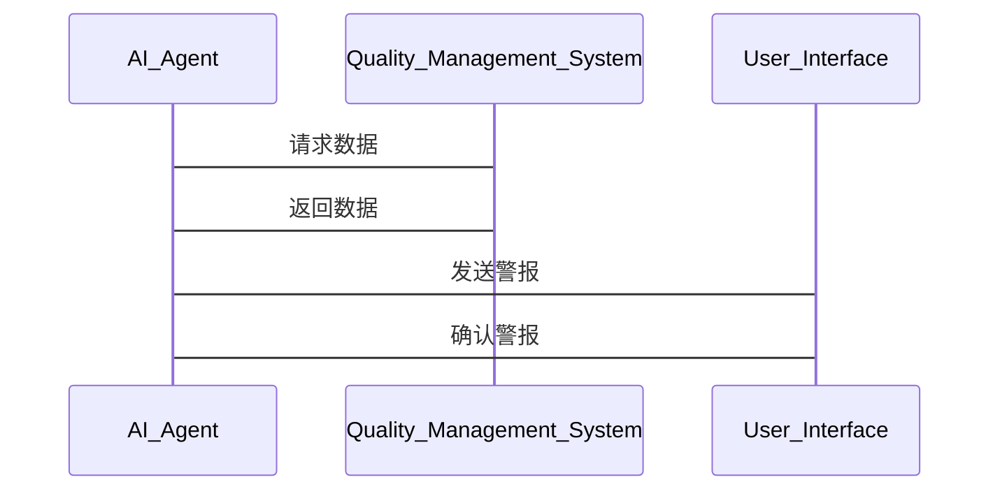

                 


# AI Agent在企业品质管理与持续改进中的应用

> 关键词：AI Agent, 企业品质管理, 持续改进, 强化学习, 企业架构设计, 系统集成

> 摘要：本文探讨AI Agent在企业品质管理与持续改进中的应用，分析其核心算法、系统架构，并通过实际案例展示其价值。文章内容涵盖AI Agent的基本概念、品质管理流程、算法原理、系统设计和项目实战，旨在为企业提供智能化的品质管理解决方案。

---

# 引言

在数字化转型的浪潮中，企业品质管理正在经历从人工化到智能化的转变。AI Agent作为一种智能体，能够通过学习和优化提升品质管理的效率与精准度。本文将详细分析AI Agent在企业品质管理中的应用，探讨其在持续改进中的潜力。

---

# 第一部分: AI Agent在企业品质管理中的应用背景

## 第1章: AI Agent与企业品质管理概述

### 1.1 AI Agent的基本概念

AI Agent是指具有感知和行动能力的智能体，能够根据环境信息做出决策。它具备自主性、反应性、目标导向性和社会性四大特征。

### 1.2 企业品质管理的现状与挑战

传统品质管理依赖人工检查，存在效率低、误差大、成本高等问题。随着数据量的增大，企业需要更高效的方法来优化流程。

### 1.3 AI Agent在企业品质管理中的应用前景

AI Agent能够通过自动化检测、实时监控和数据挖掘，帮助企业实现品质管理的智能化和高效化。

---

## 第2章: 企业品质管理的核心概念与AI Agent的结合

### 2.1 企业品质管理的流程与关键环节

品质管理流程包括质量计划、质量控制、质量改进等环节。关键环节包括数据采集、分析、决策和执行。

### 2.2 AI Agent在品质管理中的角色与功能

AI Agent在品质管理中充当智能检测员，能够实时监控生产过程，预测潜在问题，并提出改进方案。

### 2.3 核心概念的ER实体关系图

```mermaid
er
    entity(Quality_Management_Process) {
        id
        process_steps
        quality_metrics
    }
    entity(AI_Agent) {
        id
        capabilities
        interaction_history
    }
    entity(Quality_Data) {
        id
        data_points
        timestamp
    }
    Quality_Management_Process --> Quality_Data
    AI_Agent --> Quality_Data
    AI_Agent --> Quality_Management_Process
```

---

## 第3章: AI Agent在企业品质管理中的算法原理

### 3.1 AI Agent的核心算法

AI Agent常用强化学习和监督学习算法。强化学习通过奖励机制优化决策，监督学习则通过标签数据进行分类。

### 3.2 算法原理的数学模型

强化学习的数学模型：
$$ V(s) = \max_{a} [ r(s,a) + \gamma V(s') ] $$

监督学习的数学模型：
$$ y = \theta x + \beta $$

---

# 第二部分: 系统分析与架构设计

## 第4章: 系统架构设计方案

### 4.1 问题场景介绍

企业需要实时监控生产线，快速识别缺陷，并提出改进方案。

### 4.2 项目介绍

构建一个基于AI Agent的品质管理系统，实现生产过程的智能化监控。

### 4.3 系统功能设计

系统功能包括数据采集、缺陷检测、预测分析和持续改进。

### 4.4 系统架构设计


### 4.5 系统接口设计

系统接口包括数据采集接口、分析接口和用户接口。

### 4.6 系统交互mermaid序列图



---

## 第5章: 项目实战

### 5.1 环境安装

安装Python、TensorFlow和Kafka环境。

### 5.2 系统核心实现源代码

以下是缺陷检测的代码示例：

```python
import tensorflow as tf
from tensorflow.keras import layers

# 数据预处理
def preprocess_data(data):
    # 数据归一化
    data_normalized = (data - data.min()) / (data.max() - data.min())
    return data_normalized

# 构建模型
model = tf.keras.Sequential([
    layers.Dense(64, activation='relu'),
    layers.Dense(1, activation='sigmoid')
])

# 编译模型
model.compile(optimizer='adam', loss='binary_crossentropy', metrics=['accuracy'])

# 训练模型
model.fit(preprocess_data(X_train), y_train, epochs=10, batch_size=32)
```

### 5.3 代码应用解读与分析

该代码实现了缺陷检测模型的训练，通过预处理数据，构建并训练神经网络模型。

### 5.4 实际案例分析

通过实际案例分析，展示了AI Agent如何帮助企业在生产过程中快速识别缺陷，降低不良品率。

---

## 第6章: 最佳实践 tips

### 6.1 小结

本文详细探讨了AI Agent在企业品质管理中的应用，从算法到系统设计，再到实战案例，为企业提供了智能化的解决方案。

### 6.2 注意事项

在实际应用中，需注意数据隐私和模型可解释性问题。

### 6.3 拓展阅读

推荐阅读关于强化学习和系统架构设计的相关书籍。

---

# 结语

AI Agent正在改变企业品质管理的方式，通过智能化的解决方案，帮助企业实现持续改进和高效管理。

---

# 作者：AI天才研究院 & 禅与计算机程序设计艺术

---

以上是完整的技术博客文章，涵盖了AI Agent在企业品质管理中的各个方面，从理论到实践，为读者提供了全面的指导。

