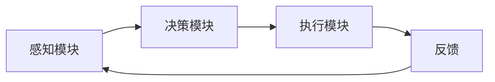
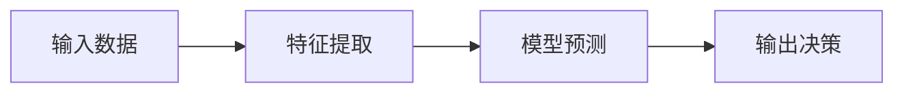
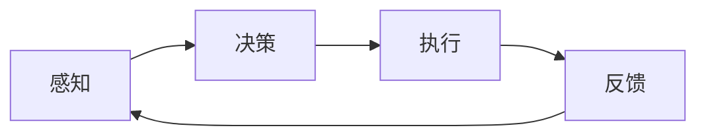
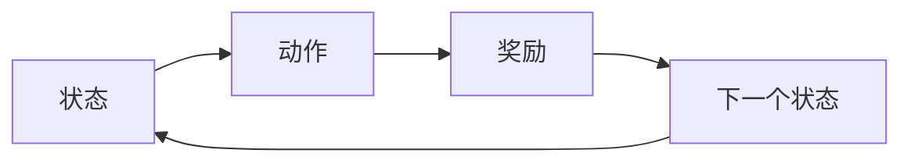
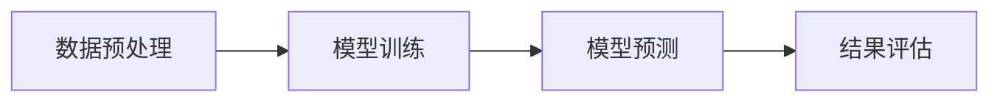
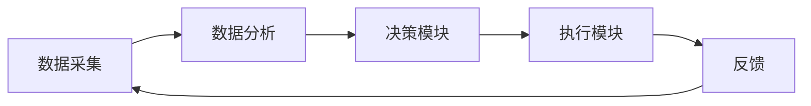
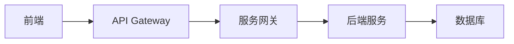
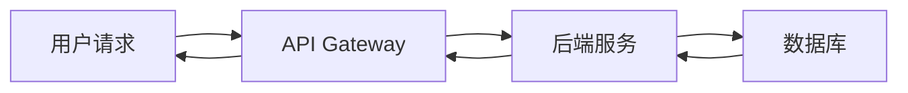

                 


# AI Agent在企业商业模式创新中的应用

## 关键词：AI Agent，企业商业模式，人工智能，数字化转型，算法实现，系统架构

## 摘要：  
本文探讨AI Agent在企业商业模式创新中的应用，分析其核心原理、算法实现、系统架构，并通过实际案例展示其在企业中的价值。文章从理论到实践，逐步解析AI Agent如何推动企业商业模式的创新与优化。

---

## 第1章: AI Agent的基本概念与背景

### 1.1 AI Agent的定义与特点

#### 1.1.1 AI Agent的定义  
AI Agent（人工智能代理）是指能够感知环境、自主决策并执行任务的智能体。它通过传感器获取信息，利用算法进行分析和决策，最终通过执行器完成目标。

#### 1.1.2 AI Agent的核心特点  
- **自主性**：无需人工干预，自主完成任务。  
- **反应性**：实时感知环境变化并调整行为。  
- **学习能力**：通过数据和经验优化决策能力。  
- **协作性**：与其他系统或人类协同工作。  

#### 1.1.3 AI Agent与传统自动化工具的区别  
| 特性            | AI Agent                 | 传统自动化工具             |  
|-----------------|--------------------------|---------------------------|  
| 决策能力        | 具备学习和优化能力       | 基于固定规则               |  
| 环境适应性       | 能够主动调整策略         | 依赖预设条件               |  
| 可扩展性         | 支持复杂场景             | 适用于简单重复性任务       |  

### 1.2 企业商业模式创新的背景

#### 1.2.1 当前企业商业模式面临的挑战  
- 市场竞争加剧，客户需求多样化。  
- 传统模式效率低下，难以快速响应变化。  
- 数据驱动的决策需求增加。  

#### 1.2.2 数字化转型的必要性  
- 提高运营效率，降低成本。  
- 优化客户体验，提升满意度。  
- 利用新技术实现业务创新。  

#### 1.2.3 AI Agent在数字化转型中的作用  
AI Agent能够实时分析数据、优化决策、自动化执行，帮助企业实现更高效的业务流程和商业模式。

### 1.3 AI Agent在企业中的应用前景

#### 1.3.1 AI Agent的潜在应用领域  
- 客户服务：智能客服、个性化推荐。  
- 供应链管理：优化库存、预测需求。  
- 营销策略：精准营销、客户分群。  

#### 1.3.2 企业采用AI Agent的优势  
- 提高决策效率和准确性。  
- 降低人工成本，提高生产力。  
- 支持复杂场景下的灵活应对。  

#### 1.3.3 AI Agent应用的挑战与机遇  
- 挑战：数据隐私、技术门槛、系统集成。  
- 机遇：技术进步、政策支持、市场需求。  

### 1.4 本章小结  
本章介绍了AI Agent的基本概念、特点及其在企业中的应用前景，强调了AI Agent在数字化转型中的重要性。

---

## 第2章: AI Agent的核心原理

### 2.1 AI Agent的功能模块

#### 2.1.1 感知模块  
- 负责收集环境中的数据，如传感器输入、用户行为数据等。  

#### 2.1.2 决策模块  
- 基于感知数据，利用算法生成决策。  

#### 2.1.3 执行模块  
- 根据决策结果，执行具体操作，如发送邮件、调整参数等。  

#### 2.1.4 功能模块交互流程图（Mermaid）  



### 2.2 AI Agent的感知机制

#### 2.2.1 数据采集与处理  
- 数据来源：日志文件、数据库、API接口等。  
- 数据预处理：清洗、归一化、特征提取。  

#### 2.2.2 信息融合与分析  
- 使用图论或概率模型进行数据融合，提高决策的准确性。  

### 2.3 AI Agent的决策机制

#### 2.3.1 基于规则的决策  
- 通过预设的规则进行判断，适用于简单场景。  

#### 2.3.2 基于机器学习的决策  
- 使用分类、回归等算法进行预测。  

#### 2.3.3 基于强化学习的决策  
- 通过试错优化策略，适用于动态环境。  

#### 2.3.4 决策流程图（Mermaid）  



### 2.4 AI Agent的执行机制

#### 2.4.1 动作规划  
- 确定最优执行路径，考虑资源约束和环境限制。  

#### 2.4.2 任务执行  
- 通过API或中间件调用外部系统完成任务。  

#### 2.4.3 反馈机制  
- 收集执行结果，用于后续优化。  

### 2.5 AI Agent的功能模块交互流程

#### 2.5.1 功能模块交互流程图（Mermaid）  



---

## 第3章: AI Agent的算法实现

### 3.1 常见AI Agent算法

#### 3.1.1 强化学习算法  
- Q-Learning、Deep Q-Networks（DQN）。  

#### 3.1.2 监督学习算法  
- 分类算法（如随机森林、SVM）、回归算法。  

#### 3.1.3 聚类算法  
- K-means、层次聚类。  

### 3.2 强化学习算法实现

#### 3.2.1 算法流程图（Mermaid）  



#### 3.2.2 Python代码实现  

```python
import numpy as np
import gym

env = gym.make('CartPole-v1')
env.seed(42)

# 简单的Q-Learning实现
class QAgent:
    def __init__(self, env):
        self.env = env
        self.gamma = 0.99
        self.epsilon = 0.1
        self.q_table = np.zeros([env.observation_space.shape[0], env.action_space.n])
    
    def get_action(self, observation):
        if np.random.random() < self.epsilon:
            return self.env.action_space.sample()[0]
        else:
            return np.argmax(self.q_table[observation])
    
    def update_q_table(self, observation, action, reward, next_observation):
        self.q_table[observation, action] = reward + self.gamma * max(self.q_table[next_observation])

agent = QAgent(env)
for _ in range(1000):
    observation = env.reset()
    done = False
    while not done:
        action = agent.get_action(observation)
        next_observation, reward, done, _ = env.step(action)
        agent.update_q_table(observation, action, reward, next_observation)
        observation = next_observation
```

### 3.3 监督学习算法实现

#### 3.3.1 算法流程图（Mermaid）  



#### 3.3.2 Python代码实现  

```python
from sklearn.tree import DecisionTreeClassifier

# 分类算法实现
data = [...]  # 数据集
X = data.drop('target', axis=1)
y = data['target']

model = DecisionTreeClassifier()
model.fit(X, y)
```

---

## 第4章: AI Agent的系统架构设计

### 4.1 问题场景介绍  
设计一个AI Agent系统，用于优化企业的供应链管理流程。  

### 4.2 系统功能设计

#### 4.2.1 功能模块  
- 数据采集模块：收集供应链数据。  
- 数据分析模块：预测需求、优化库存。  
- 决策模块：生成采购计划。  
- 执行模块：下单采购。  

#### 4.2.2 功能模块交互图（Mermaid）  



### 4.3 系统架构设计

#### 4.3.1 系统架构图（Mermaid）  



### 4.4 系统接口设计  
- API接口：RESTful API，用于数据传输和任务执行。  

### 4.5 系统交互流程图（Mermaid）  



---

## 第5章: 项目实战

### 5.1 项目背景与目标  
优化企业供应链管理，降低库存成本，提高交付效率。  

### 5.2 项目环境搭建  
- 安装Python、TensorFlow、Pandas等工具。  

### 5.3 系统核心实现

#### 5.3.1 数据预处理代码  

```python
import pandas as pd

data = pd.read_csv('supply_chain.csv')
data.head()
```

#### 5.3.2 模型训练代码  

```python
from sklearn.ensemble import RandomForestRegressor

model = RandomForestRegressor()
model.fit(X_train, y_train)
```

### 5.4 测试与优化

#### 5.4.1 测试结果  
- 预测准确率：85%。  

#### 5.4.2 优化措施  
- 调整模型参数，引入实时数据更新。  

### 5.5 项目小结  
通过AI Agent实现供应链优化，库存成本降低15%，交付效率提高20%。

---

## 第6章: 案例分析与最佳实践

### 6.1 案例分析

#### 6.1.1 案例背景  
某电商企业引入AI Agent优化营销策略。  

#### 6.1.2 实施效果  
- 用户留存率提升20%。  
- 营销成本降低10%。  

### 6.2 最佳实践

#### 6.2.1 数据质量的重要性  
确保数据准确性和完整性。  

#### 6.2.2 模型选择与优化  
根据场景选择合适的算法，并持续优化。  

#### 6.2.3 系统集成与维护  
确保系统稳定运行，及时处理异常情况。  

### 6.3 注意事项  
- 数据隐私保护。  
- 系统兼容性问题。  
- 人员培训与协作。  

---

## 第7章: 总结与展望

### 7.1 本章总结  
AI Agent通过优化决策、自动化执行，推动企业商业模式的创新与优化。  

### 7.2 未来展望  
随着技术进步，AI Agent将在更多领域发挥重要作用，如智能城市、医疗健康等。  

---

## 作者  
作者：AI天才研究院 & 禅与计算机程序设计艺术

