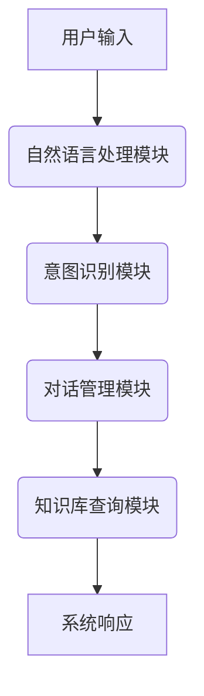
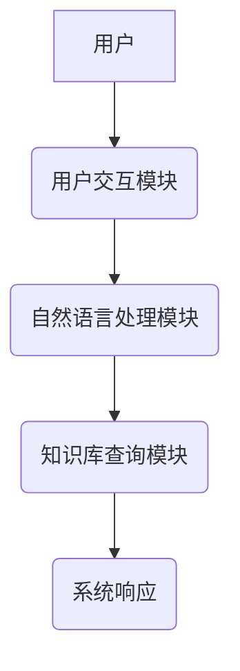

                 


# AI Agent在企业客户服务自动化中的角色

> 关键词：AI Agent, 企业客户服务, 自动化, 自然语言处理, 机器学习, 对话系统, 人工智能

> 摘要：  
随着人工智能技术的飞速发展，AI Agent（人工智能代理）在企业客户服务自动化中的角色日益重要。本文将从AI Agent的基本概念、核心原理、系统架构、应用场景以及实际项目实现等方面，全面探讨AI Agent如何在企业客户服务中实现自动化，提升客户体验和企业效率。通过结合实际案例和技术细节，本文旨在为企业技术决策者、开发人员以及对AI技术感兴趣的管理者提供有价值的参考和启示。

---

# 第一部分: AI Agent在企业客户服务自动化中的背景与概念

## 第1章: AI Agent的基本概念与背景

### 1.1 AI Agent的定义与分类
AI Agent（人工智能代理）是指能够感知环境、自主决策并执行任务的智能实体。它通过与用户交互或与系统内部数据交互，完成特定目标。AI Agent可以根据智能水平分为以下几类：
- **基于规则的AI Agent**：通过预定义的规则进行决策，适用于简单的任务。
- **基于机器学习的AI Agent**：通过数据驱动的方式学习和优化决策策略。
- **基于知识图谱的AI Agent**：结合领域知识进行推理和决策。

AI Agent的核心功能包括：
1. 感知环境：通过传感器或数据接口获取信息。
2. 分析与推理：利用算法对信息进行处理和分析。
3. 决策与执行：根据分析结果做出决策并执行任务。
4. 学习与优化：通过反馈机制不断优化自身性能。

---

### 1.2 企业客户服务自动化的需求与挑战

#### 1.2.1 传统客户服务模式的局限性
传统的客户服务模式依赖于人工坐席执行，存在以下问题：
- **效率低**：人工坐席执行需要大量时间处理简单的重复性问题。
- **成本高**：人工成本高昂，且容易出现人为错误。
- **体验差**：客户等待时间长，服务质量不稳定。

#### 1.2.2 客户服务自动化的必要性
随着企业对效率和客户体验的要求不断提高，自动化客户服务成为必然趋势：
- **24/7可用性**：AI Agent可以全天候为客户提供服务。
- **快速响应**：通过自动化技术快速解决客户问题。
- **一致性**：确保所有客户都能获得一致的服务体验。

#### 1.2.3 AI Agent在客户服务自动化中的角色
AI Agent在客户服务自动化中的主要角色包括：
- **智能客服助手**：通过自然语言处理技术，理解客户问题并提供解决方案。
- **客户行为分析**：通过数据挖掘和机器学习技术，分析客户行为，预测客户需求。
- **多渠道交互**：支持多种渠道（如电话、邮件、社交媒体）与客户交互。

---

### 1.3 AI Agent在企业中的应用价值

#### 1.3.1 提高客户满意度
通过AI Agent的智能化服务，客户可以更快地获得问题解答，提升整体满意度。

#### 1.3.2 降低企业运营成本
自动化服务减少了对人工客服的依赖，显著降低企业运营成本。

#### 1.3.3 提升客户服务效率
AI Agent可以同时处理多个客户的请求，显著提升服务效率。

---

## 1.4 本章小结
本章介绍了AI Agent的基本概念、分类及其在企业客户服务自动化中的重要性。通过对比传统客户服务模式与自动化服务的优劣，明确了AI Agent在提升客户体验和企业效率中的关键作用。

---

# 第二部分: AI Agent的核心原理与技术

## 第2章: AI Agent的核心原理

### 2.1 自然语言处理（NLP）技术

#### 2.1.1 NLP的基本概念
自然语言处理（NLP）是人工智能的核心技术之一，旨在让计算机能够理解、处理和生成人类语言。

#### 2.1.2 常见的NLP技术
- **分词（Tokenization）**：将连续的文本分割成单词或短语。
- **实体识别（Named Entity Recognition,NER）**：识别文本中的命名实体（如人名、地名、组织名）。
- **意图识别（Intent Recognition）**：识别用户输入的意图或目的。

#### 2.1.3 NLP在AI Agent中的应用
通过NLP技术，AI Agent能够理解客户的输入内容，并准确识别客户的需求。

---

### 2.2 机器学习与深度学习

#### 2.2.1 机器学习的基本原理
机器学习是一种通过数据训练模型，使其能够从数据中学习规律并进行预测的技术。

#### 2.2.2 深度学习在AI Agent中的应用
深度学习是一种基于人工神经网络的机器学习技术，广泛应用于语音识别、图像识别和自然语言处理等领域。

#### 2.2.3 常见的机器学习算法
- **决策树（Decision Tree）**：通过构建树状结构进行分类和回归。
- **随机森林（Random Forest）**：通过集成多个决策树模型，提高预测准确性。
- **神经网络（Neural Network）**：通过多层神经网络模拟人脑的处理方式。

---

### 2.3 AI Agent的对话管理

#### 2.3.1 对话管理的定义与作用
对话管理是指在交互过程中，系统根据当前对话状态，决定下一步的响应内容和方式。

#### 2.3.2 常见的对话管理策略
- **规则驱动策略**：基于预定义的规则进行决策。
- **基于模型的策略**：通过训练好的模型预测最优响应。

#### 2.3.3 对话状态表示与更新
对话状态通常包括当前对话的主题、用户的情感倾向、上下文信息等。

---

### 2.4 AI Agent的系统架构

#### 2.4.1 系统架构的定义
AI Agent的系统架构决定了各个模块之间的交互方式和数据流。

#### 2.4.2 常见的系统架构设计
- **基于规则的架构**：适用于简单的任务。
- **基于模型的架构**：适用于复杂任务，需要结合机器学习模型进行决策。

#### 2.4.3 系统架构图


---

## 2.5 本章小结
本章详细介绍了AI Agent的核心原理，包括自然语言处理、机器学习、对话管理等关键技术，并通过系统架构图展示了AI Agent的内部工作流程。

---

# 第三部分: AI Agent在企业客户服务中的应用场景

## 第3章: AI Agent在企业客户服务中的应用场景

### 3.1 智能客服助手

#### 3.1.1 智能客服助手的定义
智能客服助手是一种基于AI技术的客服系统，能够通过自然语言处理技术与客户进行交互。

#### 3.1.2 智能客服助手的功能
- **问题解答**：通过知识库提供常见问题的解答。
- **情绪分析**：分析客户的情感倾向，提供更贴心的服务。
- **推荐服务**：根据客户需求推荐相关的产品或服务。

---

### 3.2 客户支持自动化

#### 3.2.1 客户支持自动化的定义
客户支持自动化是指通过AI Agent自动处理客户的请求和问题。

#### 3.2.2 客户支持自动化的应用场景
- **故障排除**：通过引导客户完成简单的故障排除步骤。
- **信息查询**：快速回答客户关于产品或服务的查询。
- **反馈收集**：收集客户对产品或服务的反馈信息。

---

### 3.3 客户画像与行为分析

#### 3.3.1 客户画像的定义
客户画像是基于客户的行为数据，构建的客户特征模型。

#### 3.3.2 行为分析的应用
- **客户分群**：根据客户的行为数据，将客户分为不同的群体。
- **需求预测**：预测客户未来的潜在需求。

---

## 3.4 本章小结
本章介绍了AI Agent在企业客户服务中的多种应用场景，包括智能客服助手、客户支持自动化、客户画像与行为分析等。

---

# 第四部分: AI Agent系统的设计与实现

## 第4章: AI Agent系统的设计与实现

### 4.1 系统设计与分析

#### 4.1.1 系统需求分析
- **功能性需求**：AI Agent需要能够理解客户的输入，并提供相应的响应。
- **性能需求**：系统需要具备高可用性和良好的扩展性。
- **安全性需求**：确保客户数据的安全性和隐私性。

#### 4.1.2 系统架构设计
- **模块划分**：系统划分为用户交互模块、自然语言处理模块、知识库查询模块等。
- **模块之间的交互**：通过接口定义模块之间的交互方式。

#### 4.1.3 系统架构图


---

### 4.2 功能模块设计

#### 4.2.1 用户交互模块
用户交互模块负责接收用户的输入，并将其传递给自然语言处理模块。

#### 4.2.2 自然语言处理模块
自然语言处理模块负责对用户的输入进行分词、实体识别和意图识别。

#### 4.2.3 知识库查询模块
知识库查询模块根据意图识别结果，从知识库中查询相关信息。

---

### 4.3 接口设计

#### 4.3.1 API接口定义
通过API接口定义模块之间的交互方式，确保系统的可扩展性和灵活性。

#### 4.3.2 接口实现
通过编写接口实现模块之间的数据传递和交互。

---

### 4.4 系统实现与优化

#### 4.4.1 系统实现
通过编写代码实现各个功能模块，并进行系统集成。

#### 4.4.2 系统优化
通过优化算法和改进系统架构，提高系统的性能和用户体验。

---

## 4.5 本章小结
本章详细介绍了AI Agent系统的设计与实现过程，包括系统架构设计、功能模块设计、接口设计以及系统实现与优化。

---

# 第五部分: 项目实战——AI Agent客服系统的实现

## 第5章: 项目实战——AI Agent客服系统的实现

### 5.1 项目背景与需求分析

#### 5.1.1 项目背景
本项目旨在开发一个基于AI Agent的智能客服系统，用于企业客户服务自动化。

#### 5.1.2 项目需求
- **功能性需求**：支持用户通过自然语言输入提问，并获得相应的回答。
- **性能需求**：系统需要具备高可用性和良好的扩展性。
- **安全性需求**：确保客户数据的安全性和隐私性。

---

### 5.2 项目环境搭建

#### 5.2.1 环境要求
- **操作系统**：Windows或Linux
- **编程语言**：Python
- **开发工具**：PyCharm或Jupyter Notebook
- **依赖库**：numpy, pandas, scikit-learn, transformers

#### 5.2.2 环境搭建步骤
1. 安装Python和必要的依赖库。
2. 下载并安装开发工具。
3. 创建项目目录，并初始化项目结构。

---

### 5.3 系统核心实现

#### 5.3.1 自然语言处理模块的实现
```python
from transformers import pipeline

nlp = pipeline("question-answering")
```

#### 5.3.2 知识库查询模块的实现
```python
def query_knowledge_base(question):
    # 这里可以调用预训练的模型进行回答生成
    return nlp(question)
```

#### 5.3.3 用户交互模块的实现
```python
def main():
    while True:
        question = input("请输入您的问题：")
        answer = query_knowledge_base(question)
        print("答案：", answer)
```

---

### 5.4 项目测试与优化

#### 5.4.1 系统测试
- **功能测试**：测试系统的各项功能是否正常。
- **性能测试**：测试系统在高并发情况下的表现。
- **安全性测试**：测试系统的安全性，防止漏洞攻击。

#### 5.4.2 系统优化
- **算法优化**：优化自然语言处理模块的算法，提高回答的准确率。
- **系统架构优化**：优化系统架构，提高系统的扩展性和可维护性。

---

## 5.5 本章小结
本章通过一个具体的项目实战，详细介绍了AI Agent客服系统的实现过程，包括项目背景、环境搭建、系统核心实现以及项目测试与优化。

---

# 第六部分: 最佳实践与未来展望

## 第6章: 最佳实践与未来展望

### 6.1 最佳实践

#### 6.1.1 系统设计
- **模块化设计**：将系统划分为多个模块，确保系统的可扩展性和可维护性。
- **接口设计**：通过标准化接口定义模块之间的交互方式，确保系统的灵活性。

#### 6.1.2 系统优化
- **算法优化**：不断优化自然语言处理和机器学习算法，提高系统的性能和准确性。
- **数据管理**：合理管理客户数据，确保数据的安全性和隐私性。

---

### 6.2 未来展望

#### 6.2.1 新技术的应用
随着人工智能技术的不断发展，未来会有更多新技术（如大语言模型、生成式AI）应用于AI Agent系统。

#### 6.2.2 多模态交互
未来的AI Agent将支持多模态交互，包括语音、图像等多种交互方式。

#### 6.2.3 行业应用
AI Agent技术将在更多行业（如金融、医疗、教育等）得到广泛应用，推动企业的智能化转型。

---

## 6.3 本章小结
本章总结了AI Agent系统设计与实现的最佳实践，并对未来的发展趋势进行了展望，为读者提供了进一步学习和实践的方向。

---

# 作者：AI天才研究院/AI Genius Institute & 禅与计算机程序设计艺术 /Zen And The Art of Computer Programming

