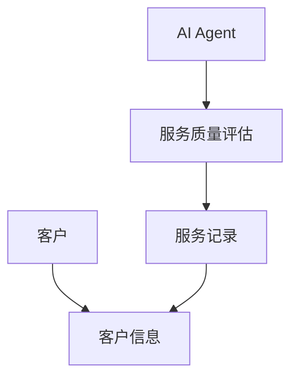
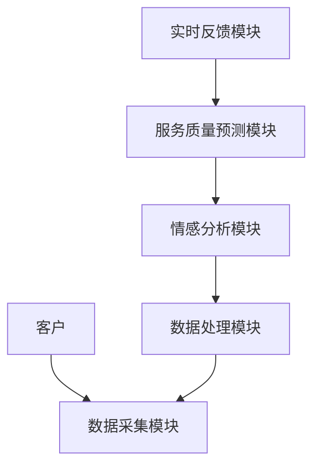

                 


# AI Agent在企业客户服务质量监控与提升中的实时应用

## 关键词：AI Agent、客户服务质量、实时监控、自然语言处理、机器学习、服务质量提升

## 摘要：  
随着企业对客户服务质量要求的不断提高，传统的客户服务质量监控方法逐渐暴露出效率低下、滞后性强等问题。本文从AI Agent的核心概念出发，详细探讨其在企业客户服务质量监控与提升中的实时应用。通过分析AI Agent的算法原理、系统架构以及实际案例，本文揭示了AI Agent在客户服务质量实时监控中的巨大潜力和实际价值，为企业提供了全新的解决方案。

---

# 第1章: 企业客户服务质量监控与提升的背景与挑战

## 1.1 企业客户服务质量的重要性  
企业客户服务质量是衡量企业竞争力的重要指标。高质量的客户服务能够提升客户满意度、忠诚度，甚至直接影响企业的市场表现和长期发展。  

### 1.1.1 客户服务质量的核心要素  
客户服务质量的核心要素包括响应速度、问题解决能力、服务态度、专业知识等。  

### 1.1.2 企业客户服务质量的衡量标准  
- 客户满意度（Customer Satisfaction）  
- 客户净推荐值（NPS）  
- 服务响应时间  
- 问题解决率  

### 1.1.3 客户服务质量对企业竞争力的影响  
优质的客户服务质量能够提升客户忠诚度，降低客户流失率，从而为企业创造更大的价值。  

## 1.2 传统客户服务质量监控的局限性  
传统客户服务质量监控主要依赖人工记录和事后分析，存在以下问题：  

### 1.2.1 传统监控方法的不足  
- 数据采集效率低  
- 数据分析滞后性强  
- 监控范围有限  

### 1.2.2 人工监控的效率低下  
人工监控需要大量的人力资源，且容易受到主观因素的影响，难以保证监控结果的客观性和准确性。  

### 1.2.3 数据分析的滞后性  
传统数据分析方法通常需要收集大量数据后进行离线分析，无法实现实时监控和快速响应。  

## 1.3 AI Agent在客户服务质量监控中的优势  
AI Agent（人工智能代理）是一种能够自主感知环境、执行任务并优化结果的智能系统。其在客户服务质量监控中的优势包括：  

### 1.3.1 AI Agent的核心优势  
- 实时性：能够实时采集和分析客户数据，快速发现并解决问题。  
- 智能性：通过机器学习和自然语言处理技术，能够自动识别客户情绪、意图，并提供个性化服务。  
- 自适应性：能够根据实时数据动态调整监控策略，优化服务质量。  

### 1.3.2 AI Agent在实时监控中的应用潜力  
AI Agent可以实时监控客户互动数据，分析客户情绪，预测潜在问题，并主动采取措施解决问题。  

### 1.3.3 AI Agent对企业客户服务质量提升的推动作用  
通过AI Agent的实时监控和智能分析，企业能够快速响应客户需求，提升客户满意度，优化服务流程。  

## 1.4 本章小结  
本章从企业客户服务质量的重要性出发，分析了传统监控方法的局限性，并详细阐述了AI Agent在客户服务质量监控中的优势和应用潜力。下一章将深入探讨AI Agent的核心概念与原理。

---

# 第2章: AI Agent的核心概念与原理

## 2.1 AI Agent的定义与分类  
AI Agent是一种能够感知环境、自主决策并执行任务的智能系统。根据功能和应用场景的不同，AI Agent可以分为以下几类：  

### 2.1.1 AI Agent的定义  
AI Agent通过感知环境数据，利用算法进行分析和决策，并执行相应的任务以实现目标。  

### 2.1.2 AI Agent的分类  
- **基于规则的AI Agent**：通过预定义的规则进行决策。  
- **基于机器学习的AI Agent**：通过机器学习算法从数据中学习决策策略。  
- **混合型AI Agent**：结合规则和机器学习的混合模型。  

### 2.1.3 不同类型AI Agent的特点对比  

| 类型                | 特点                              | 适用场景                     |
|---------------------|-----------------------------------|------------------------------|
| 基于规则的AI Agent  | 决策简单，易于解释               | 需要明确规则的场景           |
| 基于机器学习的AI Agent | 决策复杂，适应性强               | 数据量大、规则复杂的场景     |
| 混合型AI Agent      | 结合规则和机器学习，灵活性高       | 综合场景                     |

---

## 2.2 AI Agent的核心原理  
AI Agent的核心原理包括数据采集与处理、自然语言处理（NLP）技术和机器学习与深度学习算法。  

### 2.2.1 数据采集与处理  
AI Agent需要从多种数据源（如客服对话、客户评价、服务记录等）采集数据，并进行清洗、特征提取等预处理工作。  

### 2.2.2 自然语言处理（NLP）技术  
NLP技术用于分析客户的文本数据，识别客户情绪、意图和问题。例如，情感分析可以将客户评价分为正面、中性或负面。  

### 2.2.3 机器学习与深度学习算法  
机器学习算法（如支持向量机、随机森林）和深度学习算法（如LSTM、Transformer）用于训练模型，预测客户满意度、问题解决率等指标。  

---

## 2.3 AI Agent的实体关系与架构  
AI Agent的实体关系可以通过ER图表示。  



AI Agent的架构设计可以通过以下分层结构表示：  

- **数据层**：采集和存储客户数据。  
- **计算层**：进行数据处理和模型训练。  
- **应用层**：提供实时监控和智能决策功能。  

---

## 2.4 本章小结  
本章详细介绍了AI Agent的定义、分类、核心原理和实体关系架构，为后续章节的分析奠定了基础。下一章将探讨AI Agent在客户服务质量监控中的实时应用。

---

# 第3章: AI Agent在客户服务质量监控中的实时应用

## 3.1 实时数据采集与处理  
实时数据采集是AI Agent实现客户服务质量监控的基础。  

### 3.1.1 数据源的多样性  
AI Agent可以从以下数据源采集数据：  
- 客服对话记录（如电话录音、聊天记录）  
- 客户评价和反馈  
- 历史服务记录  

### 3.1.2 数据预处理技术  
数据预处理包括数据清洗、特征提取和数据标准化等步骤。  

### 3.1.3 实时数据流处理框架  
实时数据流处理框架（如Kafka、Flume）可以实现数据的高效采集和传输。  

---

## 3.2 基于NLP的情感分析  
情感分析是AI Agent实现客户情绪识别的重要技术。  

### 3.2.1 情感分析算法原理  
情感分析算法通过分析客户的文本数据，判断客户情绪是正面、中性还是负面。  

### 3.2.2 基于深度学习的情感分析模型  
深度学习模型（如LSTM、BERT）可以更准确地理解客户的意图和情绪。  

### 3.2.3 情感分析在客户服务质量监控中的应用  
通过情感分析，AI Agent可以快速识别客户的不满情绪，并优先处理负面评价。  

---

## 3.3 基于机器学习的预测与优化  
机器学习算法可以预测客户满意度、问题解决率等指标，并优化服务质量。  

### 3.3.1 机器学习算法在客户服务质量预测中的应用  
- 支持向量机（SVM）  
- 随机森林（Random Forest）  

### 3.3.2 基于深度学习的客户服务质量优化模型  
深度学习模型（如Transformer）可以实现更复杂的预测任务。  

### 3.3.3 预测结果的实时反馈与调整  
AI Agent可以根据预测结果实时调整服务策略，优化客户体验。  

---

## 3.4 本章小结  
本章详细介绍了AI Agent在客户服务质量监控中的实时应用，包括数据采集、情感分析和机器学习预测等技术。下一章将深入探讨AI Agent的算法原理与数学模型。

---

# 第4章: AI Agent的算法原理与数学模型

## 4.1 基于NLP的情感分析算法  
情感分析算法的数学模型可以通过以下步骤实现：  

### 4.1.1 TF-IDF文本特征提取  
TF-IDF（Term Frequency-Inverse Document Frequency）用于提取文本特征。  

$$ \text{TF}(t, d) = \frac{\text{词 }t \text{ 在文档 }d \text{ 中出现的次数}}{\text{文档 }d \text{ 的总词数}} $$  
$$ \text{IDF}(t) = \log\left(\frac{\text{总文档数}}{\text{包含词 }t \text{ 的文档数}}\right) $$  
$$ \text{TF-IDF}(t, d) = \text{TF}(t, d) \times \text{IDF}(t) $$  

### 4.1.2 朴素贝叶斯分类器  
朴素贝叶斯分类器是一种基于概率论的分类算法。  

$$ P(y|x) = \frac{P(x|y)P(y)}{P(x)} $$  

### 4.1.3 LSTM序列模型  
LSTM（长短期记忆网络）用于处理序列数据，如客户对话记录。  

---

## 4.2 基于机器学习的客户服务质量预测模型  

### 4.2.1 机器学习算法选择  
- 支持向量机（SVM）  
- 随机森林（Random Forest）  

### 4.2.2 深度学习模型实现  
- Transformer模型  
- BERT模型  

---

## 4.3 算法实现与优化  
AI Agent的算法实现需要考虑以下问题：  
- 数据量与模型复杂度的平衡  
- 模型训练的时间效率  
- 模型的可解释性  

---

## 4.4 本章小结  
本章详细介绍了AI Agent的算法原理与数学模型，为读者提供了技术实现的理论基础。下一章将探讨AI Agent的系统架构设计与项目实战。

---

# 第5章: AI Agent的系统架构设计与项目实战

## 5.1 系统分析与设计  
AI Agent的系统架构设计需要考虑以下方面：  

### 5.1.1 问题场景介绍  
企业客户服务质量监控的实时性要求高，需要快速响应客户需求。  

### 5.1.2 系统功能设计  
- 数据采集与处理模块  
- 情感分析模块  
- 服务质量预测模块  
- 实时反馈与优化模块  

---

## 5.2 系统架构设计  
AI Agent的系统架构可以通过以下分层结构实现：  



---

## 5.3 项目实战  
### 5.3.1 环境安装  
- 安装Python、TensorFlow、Keras等开发工具。  

### 5.3.2 核心代码实现  
以下是情感分析模块的核心代码：  

```python
import tensorflow as tf
from tensorflow.keras import layers

# 数据预处理
def preprocess(data):
    # 文本特征提取
    # ... 具体实现 ...

# 模型定义
model = tf.keras.Sequential([
    layers.Embedding(input_dim= vocab_size, output_dim= embedding_dim),
    layers.LSTM(units= lstm_units),
    layers.Dense(3, activation='softmax')
])

# 模型训练
model.compile(optimizer='adam', loss='sparse_categorical_crossentropy', metrics=['accuracy'])
model.fit(x_train, y_train, epochs=10, batch_size=32)
```

### 5.3.3 代码解读与分析  
- 上述代码定义了一个基于LSTM的情感分析模型，包括文本特征提取、模型训练和评估等步骤。  

### 5.3.4 实际案例分析  
通过实际案例分析，验证AI Agent在客户服务质量监控中的有效性。  

---

## 5.4 本章小结  
本章通过系统架构设计和项目实战，展示了AI Agent在客户服务质量监控中的具体实现。下一章将总结AI Agent的优势，并提供最佳实践建议。

---

# 第6章: 总结与展望

## 6.1 AI Agent的优势与价值  
AI Agent通过实时监控和智能分析，能够显著提升企业客户服务质量，降低运营成本。  

## 6.2 最佳实践 tips  
- 数据质量是AI Agent的核心，需要确保数据的完整性和准确性。  
- 在实际应用中，建议采用混合型AI Agent，结合规则和机器学习模型。  
- 定期更新模型，以适应客户行为和需求的变化。  

## 6.3 未来发展方向  
- 更加智能化的AI Agent  
- 多模态情感分析技术  
- 自适应性更强的实时监控系统  

## 6.4 本章小结  
本文从理论到实践，全面探讨了AI Agent在企业客户服务质量监控与提升中的实时应用。通过技术分析和项目实战，展示了AI Agent的巨大潜力和实际价值。

---

# 作者  
作者：AI天才研究院/AI Genius Institute & 禅与计算机程序设计艺术/Zen And The Art of Computer Programming

