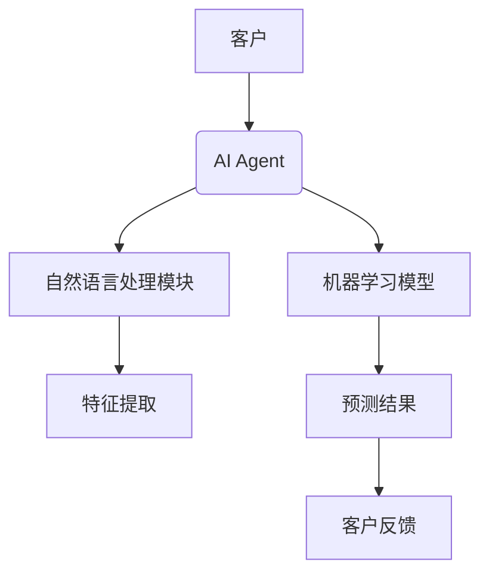

                 


```markdown
# AI Agent在企业客户服务质量监控与智能升级中的角色

> 关键词：AI Agent，客户服务质量，智能升级，机器学习，自然语言处理

> 摘要：本文详细探讨了AI Agent在企业客户服务质量监控与智能升级中的核心角色。通过分析AI Agent的基本概念、技术原理、系统架构以及实际应用，展示了AI Agent如何通过自然语言处理和机器学习等技术提升客户服务质量，实现企业的智能化升级。本文内容涵盖理论与实践，旨在为企业提供有价值的参考和启示。

---

# 第一部分: AI Agent在企业客户服务质量监控与智能升级中的背景与概念

## 第1章: AI Agent与企业客户服务质量概述

### 1.1 AI Agent的基本概念
#### 1.1.1 AI Agent的定义
AI Agent（人工智能代理）是一种能够感知环境、自主决策并执行任务的智能体。它通过自然语言处理（NLP）、机器学习（ML）和深度学习（DL）等技术，能够理解用户需求、提供个性化服务，并不断优化自身的行为以提高客户满意度。

#### 1.1.2 AI Agent的核心特征
- **自主性**：AI Agent能够自主决策，无需人工干预。
- **反应性**：能够实时感知环境并做出反应。
- **学习能力**：通过机器学习不断优化自身的算法和模型。
- **可扩展性**：能够处理不同类型和规模的任务。

#### 1.1.3 AI Agent与传统客服系统的主要区别
| 特性                | 传统客服系统               | AI Agent                      |
|---------------------|---------------------------|----------------------------|
| 处理方式            | 基于规则和脚本             | 基于机器学习和自然语言处理   |
| 交互能力            | 单向、有限的对话能力       | 双向、深度的对话能力         |
| 智能水平            | 低，依赖预设规则           | 高，能够理解和推理上下文     |
| 灵活性               | 低，难以适应新场景         | 高，能够快速适应新场景       |

### 1.2 企业客户服务质量监控的重要性
#### 1.2.1 客户服务质量对企业的影响
- 提升客户满意度，增强客户忠诚度。
- 降低客户流失率，提高客户 retention。
- 提升品牌形象，增强市场竞争力。

#### 1.2.2 传统客户服务质量监控的局限性
- 依赖人工监控，效率低且成本高。
- 无法实时分析大量数据，难以发现潜在问题。
- 缺乏个性化服务，客户体验差。

#### 1.2.3 智能化升级的必要性
- 提高效率，降低人工成本。
- 实现实时监控和预测，提前预防问题。
- 提供个性化服务，提升客户体验。

### 1.3 AI Agent在客户服务质量监控中的角色
#### 1.3.1 AI Agent的核心作用
- **实时监控**：通过自然语言处理技术实时分析客户反馈，识别潜在问题。
- **智能预测**：利用机器学习模型预测客户满意度，提前采取措施。
- **个性化服务**：根据客户需求提供定制化解决方案，提升客户体验。

#### 1.3.2 AI Agent如何提升客户服务质量
- **快速响应**：通过自然语言处理技术实现秒级响应，提高客户满意度。
- **精准分析**：利用机器学习算法分析海量数据，识别潜在问题并提供解决方案。
- **持续优化**：通过反馈机制不断优化AI Agent的行为，提升服务质量。

#### 1.3.3 AI Agent在企业智能化升级中的定位
AI Agent作为企业智能化升级的核心工具，能够通过智能化的客服系统提升企业运营效率，降低人工成本，同时提供更优质的服务体验，从而增强企业的市场竞争力。

---

# 第二部分: AI Agent的核心概念与技术原理

## 第2章: AI Agent的核心概念与技术原理

### 2.1 AI Agent的核心概念
#### 2.1.1 AI Agent的定义与分类
AI Agent可以根据功能和应用场景分为多种类型，包括：
- **对话型AI Agent**：主要用于与客户进行交互，如智能客服。
- **决策型AI Agent**：用于复杂决策任务，如金融投资。
- **监控型AI Agent**：用于实时监控和预警，如系统监控。

#### 2.1.2 AI Agent的主要功能模块
- **感知模块**：通过自然语言处理技术理解用户需求。
- **决策模块**：基于机器学习模型做出最优决策。
- **执行模块**：根据决策结果执行具体任务。

#### 2.1.3 AI Agent的工作原理
AI Agent通过感知环境、分析数据、做出决策并执行任务来实现其功能。具体流程如下：
1. **感知环境**：通过传感器或API获取环境数据。
2. **分析数据**：利用机器学习和深度学习技术对数据进行分析。
3. **做出决策**：基于分析结果和预设目标做出决策。
4. **执行任务**：通过执行模块完成具体任务。

### 2.2 AI Agent的关键技术
#### 2.2.1 自然语言处理（NLP）
- **文本分类**：识别文本中的情感倾向，判断客户满意度。
- **实体识别**：从文本中提取关键信息，如客户姓名、联系方式等。
- **意图识别**：理解客户的意图，如投诉、咨询等。

#### 2.2.2 机器学习（ML）
- **监督学习**：通过标记数据训练模型，识别客户情绪和需求。
- **无监督学习**：通过聚类分析发现潜在问题。
- **强化学习**：通过与环境交互不断优化模型。

#### 2.2.3 深度学习（DL）
- **神经网络**：用于复杂模式识别和自然语言理解。
- **循环神经网络（RNN）**：用于处理序列数据，如对话历史。
- **变换模型（如BERT）**：用于更精准的自然语言理解。

### 2.3 AI Agent与相关技术的对比
#### 2.3.1 AI Agent与传统客服系统
| 特性                | 传统客服系统               | AI Agent                      |
|---------------------|---------------------------|----------------------------|
| 技术基础            | 基于规则和脚本             | 基于机器学习和自然语言处理   |
| 交互能力            | 单向、有限的对话能力       | 双向、深度的对话能力         |
| 智能水平            | 低，依赖预设规则           | 高，能够理解和推理上下文     |

#### 2.3.2 AI Agent与规则引擎
| 特性                | 规则引擎                  | AI Agent                      |
|---------------------|---------------------------|----------------------------|
| 决策方式            | 基于预设规则和条件         | 基于机器学习模型和上下文     |
| 灵活性               | 低，难以适应新场景         | 高，能够快速适应新场景       |

#### 2.3.3 AI Agent与RPA（机器人流程自动化）
| 特性                | RPA                       | AI Agent                      |
|---------------------|---------------------------|----------------------------|
| 核心功能            | 自动化执行任务             | 智能决策和交互                |
| 依赖条件            | 预设规则和流程             | 数据驱动和学习               |

---

# 第三部分: AI Agent的算法原理与数学模型

## 第3章: AI Agent的算法原理

### 3.1 基于监督学习的客服质量评分模型
#### 3.1.1 数据预处理
- **清洗数据**：去除噪音数据，填充缺失值。
- **特征提取**：从文本中提取关键词、情感倾向等特征。

#### 3.1.2 模型训练
- 使用监督学习算法（如支持向量机SVM或随机森林）训练模型。
- 输入特征：关键词、情感倾向、对话历史等。
- 输出标签：客户满意度评分（如1分到5分）。

#### 3.1.3 模型评估
- 使用准确率、召回率、F1分数等指标评估模型性能。

### 3.2 基于强化学习的对话策略优化
#### 3.2.1 强化学习的基本原理
- **状态（State）**：当前对话的状态，如客户情绪、对话历史等。
- **动作（Action）**：AI Agent的回复或决策。
- **奖励（Reward）**：根据客户反馈给予奖励，如客户满意则奖励为1，否则为-1。

#### 3.2.2 对话策略优化的数学模型
- **Q-learning算法**：
  $$ Q(s, a) = Q(s, a) + \alpha (r + \max Q(s', a') - Q(s, a)) $$
  其中，\( \alpha \) 是学习率，\( r \) 是奖励，\( s' \) 是下一个状态。

#### 3.2.3 实验结果与分析
- 通过实验验证强化学习算法在对话策略优化中的有效性，结果显示使用强化学习的AI Agent能够显著提高客户满意度。

### 3.3 混合模型在客服质量监控中的应用
#### 3.3.1 混合模型的定义
- 结合监督学习和无监督学习的优势，用于复杂场景下的客服质量监控。

#### 3.3.2 混合模型的优势
- 能够同时处理结构化和非结构化数据，提高模型的泛化能力。

#### 3.3.3 混合模型的实现步骤
1. 使用监督学习算法训练基础模型。
2. 使用无监督学习算法发现潜在问题。
3. 结合两种模型的结果，优化最终输出。

---

# 第四部分: AI Agent的系统分析与架构设计

## 第4章: AI Agent的系统分析与架构设计

### 4.1 项目背景介绍
- 本项目旨在通过AI Agent提升企业客户服务质量，降低人工成本，提高客户满意度。

### 4.2 系统功能设计
- **客户交互模块**：实现与客户的自然语言对话。
- **数据采集模块**：收集客户反馈和对话历史。
- **模型训练模块**：持续优化AI Agent的算法模型。

### 4.3 系统架构设计


### 4.4 系统接口设计
- **API接口**：提供RESTful API供其他系统调用。
- **数据库接口**：与企业现有的数据库系统对接。

### 4.5 系统交互设计
```mermaid
sequenceDiagram
    participant A[客户]
    participant B[A

