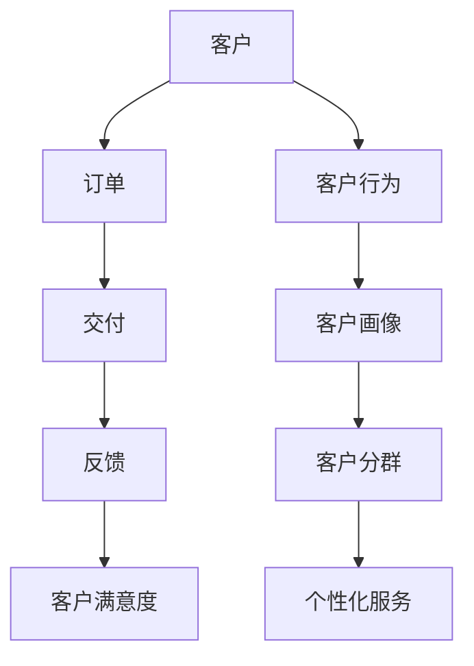
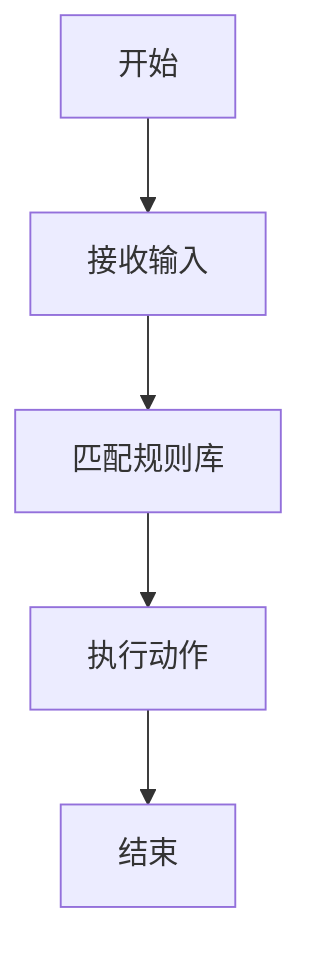
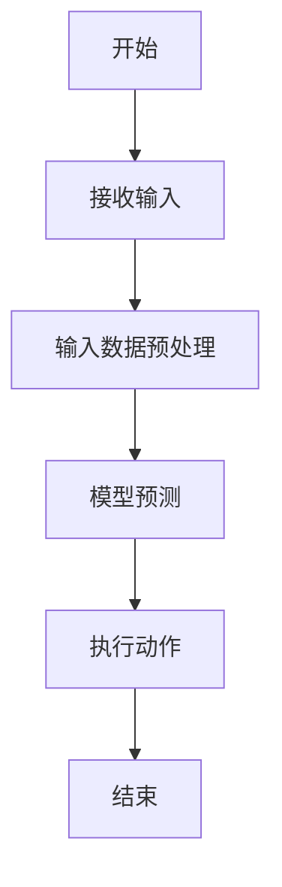
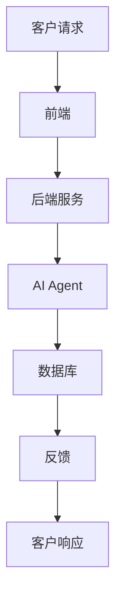
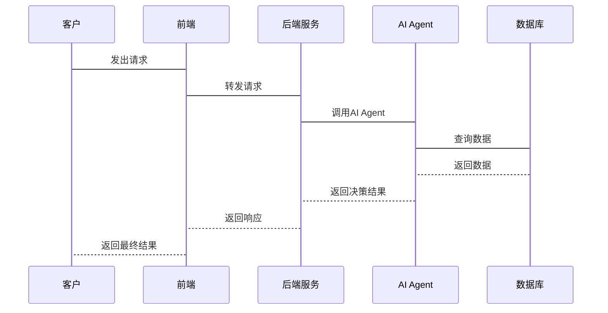

                 


# AI Agent在企业客户生命周期管理中的应用

## 关键词：AI Agent, 客户生命周期管理, 人工智能, 系统架构, 项目实战

## 摘要：本文深入探讨了AI Agent在企业客户生命周期管理中的应用，从背景介绍、核心概念、算法原理、系统架构到项目实战，全面分析了AI Agent如何提升企业客户管理的效率和精准度。通过具体案例和代码实现，展示了AI Agent在客户分群、个性化推荐、客户满意度预测等场景中的实际应用价值。

---

# 第一部分: AI Agent与客户生命周期管理概述

## 第1章: AI Agent与客户生命周期管理的背景介绍

### 1.1 AI Agent的基本概念

#### 1.1.1 AI Agent的定义

AI Agent（人工智能代理）是一种能够感知环境、自主决策并执行任务的智能体。它可以理解为一种软件或实体，能够通过传感器或数据源获取信息，并基于预设的目标和规则采取行动。

#### 1.1.2 AI Agent的核心属性

- **自主性**：能够在没有外部干预的情况下独立运行。
- **反应性**：能够实时感知环境变化并做出反应。
- **目标导向**：所有行为都围绕实现特定目标展开。
- **学习能力**：通过数据和经验不断优化自身的决策能力。

#### 1.1.3 AI Agent与传统自动化系统的区别

| 属性          | AI Agent                          | 传统自动化系统                   |
|---------------|-----------------------------------|----------------------------------|
| 决策能力       | 具备自主决策能力                   | 依赖预设规则，无自主决策能力     |
| 学习能力       | 可通过数据学习优化性能             | 无法学习，性能固定                |
| 灵活性         | 高，能够适应复杂变化               | 低，适应性差                    |
| 复杂问题处理   | 能处理非结构化和模糊问题             | 仅能处理结构化和明确问题           |

### 1.2 客户生命周期管理的定义与特点

#### 1.2.1 客户生命周期的阶段划分

客户生命周期通常分为五个阶段：

1. **获取阶段**：吸引潜在客户。
2. **转化阶段**：将潜在客户转化为实际客户。
3. **发展阶段**：提升客户的价值和忠诚度。
4. **保留阶段**：防止客户流失。
5. **终止阶段**：客户关系的终止或转移。

#### 1.2.2 客户生命周期管理的目标

- 提高客户满意度和忠诚度。
- 优化客户服务流程，降低成本。
- 提升客户生命周期价值（CLV）。

#### 1.2.3 客户生命周期管理的挑战

- 数据碎片化：客户数据分散在多个系统中，难以统一管理。
- 个性化需求：每个客户的需求和行为都不同，难以统一处理。
- 实时性要求：客户期望得到即时响应，对延迟容忍度低。

### 1.3 AI Agent在客户生命周期管理中的应用背景

#### 1.3.1 企业客户管理的痛点与难点

- 客户需求多样化，难以实现个性化服务。
- 客户数据量大，难以快速分析和处理。
- 客户行为预测准确性低，难以提前采取措施。

#### 1.3.2 AI Agent如何解决客户管理问题

- **自动化处理**：AI Agent可以自动处理客户请求和问题，减少人工干预。
- **实时响应**：通过实时数据分析，AI Agent能够快速响应客户需求。
- **个性化服务**：基于客户行为和数据，AI Agent可以提供个性化的服务和推荐。

#### 1.3.3 AI Agent在客户生命周期管理中的价值

- 提高客户满意度和忠诚度。
- 降低客户流失率。
- 提升客户服务效率和精准度。

## 1.4 本章小结

通过本章的介绍，我们了解了AI Agent的基本概念、客户生命周期管理的定义与特点，以及AI Agent在客户生命周期管理中的应用背景和价值。

---

# 第二部分: AI Agent的核心概念与原理

## 第2章: AI Agent的核心概念与原理

### 2.1 AI Agent的核心原理

#### 2.1.1 AI Agent的感知与决策机制

AI Agent通过传感器或数据源获取环境信息，然后基于这些信息进行分析和判断，最终做出决策。例如，客户在网站上的浏览行为数据可以被AI Agent感知，并用于推荐合适的产品。

#### 2.1.2 AI Agent的执行与反馈机制

AI Agent在做出决策后，会通过执行器或接口将决策结果转化为实际操作。同时，AI Agent会接收环境的反馈，用于优化未来的决策和行动。

#### 2.1.3 AI Agent的自适应与学习能力

AI Agent可以通过机器学习算法不断优化自身的决策模型，从而提高处理复杂问题的能力。例如，基于客户反馈数据，AI Agent可以学习和改进推荐算法。

### 2.2 AI Agent的属性特征对比

| 属性          | 基于规则的AI Agent | 基于模型的AI Agent |
|---------------|--------------------|---------------------|
| 决策方式       | 依赖预设规则         | 基于数据模型进行预测 |
| 学习能力       | 无法学习            | 可以通过数据学习优化 |
| 适应性         | 较低               | 较高                |
| 处理复杂性     | 低                 | 高                  |

### 2.3 AI Agent与客户生命周期的实体关系图



### 2.4 本章小结

本章详细讲解了AI Agent的核心原理和属性特征，并通过实体关系图展示了AI Agent在客户生命周期管理中的作用和价值。

---

## 第3章: AI Agent的算法原理

### 3.1 基于规则的AI Agent算法

#### 3.1.1 算法流程图



#### 3.1.2 算法实现代码

```python
def rule_based_agent(input):
    for rule in rules:
        if rule.condition(input):
            return rule.action(input)
    return default_action()
```

### 3.2 基于模型的AI Agent算法

#### 3.2.1 算法流程图



#### 3.2.2 算法实现代码

```python
class ModelBasedAgent:
    def __init__(self, model):
        self.model = model

    def decide(self, input):
        prediction = self.model.predict(input)
        return self.model.actions[prediction]
```

### 3.3 AI Agent的数学模型

#### 3.3.1 决策树模型

$$
\text{决策树} = \sum_{i=1}^{n} \text{特征}_i \times \text{权重}_i
$$

#### 3.3.2 随机森林模型

$$
\text{随机森林} = \sum_{i=1}^{n} \text{决策树}_i
$$

## 3.4 本章小结

本章详细讲解了AI Agent的两种主要算法：基于规则的算法和基于模型的算法，并通过流程图和代码示例展示了它们的实现过程。

---

# 第三部分: AI Agent的系统架构与项目实战

## 第4章: 系统架构设计与实现

### 4.1 系统功能设计

客户生命周期管理系统的功能模块包括：

- **客户信息管理**：收集和管理客户数据。
- **客户分群**：基于客户行为和特征进行分群。
- **个性化推荐**：根据客户分群结果推荐个性化产品或服务。
- **客户满意度预测**：预测客户满意度并采取相应措施。

### 4.2 系统架构设计



### 4.3 系统接口设计

- **输入接口**：接收客户行为数据和请求。
- **输出接口**：返回推荐结果或决策结果。

### 4.4 系统交互设计



## 4.5 本章小结

本章详细设计了AI Agent在客户生命周期管理系统中的架构和接口，并通过序列图展示了系统的交互流程。

---

## 第5章: 项目实战

### 5.1 项目环境安装

- **Python版本**：Python 3.8+
- **依赖库安装**：
  ```bash
  pip install numpy pandas scikit-learn
  ```

### 5.2 系统核心代码实现

#### 5.2.1 客户分群代码

```python
from sklearn.cluster import KMeans
import pandas as pd

# 加载数据
data = pd.read_csv('customer.csv')

# 模型训练
model = KMeans(n_clusters=3, random_state=0)
model.fit(data)

# 预测分群
clusters = model.predict(data)
data['cluster'] = clusters
```

#### 5.2.2 个性化推荐代码

```python
from sklearn.neighbors import NearestNeighbors

# 加载数据
data = pd.read_csv('product.csv')

# 模型训练
model = NearestNeighbors(n_neighbors=5, algorithm='ball_tree')
model.fit(data)

# 推荐产品
def recommend_product(product_id):
    distances, indices = model.kneighbors([data.iloc[product_id]], n_neighbors=5)
    return data.iloc[indices.flatten()].index
```

### 5.3 项目案例分析

#### 5.3.1 客户满意度预测

假设我们有一个客户满意度预测模型，可以通过以下步骤实现：

1. **数据准备**：收集客户行为数据和满意度评分。
2. **数据预处理**：清洗和特征工程。
3. **模型训练**：使用机器学习算法训练模型。
4. **模型评估**：通过交叉验证评估模型性能。
5. **部署应用**：将模型部署到生产环境，实时预测客户满意度。

### 5.4 项目总结

通过本章的项目实战，我们学会了如何在实际项目中应用AI Agent进行客户分群和个性化推荐，并掌握了模型训练和部署的基本方法。

---

## 第6章: 最佳实践与注意事项

### 6.1 最佳实践

- **数据质量**：确保数据的准确性和完整性。
- **模型优化**：定期更新和优化模型，提高预测准确性。
- **系统监控**：实时监控系统运行状态，及时发现和解决问题。

### 6.2 小结

AI Agent在企业客户生命周期管理中的应用前景广阔，通过合理的系统设计和算法优化，可以显著提升客户的满意度和忠诚度。

---

## 作者

作者：AI天才研究院/AI Genius Institute  
& 禅与计算机程序设计艺术 /Zen And The Art of Computer Programming

