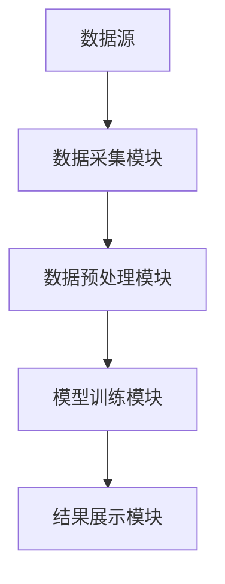

                 


# AI Agent在企业客户画像与细分中的应用

## 关键词：
AI Agent, 客户画像, 客户细分, 机器学习, 数据挖掘, 企业应用, 算法实现

## 摘要：
本文深入探讨了AI Agent在企业客户画像与细分中的应用，详细介绍了AI Agent的核心概念、算法原理、系统架构设计以及项目实战。通过结合实际案例和数学模型，本文展示了如何利用AI Agent技术提升企业客户画像的精准度和客户细分的效率，为企业实现个性化服务和精准营销提供有力支持。

---

## 第一章: AI Agent与企业客户画像概述

### 1.1 AI Agent的基本概念与背景

#### 1.1.1 AI Agent的定义与核心原理
AI Agent（人工智能代理）是一种能够感知环境并采取行动以实现目标的智能系统。其核心原理包括：
- **感知**：通过传感器或数据输入获取环境信息。
- **决策**：基于感知信息，利用算法进行分析和决策。
- **行动**：根据决策结果执行操作，如发送邮件或更新数据库。

#### 1.1.2 企业客户画像与细分的背景
客户画像是通过对客户数据的分析，构建客户特征的虚拟形象，用于帮助企业更好地理解客户需求和行为。客户细分则是将客户按照某些共同特征进行分类的过程，是个性化服务和精准营销的基础。

#### 1.1.3 AI Agent在客户画像与细分中的作用
AI Agent能够通过机器学习算法自动分析客户数据，生成客户画像并进行细分，从而提高效率和准确性。

### 1.2 客户画像与细分的核心概念

#### 1.2.1 客户画像的构建方法
- **数据收集**：通过问卷、CRM系统等方式获取客户数据。
- **特征提取**：从数据中提取关键特征，如年龄、性别、消费习惯等。
- **数据可视化**：通过图表展示客户特征，便于理解。

#### 1.2.2 客户细分的策略与方法
- **聚类分析**：将客户按照相似性分组。
- **分类算法**：基于已有标签对客户进行分类。
- **混合模型**：结合聚类和分类方法，提高准确性。

#### 1.2.3 AI Agent在客户画像与细分中的作用
- **自动化分析**：AI Agent能够自动处理大量数据，生成客户画像。
- **动态更新**：根据实时数据动态调整客户画像和细分结果。

---

## 第二章: AI Agent的算法原理与实现

### 2.1 AI Agent的核心算法

#### 2.1.1 基于强化学习的AI Agent
- **定义**：通过试错学习，不断优化决策策略。
- **应用**：在复杂环境中，如游戏和机器人控制中表现优异。

#### 2.1.2 基于监督学习的AI Agent
- **定义**：通过标注数据进行训练，预测未来结果。
- **应用**：在分类任务中，如垃圾邮件识别中表现良好。

#### 2.1.3 基于无监督学习的AI Agent
- **定义**：通过发现数据中的结构和模式进行学习。
- **应用**：在聚类任务中，如客户细分中表现优异。

### 2.2 客户画像的生成算法

#### 2.2.1 数据预处理与特征选择
- **数据清洗**：去除噪声和缺失值。
- **特征选择**：通过统计方法或模型选择关键特征。

#### 2.2.2 基于聚类的客户画像生成
- **K-means算法**：将客户分为若干簇，每簇代表一类客户特征。
- **层次聚类**：通过层次结构展示客户之间的关系。

#### 2.2.3 基于深度学习的客户画像生成
- **神经网络**：通过多层网络提取高维特征。
- **自动编码器**：用于无监督特征学习。

### 2.3 客户细分的算法实现

#### 2.3.1 基于K-means的客户细分
- **步骤**：
  1. 初始化质心。
  2. 计算每个样本到质心的距离。
  3. 重新计算质心，直到收敛。

#### 2.3.2 基于决策树的客户细分
- **ID3算法**：基于信息增益选择特征。
- **CART算法**：用于分类和回归树的构建。

#### 2.3.3 基于随机森林的客户细分
- **优势**：能够处理高维数据，鲁棒性强。
- **实现**：通过投票机制进行分类。

---

## 第三章: AI Agent的系统架构设计

### 3.1 系统架构设计

#### 3.1.1 功能模块划分
- **数据采集模块**：负责数据的获取和预处理。
- **模型训练模块**：负责客户画像和细分的算法实现。
- **结果展示模块**：以可视化方式呈现客户画像和细分结果。

#### 3.1.2 系统架构图


#### 3.1.3 系统架构的可扩展性设计
- **模块化设计**：每个模块独立，便于维护和扩展。
- **接口设计**：通过API实现模块之间的通信。

### 3.2 系统功能设计

#### 3.2.1 数据采集模块
- **数据来源**：数据库、API、文件等。
- **数据格式**：结构化数据和非结构化数据。

#### 3.2.2 数据预处理模块
- **数据清洗**：去除无效数据。
- **特征工程**：提取和转换特征。

#### 3.2.3 模型训练模块
- **算法选择**：根据任务选择合适的算法。
- **模型调优**：通过交叉验证优化模型参数。

#### 3.2.4 结果展示模块
- **可视化**：通过图表展示客户画像和细分结果。
- **交互式分析**：用户可以通过界面与模型交互。

---

## 第四章: AI Agent在企业客户细分中的实战

### 4.1 项目背景与目标
- **背景**：某电商平台希望通过客户细分实现精准营销。
- **目标**：利用AI Agent技术生成客户画像并进行细分。

### 4.2 项目实施步骤

#### 4.2.1 数据准备
- **数据收集**：收集客户的基本信息、消费记录等。
- **数据预处理**：清洗和转换数据。

#### 4.2.2 模型训练
- **算法选择**：选择K-means算法进行客户细分。
- **模型训练**：通过聚类算法生成客户簇。

#### 4.2.3 结果分析
- **簇的解释**：根据簇的特征进行客户分组。
- **效果评估**：通过 silhouette score 评估聚类效果。

#### 4.2.4 系统实现
- **环境搭建**：安装Python、scikit-learn等库。
- **代码实现**：
  ```python
  from sklearn.cluster import KMeans
  import pandas as pd

  # 数据预处理
  df = pd.read_csv('customer_data.csv')
  X = df[['age', 'income', 'purchase_frequency']]

  # 模型训练
  kmeans = KMeans(n_clusters=3, random_state=42)
  kmeans.fit(X)
  labels = kmeans.predict(X)

  # 结果展示
  print(labels)
  ```

#### 4.2.5 案例分析
- **案例1**：生成客户画像。
- **案例2**：进行客户细分并制定营销策略。

---

## 第五章: 总结与展望

### 5.1 总结
本文详细介绍了AI Agent在企业客户画像与细分中的应用，从算法原理到系统设计，再到项目实战，全面展示了AI Agent的优势和潜力。

### 5.2 展望
未来，随着AI技术的不断发展，AI Agent在客户画像与细分中的应用将更加广泛和深入，为企业创造更大的价值。

---

## 作者：
AI天才研究院/AI Genius Institute  
禅与计算机程序设计艺术/Zen And The Art of Computer Programming

