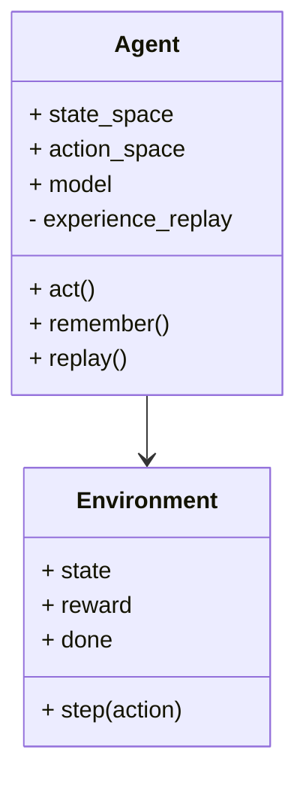
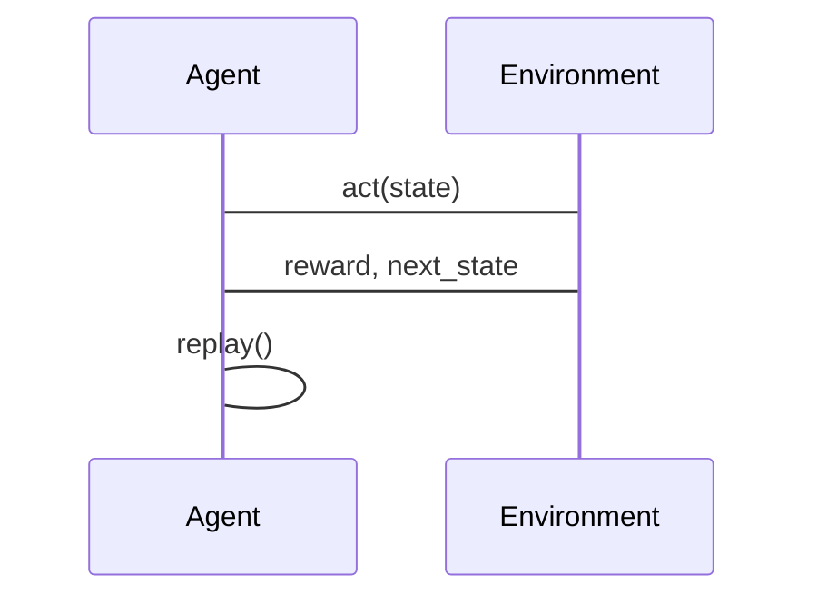

                 


# AI Agent 在企业数字化转型中的核心作用

> 关键词：AI Agent, 数字化转型, 企业智能化, 人工智能, 系统架构设计, 项目实战

> 摘要：本文详细探讨了AI Agent在企业数字化转型中的核心作用，从AI Agent的基本概念、核心原理到算法实现、系统架构设计，再到项目实战和最佳实践，为读者提供了全面而深入的分析。通过实际案例和详细的技术解读，本文帮助企业在数字化转型中更好地理解和应用AI Agent技术。

---

## 第1章: AI Agent 的基本概念与背景

### 1.1 AI Agent 的定义与特点

AI Agent（人工智能代理）是指能够感知环境并采取行动以实现目标的智能实体。它不同于传统的软件程序，具备自主性、反应性、目标导向性和社会性等核心特点。

- **自主性**：AI Agent能够在没有外部干预的情况下独立运行。
- **反应性**：能够实时感知环境变化并做出响应。
- **目标导向性**：具备明确的目标，并通过行动实现目标。
- **社会性**：能够与其他AI Agent或人类进行交互和协作。

AI Agent的应用场景广泛，包括智能助手、自动化系统、推荐系统等。

### 1.2 AI Agent 的发展历程

AI Agent的概念可以追溯到20世纪60年代，经历了以下几个阶段：

1. **早期阶段（20世纪60年代-80年代）**：AI Agent的概念初步提出，主要用于解决简单的自动化问题。
2. **发展阶段（20世纪90年代-2010年）**：随着机器学习和自然语言处理技术的进步，AI Agent的能力逐步增强。
3. **智能化阶段（2010年至今）**：深度学习和强化学习的引入，使得AI Agent具备了更强大的自主决策和学习能力。

### 1.3 AI Agent 在企业数字化转型中的作用

数字化转型是指企业利用数字技术优化业务流程、提高效率、创新商业模式的过程。AI Agent在其中扮演了关键角色：

- **提升效率**：通过自动化处理重复性任务，减少人工干预。
- **增强决策能力**：通过数据分析和预测，帮助企业做出更明智的决策。
- **优化用户体验**：通过智能化的交互设计，提升用户的满意度。

---

## 第2章: AI Agent 的核心原理与技术基础

### 2.1 AI Agent 的核心原理

AI Agent的核心原理包括知识表示、推理、计划与决策等方面：

- **知识表示**：将现实世界中的知识表示为数据结构，以便计算机理解和处理。
- **推理**：基于知识库进行逻辑推理，得出新的结论。
- **计划与决策**：根据目标和环境状态，制定行动计划并执行。

### 2.2 AI Agent 的技术基础

AI Agent的技术基础主要包括机器学习、自然语言处理和强化学习：

- **机器学习**：用于模式识别和数据分类。
- **自然语言处理**：用于理解和生成人类语言。
- **强化学习**：用于动态环境下的决策优化。

### 2.3 AI Agent 的设计方法

AI Agent的设计方法包括基于规则、基于模型和基于数据驱动三种：

- **基于规则**：通过预定义的规则进行决策。
- **基于模型**：通过建立数学模型进行预测和决策。
- **基于数据驱动**：通过大量数据训练模型，使其具备自适应能力。

---

## 第3章: AI Agent 的算法原理与实现

### 3.1 AI Agent 的主流算法

AI Agent的主流算法包括强化学习、监督学习和无监督学习：

- **强化学习**：通过与环境交互，学习最优策略。
- **监督学习**：通过标记数据进行分类和回归。
- **无监督学习**：通过数据聚类和降维发现潜在模式。

### 3.2 AI Agent 的算法实现

AI Agent的算法实现需要考虑以下几个步骤：

1. **数据预处理**：清洗和特征工程。
2. **模型训练**：选择合适的算法并进行训练。
3. **模型评估**：通过测试数据评估模型性能。
4. **模型优化**：调整超参数以提高性能。

以下是强化学习的伪代码实现：

```python
class Agent:
    def __init__(self, state_space, action_space):
        self.state_space = state_space
        self.action_space = action_space
        self.model = self.build_model()

    def build_model(self):
        # 构建神经网络模型
        pass

    def act(self, state):
        # 根据当前状态选择动作
        pass

    def remember(self, state, action, reward, next_state):
        # 存储经验
        pass

    def replay(self):
        # 重放经验并训练模型
        pass
```

### 3.3 AI Agent 的算法优化

为了提高AI Agent的性能，可以采用以下优化方法：

1. **经验重放**：通过存储历史经验，避免重复学习。
2. **策略优化**：通过优化策略函数，提高决策能力。
3. **多任务学习**：同时学习多个任务，提升模型的泛化能力。

---

## 第4章: AI Agent 的系统架构与设计

### 4.1 AI Agent 的系统架构

AI Agent的系统架构可以分为模块化、服务化和微服务三种：

- **模块化架构**：将系统划分为独立的功能模块，便于维护和扩展。
- **服务化架构**：通过服务化设计，实现模块之间的松耦合。
- **微服务架构**：将系统划分为多个微服务，实现高可用性和可扩展性。

### 4.2 AI Agent 的系统设计

AI Agent的系统设计需要考虑以下几个方面：

1. **需求分析**：明确系统的目标和功能。
2. **功能设计**：设计系统的主要功能模块。
3. **交互设计**：设计用户与系统之间的交互界面。

以下是系统功能模块的类图：



### 4.3 AI Agent 的系统实现

AI Agent的系统实现需要考虑以下几个步骤：

1. **环境搭建**：安装必要的开发工具和库。
2. **功能实现**：实现AI Agent的核心功能。
3. **接口设计**：设计系统与其他模块的接口。

以下是系统交互的序列图：



---

## 第5章: AI Agent 的项目实战

### 5.1 项目背景与目标

本项目旨在通过实现一个简单的AI Agent，展示其在企业数字化转型中的应用。项目目标包括：

1. **实现一个AI Agent**：具备基本的感知和决策能力。
2. **验证算法的可行性**：通过实验验证算法的有效性。
3. **展示应用场景**：通过实际案例展示AI Agent的应用价值。

### 5.2 项目实施步骤

1. **环境搭建**：安装Python、TensorFlow等必要的库。
2. **数据准备**：收集和整理训练数据。
3. **模型训练**：选择合适的算法并进行训练。
4. **模型评估**：通过测试数据评估模型性能。
5. **系统部署**：将模型部署到实际环境中。

### 5.3 项目核心代码实现

以下是强化学习算法的核心代码：

```python
import numpy as np
import tensorflow as tf

class Agent:
    def __init__(self, state_size, action_size):
        self.state_size = state_size
        self.action_size = action_size
        self.model = self._build_model()

    def _build_model(self):
        model = tf.keras.Sequential()
        model.add(tf.keras.layers.Dense(24, input_dim=self.state_size, activation='relu'))
        model.add(tf.keras.layers.Dense(self.action_size, activation='linear'))
        model.compile(loss='mse', optimizer=tf.keras.optimizers.Adam(lr=0.01))
        return model

    def act(self, state):
        state = np.array(state)
        prediction = self.model.predict(state)
        return np.argmax(prediction[0])

    def remember(self, state, action, reward, next_state):
        # 简单的内存实现
        pass

    def replay(self, batch_size):
        # 简单的重放实现
        pass
```

### 5.4 项目案例分析与总结

通过实验，我们发现强化学习算法在动态环境中表现优异，但在静态环境中可能需要更多的优化。因此，在实际应用中，需要根据具体场景选择合适的算法。

---

## 第6章: AI Agent 的最佳实践与小结

### 6.1 最佳实践

1. **明确目标**：在实施AI Agent之前，明确系统的目标和功能。
2. **选择合适的算法**：根据具体场景选择合适的算法。
3. **优化系统架构**：通过模块化和微服务设计提高系统的可维护性和扩展性。
4. **持续优化**：通过实验和反馈不断优化模型和系统。

### 6.2 小结

AI Agent在企业数字化转型中具有重要的作用，能够帮助企业提升效率、增强决策能力和优化用户体验。通过本文的介绍，读者可以深入了解AI Agent的核心原理、算法实现和系统设计，并能够在实际项目中加以应用。

---

## 附录: 工具推荐与参考文献

- **工具推荐**：
  - TensorFlow：深度学习框架。
  - PyTorch：深度学习框架。
  - OpenAI Gym：强化学习环境。

- **参考文献**：
  - 《机器学习实战》
  - 《深度学习》
  - 《强化学习》

---

作者：AI天才研究院/AI Genius Institute & 禅与计算机程序设计艺术 /Zen And The Art of Computer Programming

