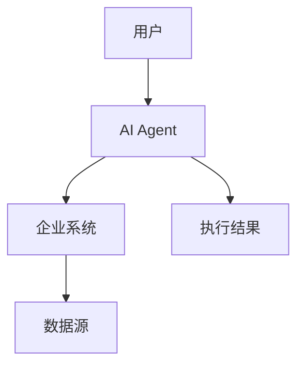
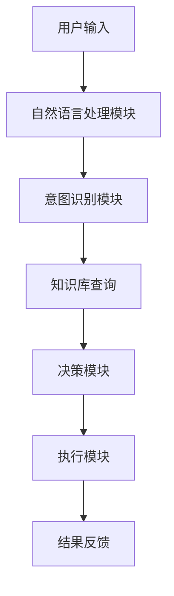
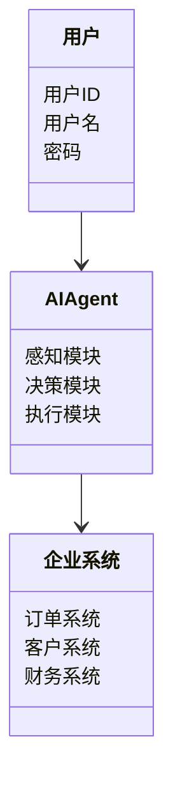
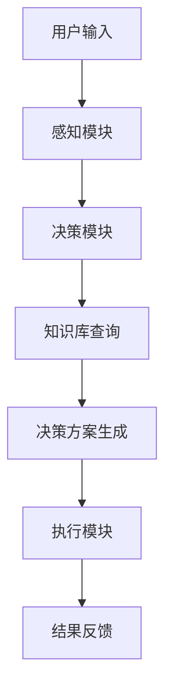
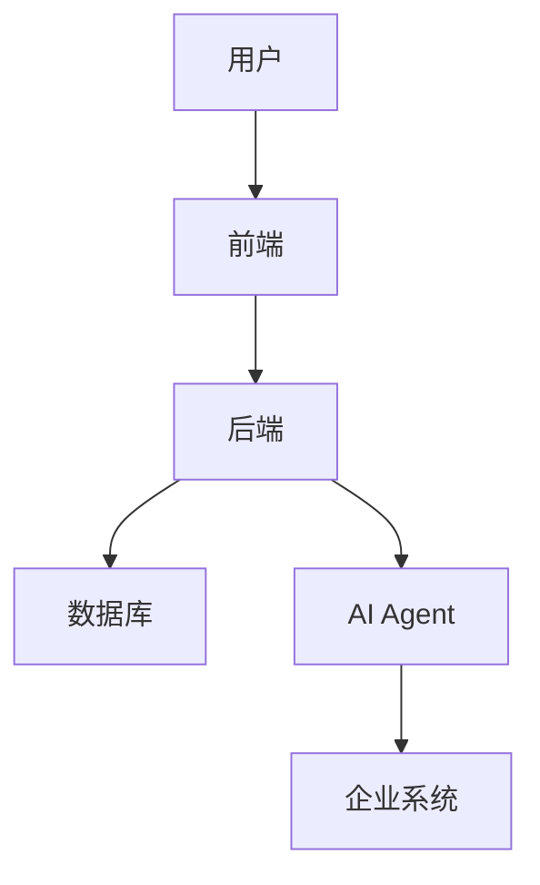
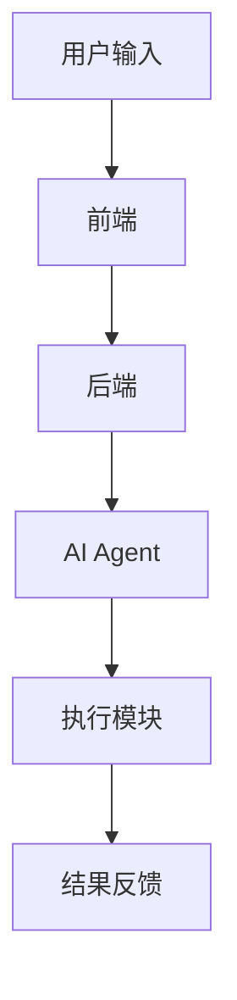

                 


# AI Agent在企业数字化转型中的核心驱动作用

## 关键词：
- AI Agent
- 数字化转型
- 企业系统
- 算法原理
- 系统架构设计

## 摘要：
本文深入探讨了AI Agent在企业数字化转型中的核心作用，分析了其在企业中的应用场景、核心原理、系统架构设计以及实现过程。通过理论与实践相结合的方式，详细讲解了AI Agent如何驱动企业数字化转型，为企业提供了一套完整的解决方案。

---

# 第一部分: AI Agent与企业数字化转型的背景介绍

# 第1章: AI Agent的核心概念与数字化转型背景

## 1.1 AI Agent的基本概念

### 1.1.1 AI Agent的定义与特点

AI Agent（人工智能代理）是指能够感知环境、自主决策并执行任务的智能体。与传统自动化工具相比，AI Agent具有以下特点：

- **智能性**：能够理解和处理复杂的信息，做出合理决策。
- **自主性**：无需人工干预，能够自主执行任务。
- **适应性**：能够根据环境变化调整行为。
- **交互性**：能够与用户或其他系统进行交互。

### 1.1.2 AI Agent的核心要素与组成

AI Agent的核心组成包括以下部分：

| 组成部分 | 描述 |
|----------|------|
| **感知模块** | 用于接收外部输入，如用户指令或环境数据。 |
| **决策模块** | 根据感知到的信息，进行分析和决策。 |
| **执行模块** | 根据决策结果，执行具体操作。 |
| **知识库** | 包含AI Agent所需的知识和经验。 |
| **学习模块** | 用于不断优化AI Agent的行为和决策能力。 |

### 1.1.3 AI Agent与传统自动化工具的区别

AI Agent与传统自动化工具的主要区别如下：

| 方面 | AI Agent | 传统自动化工具 |
|------|----------|----------------|
| **智能性** | 高 | 低 |
| **自主性** | 高 | 低 |
| **适应性** | 高 | 低 |
| **决策能力** | 强 | 弱 |

## 1.2 数字化转型的背景与挑战

### 1.2.1 数字化转型的定义与目标

数字化转型是指利用数字技术对业务模式、流程、文化等进行根本性改变，以实现业务创新和效率提升。其目标包括：

- 提高企业运营效率。
- 改善客户体验。
- 降低成本。
- 提升创新能力。

### 1.2.2 企业数字化转型中的主要挑战

企业在数字化转型过程中面临的主要挑战包括：

| 挑战 | 描述 |
|------|------|
| **技术复杂性** | 需要整合多种数字技术，技术集成难度大。 |
| **数据孤岛** | 数据分散在不同系统中，难以统一管理和分析。 |
| **员工适应性** | 员工对新技术的接受和适应需要时间。 |
| **安全风险** | 数字化转型可能导致数据泄露和网络安全风险。 |

### 1.2.3 AI Agent在数字化转型中的角色定位

AI Agent在数字化转型中扮演着关键角色，主要体现在以下几个方面：

1. **自动化业务流程**：AI Agent可以自动处理重复性任务，提高效率。
2. **智能决策支持**：通过分析数据，AI Agent可以为企业提供决策支持。
3. **客户交互**：AI Agent可以作为客服，与客户进行交互，提升客户体验。
4. **持续优化**：AI Agent能够根据反馈不断优化自身的行为和决策。

## 1.3 本章小结

本章从AI Agent的基本概念出发，分析了其在企业数字化转型中的作用，并总结了数字化转型的主要挑战和AI Agent在其中的关键角色。

---

# 第二部分: AI Agent的核心概念与原理

# 第2章: AI Agent的核心原理与工作流程

## 2.1 AI Agent的基本原理

### 2.1.1 AI Agent的感知机制

AI Agent的感知机制是其获取信息的关键步骤，主要包括以下几种方式：

| 感知方式 | 描述 |
|----------|------|
| **用户输入** | 通过用户指令获取需求。 |
| **系统数据** | 从企业系统中获取数据。 |
| **环境反馈** | 通过与环境的交互获取反馈信息。 |

### 2.1.2 AI Agent的决策逻辑

AI Agent的决策逻辑是基于感知到的信息，通过分析和推理，生成相应的决策。主要步骤包括：

1. **信息分析**：对感知到的信息进行处理和分析。
2. **决策推理**：基于知识库和规则，生成决策方案。
3. **方案优化**：对多个决策方案进行评估，选择最优方案。

### 2.1.3 AI Agent的执行过程

AI Agent的执行过程是将决策转化为具体操作的步骤，主要包括：

1. **任务分解**：将复杂任务分解为简单任务。
2. **任务执行**：按照分解后的任务执行操作。
3. **结果反馈**：将执行结果反馈给感知模块，用于后续优化。

## 2.2 AI Agent的核心算法与技术

### 2.2.1 机器学习算法在AI Agent中的应用

机器学习算法在AI Agent中的应用主要体现在以下几个方面：

- **分类**：用于识别和分类问题，如客户分类。
- **回归**：用于预测连续型数据，如销售预测。
- **聚类**：用于将数据分成不同的类别，如客户分群。

### 2.2.2 自然语言处理在AI Agent中的应用

自然语言处理（NLP）在AI Agent中的应用主要体现在以下几个方面：

- **意图识别**：识别用户的意图，如“我需要查询订单状态”。
- **实体识别**：从文本中提取关键信息，如订单号、客户姓名等。
- **对话生成**：生成自然的对话回复，提升客户交互体验。

### 2.2.3 强化学习在AI Agent中的应用

强化学习在AI Agent中的应用主要体现在以下几个方面：

- **策略优化**：通过不断试错，优化决策策略。
- **游戏AI**：在游戏场景中，AI Agent可以通过强化学习提升游戏水平。
- **机器人控制**：用于机器人路径规划和动作控制。

## 2.3 AI Agent的实体关系与系统架构

### 2.3.1 ER实体关系图

以下是AI Agent的实体关系图：



### 2.3.2 系统架构图

以下是AI Agent的系统架构图：



## 2.4 本章小结

本章详细讲解了AI Agent的核心原理，包括其感知、决策和执行过程，并介绍了机器学习、自然语言处理和强化学习在AI Agent中的应用，以及系统的实体关系和架构设计。

---

# 第三部分: AI Agent的算法原理与实现

# 第3章: AI Agent的算法原理

## 3.1 AI Agent的核心算法

### 3.1.1 机器学习算法

机器学习算法在AI Agent中的应用非常广泛，主要包括以下几种：

- **支持向量机（SVM）**：用于分类问题。
- **决策树**：用于分类和回归问题。
- **随机森林**：用于分类、回归和聚类问题。
- **神经网络**：用于复杂模式识别问题。

### 3.1.2 自然语言处理算法

自然语言处理算法在AI Agent中的应用主要包括：

- **词袋模型**：用于文本表示。
- **TF-IDF**：用于关键词提取。
- **LSTM**：用于序列建模和生成。

### 3.1.3 强化学习算法

强化学习算法在AI Agent中的应用主要包括：

- **Q-Learning**：用于状态-动作-奖励模型。
- **Deep Q-Networks（DQN）**：用于复杂环境下的决策。
- **Policy Gradient Methods**：用于策略优化。

## 3.2 算法实现流程

### 3.2.1 数据预处理

数据预处理是机器学习算法实现中的关键步骤，主要包括：

1. **数据清洗**：去除噪声数据，处理缺失值。
2. **特征提取**：从数据中提取有用的特征。
3. **数据转换**：将数据转换为适合算法处理的形式。

### 3.2.2 模型训练

模型训练是通过数据训练出一个能够完成特定任务的模型，主要步骤包括：

1. **选择算法**：根据任务需求选择合适的算法。
2. **参数初始化**：初始化模型参数。
3. **前向传播**：将输入数据通过模型生成预测结果。
4. **计算损失**：计算预测结果与真实结果之间的误差。
5. **反向传播**：通过梯度下降等方法更新模型参数。
6. **迭代训练**：重复前向传播和反向传播，直到模型收敛。

### 3.2.3 模型部署

模型部署是将训练好的模型应用到实际场景中，主要包括：

1. **接口设计**：设计模型的输入和输出接口。
2. **集成测试**：对模型进行测试，确保其正常运行。
3. **上线部署**：将模型部署到生产环境中。

## 3.3 算法实现的数学模型

### 3.3.1 机器学习模型的数学公式

$$ y = w x + b $$

其中，\( y \) 是输出，\( w \) 是权重，\( x \) 是输入，\( b \) 是偏置。

### 3.3.2 自然语言处理模型的数学公式

$$ P(word|context) = \frac{P(word, context)}{P(context)} $$

其中，\( P(word|context) \) 是在给定上下文的情况下，词的概率。

### 3.3.3 强化学习模型的数学公式

$$ Q(s, a) = r + \gamma \max_{a'} Q(s', a') $$

其中，\( Q(s, a) \) 是状态-动作对的价值，\( r \) 是奖励，\( \gamma \) 是折扣因子，\( a' \) 是下一个动作。

## 3.4 本章小结

本章详细讲解了AI Agent中常用的核心算法，包括机器学习、自然语言处理和强化学习，并介绍了算法实现的流程和数学模型。

---

# 第四部分: AI Agent的系统分析与架构设计

# 第4章: 系统分析与架构设计

## 4.1 系统功能设计

### 4.1.1 领域模型设计

以下是AI Agent的领域模型图：



### 4.1.2 系统功能模块

AI Agent的系统功能模块包括：

| 功能模块 | 描述 |
|----------|------|
| **感知模块** | 接收用户输入或系统反馈。 |
| **决策模块** | 基于感知信息生成决策方案。 |
| **执行模块** | 根据决策方案执行具体操作。 |
| **知识库** | 存储AI Agent所需的知识和经验。 |

### 4.1.3 交互流程

以下是AI Agent的交互流程图：



## 4.2 系统架构设计

### 4.2.1 系统架构图

以下是AI Agent的系统架构图：



### 4.2.2 接口设计

AI Agent的接口设计包括以下几种：

| 接口名称 | 描述 | 输入 | 输出 |
|----------|------|------|------|
| **start** | 启动AI Agent | 无 | 无 |
| **process** | 处理用户输入 | 用户指令 | 处理结果 |
| **stop** | 停止AI Agent | 无 | 无 |

### 4.2.3 交互流程

以下是AI Agent的交互流程图：



## 4.3 本章小结

本章详细讲解了AI Agent的系统功能设计、架构设计和接口设计，并通过流程图展示了系统的交互流程。

---

# 第五部分: AI Agent的项目实战

# 第5章: 项目实战

## 5.1 环境安装

### 5.1.1 安装Python

```bash
python --version
pip install --upgrade pip
```

### 5.1.2 安装必要的库

```bash
pip install numpy
pip install scikit-learn
pip install transformers
```

## 5.2 核心代码实现

### 5.2.1 感知模块

```python
class PerceptionModule:
    def __init__(self):
        self.sensors = []

    def add_sensor(self, sensor):
        self.sensors.append(sensor)

    def perceive(self):
        data = []
        for sensor in self.sensors:
            data.append(sensor.measure())
        return data
```

### 5.2.2 决策模块

```python
class DecisionModule:
    def __init__(self):
        self.rules = []

    def add_rule(self, rule):
        self.rules.append(rule)

    def decide(self, input_data):
        for rule in self.rules:
            if rule.apply(input_data):
                return rule.action
        return None
```

### 5.2.3 执行模块

```python
class ExecutionModule:
    def __init__(self):
        pass

    def execute(self, action):
        # 执行具体操作
        pass
```

### 5.2.4 知识库

```python
class KnowledgeBase:
    def __init__(self):
        self.data = {}

    def add_entry(self, key, value):
        self.data[key] = value

    def get_entry(self, key):
        return self.data.get(key, None)
```

## 5.3 项目小结

本章通过实际项目案例，详细讲解了AI Agent的环境安装和核心代码实现，展示了如何将理论应用于实践。

---

# 第六部分: 最佳实践与总结

# 第6章: 最佳实践与总结

## 6.1 最佳实践

### 6.1.1 模型优化

- 使用交叉验证优化模型参数。
- 使用网格搜索寻找最优参数组合。

### 6.1.2 安全管理

- 对敏感数据进行加密处理。
- 定期进行安全审计和漏洞扫描。

### 6.1.3 性能监控

- 实时监控系统性能。
- 定期生成性能报告。

## 6.2 小结

通过本文的讲解，我们深入探讨了AI Agent在企业数字化转型中的核心作用，分析了其在企业中的应用场景、核心原理、系统架构设计以及实现过程。

## 6.3 注意事项

- 在实际应用中，需注意数据隐私和安全问题。
- 需定期更新模型，以适应环境变化。
- 需提供良好的用户交互界面，提升用户体验。

## 6.4 拓展阅读

- 《机器学习实战》
- 《深度学习》
- 《自然语言处理入门》

---

# 作者

作者：AI天才研究院/AI Genius Institute & 禅与计算机程序设计艺术 /Zen And The Art of Computer Programming

