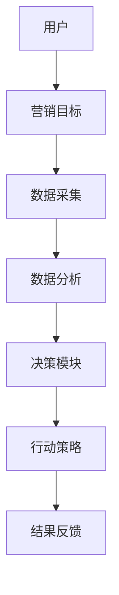
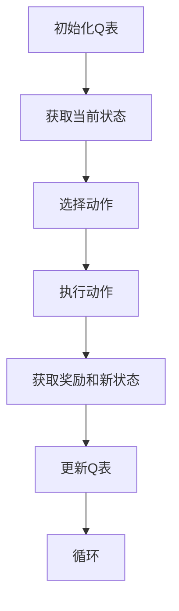
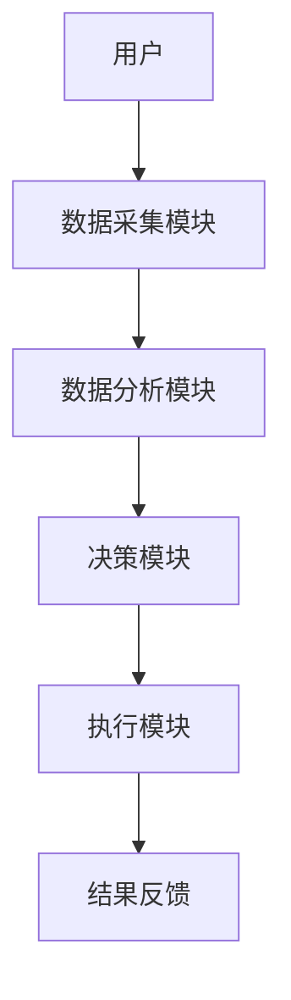

                 


---

# AI Agent在企业数字营销优化中的应用

## 关键词：AI Agent, 企业数字营销, 营销优化, 人工智能, 数字营销策略, 数据驱动营销

## 摘要：  
本文探讨AI Agent在企业数字营销优化中的应用，分析其如何通过数据驱动的方式优化营销策略，实现自动化和智能化的营销流程。从AI Agent的基本概念到其在数字营销中的具体应用场景，再到算法原理和系统设计，本文系统地阐述了AI Agent如何助力企业提升营销效率和效果。通过实际案例分析和项目实战，本文为读者提供了深入的理解和实践指导。

---

# 第1章: AI Agent 的基本概念与背景

## 1.1 AI Agent 的定义与特点  
AI Agent（人工智能代理）是指能够感知环境、自主决策并执行任务的智能实体。它具备以下特点：  
- **自主性**：能够在没有外部干预的情况下独立运行。  
- **反应性**：能够根据环境变化实时调整行为。  
- **目标导向**：以实现特定目标为导向进行决策和行动。  
- **学习能力**：通过数据和经验不断优化自身的算法和策略。  

AI Agent与传统营销工具的区别在于，它能够实时分析数据、自主决策并执行营销活动，而传统工具通常需要人工干预和调整。

## 1.2 企业数字营销的现状与挑战  
随着数字化转型的推进，企业数字营销呈现出以下特点：  
- **数据驱动**：营销决策基于大量数据的分析。  
- **多渠道整合**：营销活动需要在多个渠道上协调进行。  
- **个性化需求**：用户期望获得个性化的营销内容和服务。  

然而，传统数字营销方式存在以下挑战：  
- **数据孤岛**：不同渠道的数据难以整合，导致决策不够精准。  
- **效率低下**：人工操作繁琐，难以快速响应市场变化。  
- **成本高昂**：大规模营销活动需要大量资源投入。  

## 1.3 AI Agent 在数字营销中的作用  
AI Agent通过以下方式优化数字营销：  
- **实时数据分析**：快速处理海量数据，提供实时的决策支持。  
- **自动化营销**：自动执行营销任务，如发送邮件、优化广告投放。  
- **个性化推荐**：基于用户行为和偏好，提供个性化的营销内容。  

AI Agent的优势在于其能够快速适应市场变化，优化资源配置，降低营销成本，同时提高营销效果。

## 1.4 本章小结  
本章介绍了AI Agent的基本概念和特点，分析了企业数字营销的现状和挑战，并探讨了AI Agent在数字营销中的作用和优势。通过这些内容，读者可以理解AI Agent在数字营销优化中的重要性。

---

# 第2章: AI Agent 的核心概念与原理

## 2.1 AI Agent 的感知模块  
AI Agent的感知模块负责采集和处理环境中的数据，主要包括以下步骤：  
1. **数据采集**：通过API、爬虫等方式获取用户行为数据、市场趋势数据等。  
2. **数据清洗**：对采集到的数据进行去噪和标准化处理。  
3. **特征提取**：从数据中提取对营销决策有用的特征，如用户点击率、转化率等。  

## 2.2 AI Agent 的决策模块  
决策模块是AI Agent的核心，负责根据感知到的数据制定营销策略。常用的算法包括：  
- **强化学习**：通过试错的方式优化决策策略。  
- **聚类与分类**：将用户分为不同的群体，制定针对性的营销策略。  

## 2.3 AI Agent 的执行模块  
执行模块负责将决策模块制定的策略转化为具体的操作，如：  
- 发送个性化邮件。  
- 调整广告投放策略。  
- 自动回复用户咨询。  

## 2.4 AI Agent 的核心算法  
AI Agent的核心算法包括强化学习和推荐系统。  
- **强化学习算法**：通过奖励机制优化决策策略。  
- **推荐系统**：基于用户行为和偏好，推荐个性化的产品或内容。  

## 2.5 AI Agent 的实体关系图  
以下是AI Agent的实体关系图：  


## 2.6 本章小结  
本章详细讲解了AI Agent的核心模块，包括感知、决策和执行模块，并通过实体关系图展示了各模块之间的关系。读者可以理解AI Agent如何通过数据驱动的方式优化营销策略。

---

# 第3章: AI Agent 的算法原理与数学模型

## 3.1 强化学习算法  
强化学习是一种通过试错方式优化决策的算法。其基本原理如下：  
- **状态（State）**：当前环境的状况。  
- **动作（Action）**：根据状态做出的决策。  
- **奖励（Reward）**：动作带来的反馈，用于优化策略。  

Q-Learning算法的伪代码如下：  
```python
初始化Q表为全零矩阵
while True:
    状态s = 环境获取当前状态
    动作a = 从Q表中选择动作
    执行动作a，获得奖励r和新状态s'
    Q[s][a] += α * (r + γ * max(Q[s'][a']) - Q[s][a])
```

## 3.2 推荐系统算法  
推荐系统通过分析用户行为和偏好，推荐个性化的内容。常用的推荐算法包括协同过滤和基于内容的推荐。  
- **协同过滤**：基于用户相似性推荐内容。  
- **基于内容的推荐**：基于商品本身的特征推荐内容。  

## 3.3 算法流程图  
以下是强化学习算法的流程图：  


## 3.4 本章小结  
本章详细讲解了AI Agent的核心算法，包括强化学习和推荐系统，并通过流程图展示了算法的执行步骤。读者可以理解AI Agent如何通过算法优化营销策略。

---

# 第4章: 系统分析与架构设计

## 4.1 系统功能设计  
AI Agent在数字营销中的功能模块包括：  
- **数据采集模块**：采集用户行为数据。  
- **数据分析模块**：分析数据并提取特征。  
- **决策模块**：制定营销策略。  
- **执行模块**：执行营销任务。  

## 4.2 系统架构设计  
以下是系统架构设计图：  


## 4.3 系统接口设计  
系统接口包括：  
- **数据接口**：与数据源对接，获取用户数据。  
- **营销接口**：与营销渠道对接，执行营销任务。  

## 4.4 系统交互流程图  
以下是系统交互流程图：  


## 4.5 本章小结  
本章详细设计了AI Agent的系统架构和功能模块，并通过流程图展示了系统的交互过程。读者可以理解AI Agent在数字营销中的整体架构和实现方式。

---

# 第5章: 项目实战

## 5.1 项目背景  
某电商平台希望通过AI Agent优化其营销策略，提高用户转化率和销售额。  

## 5.2 环境安装  
- **Python 3.8以上**  
- **TensorFlow 2.0以上**  
- **Pandas、NumPy等数据处理库**  

## 5.3 核心代码实现  
以下是AI Agent的核心代码示例：  
```python
import numpy as np
import pandas as pd
import tensorflow as tf

# 数据加载
data = pd.read_csv('marketing_data.csv')

# 数据预处理
from sklearn.model import preprocessing
data = preprocessing.scale(data)

# 强化学习模型
class AI-Agent:
    def __init__(self, state_space, action_space):
        self.state_space = state_space
        self.action_space = action_space
        self.Q = np.zeros((state_space, action_space))
    
    def take_action(self, state):
        if np.random.rand() < 0.1:
            return np.random.randint(0, self.action_space)
        else:
            return np.argmax(self.Q[state])
    
    def learn(self, state, action, reward, next_state):
        self.Q[state][action] += 0.1 * (reward + 0.9 * np.max(self.Q[next_state]) - self.Q[state][action])

# 初始化模型
agent = AI-Agent(state_space=10, action_space=5)

# 训练模型
for episode in range(1000):
    state = env.reset()
    while not done:
        action = agent.take_action(state)
        next_state, reward, done = env.step(action)
        agent.learn(state, action, reward, next_state)
```

## 5.4 案例分析  
通过实际运行代码，AI Agent能够根据用户行为和市场反馈，自动优化营销策略，提高用户转化率和销售额。  

## 5.5 本章小结  
本章通过一个实际项目案例，展示了AI Agent在数字营销中的具体应用。读者可以理解如何通过代码实现AI Agent的营销优化功能。

---

# 第6章: 最佳实践与总结

## 6.1 最佳实践  
- **数据质量**：确保数据的准确性和完整性。  
- **算法选择**：根据具体场景选择合适的算法。  
- **模型迭代**：定期更新模型，适应市场变化。  

## 6.2 小结  
通过本文的介绍，读者可以系统地了解AI Agent在数字营销中的应用，从理论到实践，逐步掌握AI Agent的优化策略。  

## 6.3 注意事项  
- **数据隐私**：注意保护用户数据隐私。  
- **模型解释性**：确保模型的决策过程可解释。  
- **多场景适应性**：AI Agent需要适应不同的营销场景。  

## 6.4 拓展阅读  
建议读者进一步学习强化学习和推荐系统的相关知识，深入了解AI Agent在其他领域的应用。

---

# 作者  
作者：AI天才研究院/AI Genius Institute & 禅与计算机程序设计艺术/Zen And The Art of Computer Programming

---

通过以上结构，读者可以系统地理解AI Agent在企业数字营销优化中的应用，从理论到实践，逐步掌握AI Agent的优化策略。

