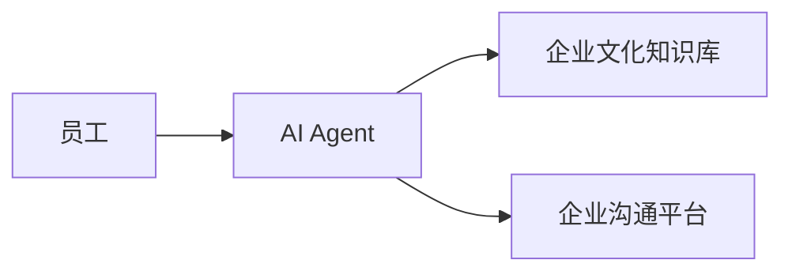
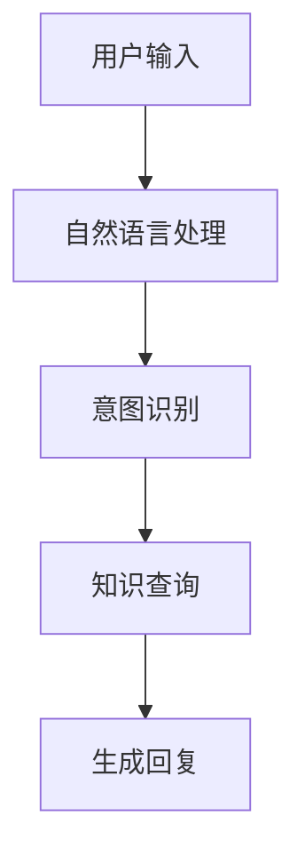
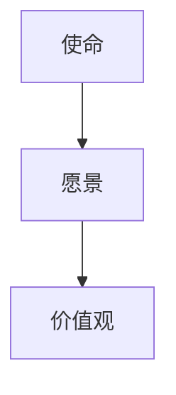
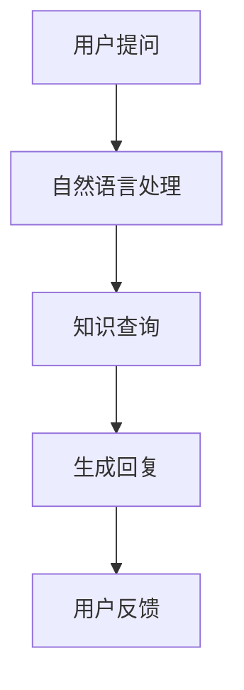

                 


# AI Agent在企业文化建设与内部沟通中的应用

## 关键词：AI Agent，企业文化，内部沟通，自然语言处理，企业知识库，决策支持，知识图谱

## 摘要：  
随着人工智能技术的快速发展，AI Agent（人工智能代理）在企业管理中的应用逐渐成为热点。本文探讨了AI Agent在企业文化建设与内部沟通中的应用价值，分析了其在企业沟通效率提升、文化传承与传播、员工行为规范引导等方面的作用。通过结合自然语言处理、知识图谱等技术，本文详细阐述了AI Agent在企业内部沟通中的实现原理，并通过实际案例展示了其在企业文化建设中的应用效果。本文还提出了基于AI Agent的企业沟通系统设计与实现方案，为企业在数字化转型中提供了新的思路。

---

# 正文

## 第一部分: AI Agent与企业文化建设的背景介绍

### 第1章: 问题背景与概念分析

#### 1.1 问题背景
企业内部沟通效率低下、文化传承不力、员工行为规范难以统一等问题一直是企业管理中的痛点。传统的企业沟通方式依赖于邮件、会议和公告，这种方式难以满足现代企业对高效、个性化和智能化沟通的需求。

#### 1.2 概念描述
AI Agent是一种能够理解用户需求、执行任务并提供反馈的智能代理系统。在企业文化建设与内部沟通中，AI Agent可以通过自然语言处理（NLP）技术与员工交互，帮助其完成信息查询、任务分配、文化宣传等工作。

#### 1.3 问题解决
AI Agent可以通过自动化处理企业内部信息，提升沟通效率；通过个性化的文化推送，增强员工对企业文化的认同感；通过实时反馈和行为引导，规范员工行为，提升企业执行力。

#### 1.4 边界与外延
AI Agent在企业沟通中的应用边界包括信息孤岛问题、数据隐私保护以及技术实现的复杂性。其外延则涉及与企业知识管理系统、决策支持系统的深度融合。

## 第二部分: AI Agent的核心概念与技术原理

### 第2章: AI Agent的技术原理

#### 2.1 AI Agent的核心技术
AI Agent的实现依赖于自然语言处理（NLP）、知识图谱构建、机器学习（ML）和对话生成等技术。其中，NLP用于理解用户意图，知识图谱用于存储企业文化知识，ML用于优化推荐算法。

#### 2.2 实体关系图
以下是一个简单的实体关系图，展示了AI Agent在企业沟通中的主要实体及其关系：


#### 2.3 决策流程图
AI Agent的决策流程如下：


### 第3章: 企业文化知识库的构建

#### 3.1 知识库构建流程
企业文化知识库的构建包括数据收集、数据清洗、知识抽取和知识存储四个步骤。

#### 3.2 知识抽取与表示
使用信息抽取技术从企业文档中提取关键信息，并将其表示为知识图谱的形式。例如，提取公司使命、愿景和价值观，并将其存储为图谱节点。

#### 3.3 知识图谱示例
以下是一个简单的知识图谱示例：


## 第三部分: AI Agent在内部沟通中的应用

### 第4章: 内部沟通系统的功能设计

#### 4.1 系统功能模块
内部沟通系统主要包括用户交互模块、知识查询模块、反馈优化模块和数据安全模块。

#### 4.2 功能流程图
以下是内部沟通系统的功能流程图：


### 第5章: 企业文化传播与行为引导

#### 5.1 企业文化传播
AI Agent可以通过个性化推送，向员工推送企业文化相关内容，增强员工的文化认同感。

#### 5.2 行为引导机制
通过实时反馈和奖励机制，引导员工遵守企业行为规范，提升员工的合规意识。

## 第四部分: 项目实战与系统实现

### 第6章: 系统实现方案

#### 6.1 环境安装
安装Python、TensorFlow、spaCy等开发工具。

#### 6.2 核心代码实现
以下是AI Agent的核心代码实现示例：
```python
def natural_language_processing(input_text):
    # 使用spaCy进行分词和实体识别
    doc = nlp(input_text)
    entities = [ent.text for ent in doc.ents]
    return entities

def knowledge_graph_query(entities):
    # 查询知识图谱中的相关信息
    results = knowledge_graph.query(entities)
    return results
```

#### 6.3 案例分析
通过一个实际案例，展示AI Agent在企业文化传播中的应用效果。

## 第五部分: 总结与展望

### 第7章: 总结
本文详细探讨了AI Agent在企业文化建设与内部沟通中的应用，分析了其技术实现和实际效果。

### 第8章: 展望
未来，随着AI技术的不断发展，AI Agent在企业管理中的应用将更加广泛，为企业创造更大的价值。

---

# 作者
作者：AI天才研究院（AI Genius Institute）  
联系邮箱：contact@aiguru.com  
官方网站：https://www.aiguru.com  

---

# 结语
通过本文的分析与探讨，我们相信AI Agent作为一项前沿技术，在企业文化建设与内部沟通中的应用将为企业管理带来新的突破。希望本文能够为相关领域的研究者和实践者提供有价值的参考。

