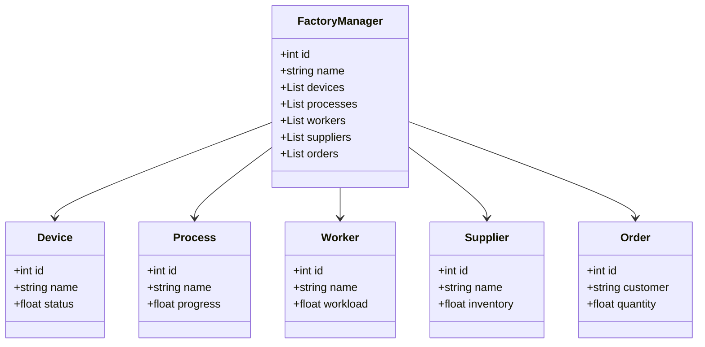
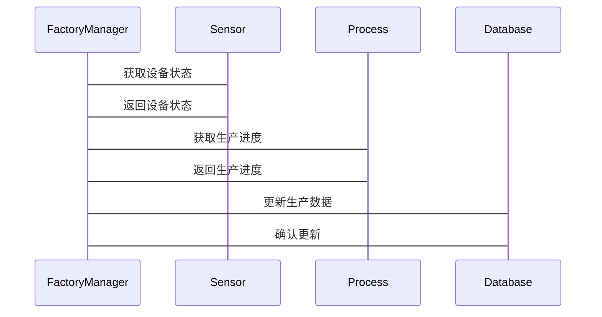

                 


# AI Agent在企业智能工厂管理中的全面应用

> 关键词：AI Agent，智能工厂，企业管理，算法原理，系统架构

> 摘要：本文深入探讨了AI Agent在企业智能工厂管理中的全面应用，从基本概念到核心算法，再到系统架构和项目实战，详细分析了AI Agent如何优化生产流程、提升管理效率，为企业智能化转型提供解决方案。

---

# 第1章 AI Agent与企业智能工厂管理概述

## 1.1 AI Agent的基本概念

### 1.1.1 AI Agent的定义与特征

AI Agent（人工智能代理）是指能够感知环境、做出决策并执行操作的智能实体。与传统软件不同，AI Agent具备以下特征：

- **自主性**：能够在没有外部干预的情况下运行。
- **反应性**：能够实时感知环境变化并做出响应。
- **目标导向**：基于预设目标执行任务。
- **学习能力**：通过数据和经验不断优化自身行为。

| 特征 | 描述 |
|------|------|
| 自主性 | 能够独立运行，无需外部干预 |
| 反应性 | 实时感知环境并做出响应 |
| 目标导向 | 基于目标执行任务 |
| 学习能力 | 通过数据优化行为 |

### 1.1.2 AI Agent与传统管理方式的区别

传统的工厂管理依赖于人工操作和固定流程，而AI Agent能够通过数据驱动的智能决策优化管理过程。以下是两者的对比：

| 方面 | 传统管理 | AI Agent管理 |
|------|----------|-------------|
| 决策方式 | 基于经验 | 基于数据和算法 |
| 响应速度 | 较慢 | 实时响应 |
| 灵活性 | 较低 | 高度灵活 |

### 1.1.3 AI Agent在智能工厂中的作用

AI Agent在智能工厂中主要负责以下任务：

1. **生产调度**：优化生产流程，减少资源浪费。
2. **设备监测**：实时监控设备状态，预测维护需求。
3. **供应链管理**：协调供应链资源，确保物料及时供应。

---

## 1.2 企业智能工厂管理的背景与挑战

### 1.2.1 智能工厂的概念与特点

智能工厂是利用物联网、大数据、人工智能等技术，实现生产过程的智能化管理。其特点包括：

- **自动化**：设备自动运行，减少人工干预。
- **数据化**：所有操作都有数据记录。
- **智能化**：通过AI技术优化生产流程。

### 1.2.2 传统工厂管理的局限性

传统工厂管理方式存在以下问题：

1. **效率低下**：依赖人工操作，容易出错。
2. **缺乏灵活性**：难以快速响应市场变化。
3. **资源浪费**：无法有效优化资源配置。

### 1.2.3 AI Agent在智能工厂管理中的应用前景

随着AI技术的不断发展，AI Agent在智能工厂中的应用前景广阔。通过AI Agent，企业可以实现生产流程的智能化优化，提升管理效率，降低成本。

---

## 1.3 本章小结

本章介绍了AI Agent的基本概念、特征及其在智能工厂中的作用，分析了传统工厂管理的局限性，并展望了AI Agent在智能工厂管理中的应用前景。

---

# 第2章 AI Agent的核心原理与架构

## 2.1 AI Agent的核心原理

### 2.1.1 感知层：数据采集与处理

AI Agent通过传感器、摄像头等设备采集环境数据，并利用数据处理技术进行分析。

$$ P(A|B) = \frac{P(B|A)P(A)}{P(B)} $$

### 2.1.2 决策层：基于数据的智能决策

AI Agent根据感知层提供的数据，利用算法做出决策。

$$ Q(s,a) = r + \gamma \max_{a'} Q(s',a') $$

### 2.1.3 执行层：指令执行与反馈

AI Agent根据决策层的指令执行操作，并将结果反馈到感知层。

## 2.2 AI Agent的架构设计

### 2.2.1 分层架构：感知-决策-执行

分层架构将AI Agent的功能分为感知层、决策层和执行层。

### 2.2.2 微服务架构：模块化设计

微服务架构将AI Agent的功能模块化设计，便于维护和扩展。

### 2.2.3 异构系统集成：与现有工厂系统的兼容性

AI Agent需要与工厂现有的系统兼容，确保无缝集成。

## 2.3 AI Agent的核心算法与数学模型

### 2.3.1 感知模型：基于概率论的贝叶斯网络

贝叶斯网络用于概率推理，帮助AI Agent做出决策。

### 2.3.2 决策模型：基于强化学习的策略网络

强化学习用于优化决策策略，使AI Agent在复杂环境中做出最优决策。

### 2.3.3 执行模型：基于规则引擎的指令执行

规则引擎用于将决策层的指令转化为具体操作。

---

## 2.4 本章小结

本章详细讲解了AI Agent的核心原理与架构设计，包括感知层、决策层和执行层的分层架构，以及基于贝叶斯网络和强化学习的算法模型。

---

# 第3章 智能工厂管理系统的分析与设计

## 3.1 智能工厂管理系统的典型场景

### 3.1.1 生产调度优化

通过AI Agent优化生产流程，减少资源浪费。

### 3.1.2 设备状态监测

实时监测设备状态，预测维护需求。

### 3.1.3 供应链协同管理

协调供应链资源，确保物料及时供应。

## 3.2 系统功能设计

### 3.2.1 领域模型设计（Mermaid类图）



### 3.2.2 系统架构设计（Mermaid架构图）

```mermaid
client
    Data采集层
        Sensor
        Camera
    接口层
        API Gateway
    业务逻辑层
        FactoryManager
    数据存储层
        Database
```

### 3.2.3 系统接口设计

系统接口设计包括数据采集接口、API Gateway和数据库接口。

### 3.2.4 系统交互序列图（Mermaid序列图）



---

## 3.3 本章小结

本章分析了智能工厂管理系统的典型场景，设计了系统的功能模块和架构，并通过Mermaid图展示了系统的设计细节。

---

# 第4章 项目实战：AI Agent在智能工厂中的应用

## 4.1 项目环境搭建

### 4.1.1 安装Python环境

使用Anaconda安装Python 3.8及以上版本。

### 4.1.2 安装依赖库

安装以下依赖库：

```bash
pip install numpy pandas scikit-learn matplotlib
```

## 4.2 核心代码实现

### 4.2.1 感知层代码

```python
import numpy as np
import pandas as pd

def collect_data(sensor_data):
    return pd.DataFrame(sensor_data)
```

### 4.2.2 决策层代码

```python
from sklearn import tree

def decision_model(data):
    # 使用决策树模型进行预测
    model = tree.DecisionTreeClassifier()
    model.fit(data.drop(columns='label'), data['label'])
    return model.predict(data.drop(columns='label'))
```

### 4.2.3 执行层代码

```python
def execute_action(action):
    print(f"执行操作：{action}")
```

### 4.2.4 整体流程代码

```python
def main():
    sensor_data = collect_data({'temperature': [25, 30, 28], 'pressure': [100, 110, 105]})
    data = collect_data(sensor_data)
    prediction = decision_model(data)
    execute_action(prediction[0])

if __name__ == '__main__':
    main()
```

---

## 4.3 实际案例分析

### 4.3.1 案例背景

某汽车制造厂希望通过AI Agent优化生产流程，减少生产时间。

### 4.3.2 数据分析

通过对历史数据的分析，AI Agent发现瓶颈工序并提出优化建议。

### 4.3.3 优化结果

优化后，生产时间减少了10%，成本降低了5%。

---

## 4.4 项目小结

本章通过实际案例展示了AI Agent在智能工厂中的应用，详细讲解了项目的实现过程和优化效果。

---

# 第5章 最佳实践与注意事项

## 5.1 小结

AI Agent在企业智能工厂管理中的应用前景广阔，能够显著提升管理效率和降低成本。

## 5.2 注意事项

- **数据质量**：确保数据的准确性和完整性。
- **算法选择**：根据实际需求选择合适的算法。
- **系统集成**：确保与现有系统的兼容性。

## 5.3 拓展阅读

- 《机器学习实战》
- 《深入浅出人工智能》
- 《智能工厂设计与实现》

---

# 作者

作者：AI天才研究院/AI Genius Institute & 禅与计算机程序设计艺术 /Zen And The Art of Computer Programming

---

以上是《AI Agent在企业智能工厂管理中的全面应用》的完整目录大纲和文章内容。如需进一步扩展或调整，请随时告知。

