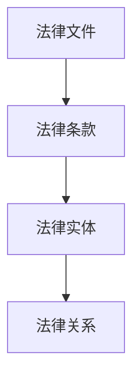
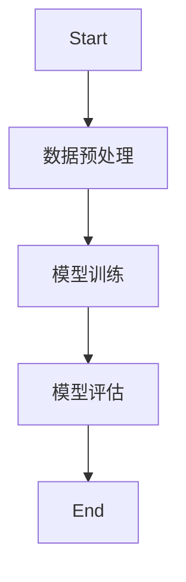
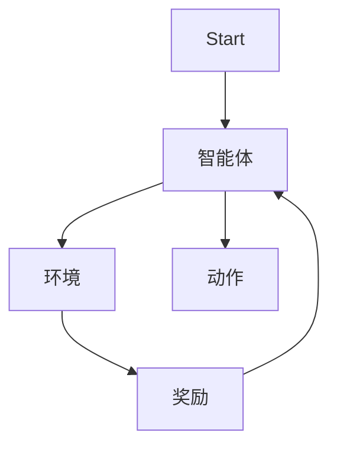
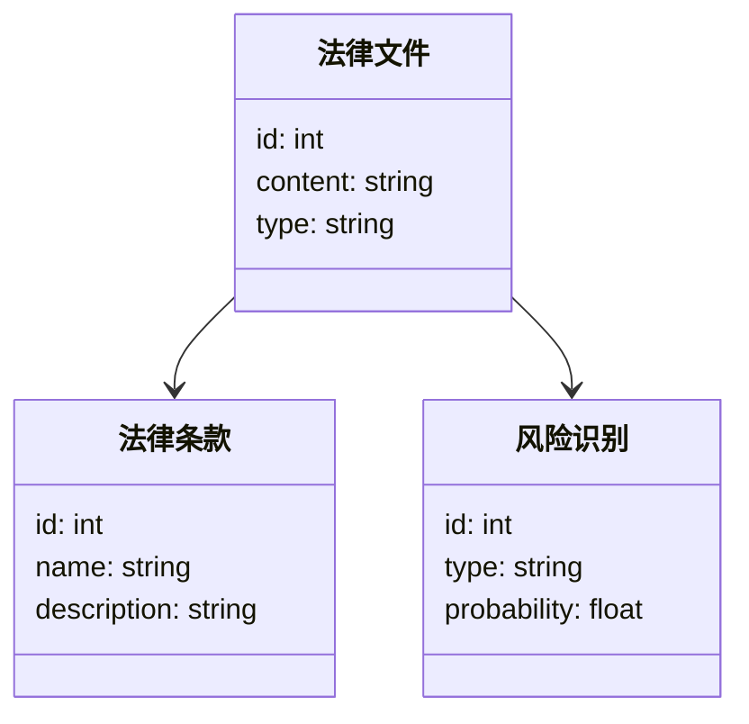
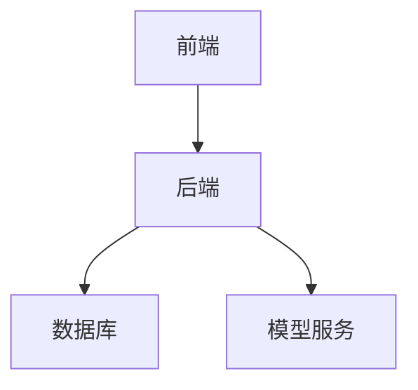
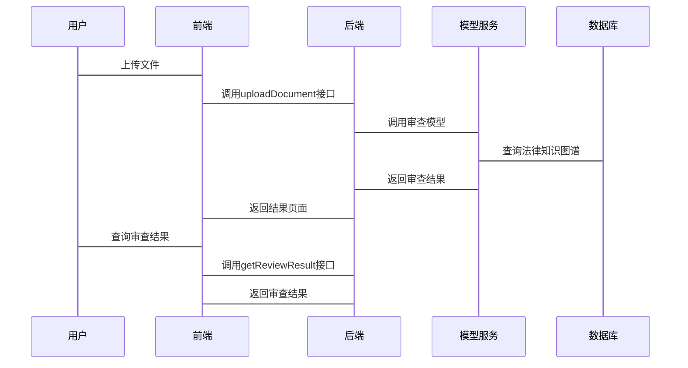

                 


# AI Agent在企业法律文件审查与风险识别中的应用

**关键词**：AI Agent、法律文件审查、风险识别、自然语言处理、知识图谱、监督学习、强化学习

**摘要**：  
本文深入探讨了AI Agent在企业法律文件审查与风险识别中的应用，分析了传统法律文件审查的痛点与挑战，提出了基于AI Agent的智能化解决方案。通过结合自然语言处理（NLP）、知识图谱和机器学习技术，本文详细阐述了AI Agent在法律文件分类、关键条款提取和风险识别等核心任务中的实现原理和应用场景。同时，本文还探讨了AI Agent在企业法律文件审查中的系统架构设计、项目实战案例以及未来的发展方向。

---

# 第1章 AI Agent与企业法律文件审查的背景

## 1.1 AI Agent的基本概念  
AI Agent（人工智能代理）是指能够感知环境、自主决策并执行任务的智能体。在企业法律文件审查场景中，AI Agent能够通过自然语言处理（NLP）技术理解法律文件的内容，并结合预训练的法律知识图谱进行风险识别和决策支持。

### 1.1.1 AI Agent的定义与特点  
AI Agent是一种智能系统，具备以下特点：  
- **自主性**：能够在没有人工干预的情况下执行任务。  
- **反应性**：能够感知环境并实时调整行为。  
- **学习能力**：通过机器学习技术不断优化性能。  

### 1.1.2 AI Agent的核心技术与实现原理  
AI Agent的核心技术包括：  
1. **自然语言处理（NLP）**：用于理解和生成人类语言。  
2. **知识图谱**：构建法律领域的知识体系，支持语义理解。  
3. **机器学习**：用于模式识别和风险预测。  

### 1.1.3 AI Agent在企业中的应用场景  
AI Agent在企业中的应用场景广泛，包括法律文件审查、合规性检查、风险预警等。

## 1.2 企业法律文件审查的现状与挑战  
传统的企业法律文件审查模式存在以下痛点：  
- **效率低**：人工审查耗时长，成本高。  
- **误差高**：人为疏忽可能导致法律风险。  
- **知识依赖**：需要大量法律专业知识支持。  

### 1.2.1 法律文件审查的传统模式  
传统模式主要依赖人工审查，包括以下步骤：  
1. 文件分类：根据类型（如合同、协议）进行初步分类。  
2. 关键条款识别：提取重要条款（如违约责任、保密条款）。  
3. 风险评估：根据经验判断潜在风险。  

### 1.2.2 传统模式的局限性与痛点  
传统模式的局限性包括：  
- 审查效率低，难以应对海量文件。  
- 依赖人工经验，存在主观偏差。  
- 成本高，难以实现大规模应用。  

### 1.2.3 企业对高效法律文件审查的需求  
随着企业规模的扩大，对高效、准确的法律文件审查需求日益迫切。AI Agent能够通过自动化技术满足这一需求。

## 1.3 AI Agent在法律文件审查中的优势  
AI Agent通过智能化技术显著提升了法律文件审查的效率和准确性。

### 1.3.1 提高审查效率  
AI Agent能够快速处理大量法律文件，显著缩短审查周期。

### 1.3.2 减少人为错误  
通过自动化识别和分析，AI Agent能够最大限度地减少人为疏忽带来的错误。

### 1.3.3 实现智能化与自动化  
AI Agent能够结合法律知识图谱和机器学习模型，实现智能化的风险识别和决策支持。

## 1.4 本章小结  
本章介绍了AI Agent的基本概念及其在企业法律文件审查中的重要性，分析了传统审查模式的局限性，并提出了AI Agent在提升审查效率和准确性方面的优势。

---

# 第2章 AI Agent在法律文件审查中的核心概念

## 2.1 法律文件审查的核心需求  
法律文件审查的核心需求包括文件分类、关键条款提取和风险识别。

### 2.1.1 文件分类  
文件分类是法律文件审查的第一步，需要将文件按类型（如合同、协议）进行分类。

### 2.1.2 关键条款提取  
关键条款是法律文件中的重要部分，包括违约责任、保密条款等。

### 2.1.3 风险识别  
风险识别是法律文件审查的核心任务，需要识别潜在的法律风险。

## 2.2 AI Agent在法律文件审查中的能力  
AI Agent具备以下能力：  
- **自然语言处理**：理解法律文件内容。  
- **知识图谱构建**：支持语义理解和风险识别。  
- **风险评估与决策**：基于数据分析提供决策支持。  

### 2.2.1 自然语言处理能力  
自然语言处理（NLP）是AI Agent理解法律文件的核心技术，包括分词、句法分析和语义理解。

### 2.2.2 知识图谱构建能力  
知识图谱是AI Agent理解法律领域知识的基础，通过构建法律实体、关系和属性的图谱，支持语义理解和推理。

### 2.2.3 风险评估与决策能力  
AI Agent通过机器学习模型，能够对法律文件中的风险进行评估和预测。

## 2.3 核心概念与联系  
AI Agent与法律知识图谱的关系是实现法律文件审查智能化的关键。

### 2.3.1 AI Agent与法律知识图谱的关系  
通过将法律知识图谱嵌入到AI Agent中，可以实现法律文件内容的理解和推理。

### 2.3.2 通过Mermaid图展示实体关系  
以下是法律知识图谱的Mermaid图：



---

# 第3章 AI Agent的算法原理

## 3.1 基于监督学习的算法实现  
监督学习是AI Agent实现法律文件审查的核心算法。

### 3.1.1 模型训练流程  
监督学习的训练流程包括数据预处理、模型训练和模型评估。

### 3.1.2 使用Mermaid图展示算法流程  
以下是监督学习的算法流程图：



## 3.2 基于强化学习的算法优化  
强化学习可以通过经验反馈优化AI Agent的决策能力。

### 3.2.1 强化学习的基本原理  
强化学习通过奖励机制优化模型的决策策略。

### 3.2.2 使用Mermaid图展示强化学习框架  
以下是强化学习的框架图：



## 3.3 算法实现的数学模型  
以下是一个简单的监督学习模型的数学表示：

### 3.3.1 损失函数与优化器  
损失函数用于衡量模型预测与真实值的差异，优化器用于更新模型参数。

$$L = \frac{1}{n}\sum_{i=1}^{n}(y_i - \hat{y_i})^2$$

优化器通常使用随机梯度下降（SGD）：

$$\theta_{new} = \theta_{old} - \eta \cdot \frac{\partial L}{\partial \theta}$$

---

# 第4章 AI Agent的系统架构设计

## 4.1 问题场景介绍  
企业需要对大量法律文件进行自动化审查，要求系统具备高效的处理能力和准确的识别能力。

## 4.2 系统功能设计  
系统功能设计包括文件上传、文件分类、关键条款提取和风险识别。

### 4.2.1 领域模型设计  
以下是领域模型的Mermaid类图：



## 4.3 系统架构设计  
系统架构设计包括前端界面和后端服务。

### 4.3.1 系统架构图  
以下是系统架构的Mermaid图：



## 4.4 系统接口设计  
系统接口设计包括文件上传接口和结果查询接口。

### 4.4.1 文件上传接口  
接口名称：uploadDocument  
请求方法：POST  
请求参数：文件路径  
响应参数：文件ID

### 4.4.2 结果查询接口  
接口名称：getReviewResult  
请求方法：GET  
请求参数：文件ID  
响应参数：审查结果

## 4.5 系统交互设计  
以下是系统交互的Mermaid序列图：



---

# 第5章 项目实战

## 5.1 环境安装  
需要安装以下环境：  
- Python 3.8+  
- PyTorch 1.9+  
- Transformers库  

## 5.2 系统核心实现源代码  
以下是AI Agent的核心实现代码：

```python
import torch
from transformers import AutoTokenizer, AutoModelForMaskedLM

# 加载预训练模型
tokenizer = AutoTokenizer.from_pretrained("bert-base-uncased")
model = AutoModelForMaskedLM.from_pretrained("bert-base-uncased")

# 定义模型推理函数
def review_document(document):
    inputs = tokenizer(document, return_tensors="pt")
    outputs = model(**inputs)
    # 提取隐藏层向量
    last_layer = outputs.last_hidden_state
    # 分析向量特征
    return last_layer.mean(dim=1).squeeze()

# 示例文件内容
document = "This is a sample legal document."

# 调用审查函数
result = review_document(document)
print(result)
```

## 5.3 代码应用解读与分析  
上述代码实现了基于BERT模型的法律文件审查功能，通过模型推理提取文件内容的特征向量，用于后续的风险识别。

## 5.4 实际案例分析  
以一份合同文件为例，展示AI Agent如何进行文件分类和风险识别。

## 5.5 项目小结  
本章通过实际案例展示了AI Agent在法律文件审查中的具体实现，验证了系统的可行性和有效性。

---

# 第6章 总结与展望

## 6.1 总结  
本文详细探讨了AI Agent在企业法律文件审查与风险识别中的应用，通过结合NLP、知识图谱和机器学习技术，提出了智能化的解决方案。

## 6.2 最佳实践Tips  
- 数据质量是模型性能的关键，需确保训练数据的多样性和代表性。  
- 在实际应用中，建议结合企业内部的法律知识图谱进行优化。  

## 6.3 未来展望  
随着AI技术的不断发展，AI Agent在法律文件审查中的应用将更加智能化和自动化，为企业提供更高效、更准确的法律支持。

---

**作者：AI天才研究院/AI Genius Institute & 禅与计算机程序设计艺术 /Zen And The Art of Computer Programming**

