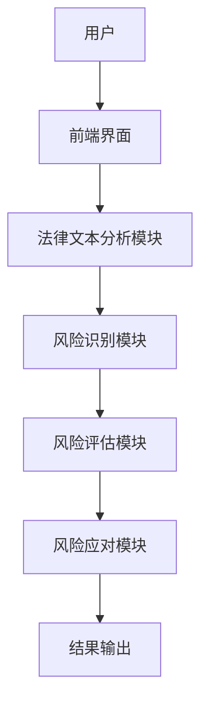

                 


```markdown
# AI Agent在企业法律风险管理中的应用

## 关键词
AI Agent, 企业法律风险管理, 法律风险识别, 法律风险评估, 法律风险应对, AI技术应用

## 摘要
本文系统地探讨了AI Agent在企业法律风险管理中的应用，从理论基础到实际应用，详细阐述了AI Agent如何通过智能化手段提升法律风险管理的效率和准确性。文章首先介绍了AI Agent的基本概念和法律风险管理的重要性，然后深入分析了AI Agent与法律风险管理的核心概念及其联系，详细讲解了AI Agent在法律风险管理中的算法原理和系统架构设计。接着，通过实际案例展示了AI Agent在法律风险管理中的实战应用，并总结了最佳实践和注意事项。本文旨在为企业法律风险管理提供一种创新的解决方案，为相关领域的研究和实践提供参考。

---

# 第一部分: AI Agent与企业法律风险管理的背景介绍

## 第1章: AI Agent的基本概念

### 1.1 AI Agent的定义
AI Agent（人工智能代理）是指能够感知环境、自主决策并执行任务的智能实体。它能够通过传感器获取信息，利用算法处理数据，并通过执行器采取行动，以实现特定目标。AI Agent的核心在于其智能化和自主性，能够在复杂环境中解决问题并优化决策过程。

### 1.2 法律风险管理的重要性
法律风险管理是企业在经营过程中的一项重要工作，旨在识别、评估和应对可能对企业造成法律风险的因素。法律风险可能来自于合同纠纷、合规问题、知识产权争议等，一旦处理不当，可能对企业声誉、财务和运营造成重大影响。因此，如何高效、准确地进行法律风险管理，是企业面临的重大挑战。

### 1.3 AI Agent在法律风险管理中的应用背景
随着人工智能技术的快速发展，AI Agent在法律领域的应用逐渐成为可能。AI Agent能够通过自然语言处理技术分析大量的法律文档，快速识别潜在的法律风险，并提供个性化的解决方案。相比于传统的人工审查方式，AI Agent不仅效率更高，而且能够覆盖更多的法律场景，为企业提供更全面的法律风险管理支持。

### 1.4 本章小结
本章介绍了AI Agent的基本概念以及法律风险管理的重要性，重点分析了AI Agent在法律风险管理中的应用背景。通过对两者的结合，初步展现了AI Agent在法律风险管理中的巨大潜力。

---

# 第二部分: AI Agent与法律风险管理的核心概念与联系

## 第2章: AI Agent与法律风险管理的核心概念

### 2.1 AI Agent的原理与实现
AI Agent的实现依赖于多种人工智能技术，包括自然语言处理（NLP）、机器学习、知识图谱等。AI Agent通过获取外部信息，利用内部知识库进行分析和推理，最终生成相应的决策或行动方案。

#### 2.1.1 自然语言处理（NLP）
自然语言处理技术是AI Agent与法律文档交互的关键。通过NLP，AI Agent能够理解法律文本的语义，提取关键信息，并生成相应的摘要或总结。

#### 2.1.2 机器学习
机器学习是AI Agent的核心技术之一。通过训练大量的法律案例数据，AI Agent能够识别潜在的法律风险，并预测案件的发展趋势。

#### 2.1.3 知识图谱
知识图谱是AI Agent的“知识库”，它包含了丰富的法律术语、法规和案例信息。通过知识图谱，AI Agent能够快速查询相关法律信息，并提供准确的法律建议。

### 2.2 法律风险管理的核心要素
法律风险管理的核心要素包括法律风险识别、评估和应对。企业需要通过系统化的流程，识别潜在的法律风险，并采取相应的措施进行应对。

#### 2.2.1 法律风险识别
法律风险识别是法律风险管理的第一步，旨在发现可能对企业造成法律风险的因素。AI Agent可以通过分析企业的合同、交易记录等信息，识别潜在的法律风险。

#### 2.2.2 法律风险评估
法律风险评估是对识别出的法律风险进行量化分析，评估其对企业的影响程度。AI Agent可以通过机器学习模型，对法律风险进行分类和排序，帮助企业在有限的资源下优先处理高风险问题。

#### 2.2.3 法律风险应对
法律风险应对是法律风险管理的关键环节，旨在采取有效的措施降低法律风险。AI Agent可以根据企业的具体情况，提供个性化的法律建议，并协助企业制定应对策略。

### 2.3 AI Agent与法律风险管理的结合点
AI Agent与法律风险管理的结合点主要体现在以下几个方面：
1. **法律风险识别**：AI Agent通过分析企业的合同、交易记录等信息，识别潜在的法律风险。
2. **法律风险评估**：AI Agent利用机器学习模型，对法律风险进行分类和排序。
3. **法律风险应对**：AI Agent提供个性化的法律建议，并协助企业制定应对策略。

## 第3章: AI Agent与法律风险管理的核心概念联系

### 3.1 AI Agent与法律风险管理的原理对比
AI Agent与法律风险管理的原理有明显的区别，但也有许多相似之处。AI Agent的核心是通过感知环境、自主决策和执行任务来实现目标，而法律风险管理则是通过识别、评估和应对法律风险来保障企业利益。两者的目标都是为了实现最优的结果，但实现方式有所不同。

### 3.2 AI Agent与法律风险管理的属性特征对比
以下是AI Agent与法律风险管理的核心属性特征对比：

| 属性 | AI Agent | 法律风险管理 |
|------|----------|--------------|
| 目标 | 实现特定目标 | 保障企业利益 |
| 输入 | 环境信息 | 法律文本、数据 |
| 输出 | 决策或行动 | 风险评估、应对策略 |
| 学习能力 | 可通过机器学习不断优化 | 可通过案例学习提升能力 |
| 自主性 | 高度自主 | 较低自主性 |
| 适应性 | 能够适应环境变化 | 需要人工调整 |

### 3.3 AI Agent与法律风险管理的ER实体关系图
以下是AI Agent与法律风险管理的ER实体关系图：

```mermaid
er
  %%{init: 'flowchart', direction: 'TB'}%%

  %% 定义实体 %%
  entity(EA, "AI Agent") {
    类别: 实体
    类型: AI Agent
  }
  
  entity(RM, "法律风险管理") {
    类别: 实体
    类型: 法律风险管理
  }
  
  %% 关系 %%
  relationship(R, "应用于", EA, RM) {
    类型: 关系
    描述: AI Agent应用于法律风险管理
  }
```

---

# 第三部分: AI Agent在法律风险管理中的算法原理

## 第4章: AI Agent的算法原理

### 4.1 AI Agent的算法流程
AI Agent在法律风险管理中的算法流程如下：

1. **信息获取**：通过自然语言处理技术，从法律文本中提取关键信息。
2. **风险识别**：利用机器学习模型，识别潜在的法律风险。
3. **风险评估**：对识别出的法律风险进行量化分析，评估其影响程度。
4. **风险应对**：根据评估结果，生成相应的法律建议和应对策略。
5. **优化调整**：根据实际效果，优化算法模型，提升准确性。

### 4.2 AI Agent的算法实现
以下是AI Agent的算法实现流程图：

```mermaid
graph TD
    A[开始] -> B[信息获取]
    B -> C[风险识别]
    C -> D[风险评估]
    D -> E[风险应对]
    E -> F[优化调整]
    F -> G[结束]
```

### 4.3 AI Agent的数学模型
AI Agent的数学模型主要用于风险评估和预测。以下是常用的数学模型：

#### 4.3.1 风险评估模型
风险评估模型的目标是量化法律风险的影响程度。常用的模型包括线性回归、随机森林等。

#### 4.3.2 预测模型
预测模型用于预测法律风险的发展趋势。常用的模型包括时间序列分析、神经网络等。

#### 4.3.3 优化模型
优化模型用于优化法律风险管理策略。常用的模型包括遗传算法、模拟退火等。

### 4.4 AI Agent的Python代码实现
以下是AI Agent的Python代码实现示例：

```python
import numpy as np
from sklearn import linear_model

# 示例数据：法律风险评分
X = np.array([[1], [2], [3], [4], [5]])
y = np.array([2, 4, 5, 4, 5])

# 训练模型
model = linear_model.LinearRegression()
model.fit(X, y)

# 预测风险评分
predicted = model.predict([[6]])
print(predicted)
```

---

# 第四部分: AI Agent与法律风险管理的系统架构设计

## 第5章: 系统分析与架构设计方案

### 5.1 系统功能设计
AI Agent在法律风险管理中的系统功能设计包括以下几个方面：
1. **法律文本分析**：通过自然语言处理技术，分析法律文本，提取关键信息。
2. **风险识别**：利用机器学习模型，识别潜在的法律风险。
3. **风险评估**：对识别出的法律风险进行量化分析，评估其影响程度。
4. **风险应对**：根据评估结果，生成相应的法律建议和应对策略。

### 5.2 系统架构设计
以下是AI Agent在法律风险管理中的系统架构设计图：



### 5.3 系统接口设计
系统接口设计包括以下几个部分：
1. **用户输入接口**：用户通过前端界面输入法律文本或数据。
2. **系统输出接口**：系统通过前端界面输出风险评估结果和应对策略。

### 5.4 系统交互设计
以下是系统交互设计的序列图：

```mermaid
sequenceDiagram
    participant 用户
    participant 前端界面
    participant 法律文本分析模块
    participant 风险识别模块
    participant 风险评估模块
    participant 风险应对模块
    用户 -> 前端界面: 输入法律文本
    前端界面 -> 法律文本分析模块: 分析法律文本
    法律文本分析模块 -> 风险识别模块: 识别潜在风险
    风险识别模块 -> 风险评估模块: 评估风险影响
    风险评估模块 -> 风险应对模块: 制定应对策略
    风险应对模块 -> 前端界面: 输出结果
    用户 <- 前端界面: 显示风险评估结果和应对策略
```

---

# 第五部分: AI Agent在法律风险管理中的项目实战

## 第6章: 项目实战

### 6.1 环境安装
以下是AI Agent项目实战的环境安装步骤：
1. 安装Python和相关库（如numpy、scikit-learn）。
2. 安装自然语言处理工具（如spaCy）。
3. 安装机器学习框架（如TensorFlow）。

### 6.2 核心代码实现
以下是AI Agent的核心代码实现示例：

```python
import spacy

# 加载中文模型
nlp = spacy.load("zh_core_web_sm")

# 示例法律文本
text = "合同中存在违约条款，需谨慎处理。"

# 文本分析
doc = nlp(text)
for token in doc:
    print(token.text, token.pos_, token.dep_)
```

### 6.3 代码功能解读
上述代码实现了对法律文本的分词、词性标注和句法分析，帮助AI Agent理解文本的语义结构。通过自然语言处理技术，AI Agent能够提取关键信息，识别潜在的法律风险。

### 6.4 实际案例分析
以下是一个实际案例分析：
某企业在与客户签订合同时，合同中存在违约条款。通过AI Agent的分析，识别出违约条款可能存在的法律风险，并提供相应的建议，如修改合同条款或增加担保措施。

### 6.5 项目小结
本章通过实际案例展示了AI Agent在法律风险管理中的应用，详细讲解了项目的环境安装、核心代码实现以及实际案例分析。通过本章的学习，读者能够理解AI Agent在法律风险管理中的具体应用场景和技术实现。

---

# 第六部分: 最佳实践与注意事项

## 第7章: 最佳实践

### 7.1 小结
本章总结了AI Agent在法律风险管理中的应用，重点强调了AI Agent在风险识别、评估和应对中的重要作用。通过对实际案例的分析，展示了AI Agent如何帮助企业提高法律风险管理的效率和准确性。

### 7.2 注意事项
在实际应用中，需要注意以下几点：
1. **数据隐私**：确保法律文本的数据隐私和合规性。
2. **算法准确性**：定期更新算法模型，确保其准确性。
3. **人机协同**：AI Agent应与法律专家协同工作，避免过度依赖人工智能。

### 7.3 扩展阅读
1. 《人工智能与法律》
2. 《机器学习在法律领域的应用》
3. 《自然语言处理与法律文本分析》

---

# 作者：AI天才研究院/AI Genius Institute & 禅与计算机程序设计艺术 /Zen And The Art of Computer Programming
```

