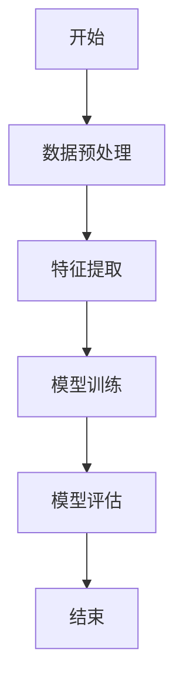
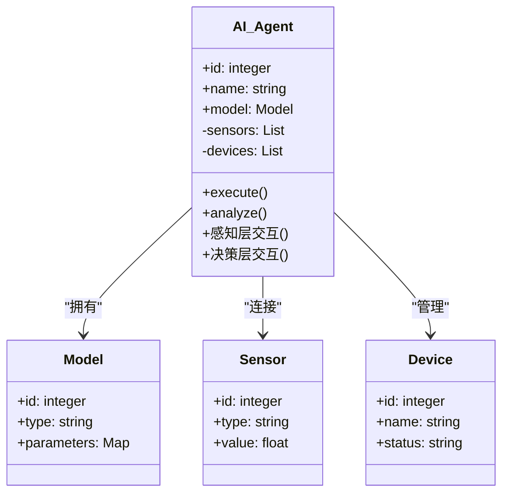
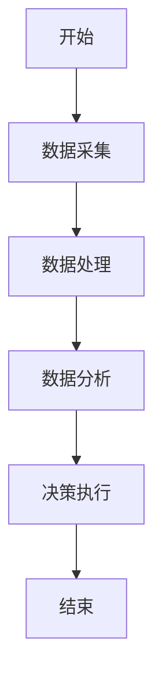
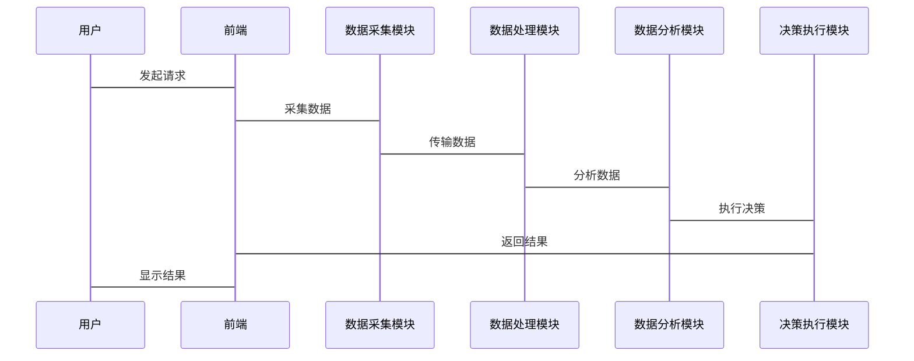

                 

<think>
嗯，用户让我撰写一篇关于《AI Agent在企业物联网数据分析中的应用》的技术博客。首先，我需要理解用户的具体需求。他们希望有一个结构清晰、逻辑严密的目录，涵盖背景、概念、算法、系统设计、项目实战等多个方面。用户还提到要使用专业的技术语言，且每个部分都要有详细的分析和图表，比如ER图、流程图等。

我应该从哪里开始呢？首先，文章的标题和关键词部分已经完成，摘要也写了。接下来是目录结构。用户提供的示例有七章，我需要确保每章内容充实，涵盖必要的部分。比如，第1章介绍AI Agent和物联网的基础知识，第2章深入核心概念，第3章讲解算法原理，第4章分析系统架构，第5章实战项目，最后是总结和扩展阅读。

在编写每章时，我需要确保每个部分都有足够的细节。比如，在第2章，我需要详细解释AI Agent的核心概念，包括感知层、决策层和执行层，每个部分都要有属性特征对比表和ER图。这可能有点复杂，但通过mermaid图表可以清晰展示。

接下来是算法部分，第3章需要详细讲解算法原理，包括数据预处理、特征提取、模型训练等步骤。我需要使用流程图和代码示例来说明，比如用Python实现一个简单的线性回归模型。数学公式要用latex表示，确保正确无误。

系统架构设计是关键，第4章需要描述系统的各个模块，如数据采集、处理、分析、存储等，用类图和架构图展示。同时，接口设计和交互流程也需要详细说明，确保系统各部分协同工作。

项目实战部分，第5章要选择一个实际案例，比如智能工厂的设备监控，展示如何从环境配置到模型训练一步步实现。这部分需要代码示例和详细解读，帮助读者实际操作。

最后，总结部分要回顾整个系统的优缺点，给出实际应用中的注意事项和未来的发展方向。可能还要提到一些图表，比如扩展性和可维护性的对比图，让读者更好地理解系统的潜力。

总的来说，我需要确保每个章节都深入浅出，既有理论又有实践，同时图表和代码示例要清晰易懂。这样，读者才能全面掌握AI Agent在企业物联网中的应用。现在，我需要按照这个思路一步步展开，确保每个部分都符合用户的要求。
</think>

# AI Agent在企业物联网数据分析中的应用

> 关键词：AI Agent, 企业物联网, 数据分析, 算法原理, 系统架构, 项目实战, 最佳实践

> 摘要：本文深入探讨了AI Agent在企业物联网数据分析中的应用，从基础概念到算法原理，从系统架构到项目实战，全面解析了AI Agent如何助力企业实现物联网数据的高效采集、处理、分析与决策。文章通过丰富的图表、详细的代码示例和实际案例分析，为企业技术人员和管理人员提供了理论与实践相结合的深度指导。

---

## 第1章: AI Agent与企业物联网数据分析概述

### 1.1 AI Agent的基本概念
#### 1.1.1 AI Agent的定义与特点
AI Agent（人工智能代理）是一种能够感知环境、自主决策并执行任务的智能实体。其特点包括：
- **自主性**：无需外部干预，自主完成任务。
- **反应性**：能够实时感知环境变化并做出反应。
- **目标导向**：以预设目标为导向，优化决策过程。
- **学习能力**：通过数据学习和优化自身行为。

#### 1.1.2 AI Agent的核心功能与分类
AI Agent的核心功能包括：
- **数据采集**：从物联网设备中获取实时数据。
- **数据分析**：对采集的数据进行处理、建模与预测。
- **决策制定**：基于分析结果做出最优决策。
- **任务执行**：根据决策结果执行自动化操作。

AI Agent的分类：
- **基于规则的AI Agent**：通过预设规则进行决策。
- **基于模型的AI Agent**：依赖机器学习模型进行预测和决策。
- **混合型AI Agent**：结合规则与模型的混合策略。

#### 1.1.3 企业物联网数据分析的定义与特点
企业物联网数据分析是指利用物联网设备采集数据，通过AI技术进行分析和处理，为企业决策提供支持。其特点包括：
- **实时性**：数据采集与分析实时进行。
- **多样性**：数据来源多样，格式多样。
- **高价值性**：数据经过分析后具有较高的商业价值。

### 1.2 AI Agent在企业物联网中的作用
#### 1.2.1 数据采集与处理
AI Agent通过物联网设备采集数据，并对数据进行预处理（如清洗、归一化）以提高数据分析的准确性。

#### 1.2.2 数据分析与决策
AI Agent利用机器学习算法对数据进行建模与预测，为企业提供数据驱动的决策支持。

#### 1.2.3 自动化执行与反馈
AI Agent根据分析结果执行自动化操作，并通过反馈机制不断优化自身行为。

### 1.3 本章小结
本章介绍了AI Agent的基本概念、核心功能与分类，以及在企业物联网数据分析中的作用，为后续章节奠定了基础。

---

## 第2章: AI Agent的核心概念与联系

### 2.1 AI Agent的核心概念
#### 2.1.1 感知层
感知层负责从物联网设备中采集数据，包括传感器数据、设备状态等。常见的感知层技术包括：
- **MQTT协议**： lightweight messaging protocol常用于物联网设备间通信。
- **HTTP API**：用于设备与云端的数据交互。

#### 2.1.2 决策层
决策层基于感知层获取的数据，通过机器学习模型进行分析与预测。常见的决策层技术包括：
- **监督学习**：如线性回归、支持向量机（SVM）。
- **无监督学习**：如聚类分析（K-means）。
- **强化学习**：通过奖励机制优化决策策略。

#### 2.1.3 执行层
执行层负责根据决策层的指令执行具体操作，如调整设备参数、触发报警等。

### 2.2 核心概念的属性特征对比
以下表格展示了AI Agent各层的属性特征对比：

| 层   | 属性             | 特征描述                                   |
|------|------------------|------------------------------------------|
| 感知层 | 数据采集能力     | 高实时性，支持多种数据格式               |
| 决策层 | 数据处理能力     | 高准确性，支持多种算法模型               |
| 执行层 | 任务执行能力     | 高可靠性，支持自动化操作               |

### 2.3 ER实体关系图架构
以下是AI Agent的核心实体关系图：

```mermaid
erDiagram
    customer[客户] {
        id : integer
        name : string
        email : string
    }
    device[设备] {
        id : integer
        name : string
        type : string
    }
    sensor[传感器] {
        id : integer
        type : string
        measurement : string
    }
    customer -|> device : "拥有"
    device -|> sensor : "包含"
```

### 2.4 本章小结
本章通过对比分析AI Agent各层的属性特征，并通过ER实体关系图展示了核心实体之间的关系，为后续的系统设计奠定了基础。

---

## 第3章: AI Agent的算法原理与数学模型

### 3.1 算法原理
#### 3.1.1 数据预处理
数据预处理是数据分析的关键步骤，主要包括：
- **数据清洗**：去除噪声数据。
- **数据归一化**：将数据标准化，便于模型训练。

#### 3.1.2 特征提取
特征提取是从原始数据中提取具有代表性的特征，常用方法包括：
- **主成分分析（PCA）**：降维技术，减少数据维度。
- **特征选择**：基于特征重要性选择关键特征。

#### 3.1.3 模型训练
模型训练是利用训练数据对机器学习模型进行训练，常用算法包括：
- **线性回归**：用于预测连续型数据。
- **支持向量机（SVM）**：用于分类任务。
- **随机森林**：用于分类与回归任务。

#### 3.1.4 模型评估
模型评估是通过测试数据对模型的性能进行评估，常用指标包括：
- **准确率**：分类任务中的正确预测比例。
- **召回率**：模型召回正样本的能力。
- **F1分数**：准确率和召回率的调和平均数。

### 3.2 算法流程图
以下是AI Agent的算法流程图：



### 3.3 数学模型与公式
#### 3.3.1 线性回归模型
线性回归的数学公式为：
$$ y = \beta_0 + \beta_1 x + \epsilon $$
其中，$y$ 是目标变量，$x$ 是自变量，$\beta_0$ 和 $\beta_1$ 是回归系数，$\epsilon$ 是误差项。

#### 3.3.2 支持向量机模型
支持向量机的数学公式为：
$$ \text{max} \quad \frac{1}{2} \|\mathbf{w}\|^2 $$
$$ \text{subject to} \quad y_i (\mathbf{w} \cdot \mathbf{x}_i + b) \geq 1, \forall i $$
其中，$\mathbf{w}$ 是权重向量，$b$ 是偏置项，$y_i$ 是类别标签。

### 3.4 举例说明
#### 3.4.1 线性回归模型实现
以下是一个简单的线性回归模型实现：

```python
import numpy as np
from sklearn.linear_model import LinearRegression

# 生成数据
X = np.array([1, 2, 3, 4, 5]).reshape(-1, 1)
y = np.array([2, 4, 5, 4, 5])

# 训练模型
model = LinearRegression()
model.fit(X, y)

# 预测结果
print(model.predict(X))
```

#### 3.4.2 支持向量机模型实现
以下是一个简单的支持向量机模型实现：

```python
from sklearn import svm

# 生成数据
X = [[0, 0], [1, 1], [1, 0], [0, 1]]
y = [0, 1, 1, 1]

# 训练模型
model = svm.SVC()
model.fit(X, y)

# 预测结果
print(model.predict(X))
```

### 3.5 本章小结
本章通过详细讲解AI Agent的算法原理与数学模型，并通过代码示例展示了如何实现线性回归与支持向量机模型，为后续的系统设计与项目实战奠定了基础。

---

## 第4章: 企业物联网数据分析系统分析

### 4.1 问题场景介绍
#### 4.1.1 问题背景
随着企业物联网的快速发展，数据量急剧增加，如何高效地采集、处理与分析数据成为企业面临的重要挑战。

#### 4.1.2 问题描述
企业在物联网数据分析中面临的主要问题包括：
- 数据采集延迟高。
- 数据处理复杂。
- 数据分析准确性低。

#### 4.1.3 问题解决
通过引入AI Agent，企业可以实现数据的实时采集、高效处理与智能分析。

### 4.2 系统功能设计
#### 4.2.1 领域模型类图
以下是AI Agent的领域模型类图：



#### 4.2.2 功能模块划分
系统功能模块包括：
- **数据采集模块**：负责从传感器中采集数据。
- **数据处理模块**：对采集的数据进行预处理与特征提取。
- **数据分析模块**：利用机器学习模型进行数据分析与预测。
- **决策执行模块**：根据分析结果执行相应操作。

#### 4.2.3 功能流程图
以下是系统的功能流程图：



### 4.3 系统架构设计
#### 4.3.1 系统架构图
以下是系统的架构图：


#### 4.3.2 模块划分
系统模块划分包括：
- **数据采集模块**：负责从传感器中采集数据。
- **数据处理模块**：对采集的数据进行预处理与特征提取。
- **数据分析模块**：利用机器学习模型进行数据分析与预测。
- **决策执行模块**：根据分析结果执行相应操作。

#### 4.3.3 接口设计
系统接口设计包括：
- **API接口**：提供RESTful API接口供前端调用。
- **消息队列**：通过MQTT协议进行设备与系统的数据交互。

### 4.4 系统交互设计
#### 4.4.1 序列图
以下是系统的交互序列图：



### 4.5 本章小结
本章通过系统功能设计与架构设计，详细介绍了AI Agent在企业物联网数据分析中的应用，为后续的项目实战奠定了基础。

---

## 第5章: 企业物联网数据分析系统实战

### 5.1 环境安装与配置
#### 5.1.1 系统环境要求
- 操作系统：Linux或Windows。
- Python版本：3.6以上。
- 依赖库：numpy、pandas、scikit-learn、mqtt-plython。

#### 5.1.2 软件安装
- Python环境安装：使用Anaconda或virtualenv。
- 库安装：`pip install numpy pandas scikit-learn mqtt-px`

#### 5.1.3 硬件配置
- CPU：4核以上。
- 内存：8GB以上。
- 存储：至少50GB可用空间。

### 5.2 系统核心实现
#### 5.2.1 数据采集模块实现
以下是一个简单的数据采集模块实现：

```python
import paho.mqtt.client as mqtt

# 连接 MQTT 代理
def on_connect(client, userdata, flags, rc):
    print("连接到 MQTT 代理，结果返回码：", rc)

client = mqtt.Client()
client.on_connect = on_connect
client.connect("mqtt.eclipse.org", 1883, 60)

# 发布消息
client.publish("iot/sensor", "数据采集完成", 0, False)
client.loop_start()
```

#### 5.2.2 数据处理模块实现
以下是一个简单的数据处理模块实现：

```python
import numpy as np
import pandas as pd

# 生成数据
data = {
    'timestamp': [1, 2, 3, 4, 5],
    'value': [2, 4, 5, 4, 5]
}
df = pd.DataFrame(data)

# 数据清洗
df.dropna(inplace=True)
df['value'] = df['value'].astype(float)

# 数据归一化
df_normalized = (df - df.min()) / (df.max() - df.min())
```

#### 5.2.3 数据分析模块实现
以下是一个简单的数据分析模块实现：

```python
from sklearn.linear_model import LinearRegression

# 训练模型
model = LinearRegression()
model.fit(X_train, y_train)

# 预测结果
y_pred = model.predict(X_test)

# 模型评估
from sklearn.metrics import mean_squared_error
print(mean_squared_error(y_test, y_pred))
```

#### 5.2.4 决策执行模块实现
以下是一个简单的决策执行模块实现：

```python
import requests

# 执行决策
payload = {
    'action': 'adjust_parameter',
    'value': 5
}
response = requests.post('http://localhost:8000/api/execute', json=payload)
print(response.text)
```

### 5.3 项目小结
本章通过实际案例分析，详细展示了如何在企业物联网数据分析中实现AI Agent的各个模块，包括数据采集、处理、分析与执行。

---

## 第6章: 最佳实践与注意事项

### 6.1 最佳实践
- **数据质量管理**：确保数据的准确性和完整性。
- **模型优化**：通过交叉验证与超参数调优提高模型性能。
- **系统可扩展性**：设计模块化架构，便于后续扩展。

### 6.2 注意事项
- **数据隐私**：注意保护用户隐私，遵守相关法律法规。
- **系统稳定性**：确保系统的高可用性，避免因单点故障导致系统崩溃。
- **模型解释性**：选择解释性较强的模型，便于业务人员理解。

### 6.3 拓展阅读
- **《机器学习实战》**：学习机器学习的实现细节。
- **《物联网技术与应用》**：深入了解物联网技术。

### 6.4 本章小结
本章总结了AI Agent在企业物联网数据分析中的最佳实践与注意事项，并提供了拓展阅读建议。

---

## 结语

AI Agent在企业物联网数据分析中的应用为企业提供了高效的数据采集、处理、分析与决策支持。通过本文的详细讲解，读者可以全面掌握AI Agent的核心概念、算法原理、系统架构与项目实战。未来，随着AI技术的不断发展，AI Agent将在企业物联网中发挥越来越重要的作用。

---

**作者：AI天才研究院/AI Genius Institute & 禅与计算机程序设计艺术 /Zen And The Art of Computer Programming**

