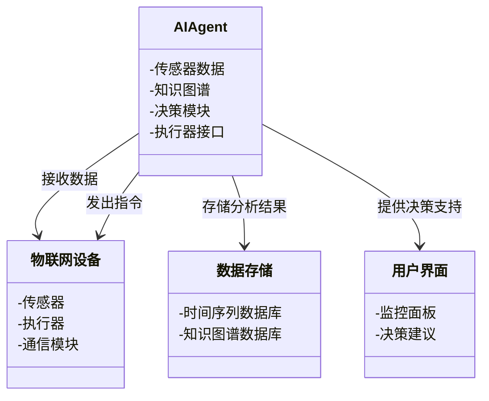

                 


# AI Agent在企业物联网数据分析中的应用前景

## 关键词：AI Agent, 物联网, 数据分析, 智能决策, 多智能体协作

## 摘要：  
随着物联网技术的快速发展，企业物联网数据的规模和复杂性不断增加，传统的数据分析方法已难以满足实时性和智能化的需求。AI Agent作为一种能够自主感知、推理和决策的智能体，为企业物联网数据分析提供了新的解决方案。本文将从AI Agent的核心原理、物联网数据分析的关键挑战、AI Agent在企业物联网中的应用场景，以及系统架构设计等方面展开详细探讨，分析AI Agent在企业物联网数据分析中的应用前景，并结合实际案例和最佳实践，为企业技术决策者和开发者提供有价值的参考。

---

# 第一部分: AI Agent与企业物联网数据分析的背景与基础

## 第1章: AI Agent与物联网概述

### 1.1 AI Agent的基本概念  
AI Agent，即人工智能代理，是一种能够感知环境、自主决策并执行任务的智能实体。它具备以下几个核心特点：  
1. **自主性**：AI Agent能够独立执行任务，无需外部干预。  
2. **反应性**：能够实时感知环境变化并做出响应。  
3. **目标导向**：基于目标或任务驱动行为。  
4. **学习能力**：能够通过数据和经验不断优化自身性能。  

#### 1.1.2 物联网的基本概念与架构  
物联网（Internet of Things，IoT）是指通过各种信息传感设备（如传感器、射频识别（RFID）技术、全球定位系统、红外感应器等）按约定的协议，把任何物品与互联网连接起来，实现信息交换和通信，以实现智能化识别、定位、跟踪、监控和管理。典型的物联网系统架构包括：  
1. **感知层**：负责数据的采集和初步处理，包括传感器和执行器。  
2. **网络层**：负责数据的传输，包括无线通信技术和网络协议。  
3. **应用层**：负责数据的处理、分析和展示，提供最终的用户界面和服务。  

#### 1.1.3 AI Agent与物联网的结合  
AI Agent与物联网的结合主要体现在以下几个方面：  
- **数据处理**：AI Agent能够实时处理物联网设备产生的海量数据，提取有用信息。  
- **智能决策**：基于数据分析结果，AI Agent能够自主做出决策并执行操作。  
- **协作优化**：通过多智能体协作，AI Agent能够优化物联网系统的整体性能。  

---

## 第2章: AI Agent在企业物联网中的应用前景  

### 2.1 企业物联网的现状与发展趋势  
#### 2.1.1 企业物联网的现状分析  
当前，企业物联网的应用场景日益广泛，涵盖了工业制造、物流、医疗、能源等多个领域。然而，随着设备数量的激增和数据规模的不断扩大，企业物联网数据分析面临以下挑战：  
1. **数据量大**：物联网设备产生的数据量呈指数级增长，传统的存储和处理方式已难以应对。  
2. **实时性要求高**：企业物联网应用往往需要实时数据处理和快速决策。  
3. **数据异构性**：不同设备产生的数据格式和类型差异较大，增加了数据融合的难度。  

#### 2.1.2 物联网在企业中的主要应用场景  
1. **智能制造**：通过物联网技术实现生产设备的智能化监控和优化。  
2. **智能物流**：利用物联网实时追踪物流信息，优化配送路径。  
3. **智能能源管理**：通过物联网实现能源消耗的实时监控和优化管理。  

#### 2.1.3 企业物联网的未来发展趋势  
- **边缘计算**：将计算能力推移到数据源附近，减少数据传输延迟。  
- **智能化升级**：通过AI技术提升物联网系统的自主决策能力。  
- **多技术融合**：物联网、大数据、人工智能等技术的深度融合将成为趋势。  

### 2.2 AI Agent在物联网数据分析中的应用价值  
#### 2.2.1 提高数据分析效率  
AI Agent能够实时处理海量数据，通过机器学习和深度学习算法快速提取有价值的信息，显著提高数据分析效率。  

#### 2.2.2 实现智能化决策  
AI Agent具备自主决策能力，能够基于实时数据做出最优决策，例如在智能制造中实时调整生产参数以提高效率。  

#### 2.2.3 优化企业运营流程  
通过AI Agent的协作优化能力，企业可以实现生产流程的智能化调度，降低资源浪费，提高整体运营效率。  

---

# 第二部分: AI Agent的核心概念与原理  

## 第3章: AI Agent的核心原理  

### 3.1 AI Agent的基本原理  
#### 3.1.1 AI Agent的感知与决策机制  
AI Agent的感知过程主要通过传感器或数据接口获取环境信息，然后通过算法进行分析和推理，最终做出决策并执行操作。  

#### 3.1.2 基于知识图谱的推理过程  
知识图谱是一种结构化的数据表示方式，能够帮助AI Agent更好地理解和推理复杂关系。通过构建领域知识图谱，AI Agent可以进行语义理解和关联推理。  

#### 3.1.3 多智能体协作的实现方式  
多智能体协作是指多个AI Agent协同工作，共同完成复杂任务。通过通信协议和协作算法，多个智能体可以实现信息共享和任务分配。  

### 3.2 物联网数据分析的核心算法  
#### 3.2.1 数据预处理与特征提取  
数据预处理包括数据清洗、标准化和归一化等步骤，特征提取则通过PCA（主成分分析）等方法提取关键特征。  

#### 3.2.2 基于机器学习的预测模型  
常用的机器学习算法包括线性回归、支持向量机（SVM）和随机森林等。以线性回归为例，其数学模型为：  
$$ y = \beta_0 + \beta_1 x_1 + \beta_2 x_2 + \dots + \beta_n x_n $$  
其中，$y$ 是目标变量，$\beta$ 是系数，$x$ 是特征变量。  

#### 3.2.3 基于深度学习的自然语言处理  
深度学习模型如LSTM（长短期记忆网络）适用于时间序列数据的处理。其核心思想是通过记忆单元捕捉数据中的长距离依赖关系。  

### 3.3 AI Agent与物联网数据的结合  
#### 3.3.1 数据流的实时处理  
通过流数据处理技术（如Flink），AI Agent能够实时处理物联网设备产生的数据流。  

#### 3.3.2 基于上下文的智能决策  
AI Agent能够基于上下文信息（如时间、地点、设备状态等）做出更精准的决策。  

#### 3.3.3 自适应优化算法  
通过强化学习算法（如Q-learning），AI Agent可以不断优化自身的决策策略，以适应动态变化的环境。  

---

## 第4章: 系统分析与架构设计  

### 4.1 问题场景介绍  
以智能制造为例，企业的物联网系统需要实时监控生产线上的设备状态，并根据传感器数据优化生产参数。  

### 4.2 系统功能设计  
#### 4.2.1 领域模型设计（Mermaid类图）  



#### 4.2.2 系统架构设计（Mermaid架构图）  

```mermaid
div class="mermaid"
graph LR
    A[AI Agent] --> B[物联网设备]
    A --> C[数据存储]
    A --> D[用户界面]
    B --> C
    C --> D
```

---

# 第三部分: 项目实战与最佳实践  

## 第5章: 项目实战  

### 5.1 环境安装与配置  
需要安装Python、TensorFlow、Flink等工具，并配置物联网设备的通信协议。  

### 5.2 核心实现代码  
以下是一个基于Flink和TensorFlow的AI Agent实现示例：  

```python
from pyflink.datastream import StreamExecutionEnvironment
from pyflink.ml.tensorflow import TensorflowModel, Mode
import tensorflow as tf

# 创建流处理环境
env = StreamExecutionEnvironment.get_execution_environment()

# 定义模型输入和输出
input_signature = tf.TensorSpec(shape=(-1, 128), dtype=tf.float32)
output_signature = tf.TensorSpec(shape=(-1, 10), dtype=tf.float32)

# 加载TensorFlow模型
model = TensorflowModel.load("my_model", input_signature, output_signature, Mode.PREDICT)

# 定义数据处理逻辑
def process_element(element):
    # 数据预处理
    processed_data = element.map(lambda x: x / 255.0)
    # 调用模型进行预测
    prediction = model.predict(processed_data)
    return prediction

# 添加处理流程
env.from_source(...).process(process_element).execute()
```

### 5.3 代码解读与分析  
上述代码展示了如何使用Flink和TensorFlow构建实时数据处理管道。AI Agent通过Flink接收物联网设备的数据流，进行实时预测，并将结果反馈给设备或用户界面。  

### 5.4 案例分析与优化建议  
以智能物流为例，AI Agent可以通过实时分析车辆位置和交通状况，动态调整配送路径，减少配送时间。  

---

## 第6章: 最佳实践与总结  

### 6.1 最佳实践Tips  
- **数据质量管理**：确保物联网设备的数据质量，避免噪声干扰。  
- **模型迭代优化**：定期更新AI Agent的模型参数，保持其决策能力。  
- **系统安全性**：加强AI Agent和物联网设备的安全防护，防止数据泄露和攻击。  

### 6.2 本章小结  
本文从AI Agent的核心原理、物联网数据分析的关键技术、系统架构设计，以及项目实战等多个方面，全面探讨了AI Agent在企业物联网数据分析中的应用前景。通过实际案例和最佳实践，为读者提供了宝贵的参考和启示。

---

## 作者：AI天才研究院/AI Genius Institute & 禅与计算机程序设计艺术 /Zen And The Art of Computer Programming

