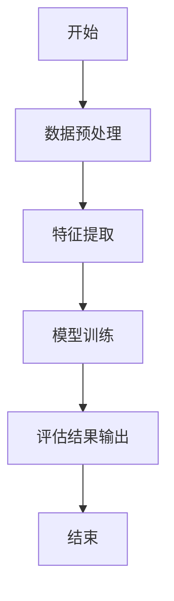
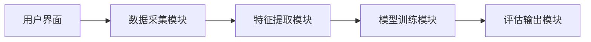

                 


# AI Agent在企业知识产权价值评估中的应用

> 关键词：AI Agent，知识产权评估，企业价值，算法原理，系统架构

> 摘要：本文详细探讨了AI Agent在企业知识产权价值评估中的应用，从基本概念、核心算法、系统架构到实际案例，全面分析了AI Agent如何提升知识产权评估的效率和准确性。通过结合实际应用场景，本文为读者提供了一套完整的解决方案，涵盖了从理论到实践的全过程。

---

## 第一部分: AI Agent与企业知识产权价值评估概述

### 第1章: AI Agent与知识产权价值评估的背景

#### 1.1 问题背景与描述

##### 1.1.1 企业知识产权的重要性  
知识产权（Intellectual Property, IP）是企业的核心资产之一，包括专利、商标、版权、商业秘密等。知识产权的价值不仅体现在法律保护上，更体现在其对企业发展、市场竞争和财务价值的贡献上。然而，知识产权的评估难度较高，主要因为其无形性、法律复杂性和市场波动性。

##### 1.1.2 知识产权价值评估的难点  
传统的知识产权评估方法通常依赖人工分析和专家经验，存在效率低、主观性强、成本高等问题。尤其是在面对海量数据和复杂法律关系时，人工评估的效率和准确性难以满足现代企业的需求。

##### 1.1.3 AI Agent在知识产权评估中的潜力  
AI Agent（人工智能代理）是一种能够自主感知环境、执行任务并优化决策的智能系统。其强大的数据处理能力、学习能力和自动化能力，使其成为解决知识产权评估问题的理想工具。

#### 1.2 问题解决与边界

##### 1.2.1 AI Agent如何解决评估问题  
AI Agent可以通过自然语言处理（NLP）、机器学习和大数据分析等技术，快速处理海量知识产权数据，提取关键特征，并基于历史数据和市场信息生成评估结果。此外，AI Agent还可以实时监控市场动态，提供动态评估服务。

##### 1.2.2 评估范围与边界  
AI Agent主要用于评估知识产权的经济价值，包括专利的市场价值、商标的影响力、版权的商业潜力等。其边界在于不涉及知识产权的法律确权问题，也不直接参与法律诉讼。

##### 1.2.3 核心概念与外延  
AI Agent在知识产权评估中的应用涵盖了数据采集、特征提取、模型训练和结果输出四个核心环节。其外延包括数据清洗、市场分析和风险评估等辅助功能。

---

### 第2章: 核心概念与联系

#### 2.1 AI Agent的基本原理

##### 2.1.1 AI Agent的定义与特征  
AI Agent是一种智能系统，具备以下特征：自主性、反应性、目标导向性和学习能力。在知识产权评估中，AI Agent通常表现为一种软件系统，能够自动执行数据处理、模型训练和结果输出。

##### 2.1.2 知识产权评估的核心要素  
知识产权评估的核心要素包括：技术先进性、市场竞争力、法律保护力度和经济价值。这些要素可以通过数据化的方式表示，并作为AI Agent的输入。

##### 2.1.3 AI Agent与知识产权评估的关系  
AI Agent通过数据驱动的方法，将知识产权的无形价值转化为可量化的指标。其作用类似于一个智能工具，帮助评估人员快速、准确地完成评估任务。

#### 2.2 核心概念对比

##### 2.2.1 AI Agent与其他评估方法的对比  
传统的评估方法依赖人工分析，效率低且主观性强。AI Agent则通过自动化和数据驱动的方式，显著提高了评估效率和准确性。

##### 2.2.2 不同知识产权类型对AI Agent的影响  
不同类型的知识产权（如专利、商标、版权）具有不同的评估特征。AI Agent需要针对不同类型的知识产权设计不同的评估模型。

##### 2.2.3 评估指标与权重的对比分析  
评估指标的权重直接影响评估结果。AI Agent可以通过机器学习算法自动确定各指标的权重，从而优化评估过程。

#### 2.3 实体关系图

##### 2.3.1 ER图展示  
以下是知识产权评估系统的核心实体关系图：

```mermaid
er
  actor: 评估人员
  tool: AI Agent
  patent: 专利数据
  trademark: 商标数据
  copyright: 版权数据
  relation: 评估人员使用AI Agent对专利、商标、版权进行评估
```

---

## 第三部分: 算法原理与数学模型

### 第3章: 知识产权价值评估算法

#### 3.1 算法流程

##### 3.1.1 算法流程图  
以下是AI Agent在知识产权评估中的算法流程图：



#### 3.2 数学模型与公式

##### 3.2.1 加权评分模型  
加权评分模型是知识产权评估的核心算法之一。其公式如下：

$$
\text{总评分} = \sum_{i=1}^{n} w_i \times x_i
$$

其中，$w_i$ 是第 $i$ 个特征的权重，$x_i$ 是对应的特征值。

##### 3.2.2 贝叶斯网络模型  
贝叶斯网络模型用于评估知识产权的市场风险。其公式如下：

$$
P(A|B) = \frac{P(B|A) \times P(A)}{P(B)}
$$

其中，$P(A|B)$ 是在事件 $B$ 发生的情况下，事件 $A$ 发生的概率。

##### 3.2.3 实例分析  
假设我们评估一项专利的价值，其技术先进性得分为90，市场竞争力得分为80，法律保护得分为85。假设权重分别为0.4、0.3和0.3。则总评分为：

$$
0.4 \times 90 + 0.3 \times 80 + 0.3 \times 85 = 36 + 24 + 25.5 = 85.5
$$

---

### 第4章: 系统分析与架构设计

#### 4.1 系统应用场景

##### 4.1.1 企业内部评估  
企业可以使用AI Agent对内部知识产权资产进行评估，为财务决策提供支持。

##### 4.1.2 第三方评估  
AI Agent还可以用于第三方知识产权评估服务，如专利交易、并购评估等。

#### 4.2 系统功能设计

##### 4.2.1 数据采集模块  
数据采集模块负责从企业数据库和外部知识库中获取知识产权数据。

##### 4.2.2 特征提取模块  
特征提取模块将数据转化为可计算的特征，如技术关键词、市场指数等。

##### 4.2.3 模型训练模块  
模型训练模块使用机器学习算法对特征进行训练，生成评估模型。

##### 4.2.4 评估输出模块  
评估输出模块将模型输出结果以可视化的方式呈现给用户。

#### 4.3 系统架构设计

##### 4.3.1 系统架构图  
以下是系统的总体架构图：



#### 4.4 接口设计

##### 4.4.1 数据接口  
数据接口负责与企业数据库和外部知识库进行数据交互。

##### 4.4.2 用户接口  
用户接口提供友好的操作界面，方便用户输入数据和查看结果。

#### 4.5 交互流程图

##### 4.5.1 交互流程  
以下是用户与系统交互的流程图：

```mermaid
sequenceDiagram
    actor 评估人员
    system AI Agent系统
    评估人员 -> AI Agent系统: 提交知识产权数据
    AI Agent系统 -> 数据采集模块: 获取数据
    数据采集模块 -> 特征提取模块: 提取特征
    特征提取模块 -> 模型训练模块: 训练模型
    模型训练模块 -> 评估输出模块: 输出结果
    评估输出模块 -> 评估人员: 显示评估结果
```

---

## 第五部分: 项目实战

### 第5章: 项目实施与案例分析

#### 5.1 环境安装

##### 5.1.1 系统要求  
- 操作系统：Windows/Mac/Linux  
- Python版本：3.6以上  
- 依赖库：TensorFlow, Scikit-learn, Pandas

#### 5.2 核心代码实现

##### 5.2.1 数据预处理代码  
```python
import pandas as pd

# 读取数据
data = pd.read_csv('ip_data.csv')

# 数据清洗
data.dropna(inplace=True)
data = data[~data.duplicated()]
```

##### 5.2.2 模型训练代码  
```python
from sklearn.model import LinearRegression

# 训练模型
model = LinearRegression()
model.fit(X_train, y_train)

# 预测结果
y_pred = model.predict(X_test)
```

#### 5.3 案例分析

##### 5.3.1 案例背景  
某科技公司拥有一项专利技术，需要评估其市场价值。

##### 5.3.2 数据分析  
- 技术先进性：90  
- 市场竞争力：80  
- 法律保护：85  

##### 5.3.3 评估结果  
总评分为85.5，表明该专利具有较高的市场价值。

---

## 第六部分: 总结与展望

### 第6章: 总结与展望

#### 6.1 总结  
本文详细探讨了AI Agent在企业知识产权价值评估中的应用，从算法原理到系统架构，再到实际案例，全面分析了AI Agent的优势和潜力。通过本文的介绍，读者可以了解如何利用AI技术提升知识产权评估的效率和准确性。

#### 6.2 未来展望  
未来，随着AI技术的不断发展，知识产权评估将更加智能化和自动化。AI Agent将不仅仅局限于评估环节，还可以在知识产权的保护、管理和商业化中发挥更大的作用。

#### 6.3 最佳实践 Tips  
- 在使用AI Agent进行知识产权评估时，建议结合企业的实际需求和数据特点，选择合适的模型和算法。  
- 数据的质量和完整性直接影响评估结果，因此在数据采集和预处理阶段需要特别注意。  
- 定期更新模型和优化算法，以适应市场变化和技术进步。

---

## 作者简介

作者：AI天才研究院（AI Genius Institute）  
致力于人工智能与计算机编程的研究与实践，专注于为企业提供智能化解决方案。  
更多信息请访问：[禅与计算机程序设计艺术](https://zenandart.com)

