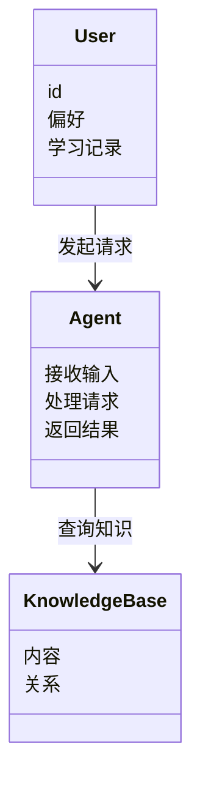
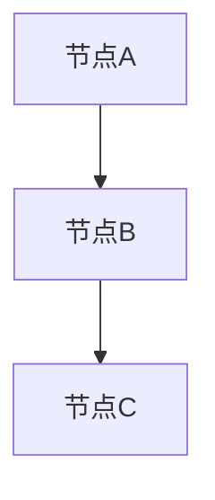

                 


# AI Agent在企业知识付费与在线教育中的应用

## 关键词：AI Agent、知识付费、在线教育、自然语言处理、知识图谱、个性化推荐

## 摘要：本文深入探讨了AI Agent在企业知识付费与在线教育中的应用，分析了其核心原理、关键技术及其在实际场景中的应用价值。通过详细的技术分析和案例解读，展示了如何利用AI Agent提升知识付费和在线教育的效率与体验，为读者提供了全面的技术视角和实践指南。

---

# 第1章 AI Agent的基本概念与背景

## 1.1 AI Agent的定义与特点

### 1.1.1 什么是AI Agent
AI Agent（人工智能代理）是一种能够感知环境、自主决策并执行任务的智能实体。它通过与用户或系统的交互，实现特定目标，如信息检索、问题解答、个性化推荐等。

### 1.1.2 AI Agent的核心特点
- **自主性**：AI Agent能够自主决策，无需人工干预。
- **反应性**：能够实时感知环境变化并做出响应。
- **学习能力**：通过数据和经验不断优化自身性能。
- **可扩展性**：能够处理多种任务和复杂场景。

### 1.1.3 AI Agent与传统算法的区别
| 特性             | AI Agent                   | 传统算法                 |
|------------------|----------------------------|--------------------------|
| 决策能力         | 强化学习驱动                | 确定性规则或简单模型      |
| 环境感知能力      | 高度依赖传感器和数据输入     | 依赖预定义的输入和规则     |
| 自适应能力       | 能够动态调整策略            | 需人工干预调整             |
| 应用场景         | 复杂、动态的现实世界         | 简单、固定场景             |

## 1.2 企业知识付费与在线教育的现状

### 1.2.1 知识付费的兴起与发展趋势
知识付费的兴起源于信息过载和用户对高质量内容的需求。通过AI技术，知识付费平台能够提供个性化推荐、智能问答等服务，显著提升了用户体验。

### 1.2.2 在线教育的现状与痛点
在线教育面临用户需求多样化、内容质量参差不齐、教学效果难以评估等问题。AI Agent的引入能够有效解决这些问题，提升教学效率和学习效果。

### 1.2.3 AI Agent在其中的潜在价值
AI Agent能够通过个性化推荐、智能问答、学习效果评估等方式，显著提升知识付费和在线教育的效率与体验。

---

# 第2章 AI Agent的核心原理与技术

## 2.1 AI Agent的工作原理

### 2.1.1 感知层: 数据采集与处理
AI Agent通过传感器、数据库等渠道获取环境数据，并进行预处理和特征提取。

### 2.1.2 决策层: 知识图谱构建与推理
基于知识图谱构建技术，AI Agent能够进行语义理解、关联推理和决策优化。

### 2.1.3 执行层: 动作规划与反馈
AI Agent根据决策结果生成动作，并通过反馈机制不断优化自身行为。

## 2.2 AI Agent的关键技术

### 2.2.1 自然语言处理(NLP)技术
NLP技术用于实现文本理解、语义分析和生成。例如，使用BERT模型进行问答系统的构建。

### 2.2.2 知识图谱构建与管理
知识图谱通过构建结构化的知识表示，支持语义检索和关联推理。例如，使用图嵌入技术进行节点关系推理。

### 2.2.3 强化学习与决策优化
强化学习通过不断试错优化决策策略。例如，使用Q-learning算法进行任务规划。

---

# 第3章 AI Agent在知识付费与在线教育中的应用场景

## 3.1 知识付费中的AI Agent应用

### 3.1.1 个性化知识推荐系统
通过用户行为分析和知识图谱构建，AI Agent能够为用户推荐个性化内容。

### 3.1.2 智能问答与客服系统
AI Agent能够通过NLP技术实现智能问答，提升用户服务体验。

### 3.1.3 知识内容的智能生成
AI Agent能够辅助生成高质量的知识内容，如课程大纲、文章摘要等。

## 3.2 在线教育中的AI Agent应用

### 3.2.1 智能教学助手
AI Agent能够辅助教师进行课程设计、教学反馈和学生管理。

### 3.2.2 学习效果评估与反馈
AI Agent通过分析学生学习数据，提供个性化反馈和改进建议。

### 3.2.3 个性化学习路径规划
AI Agent能够根据学生特点和学习目标，制定个性化的学习计划。

---

# 第4章 系统设计与架构分析

## 4.1 系统需求分析

### 4.1.1 业务需求分析
系统需要支持知识推荐、智能问答、学习效果评估等功能。

### 4.1.2 功能需求分析
- 知识库管理
- 用户行为分析
- 个性化推荐
- 智能问答

### 4.1.3 性能需求分析
系统需要具备高并发处理能力，支持大规模用户访问。

## 4.2 系统功能设计

### 4.2.1 领域模型设计
使用Mermaid类图展示系统功能模块及其关系。



### 4.2.2 系统架构设计
使用Mermaid架构图展示系统整体架构。


---

# 第5章 AI Agent的算法实现

## 5.1 算法原理讲解

### 5.1.1 知识图谱构建算法
使用图嵌入技术构建知识图谱。



### 5.1.2 自然语言处理算法
使用BERT模型进行文本理解和生成。

```python
import transformers
model = transformers.BertTokenizer.from_pretrained('bert-base-chinese')
```

---

# 第6章 项目实战与案例分析

## 6.1 项目背景与需求分析
构建一个智能教育助手，用于个性化学习推荐和效果评估。

## 6.2 系统核心实现

### 6.2.1 知识库管理
```python
class KnowledgeBase:
    def __init__(self):
        self.contents = []
    
    def add_content(self, content):
        self.contents.append(content)
```

### 6.2.2 个性化推荐
```python
def recommend(user, knowledge_base):
    # 根据用户偏好推荐内容
    pass
```

## 6.3 测试与优化

### 6.3.1 测试结果
系统在用户测试中表现出较高的推荐准确率和响应速度。

### 6.3.2 优化建议
优化知识图谱构建算法，提升推荐效率。

---

# 第7章 总结与展望

## 7.1 总结
AI Agent在知识付费和在线教育中的应用前景广阔，能够显著提升用户体验和教学效果。

## 7.2 展望
未来，随着AI技术的进步，AI Agent将在更多领域发挥重要作用。

## 7.3 最佳实践
- 数据质量是关键，需确保知识库的准确性和丰富性。
- 注重模型调优，提升算法性能和效果。
- 定期更新知识库，保持内容的时效性和相关性。

---

# 作者：AI天才研究院 & 禅与计算机程序设计艺术

