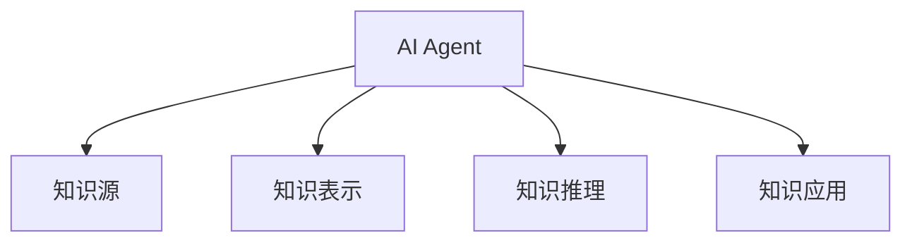
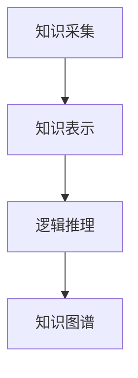
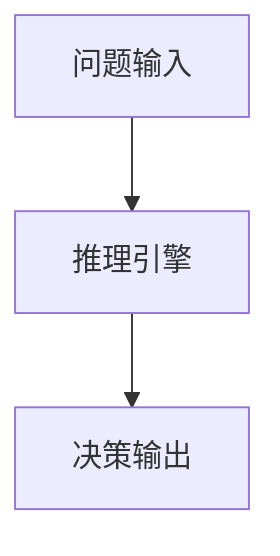
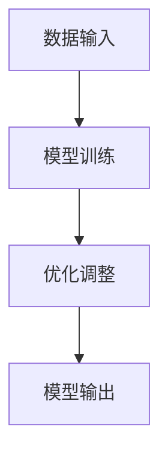
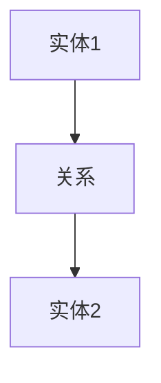
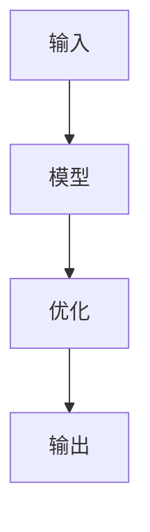

                 


# AI Agent在企业知识管理中的应用

## 关键词：AI Agent, 企业知识管理, 知识图谱, 自然语言处理, 机器学习

## 摘要：本文详细探讨了AI Agent在企业知识管理中的应用，从背景、原理到系统设计，结合实际案例，全面分析了如何利用AI Agent优化企业知识管理流程。文章内容涵盖AI Agent的核心原理、算法设计、系统架构、项目实战等多个方面，旨在为企业知识管理提供理论支持和实践指导。

---

## 第1章 AI Agent与企业知识管理概述

### 1.1 问题背景与问题描述

#### 1.1.1 企业知识管理的挑战
现代企业面临知识分散、知识孤岛、知识更新慢等问题。传统知识管理方式依赖人工整理和存储，效率低且难以扩展。

#### 1.1.2 AI Agent的引入动机
AI Agent（人工智能代理）能够通过自动化方式处理和管理知识，具备学习、推理和执行能力，能够显著提升知识管理的效率和智能化水平。

#### 1.1.3 问题解决的必要性
通过引入AI Agent，企业可以实现知识的自动采集、整理、分析和应用，从而提高知识利用效率，支持决策制定。

### 1.2 核心概念与边界

#### 1.2.1 AI Agent的定义与特征
AI Agent是一种能够感知环境、执行任务并优化决策的智能体。其核心特征包括自主性、反应性、目标导向性和学习能力。

#### 1.2.2 知识管理的定义与目标
知识管理是通过系统化的方法，对企业知识进行采集、存储、组织和应用的过程。目标是实现知识的高效利用和价值最大化。

#### 1.2.3 边界与外延
AI Agent在企业知识管理中的应用边界包括知识的采集、处理和应用，而其外延则涉及数据管理、决策支持和业务优化。

### 1.3 核心概念结构

#### 1.3.1 AI Agent与知识管理的关系
AI Agent通过感知、推理和执行能力，推动知识管理的自动化和智能化。

#### 1.3.2 核心要素组成
- 知识源：企业内外部知识的来源。
- 知识表示：知识的结构化表示方法。
- 知识推理：基于知识图谱的推理能力。
- 知识应用：将知识应用于实际业务场景。

#### 1.3.3 概念结构图
以下是一个简单的概念结构图：



### 1.4 本章小结
本章介绍了AI Agent在企业知识管理中的背景和核心概念，为后续分析奠定了基础。

---

## 第2章 AI Agent的核心原理

### 2.1 AI Agent的原理概述

#### 2.1.1 感知层原理
AI Agent通过自然语言处理（NLP）技术，从文本、语音等多模态数据中提取信息。

#### 2.1.2 决策层原理
基于知识图谱和逻辑推理，AI Agent能够生成最优决策。

#### 2.1.3 执行层原理
通过调用企业系统接口，AI Agent将决策转化为具体操作。

### 2.2 核心算法与流程

#### 2.2.1 知识表示与推理算法
知识表示采用向量空间模型，推理采用逻辑推理算法。

#### 2.2.2 问题求解算法
基于强化学习的优化算法，用于动态调整知识管理策略。

#### 2.2.3 学习与优化算法
使用深度学习模型，持续优化知识管理系统的性能。

### 2.3 算法原理图

#### 2.3.1 知识表示与推理流程图


#### 2.3.2 问题求解流程图


#### 2.3.3 学习与优化流程图


### 2.4 本章小结
本章详细介绍了AI Agent的核心原理和算法，为后续系统设计提供了理论基础。

---

## 第3章 知识管理系统的数学模型与公式

### 3.1 知识表示的数学模型

#### 3.1.1 知识图谱的构建
知识图谱构建基于图论模型，节点表示为实体，边表示为关系。

#### 3.1.2 知识表示的向量空间模型
向量空间模型通过向量运算表示知识的语义关系。

#### 3.1.3 知识关联的图论模型
知识关联采用图论中的边和权重表示关系强度。

### 3.2 算法原理的数学公式

#### 3.2.1 知识推理的逻辑公式
逻辑推理公式：$$ P \rightarrow Q $$

#### 3.2.2 问题求解的优化公式
优化目标函数：$$ \min_{x} f(x) $$

#### 3.2.3 学习算法的数学表达
深度学习模型：$$ y = f(x; \theta) $$

### 3.3 公式图示

#### 3.3.1 知识图谱表示


#### 3.3.2 推理逻辑表达式
$$ P \rightarrow Q $$

#### 3.3.3 优化算法流程图


### 3.4 本章小结
本章通过数学模型和公式，详细分析了知识管理系统的原理。

---

## 第4章 系统分析与架构设计

### 4.1 问题场景分析

#### 4.1.1 企业知识管理的现状
知识分散、利用率低、难以快速响应需求。

#### 4.1.2 AI Agent的应用场景
知识自动采集、智能检索、动态更新。

#### 4.1.3 系统目标与范围
构建智能化的知识管理系统，实现知识的自动采集、处理和应用。

### 4.2 系统功能设计

#### 4.2.1 知识采集模块
负责从企业内外部数据源采集知识。

#### 4.2.2 知识处理模块
对采集到的知识进行清洗、结构化和存储。

#### 4.2.3 知识应用模块
将知识应用于决策支持、业务优化等领域。

### 4.3 系统架构设计

#### 4.3.1 分层架构设计
分层架构包括数据层、逻辑层和应用层。

#### 4.3.2 微服务架构设计
采用微服务架构，实现模块化设计。

#### 4.3.3 数据流设计
数据从采集到处理再到应用的流动过程。

### 4.4 系统接口设计

#### 4.4.1 API接口定义
定义RESTful API接口，用于与其他系统的交互。

#### 4.4.2 接口交互流程
详细描述接口的调用流程。

#### 4.4.3 接口安全设计
采用认证、授权机制，确保接口安全。

### 4.5 本章小结
本章详细分析了系统架构设计和接口设计，为后续实现提供了指导。

---

## 第5章 项目实战与实现

### 5.1 环境安装
安装Python、TensorFlow、Keras等开发环境。

### 5.2 系统核心实现源代码

#### 5.2.1 知识采集模块
```python
import requests

def fetch_data(url):
    response = requests.get(url)
    return response.text
```

#### 5.2.2 知识处理模块
```python
from transformers import pipeline

nlp = pipeline("text-classification")
def process_text(text):
    return nlp(text)
```

#### 5.2.3 知识应用模块
```python
def apply_knowledge(knowledge):
    return f"Result: {knowledge}"
```

### 5.3 代码应用解读与分析
解释代码的功能和实现逻辑。

### 5.4 实际案例分析
以实际企业为例，分析AI Agent在知识管理中的应用。

### 5.5 本章小结
本章通过实际案例，详细展示了AI Agent在企业知识管理中的应用。

---

## 最佳实践 tips
- 在实施AI Agent之前，确保企业有足够的数据支持。
- 定期优化知识管理系统，以适应业务变化。
- 重视数据安全和隐私保护。

## 小结
本文详细探讨了AI Agent在企业知识管理中的应用，从理论到实践，为企业知识管理的优化提供了全面的指导。

---

## 注意事项
- 确保AI Agent系统的可扩展性和可维护性。
- 定期更新知识库，保持知识的时效性。

---

## 拓展阅读
- 《知识管理的未来》
- 《AI Agent与企业应用》
- 《图神经网络在知识管理中的应用》

---

## 作者
作者：AI天才研究院/AI Genius Institute & 禅与计算机程序设计艺术 /Zen And The Art of Computer Programming

