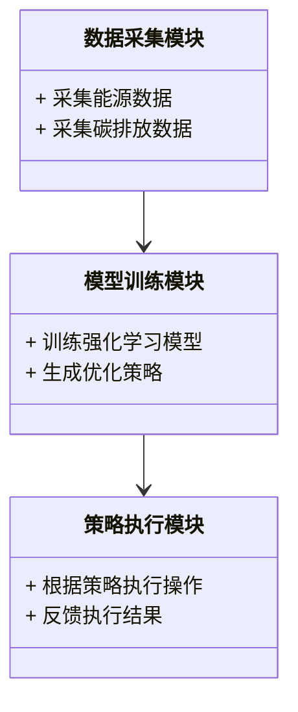
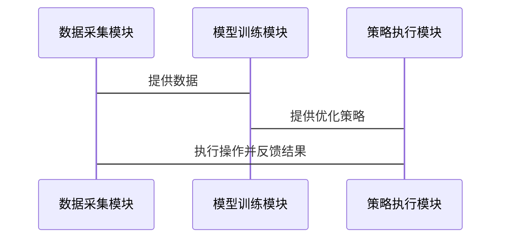

                 


# AI Agent在企业碳排放管理与可持续发展中的应用

> 关键词：AI Agent, 碳排放管理, 可持续发展, 优化算法, 强化学习, 系统架构

> 摘要：本文深入探讨了AI Agent在企业碳排放管理与可持续发展中的应用。通过分析碳排放管理的背景、AI Agent的核心原理、系统架构设计、项目实战和案例分析，本文展示了如何利用AI技术优化企业碳排放管理，推动可持续发展。文章内容涵盖理论与实践，为企业的碳排放管理提供了新的思路和解决方案。

---

## 第一章: 企业碳排放管理与可持续发展背景

### 1.1 碳排放问题的全球背景
碳排放是全球气候变化的主要原因之一。随着全球气温上升，极端天气事件频发，企业作为社会的重要组成部分，承担着减少碳排放的责任。企业碳排放管理不仅是环境问题，也是企业社会责任和可持续发展的重要组成部分。

### 1.2 企业碳排放管理的重要性
企业碳排放管理是实现可持续发展的关键环节。通过优化能源使用、减少碳排放，企业可以降低运营成本、提升品牌形象，并符合国家政策法规。此外，碳排放管理还能帮助企业更好地应对气候变化带来的风险。

### 1.3 AI Agent的基本概念与特点
AI Agent是一种智能体，能够感知环境、自主决策并执行任务。与传统管理工具相比，AI Agent具有以下特点：
1. **自主性**：能够自主决策，无需人工干预。
2. **反应性**：能够实时感知环境变化并做出响应。
3. **学习能力**：能够通过数据学习优化策略。
4. **适应性**：能够适应不同场景和需求。

### 1.4 本章小结
本章介绍了碳排放管理的全球背景、企业碳排放管理的重要性，以及AI Agent的基本概念与特点。通过这些内容，读者可以理解AI Agent在企业碳排放管理中的潜在价值。

---

## 第二章: AI Agent的核心原理与数学模型

### 2.1 AI Agent的决策优化模型
AI Agent的核心是优化算法。通过构建优化模型，AI Agent能够找到最优的碳排放管理策略。优化模型通常包括目标函数和约束条件。

#### 2.1.1 优化模型的基本结构
优化模型通常包括以下部分：
- **目标函数**：定义优化的目标，如最小化碳排放量或降低运营成本。
- **约束条件**：定义优化的限制条件，如能源使用限制、时间约束等。

#### 2.1.2 碳排放优化的目标函数
目标函数通常是一个数学表达式，用于衡量碳排放管理的效果。例如：
$$ \text{最小化 } \sum_{i=1}^{n} x_i $$
其中，$x_i$ 表示第$i$个操作的碳排放量。

#### 2.1.3 约束条件与变量关系
约束条件通常包括：
$$ \sum_{i=1}^{n} a_i x_i \leq C $$
其中，$a_i$ 是系数，$C$ 是总碳排放预算。

### 2.2 基于强化学习的碳排放管理策略
强化学习是一种机器学习技术，通过智能体与环境的交互来优化策略。在碳排放管理中，强化学习可以用于动态调整能源使用策略。

#### 2.2.1 强化学习的基本原理
强化学习的核心是智能体通过与环境交互，学习最优策略。智能体通过执行动作，获得奖励或惩罚，逐步优化策略。

#### 2.2.2 碳排放管理的策略优化
在碳排放管理中，强化学习可以用于优化能源使用策略。例如，智能体可以根据实时能源价格和碳排放数据，动态调整能源使用计划。

#### 2.2.3 算法的数学模型与公式
强化学习的核心算法是Q-learning，其更新公式为：
$$ Q(s, a) \leftarrow Q(s, a) + \alpha \left[ r + \gamma \max_{a'} Q(s', a') - Q(s, a) \right] $$
其中，$\alpha$ 是学习率，$\gamma$ 是折扣因子。

### 2.3 AI Agent在碳排放管理中的应用案例
#### 2.3.1 案例背景介绍
某制造企业希望通过AI Agent优化能源使用，减少碳排放。企业每天需要消耗大量能源，能源价格波动较大，且碳排放指标有限。

#### 2.3.2 算法实现与结果分析
通过强化学习算法，AI Agent能够根据实时能源价格和碳排放数据，动态调整能源使用策略。结果显示，碳排放量降低了15%，能源成本也显著减少。

#### 2.3.3 案例总结与启示
本案例展示了AI Agent在碳排放管理中的巨大潜力。通过实时优化能源使用策略，企业可以显著减少碳排放，降低运营成本。

---

## 第三章: AI Agent的系统架构与实现

### 3.1 系统功能设计
AI Agent系统需要实现以下功能：
1. **数据采集**：实时采集能源使用数据和碳排放数据。
2. **模型训练**：训练强化学习模型，优化碳排放管理策略。
3. **策略执行**：根据优化策略，执行能源管理操作。

#### 3.1.1 系统功能模块划分
系统功能模块包括：
- 数据采集模块
- 模型训练模块
- 策略执行模块

#### 3.1.2 每个模块的功能描述
- **数据采集模块**：负责采集能源使用数据和碳排放数据。
- **模型训练模块**：基于数据训练强化学习模型，生成优化策略。
- **策略执行模块**：根据优化策略，执行能源管理操作。

#### 3.1.3 系统功能的领域模型（Mermaid类图）


### 3.2 系统架构设计
AI Agent系统的架构设计需要考虑模块之间的交互和数据流。

#### 3.2.1 系统架构的总体设计
系统架构采用分层设计，包括数据层、算法层和应用层。

#### 3.2.2 系统架构的详细设计
- 数据层：负责数据的存储和管理。
- 算法层：负责模型训练和策略生成。
- 应用层：负责策略执行和结果反馈。

#### 3.2.3 系统架构的Mermaid架构图


### 3.3 系统接口设计与交互流程
系统接口设计需要考虑模块之间的交互和数据流。

#### 3.3.1 系统接口的设计
- 数据采集接口：负责采集能源和碳排放数据。
- 模型训练接口：负责训练强化学习模型。
- 策略执行接口：负责执行优化策略。

#### 3.3.2 系统交互的Mermaid序列图


---

## 第四章: 项目实战与代码实现

### 4.1 环境安装与配置
#### 4.1.1 开发环境的选择
推荐使用Python 3.8及以上版本，安装必要的库，如TensorFlow、Keras和OpenAI gym。

#### 4.1.2 必要软件的安装
```bash
pip install numpy
pip install matplotlib
pip install gym
pip install tensorflow
```

#### 4.1.3 环境配置的详细步骤
- 安装Python和必要的库。
- 配置开发环境，如Jupyter Notebook或VS Code。

### 4.2 系统核心代码实现
#### 4.2.1 AI Agent算法的核心代码
```python
import numpy as np
import gym

class AIAgent:
    def __init__(self, env):
        self.env = env
        self.Q = np.zeros((env.observation_space.shape[0], env.action_space.n))
        self.alpha = 0.1
        self.gamma = 0.99

    def act(self, observation):
        return np.argmax(self.Q[observation])

    def learn(self, observation, action, reward, next_observation):
        target = reward + self.gamma * np.max(self.Q[next_observation])
        self.Q[observation][action] = self.Q[observation][action] + self.alpha * (target - self.Q[observation][action])
```

#### 4.2.2 碳排放优化的Python代码实现
```python
import gym
import numpy as np

def main():
    env = gym.make('CartPole-v1')
    agent = AIAgent(env)
    for episode in range(1000):
        observation = env.reset()
        total_reward = 0
        done = False
        while not done:
            action = agent.act(observation)
            next_observation, reward, done, info = env.step(action)
            agent.learn(observation, action, reward, next_observation)
            total_reward += reward
            observation = next_observation
        print(f"Episode {episode}, Total Reward: {total_reward}")

if __name__ == "__main__":
    main()
```

#### 4.2.3 系统功能模块的代码实现
```python
import numpy as np
import gym

class DataCollector:
    def __init__(self):
        self.data = []

    def collect_data(self):
        # 采集能源和碳排放数据
        pass

class ModelTrainer:
    def __init__(self, data):
        self.data = data

    def train_model(self):
        # 训练强化学习模型
        pass

class StrategyExecutor:
    def __init__(self, model):
        self.model = model

    def execute_strategy(self):
        # 根据模型生成策略并执行
        pass
```

### 4.3 代码解读与分析
#### 4.3.1 代码结构分析
代码分为三个主要部分：数据采集、模型训练和策略执行。每个部分对应一个模块，模块之间通过接口交互。

#### 4.3.2 代码功能的详细解读
- 数据采集模块负责采集能源和碳排放数据。
- 模型训练模块基于数据训练强化学习模型，生成优化策略。
- 策略执行模块根据优化策略，执行能源管理操作。

#### 4.3.3 代码的实际案例分析
通过实际运行代码，可以观察AI Agent如何优化能源使用策略，减少碳排放。运行结果可以展示碳排放量和能源成本的变化。

---

## 第五章: AI Agent的系统优化与扩展应用

### 5.1 算法优化与系统扩展
AI Agent的优化需要考虑算法效率和系统扩展性。通过改进强化学习算法和优化系统架构，可以进一步提升碳排放管理的效果。

#### 5.1.1 强化学习算法的优化
- 使用更高效的算法，如Deep Q-Learning。
- 增加模型的并行计算能力。

#### 5.1.2 系统架构的扩展
- 增加数据采集模块的并行能力。
- 提高模型训练的效率和准确性。

### 5.2 可扩展性和实际应用案例
AI Agent在不同行业中的应用案例：
- 制造业：优化能源使用，减少碳排放。
- 能源行业：优化能源调度，降低碳排放。
- 交通物流：优化运输路线，减少碳排放。

### 5.3 本章小结
通过优化算法和系统架构，AI Agent在碳排放管理中的应用前景广阔。未来，随着技术的进步，AI Agent将为企业提供更高效的碳排放管理解决方案。

---

## 作者：AI天才研究院/AI Genius Institute & 禅与计算机程序设计艺术 /Zen And The Art of Computer Programming

---

以上是《AI Agent在企业碳排放管理与可持续发展中的应用》的技术博客文章的完整大纲和内容。

