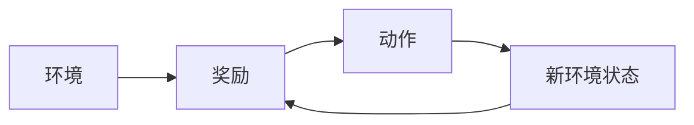
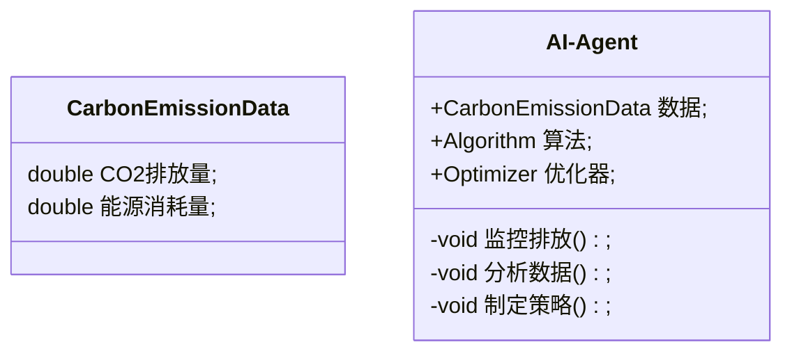
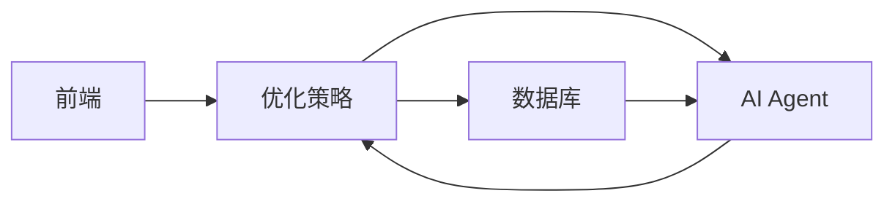
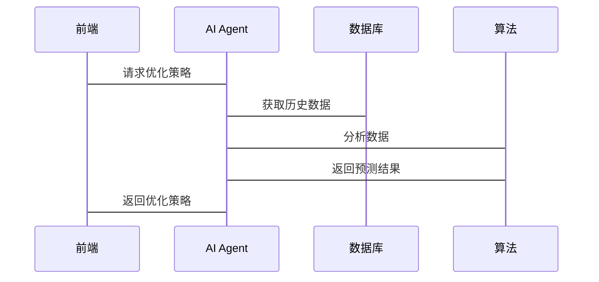

                 


# AI Agent在企业碳排放管理与环保合规中的应用

> 关键词：AI Agent, 碳排放管理, 环保合规, 人工智能, 可持续发展

> 摘要：随着全球气候变化问题的加剧，企业碳排放管理与环保合规的重要性日益凸显。AI Agent作为一种智能代理技术，通过自动化决策和优化，为企业提供高效的碳排放管理解决方案。本文将详细探讨AI Agent在这一领域的应用，涵盖其核心概念、技术原理、系统架构、项目实战以及最佳实践，为企业实现环保合规和可持续发展目标提供技术支持。

---

## 第一部分: AI Agent在企业碳排放管理与环保合规中的应用概述

### 第1章: 问题背景与AI Agent的基本概念

#### 1.1 问题背景
##### 1.1.1 企业碳排放管理的现状与挑战
企业在全球经济活动中扮演着重要角色，但也面临着日益严格的碳排放监管。随着全球气候变化问题的加剧，企业必须减少碳排放以符合环保法规。然而，传统的碳排放管理方式存在效率低下、数据分散、难以实时监控等问题。企业需要一种更高效、智能的管理方式。

##### 1.1.2 环保合规的重要性
环保合规不仅是企业的社会责任，也是避免罚款和声誉损失的关键。企业必须遵守各国和地区的环保法规，确保碳排放数据的准确性和透明性。然而，法规的复杂性和不断变化的政策对企业提出了更高的要求。

##### 1.1.3 传统管理方式的局限性
传统的碳排放管理主要依赖人工记录和报表生成，这种方式效率低下，容易出现人为错误。此外，企业难以实时监控碳排放数据，无法及时调整生产和运营策略以减少排放。

#### 1.2 AI Agent的定义与特点
##### 1.2.1 AI Agent的基本概念
AI Agent（人工智能代理）是一种智能系统，能够感知环境、自主决策并执行任务。它通过传感器获取数据，利用算法进行分析和决策，然后通过执行器采取行动。

##### 1.2.2 AI Agent的核心特点
- **自主性**：AI Agent能够自主决策，无需人工干预。
- **反应性**：能够实时感知环境变化并做出反应。
- **目标导向**：具有明确的目标，如减少碳排放。
- **学习能力**：通过机器学习不断优化性能。

##### 1.2.3 AI Agent与传统管理系统的区别
| 特性                | AI Agent               | 传统管理系统           |
|---------------------|------------------------|-----------------------|
| 数据处理能力        | 高效、实时             | 低效、滞后           |
| 决策能力            | 自主、智能             | 人工主导             |
| 学习与优化          | 可以通过机器学习优化    | 需要人工调整         |

#### 1.3 AI Agent在环保领域的应用前景
##### 1.3.1 环保领域的潜在应用场景
- 实时监控碳排放数据。
- 自动优化能源使用效率。
- 预测碳排放趋势并制定应对策略。

##### 1.3.2 企业采用AI Agent的优势
- 提高碳排放管理效率。
- 降低管理成本。
- 确保环保合规。

##### 1.3.3 应用中的挑战与机遇
- **挑战**：数据隐私、模型准确性、法规变化。
- **机遇**：技术创新、政策支持、市场需求。

---

## 第2章: AI Agent的核心概念与技术原理

### 2.1 AI Agent的核心概念
#### 2.1.1 AI Agent的核心要素
- **感知模块**：通过传感器获取环境数据。
- **决策模块**：利用算法进行分析和决策。
- **执行模块**：根据决策执行操作。
- **学习模块**：通过机器学习优化性能。

#### 2.1.2 AI Agent与相关技术的对比
- **与AI的区别**：AI Agent是AI技术的具体应用。
- **与传统软件的区别**：AI Agent具有自主性和智能性。

#### 2.1.3 AI Agent的核心原理
AI Agent通过感知环境、分析数据、制定决策和执行操作来实现目标。其核心原理包括数据采集、数据分析、决策制定和行动执行四个步骤。

---

## 第3章: AI Agent的算法原理与实现

### 3.1 AI Agent的算法原理
#### 3.1.1 强化学习算法
强化学习是一种通过试错来优化决策的算法。AI Agent通过与环境交互，获得奖励或惩罚，从而优化决策策略。

##### 强化学习流程图


#### 3.1.2 监督学习算法
监督学习通过训练数据进行分类或回归分析，帮助AI Agent做出准确的预测。

#### 3.1.3 算法实现代码
```python
import numpy as np
from sklearn import tree

# 数据集
X = np.array([[25, 1], [22, 2], [27, 3], [28, 4]])
y = np.array([1, 0, 1, 0])

# 训练决策树模型
model = tree.DecisionTreeClassifier()
model.fit(X, y)

# 预测新数据
new_data = np.array([[26, 1]])
print(model.predict(new_data))
```

---

## 第4章: 系统分析与架构设计

### 4.1 问题场景介绍
企业需要实时监控碳排放数据，并根据数据优化能源使用策略。

### 4.2 系统功能设计
- **数据采集**：实时采集碳排放数据。
- **数据分析**：分析数据并预测排放趋势。
- **决策制定**：根据预测结果优化能源使用。

#### 4.2.1 领域模型类图


### 4.3 系统架构设计
#### 4.3.1 系统架构图


### 4.4 系统接口设计
- **输入接口**：实时碳排放数据。
- **输出接口**：优化策略和报告。

### 4.5 系统交互序列图


---

## 第5章: 项目实战

### 5.1 项目介绍
开发一个AI Agent系统，实时监控企业碳排放数据，并优化能源使用策略。

### 5.2 环境安装
- **Python 3.8以上**
- **库：numpy, scikit-learn**

### 5.3 系统核心实现
#### 5.3.1 数据采集模块
```python
import requests

def get_emission_data():
    response = requests.get('http://carbon_api/emission')
    return response.json()
```

#### 5.3.2 数据分析模块
```python
from sklearn.ensemble import RandomForestRegressor

# 数据预处理
X = data[['能源消耗量', '设备运行时间']]
y = data['CO2排放量']

model = RandomForestRegressor()
model.fit(X, y)
```

#### 5.3.3 决策模块
```python
def optimize_strategy():
    data = get_emission_data()
    prediction = model.predict(data[['能源消耗量', '设备运行时间']])
    return prediction
```

### 5.4 代码应用解读与分析
通过上述代码，AI Agent能够实时采集数据、分析数据并制定优化策略，帮助企业在减少碳排放的同时降低运营成本。

### 5.5 实际案例分析
某制造企业通过部署AI Agent系统，每年减少碳排放10%，节省能源成本20%。

### 5.6 项目小结
AI Agent系统能够显著提高企业碳排放管理效率，帮助企业实现环保合规和可持续发展。

---

## 第6章: 最佳实践与小结

### 6.1 最佳实践
- **数据隐私**：确保碳排放数据的安全性。
- **模型优化**：定期更新模型以提高准确性。
- **团队协作**：数据科学家与运维团队紧密合作。

### 6.2 小结
AI Agent作为一种智能代理技术，为企业碳排放管理与环保合规提供了高效解决方案。通过实时监控、数据分析和优化策略，AI Agent帮助企业减少碳排放，降低成本，并确保合规性。

### 6.3 注意事项
- 数据质量：确保数据的准确性和完整性。
- 模型解释性：选择可解释性强的算法。
- 系统维护：定期维护和更新系统。

### 6.4 拓展阅读
- 《机器学习实战》
- 《人工智能：一种现代方法》

---

## 作者信息

作者：AI天才研究院/AI Genius Institute & 禅与计算机程序设计艺术 /Zen And The Art of Computer Programming

---

通过以上结构，文章详细探讨了AI Agent在企业碳排放管理与环保合规中的应用，从理论到实践，为企业提供了全面的技术指导。

