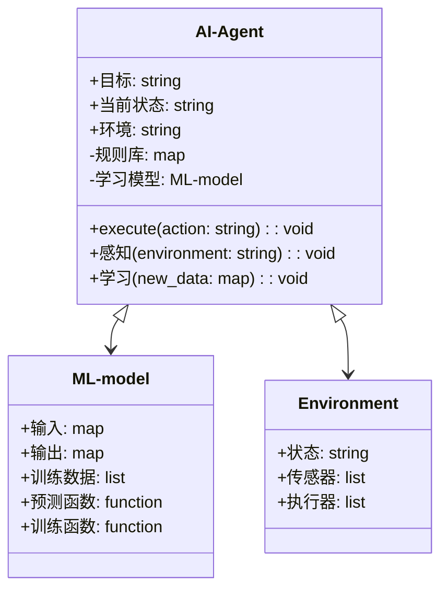
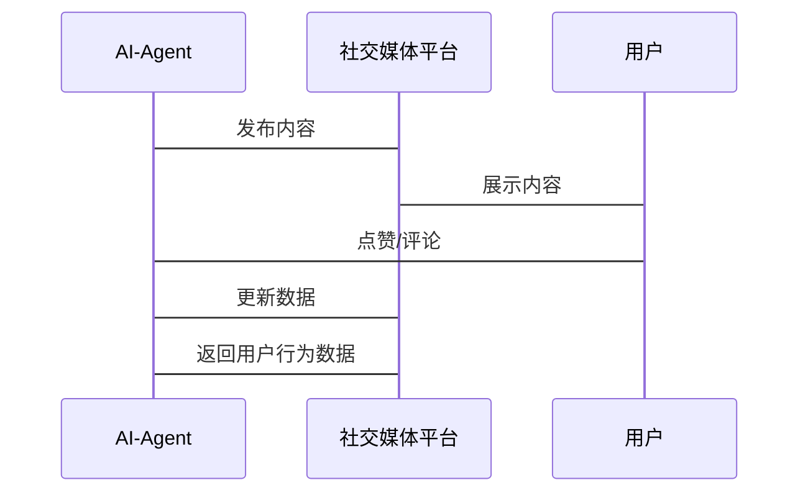

                 


# AI Agent在企业社交媒体管理中的应用

> 关键词：AI Agent, 企业社交媒体管理, 自然语言处理, 机器学习, 社交媒体优化

> 摘要：随着社交媒体在企业中的重要性日益增加，如何高效、智能地管理社交媒体成为企业面临的关键挑战。本文探讨了AI Agent在企业社交媒体管理中的应用，详细分析了其核心技术、应用场景、系统架构及项目实战。通过本文，读者将深入了解AI Agent如何助力企业提升社交媒体管理效率和决策能力。

---

## 第1章: AI Agent与企业社交媒体管理概述

### 1.1 AI Agent的基本概念

#### 1.1.1 什么是AI Agent
AI Agent（人工智能代理）是指能够感知环境、自主决策并执行任务的智能实体。它通过传感器获取信息，利用算法进行分析，并通过执行器完成目标。

#### 1.1.2 AI Agent的核心特征
- **自主性**：无需人工干预，自主完成任务。
- **反应性**：能够实时感知环境并做出反应。
- **目标导向**：以明确的目标为导向，优化决策。
- **学习能力**：通过数据和经验不断优化自身性能。

#### 1.1.3 AI Agent与传统自动化工具的区别
传统的自动化工具基于固定的规则执行任务，而AI Agent能够根据环境变化自适应调整策略，具备更强的灵活性和智能性。

### 1.2 企业社交媒体管理的挑战

#### 1.2.1 社交媒体管理的复杂性
- 多平台覆盖：企业需要管理多个社交媒体平台，如微博、Twitter、LinkedIn等。
- 用户互动：处理大量用户的评论、私信和反馈。
- 内容生成：需要持续产出高质量的内容以吸引用户。
- 舆情监控：实时监控品牌形象和声誉，应对突发事件。

#### 1.2.2 传统社交媒体管理的局限性
- **效率低下**：人工管理社交媒体账号效率低，难以应对海量信息。
- **决策延迟**：人工分析数据耗时长，无法快速响应市场变化。
- **缺乏个性化**：难以针对不同用户群体提供个性化内容。

#### 1.2.3 企业对高效社交媒体管理的需求
- **提高效率**：通过自动化工具减少人工干预，提升管理效率。
- **精准决策**：利用数据驱动的洞察，优化营销策略。
- **增强用户体验**：通过个性化内容和即时互动提升用户满意度。

### 1.3 AI Agent在企业社交媒体管理中的作用

#### 1.3.1 提高管理效率
AI Agent能够自动化处理大量重复性任务，如内容发布、用户回复等，显著提高管理效率。

#### 1.3.2 实现智能化决策
通过分析海量数据，AI Agent能够提供精准的市场洞察和决策建议，帮助企业在复杂环境中做出最优选择。

#### 1.3.3 优化用户体验
AI Agent能够实时感知用户需求，提供个性化内容和即时互动，显著提升用户体验。

### 1.4 本章小结
本章介绍了AI Agent的基本概念及其在企业社交媒体管理中的重要性，分析了传统社交媒体管理的挑战，并探讨了AI Agent在解决这些问题中的潜力。

---

## 第2章: AI Agent的核心技术与原理

### 2.1 自然语言处理（NLP）基础

#### 2.1.1 NLP的基本概念
NLP是研究如何让计算机理解和生成人类语言的学科，是AI Agent的核心技术之一。

#### 2.1.2 常见的NLP技术
- **分词**：将文本分割成有意义的词语或短语。
- **实体识别**：识别文本中的命名实体（如人名、地名、组织名）。
- **情感分析**：判断文本的情感倾向（正面、负面、中性）。
- **文本生成**：根据输入生成自然语言文本。

#### 2.1.3 NLP在社交媒体管理中的应用
- **舆情分析**：分析用户评论的情感倾向，帮助企业了解品牌形象。
- **内容生成**：自动生成社交媒体帖子、回复用户评论。
- **关键词提取**：提取文本中的关键词，用于主题分析。

### 2.2 机器学习与深度学习

#### 2.2.1 机器学习的基本原理
机器学习是一种通过数据训练模型，使其能够从数据中学习规律并进行预测的技术。

#### 2.2.2 深度学习的核心技术
深度学习是机器学习的一种，通过多层神经网络模型提取数据特征，适用于复杂的模式识别任务。

#### 2.2.3 机器学习在AI Agent中的应用
- **用户行为预测**：通过历史数据训练模型，预测用户的下一步行为。
- **内容推荐**：基于用户偏好推荐相关内容。
- **异常检测**：识别异常行为，如恶意评论或攻击性言论。

### 2.3 AI Agent的算法原理

#### 2.3.1 基于规则的AI Agent
基于规则的AI Agent通过预定义的规则执行任务，适用于任务明确、规则固定的场景。

- **优点**：简单易懂，开发周期短。
- **缺点**：灵活性差，难以应对复杂场景。

#### 2.3.2 基于模型的AI Agent
基于模型的AI Agent通过构建数学模型进行决策，适用于复杂场景。

- **优点**：灵活性高，能够应对复杂任务。
- **缺点**：开发复杂度高，需要大量数据训练。

#### 2.3.3 基于强化学习的AI Agent
基于强化学习的AI Agent通过与环境互动，不断优化策略。

- **优点**：能够在动态环境中自适应调整策略。
- **缺点**：训练周期长，需要大量计算资源。

### 2.4 本章小结
本章详细介绍了AI Agent的核心技术，包括自然语言处理和机器学习，并探讨了不同类型的AI Agent及其适用场景。

---

## 第3章: AI Agent在企业社交媒体管理中的应用场景

### 3.1 内容生成与优化

#### 3.1.1 自动化内容创作
AI Agent可以根据品牌调性和目标受众生成高质量的社交媒体内容，包括帖子、评论等。

#### 3.1.2 内容优化建议
通过分析历史数据，AI Agent可以提供内容优化建议，如最佳发布时间、热门话题等。

#### 3.1.3 内容效果预测
AI Agent可以通过预测模型评估内容的效果，帮助企业提前制定应对策略。

### 3.2 用户行为分析与预测

#### 3.2.1 用户行为数据采集
通过社交媒体平台获取用户的行为数据，如点击、点赞、评论等。

#### 3.2.2 用户行为模式分析
利用数据挖掘技术分析用户行为模式，识别用户的兴趣和偏好。

#### 3.2.3 用户行为预测与干预
通过预测模型预测用户的下一步行为，并采取相应的干预措施，如个性化推荐。

### 3.3 舆情监控与危机管理

#### 3.3.1 实时舆情监控
AI Agent可以实时监控社交媒体上的舆情，识别潜在的危机事件。

#### 3.3.2 危机事件预警
通过异常检测技术，AI Agent可以提前预警可能引发危机的事件。

#### 3.3.3 舆情分析与应对策略
AI Agent可以提供舆情分析报告，并建议应对策略，帮助企业有效管理品牌形象。

### 3.4 本章小结
本章详细探讨了AI Agent在企业社交媒体管理中的应用场景，包括内容生成、用户行为分析和舆情监控等方面。

---

## 第4章: AI Agent的系统架构与设计

### 4.1 系统架构

#### 4.1.1 问题场景介绍
企业需要一个高效的AI Agent系统来管理多个社交媒体平台，实时监控舆情并提供智能化决策支持。

#### 4.1.2 系统功能设计

##### 4.1.2.1 领域模型（mermaid类图）


#### 4.1.2.2 系统架构设计（mermaid架构图）


#### 4.1.2.3 系统接口设计
- **社交媒体API接口**：用于与各个社交媒体平台交互，如发布内容、获取用户数据等。
- **数据存储接口**：用于存储和检索历史数据，支持高效的查询和分析。
- **用户交互接口**：供用户与AI-Agent进行交互，如设置目标、查看分析结果等。

#### 4.1.2.4 系统交互（mermaid序列图）


### 4.2 本章小结
本章详细介绍了AI Agent系统的架构设计，包括系统功能设计、架构图、接口设计和系统交互流程。

---

## 第5章: 项目实战——AI Agent在社交媒体管理中的应用

### 5.1 环境搭建

#### 5.1.1 系统需求
- **编程语言**：Python 3.8+
- **开发工具**：Jupyter Notebook或VS Code
- **依赖库**：自然语言处理库（如spaCy、NLTK）、机器学习库（如scikit-learn、TensorFlow）

#### 5.1.2 安装依赖
```bash
pip install spacy scikit-learn tensorflow
python -m spacy download en_core_web_sm
```

### 5.2 系统核心实现

#### 5.2.1 内容生成模块
```python
from spacy.lang.en import English
from spacy.lang.zh import Chinese

nlp = English()  # 或者使用 Chinese()

def generate_content(topic):
    doc = nlp(topic)
    keywords = [token.text for token in doc]
    content = " ".join(keywords)
    return content
```

#### 5.2.2 用户行为分析模块
```python
from sklearn.feature_extraction.text import TfidfVectorizer
from sklearn.cluster import KMeans

vectorizer = TfidfVectorizer()
X = vectorizer.fit_transform(user_comments)
model = KMeans(n_clusters=5)
model.fit(X)
```

#### 5.2.3 舆情监控模块
```python
import tensorflow as tf
from tensorflow.keras.models import Sequential
from tensorflow.keras.layers import Dense

model = Sequential()
model.add(Dense(64, activation='relu', input_shape=(input_dim,)))
model.add(Dense(1, activation='sigmoid'))
model.compile(optimizer='adam', loss='binary_crossentropy')
model.fit(x_train, y_train, epochs=10, batch_size=32)
```

### 5.3 案例分析

#### 5.3.1 案例背景
某企业希望优化其社交媒体内容发布策略，提升用户互动率。

#### 5.3.2 数据收集
从社交媒体平台获取过去一个月的内容发布记录和用户互动数据。

#### 5.3.3 数据分析
利用NLP技术提取关键词，分析用户偏好和情感倾向。

#### 5.3.4 模型训练
训练一个情感分类模型，预测用户对新内容的情感倾向。

#### 5.3.5 实施优化
根据模型预测结果，调整内容发布策略，优化用户互动率。

### 5.4 项目小结
本章通过一个实际案例，详细讲解了AI Agent在企业社交媒体管理中的具体实现和应用。

---

## 第6章: 总结与展望

### 6.1 本章总结
本文详细探讨了AI Agent在企业社交媒体管理中的应用，从核心技术到具体应用场景，再到系统架构和项目实战，全面介绍了AI Agent的优势和潜力。

### 6.2 未来展望
随着AI技术的不断发展，AI Agent在企业社交媒体管理中的应用将更加广泛和深入。未来的研究方向包括更复杂的决策模型、多模态交互技术以及更高效的训练方法。

---

## 作者：AI天才研究院/AI Genius Institute & 禅与计算机程序设计艺术 /Zen And The Art of Computer Programming

---

**注意**：以上文章是根据您的要求创作的内容，如需进一步调整或补充，请随时告知！

