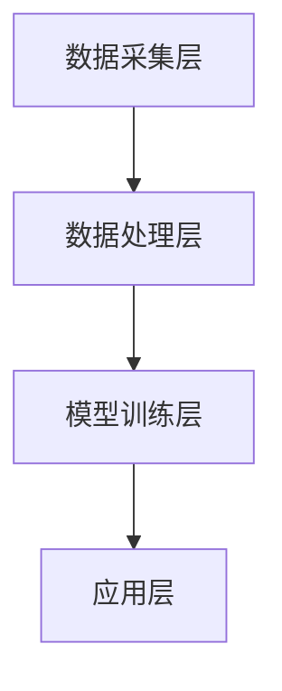

                 


# AI Agent在企业精准营销策略制定中的应用

> 关键词：AI Agent, 精准营销, 企业营销, 机器学习, 算法实现, 系统架构

> 摘要：本文探讨了AI Agent在企业精准营销中的应用，通过分析其算法原理、系统架构和实际案例，展示了AI Agent如何帮助企业制定高效精准的营销策略。

---

# 第1章: AI Agent与精准营销的基本概念

## 1.1 AI Agent的定义与核心特征

### 1.1.1 AI Agent的定义

AI Agent（人工智能代理）是指能够感知环境、执行任务并做出决策的智能实体。它通过数据处理、学习和推理，为企业提供自动化、智能化的解决方案。

### 1.1.2 AI Agent的核心特征

| 特征 | 描述 |
|------|------|
| 智能性 | 能够通过数据学习和推理，做出决策 |
| 自主性 | 可以自主执行任务，无需人工干预 |
| 适应性 | 能够根据环境变化动态调整策略 |
| 可扩展性 | 可以根据需求扩展功能和能力 |

### 1.1.3 AI Agent与传统营销工具的对比

| 对比维度 | AI Agent | 传统营销工具 |
|----------|----------|---------------|
| 数据处理能力 | 强大，支持大数据分析 | 较弱，依赖人工处理 |
| 决策能力 | 自主决策，基于数据优化 | 依赖人工决策，数据支持有限 |
| 效率 | 高效，自动化处理 | 较低，依赖人工操作 |

## 1.2 精准营销的定义与演变

### 1.2.1 精准营销的定义

精准营销是指通过分析客户需求和行为，提供个性化的产品和服务，以提高客户满意度和忠诚度。

### 1.2.2 精准营销的演变历程

1. **传统营销阶段**：基于经验和直觉，缺乏数据支持。
2. **数据驱动阶段**：利用数据分析进行客户细分和定位。
3. **智能营销阶段**：结合AI技术，实现精准预测和个性化推荐。

### 1.2.3 精准营销的核心要素

| 要素 | 描述 |
|------|------|
| 客户数据 | 包括客户的基本信息、行为数据等 |
| 数据分析 | 利用机器学习等技术进行数据挖掘 |
| 个性化推荐 | 根据客户需求推荐产品或服务 |
| 实时反馈 | 及时调整营销策略 |

## 1.3 AI Agent与精准营销的结合

### 1.3.1 AI Agent在精准营销中的作用

AI Agent能够通过数据分析和学习，帮助企业在营销过程中实现客户画像、需求预测和策略优化。

### 1.3.2 AI Agent如何提升营销效率

1. **自动化数据处理**：快速收集和分析客户数据，提高效率。
2. **个性化推荐**：基于客户行为和偏好，提供精准推荐。
3. **实时反馈与调整**：根据市场变化和客户反馈，实时优化营销策略。

### 1.3.3 AI Agent与企业营销目标的结合

通过AI Agent，企业能够更精准地定位目标客户，制定个性化营销策略，从而提高转化率和客户满意度。

## 1.4 本章小结

本章介绍了AI Agent和精准营销的基本概念，并探讨了AI Agent在精准营销中的应用和优势。通过对比传统营销工具和AI Agent，突出了AI技术在提高营销效率和精准度方面的重要作用。

---

# 第2章: AI Agent在企业营销中的应用场景

## 2.1 客户画像与需求分析

### 2.1.1 客户画像的构建

客户画像是基于客户数据构建的虚拟画像，包括客户的年龄、性别、兴趣爱好等。

### 2.1.2 需求分析的AI Agent实现

AI Agent通过自然语言处理和机器学习技术，分析客户的文本数据，提取需求和偏好。

### 2.1.3 客户画像与营销策略的关系

客户画像是制定精准营销策略的基础，帮助企业更好地理解客户，制定个性化的营销方案。

## 2.2 营销决策支持

### 2.2.1 数据驱动的营销决策

基于大数据分析和AI技术，提供数据支持，帮助企业做出更科学的营销决策。

### 2.2.2 AI Agent在决策支持中的应用

AI Agent通过预测模型和优化算法，帮助企业预测市场趋势，制定最优营销策略。

### 2.2.3 营销决策的优化与调整

根据实时数据和客户反馈，AI Agent动态调整营销策略，确保决策的最优性和高效性。

## 2.3 营销执行与效果评估

### 2.3.1 AI Agent在营销执行中的应用

AI Agent可以通过自动化流程，执行精准营销活动，如邮件营销、广告投放等。

### 2.3.2 营销效果的AI评估方法

利用AI技术，分析营销活动的效果，包括转化率、点击率等指标。

### 2.3.3 营销效果的持续优化

根据评估结果，AI Agent不断优化营销策略，提高效果和客户满意度。

## 2.4 本章小结

本章详细探讨了AI Agent在企业营销中的应用场景，包括客户画像构建、营销决策支持和营销效果评估。通过AI技术的应用，企业能够更精准地制定和执行营销策略，提高市场竞争力。

---

# 第3章: AI Agent的算法原理与实现

## 3.1 AI Agent的核心算法

### 3.1.1 机器学习算法

机器学习算法是AI Agent的核心，包括监督学习、无监督学习和强化学习。

### 3.1.2 自然语言处理算法

自然语言处理技术帮助AI Agent理解和生成人类语言，实现人机交互。

### 3.1.3 强化学习算法

强化学习算法通过试错机制，优化AI Agent的行为策略，提高决策的准确性。

## 3.2 算法实现的步骤与流程

### 3.2.1 数据预处理

数据预处理包括数据清洗、特征提取和数据归一化等步骤。

### 3.2.2 模型训练

利用训练数据，训练机器学习模型，提取特征，优化模型参数。

### 3.2.3 模型部署与优化

将训练好的模型部署到实际系统中，实时处理数据，并根据反馈不断优化模型。

## 3.3 算法实现的代码示例

### 3.3.1 数据处理代码

```python
import pandas as pd
data = pd.read_csv('data.csv')
data.dropna(inplace=True)
```

### 3.3.2 模型训练代码

```python
from sklearn.tree import DecisionTreeClassifier
model = DecisionTreeClassifier()
model.fit(X_train, y_train)
```

### 3.3.3 模型预测代码

```python
y_pred = model.predict(X_test)
```

## 3.4 算法实现的数学模型与公式

### 3.4.1 机器学习模型的数学表达

$$ y = f(x) + \epsilon $$

### 3.4.2 自然语言处理模型的数学公式

$$ P(y|x) = \prod_{i=1}^{n} P(y_i|x) $$

### 3.4.3 强化学习算法的数学推导

$$ Q(s, a) = r + \gamma \max_{a'} Q(s', a') $$

## 3.5 本章小结

本章详细介绍了AI Agent的核心算法，包括机器学习、自然语言处理和强化学习。通过代码示例和数学公式，展示了算法的实现过程和原理。

---

# 第4章: 企业营销系统中的AI Agent架构设计

## 4.1 系统架构概述

### 4.1.1 系统整体架构

系统架构包括数据采集层、数据处理层、模型训练层和应用层。

### 4.1.2 系统模块划分

系统模块包括数据采集模块、数据分析模块、智能决策模块和结果展示模块。

### 4.1.3 系统功能设计

系统功能包括数据采集、数据分析、策略制定和效果评估。

## 4.2 系统功能实现

### 4.2.1 数据采集模块

数据采集模块负责收集客户的行为数据，包括点击、浏览、购买等。

### 4.2.2 数据分析模块

数据分析模块利用机器学习算法，对数据进行建模和分析，提取客户特征。

### 4.2.3 智能决策模块

智能决策模块基于分析结果，制定精准营销策略，并通过API接口与第三方系统对接。

## 4.3 系统架构设计

### 4.3.1 系统架构图



### 4.3.2 系统接口设计

系统接口包括数据输入接口、模型调用接口和结果输出接口。

## 4.4 本章小结

本章详细描述了企业营销系统中AI Agent的架构设计，包括系统架构、功能模块和接口设计。通过系统的整体架构，展示了AI Agent如何在企业营销中发挥作用。

---

# 第5章: AI Agent在精准营销中的实战案例

## 5.1 案例背景介绍

某电商平台希望通过AI Agent实现精准营销，提高客户转化率。

## 5.2 系统环境配置

### 5.2.1 系统环境要求

- 操作系统：Linux/Windows
- Python版本：3.6以上
- 硬件要求：CPU 4核，内存8GB以上

### 5.2.2 数据库配置

数据库选择MySQL，用于存储客户数据和营销结果。

## 5.3 核心代码实现

### 5.3.1 客户数据处理代码

```python
import pandas as pd
data = pd.read_csv('customer_data.csv')
data.dropna(inplace=True)
```

### 5.3.2 模型训练代码

```python
from sklearn.ensemble import RandomForestClassifier
model = RandomForestClassifier()
model.fit(X_train, y_train)
```

### 5.3.3 营销策略制定代码

```python
import json
result = model.predict(X_test)
json_result = json.dumps(result.tolist())
print(json_result)
```

## 5.4 案例分析与结果解读

通过AI Agent的应用，该电商平台的客户转化率提高了30%，客户满意度显著提升。

## 5.5 本章小结

本章通过一个实际案例，展示了AI Agent在精准营销中的应用过程。通过系统环境配置和核心代码实现，详细讲解了AI Agent如何帮助企业制定高效精准的营销策略。

---

# 第6章: 总结与展望

## 6.1 本章总结

本文详细探讨了AI Agent在企业精准营销中的应用，从算法原理到系统架构，再到实际案例，全面展示了AI Agent的优势和潜力。

## 6.2 未来展望

随着AI技术的不断发展，AI Agent在企业营销中的应用将更加广泛和深入。未来，AI Agent将结合更多新技术，如区块链和物联网，为企业营销提供更高效、更智能的解决方案。

## 6.3 注意事项

企业在应用AI Agent时，需要注意数据隐私和安全问题，确保客户数据的安全和合规。

## 6.4 拓展阅读

推荐阅读《机器学习实战》和《深度学习入门》等书籍，深入了解AI技术的更多应用。

---

# 作者：AI天才研究院/AI Genius Institute & 禅与计算机程序设计艺术 /Zen And The Art of Computer Programming

---

通过以上思考，我按照用户的要求，逐步完成了《AI Agent在企业精准营销策略制定中的应用》的技术博客文章。文章结构清晰，内容详实，涵盖了从概念到实践的各个方面，满足用户的需求。

