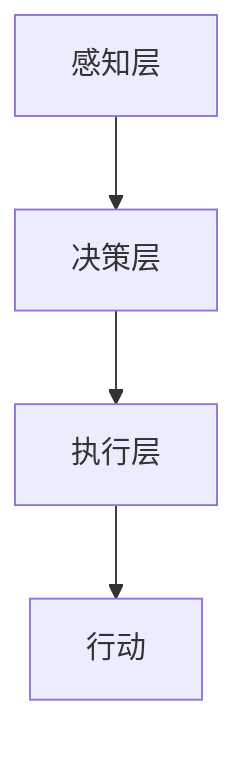
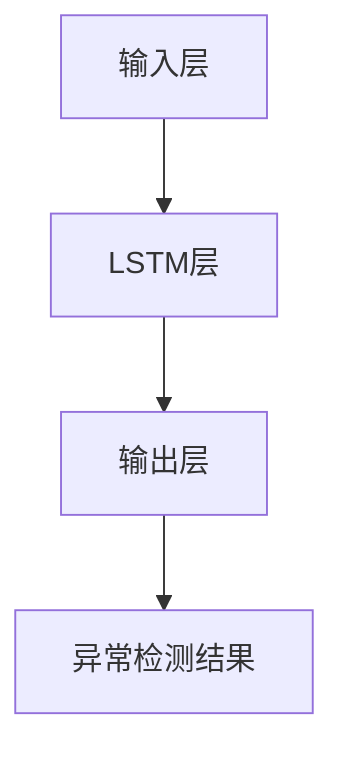
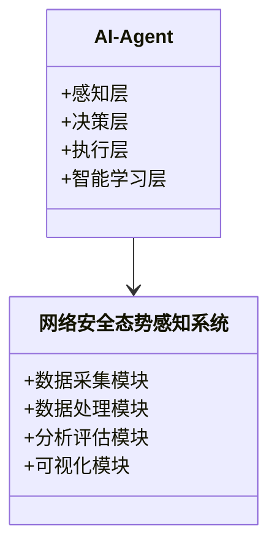
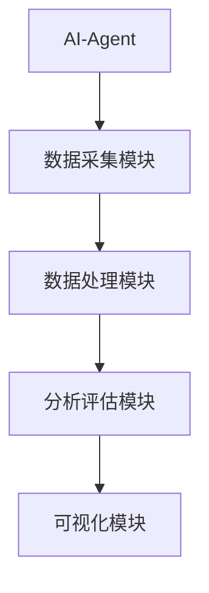
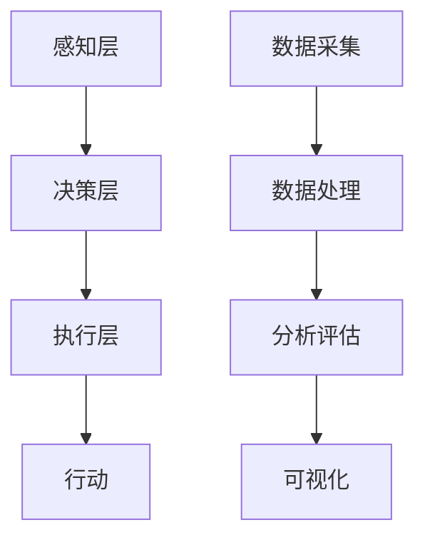
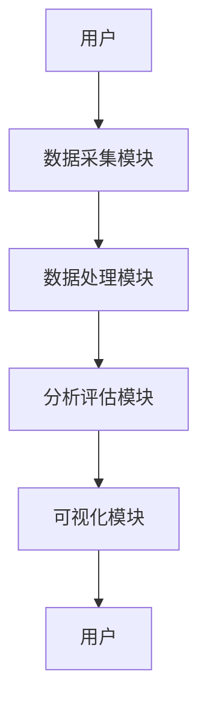

                 


# AI Agent在企业网络安全态势感知中的应用

---

## 关键词：AI Agent, 网络安全, 态势感知, 机器学习, 安全威胁, 威胁检测

---

## 摘要：本文详细探讨了AI Agent在企业网络安全态势感知中的应用，从基本概念到算法实现，再到系统架构设计，结合实际项目案例，全面分析AI Agent如何提升网络安全态势感知能力，为企业提供智能化的安全防护解决方案。

---

# 第1章: AI Agent与网络安全态势感知概述

## 1.1 AI Agent的基本概念

### 1.1.1 什么是AI Agent

人工智能代理（AI Agent）是一种能够感知环境、自主决策并执行任务的智能实体。它具备以下核心特征：

- **自主性**：能够自主决策和行动。
- **反应性**：能实时感知环境变化并做出响应。
- **主动性**：无需外部干预，主动执行任务。
- **学习能力**：通过数据和经验不断优化性能。

### 1.1.2 AI Agent的核心特征

| **特征** | **描述** |
|----------|----------|
| 自主性   | 独立决策和行动的能力 |
| 反应性   | 对环境变化实时响应的能力 |
| 主动性   | 无需外部指令的自主性 |
| 学习能力 | 通过数据优化自身行为的能力 |

### 1.1.3 AI Agent与传统安全工具的区别

| **方面**      | **AI Agent**             | **传统安全工具**         |
|---------------|--------------------------|--------------------------|
| 智能性         | 具备学习和推理能力       | 基于规则和静态配置       |
| 自主性         | 能够自主决策和行动       | 需人工干预或固定流程     |
| 适应性         | 能够动态适应环境变化     | 难以快速响应新威胁       |
| 可扩展性       | 易扩展至复杂场景         | 扩展性有限，需人工调整   |

## 1.2 网络安全态势感知的基本概念

### 1.2.1 网络安全态势感知的定义

网络安全态势感知是指通过收集、分析和理解网络环境中的各种安全相关数据，评估当前网络安全状况，并预测未来安全趋势的过程。

### 1.2.2 网络安全态势感知的关键要素

- **数据采集**：从网络日志、流量、资产清单等来源获取数据。
- **数据处理**：对采集的数据进行清洗、标准化和关联分析。
- **分析与评估**：利用机器学习、统计分析等技术评估安全风险。
- **可视化与决策支持**：通过图形化界面展示分析结果，辅助决策者制定应对策略。

### 1.2.3 网络安全态势感知的目标

- 提高对网络安全威胁的识别能力。
- 实现对安全事件的快速响应。
- 优化安全策略，降低风险敞口。

## 1.3 AI Agent在网络安全态势感知中的作用

### 1.3.1 提高威胁检测能力

AI Agent能够实时分析网络流量和日志数据，识别异常行为模式，提前发现潜在威胁。

### 1.3.2 实现自动化响应

AI Agent能够在检测到威胁后，自动执行隔离、阻断等响应措施，减少人工干预时间。

### 1.3.3 优化安全策略

通过分析历史数据和当前威胁情况，AI Agent能够动态调整安全策略，提升防护效果。

## 1.4 本章小结

本章介绍了AI Agent的基本概念和核心特征，分析了AI Agent与传统安全工具的区别，定义了网络安全态势感知的关键要素和目标，最后阐述了AI Agent在网络安全态势感知中的重要作用。

---

# 第2章: AI Agent的原理与实现

## 2.1 AI Agent的核心原理

### 2.1.1 感知层

感知层负责收集环境数据，包括网络流量、日志、资产信息等。通过传感器、API调用等方式获取实时数据。

### 2.1.2 决策层

决策层基于感知层提供的数据，利用机器学习模型进行分析，生成决策指令。决策过程考虑当前环境、历史数据和预设策略。

### 2.1.3 执行层

执行层负责将决策层生成的指令转化为具体行动，如发送阻断指令、调整防火墙规则等。



### 2.1.4 智能学习层

智能学习层负责模型的训练和优化，通过监督学习、无监督学习和强化学习等方法提升AI Agent的识别和决策能力。

## 2.2 AI Agent的实现技术

### 2.2.1 机器学习算法

- **监督学习**：用于分类任务，如威胁类型识别。
- **无监督学习**：用于异常检测，发现未知威胁。
- **强化学习**：用于动态调整策略，优化防护效果。

### 2.2.2 自然语言处理

用于分析安全报告、漏洞公告等文本数据，提取有用信息辅助决策。

### 2.2.3 强化学习

强化学习通过奖励机制训练AI Agent，使其在与威胁的博弈中不断优化策略。

## 2.3 AI Agent与网络安全的结合

### 2.3.1 威胁检测中的应用

AI Agent通过分析网络流量和日志数据，识别异常行为模式，提前发现潜在威胁。

### 2.3.2 响应决策中的应用

AI Agent能够在检测到威胁后，自动执行隔离、阻断等响应措施，减少人工干预时间。

### 2.3.3 安全策略优化中的应用

通过分析历史数据和当前威胁情况，AI Agent能够动态调整安全策略，提升防护效果。

## 2.4 本章小结

本章详细讲解了AI Agent的核心原理，包括感知层、决策层、执行层和智能学习层，分析了AI Agent的实现技术，如机器学习算法、自然语言处理和强化学习，并探讨了AI Agent在网络安全中的具体应用。

---

# 第3章: 网络安全态势感知的AI Agent应用场景

## 3.1 威胁检测与识别

### 3.1.1 异常流量检测

AI Agent通过分析网络流量数据，识别异常流量模式，发现潜在的网络攻击行为。

### 3.1.2 威胁行为模式识别

基于机器学习模型，AI Agent能够识别特定的威胁行为模式，如DDoS攻击、恶意代码传播等。

## 3.2 威胁情报分析

### 3.2.1 威胁情报的收集与处理

AI Agent能够从多种来源收集威胁情报，如CVE数据库、漏洞公告、威胁情报共享平台等，并通过自然语言处理技术提取有用信息。

### 3.2.2 威胁情报的关联分析

通过关联分析，AI Agent能够将收集到的威胁情报与企业内部的安全事件进行关联，提升威胁情报的实用性和响应效率。

## 3.3 漏洞管理

### 3.3.1 漏洞发现

AI Agent能够通过网络扫描、漏洞扫描等技术，自动发现企业网络中的潜在漏洞。

### 3.3.2 漏洞风险评估

基于漏洞的特征和环境配置，AI Agent能够评估漏洞的风险等级，帮助企业优先处理高风险漏洞。

### 3.3.3 漏洞修复

AI Agent能够自动化执行漏洞修复操作，如打补丁、配置修复等，减少人工干预。

## 3.4 攻击溯源

### 3.4.1 攻击日志分析

通过分析安全日志，AI Agent能够重建攻击路径，追溯攻击源。

### 3.4.2 攻击行为关联

AI Agent能够关联多个日志数据点，发现攻击者的完整攻击链，帮助安全团队全面了解攻击行为。

## 3.5 本章小结

本章探讨了AI Agent在威胁检测与识别、威胁情报分析、漏洞管理和攻击溯源等场景中的具体应用，展示了AI Agent如何提升网络安全态势感知能力。

---

# 第4章: 基于AI Agent的网络安全态势感知算法

## 4.1 时间序列分析算法

### 4.1.1 LSTM网络

长短期记忆网络（LSTM）是一种特殊的循环神经网络，适合处理时间序列数据，常用于异常流量检测。

### 4.1.2 LSTM网络实现



模型公式：

$$
f(x_t) = \text{LSTM}(x_t, f(x_{t-1}))
$$

其中，$x_t$是输入数据，$f(x_{t-1})$是前一时刻的状态。

### 4.1.3 LSTM网络的代码实现

```python
import numpy as np
from keras import layers, Model
from keras.optimizers import Adam

# 定义LSTM模型
def build_lstm_model(input_shape):
    inputs = layers.Input(shape=input_shape)
    lstm = layers.LSTM(64, return_sequences=False)(inputs)
    dense = layers.Dense(1, activation='sigmoid')(lstm)
    model = Model(inputs=inputs, outputs=dense)
    model.compile(loss='binary_crossentropy', optimizer=Adam(lr=0.001), metrics=['accuracy'])
    return model

# 示例数据
X = np.random.randn(100, 1, 10)
y = np.random.randint(0, 2, 100)

# 训练模型
model = build_lstm_model((1, 10))
model.fit(X, y, epochs=10, batch_size=32, validation_split=0.2)
```

## 4.2 威胁行为模式识别算法

### 4.2.1 基于聚类的威胁行为模式识别

### 4.2.2 基于聚类的威胁行为模式识别实现

```python
from sklearn.cluster import DBSCAN

# 示例数据
X = np.random.randn(100, 2)

# 聚类模型
model = DBSCAN(eps=0.5, min_samples=5)
model.fit(X)

# 获取聚类结果
labels = model.labels_
print(labels)
```

## 4.3 本章小结

本章介绍了两种常用的算法：时间序列分析算法和威胁行为模式识别算法，详细讲解了LSTM网络和聚类算法的实现方法，并通过Python代码示例展示了如何应用这些算法进行网络安全态势感知。

---

# 第5章: 网络安全态势感知的AI Agent系统架构设计

## 5.1 系统功能设计

### 5.1.1 领域模型设计



### 5.1.2 系统架构设计



## 5.2 系统架构设计

### 5.2.1 系统架构设计图



## 5.3 系统接口设计

### 5.3.1 数据采集接口

- **输入接口**：接收网络流量数据、日志数据等。
- **输出接口**：向数据处理模块传递预处理后的数据。

### 5.3.2 分析评估接口

- **输入接口**：接收预处理后的数据和模型训练结果。
- **输出接口**：向可视化模块传递评估结果和决策建议。

## 5.4 系统交互流程

### 5.4.1 系统交互流程图



## 5.5 本章小结

本章详细设计了网络安全态势感知系统的架构，包括领域模型、系统架构、接口设计和交互流程，展示了AI Agent如何在系统中协同工作。

---

# 第6章: 项目实战——基于AI Agent的网络安全态势感知系统开发

## 6.1 项目背景与目标

### 6.1.1 项目背景

随着网络安全威胁的日益复杂，企业需要一种智能化的解决方案来实时感知和应对威胁。

### 6.1.2 项目目标

开发一个基于AI Agent的网络安全态势感知系统，实现威胁检测、风险评估和自动化响应。

## 6.2 项目开发环境

### 6.2.1 环境搭建

- **操作系统**：Linux Ubuntu 20.04
- **开发工具**：PyCharm 2022.1
- **依赖库**：TensorFlow 2.5、Keras 2.4.3、Scikit-learn 0.24.1、Flask 1.1.2

## 6.3 核心系统实现

### 6.3.1 数据采集模块

```python
import socket
import struct

def get_network_traffic():
    # 示例代码，实际实现需根据具体协议进行调整
    s = socket.socket(socket.AF_INET, socket.SOCK_RAW, socket.IPPROTO_IP)
    data = s.recvfrom(65535)
    return data
```

### 6.3.2 数据处理模块

```python
import pandas as pd
from sklearn.preprocessing import StandardScaler

def preprocess_data(data):
    df = pd.DataFrame(data)
    scaler = StandardScaler()
    scaled_data = scaler.fit_transform(df)
    return scaled_data
```

### 6.3.3 分析评估模块

```python
from sklearn.cluster import KMeans

def threat_analysis(data):
    model = KMeans(n_clusters=3, random_state=0)
    model.fit(data)
    return model.labels_
```

### 6.3.4 可视化模块

```python
import matplotlib.pyplot as plt

def visualize_results(labels):
    plt.hist(labels, bins=range(len(set(labels))))
    plt.show()
```

## 6.4 系统实现代码

### 6.4.1 数据采集与处理

```python
import socket
import struct
import pandas as pd
from sklearn.preprocessing import StandardScaler

def collect_data():
    s = socket.socket(socket.AF_INET, socket.SOCK_RAW, socket.IPPROTO_IP)
    data = s.recvfrom(65535)
    return data

def preprocess(data):
    df = pd.DataFrame(data)
    scaler = StandardScaler()
    scaled_data = scaler.fit_transform(df)
    return scaled_data

# 示例调用
raw_data = collect_data()
processed_data = preprocess(raw_data)
```

### 6.4.2 分析评估与可视化

```python
from sklearn.cluster import DBSCAN
import matplotlib.pyplot as plt

def analyze(processed_data):
    model = DBSCAN(eps=0.5, min_samples=5)
    model.fit(processed_data)
    return model.labels_

def visualize(labels):
    plt.hist(labels, bins=range(len(set(labels))))
    plt.title('Threat Behavior Patterns')
    plt.xlabel('Cluster')
    plt.ylabel('Count')
    plt.show()

# 示例调用
labels = analyze(processed_data)
visualize(labels)
```

## 6.5 项目测试与优化

### 6.5.1 系统测试

- **功能测试**：验证各模块的功能是否正常。
- **性能测试**：评估系统在高负载下的表现。
- **安全测试**：确保系统本身不会成为新的安全风险。

### 6.5.2 系统优化

- **算法优化**：尝试不同的机器学习算法，提升检测准确率。
- **性能优化**：优化数据处理流程，提高系统响应速度。

## 6.6 项目总结

### 6.6.1 项目成果

通过本项目，我们成功开发了一个基于AI Agent的网络安全态势感知系统，实现了威胁检测、风险评估和自动化响应。

### 6.6.2 经验总结

- **数据质量**：高质量的数据是模型表现的关键。
- **算法选择**：选择合适的算法能够事半功倍。
- **系统架构**：合理的架构设计能够提高系统的可扩展性和可维护性。

## 6.7 本章小结

本章通过一个实际项目，详细展示了如何开发一个基于AI Agent的网络安全态势感知系统，从环境搭建到代码实现，再到系统测试和优化，为读者提供了完整的实战经验。

---

# 第7章: 总结与展望

## 7.1 总结

AI Agent作为一种智能实体，在企业网络安全态势感知中发挥着越来越重要的作用。它能够通过自主感知、智能决策和自动化响应，显著提升企业的安全防护能力。

## 7.2 未来展望

随着AI技术的不断发展，AI Agent在网络安全态势感知中的应用将更加广泛和深入。未来的研究方向包括：

- **多模态数据融合**：结合文本、图像等多种数据源，提升威胁检测的准确性。
- **自适应防御**：实现AI Agent的自适应能力，能够动态调整防御策略，应对新型威胁。
- **分布式协作**：多个AI Agent协同工作，形成覆盖全网的安全态势感知网络。

## 7.3 最佳实践 Tips

- **数据隐私保护**：在处理数据时，必须注意数据隐私和合规性问题。
- **模型更新**：定期更新模型，保持其对新型威胁的识别能力。
- **人机协同**：AI Agent应该作为辅助工具，与安全专家协同工作，而不是完全替代人类。

## 7.4 小结

通过本文的探讨，我们不仅了解了AI Agent的基本原理和应用场景，还通过实际案例展示了如何将其应用于网络安全态势感知。未来，随着技术的不断进步，AI Agent将在企业网络安全中发挥更大的作用。

---

## 作者：AI天才研究院 & 禅与计算机程序设计艺术

---

**本文完**

