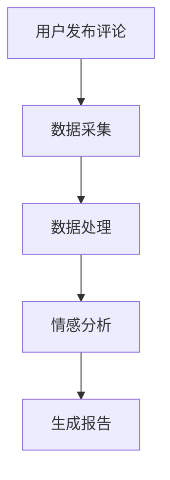
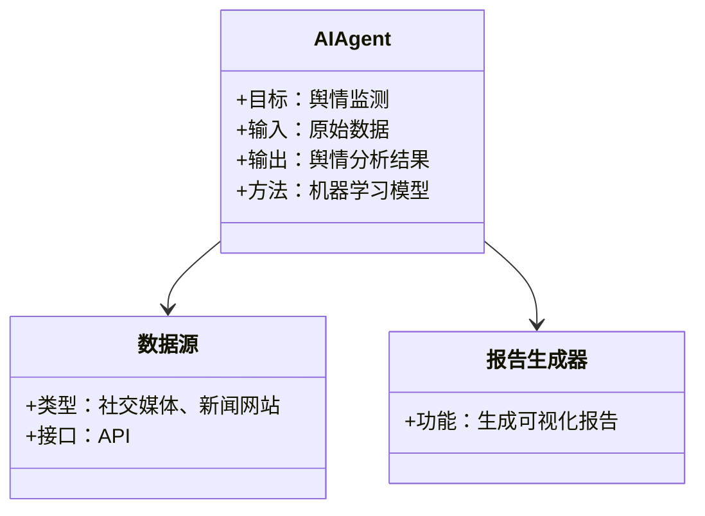
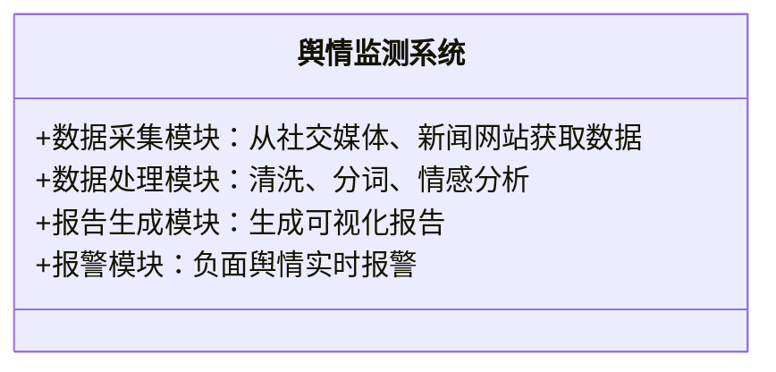
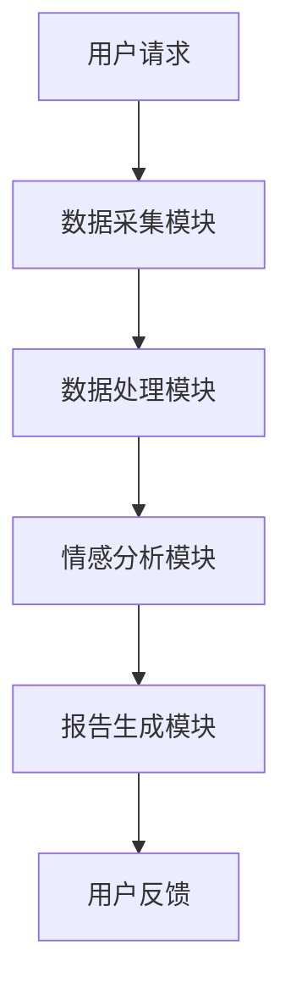

                 


# AI Agent在企业舆情监测与品牌管理中的应用

> 关键词：AI Agent, 舆情监测, 品牌管理, 人工智能, 企业应用

> 摘要：本文详细探讨了AI Agent在企业舆情监测与品牌管理中的应用。从AI Agent的基本概念与原理出发，分析其在舆情监测中的核心作用，结合实际案例和系统设计，阐述了AI Agent如何通过自然语言处理、机器学习等技术手段，帮助企业实现智能化的舆情监控与品牌管理。文章内容涵盖了背景介绍、核心概念、算法原理、系统架构设计、项目实战及最佳实践等多方面内容，为读者提供了全面的技术解读与实践指导。

---

# 第一部分: AI Agent与企业舆情监测基础

## 第1章: AI Agent的基本概念与原理

### 1.1 AI Agent的定义与特点

#### 1.1.1 AI Agent的定义
AI Agent（人工智能代理）是一种能够感知环境、自主决策并采取行动以实现特定目标的智能系统。它可以基于输入的数据和环境反馈，通过学习和推理优化自身的操作流程。AI Agent的核心在于其智能化的决策能力和自动化执行能力。

#### 1.1.2 AI Agent的核心特点
- **自主性**：AI Agent能够自主决策，无需人工干预。
- **反应性**：能够实时感知环境变化并做出反应。
- **学习能力**：通过机器学习算法不断优化自身的模型。
- **协作性**：能够与其他系统或AI Agent协同工作。

#### 1.1.3 AI Agent与传统算法的区别
| 特性 | 传统算法 | AI Agent |
|------|----------|----------|
| 决策方式 | 确定性规则 | 基于数据的学习与推理 |
| 自适应性 | 无 | 具有自适应能力 |
| 执行能力 | 仅提供结果 | 可以执行具体操作 |

---

### 1.2 企业舆情监测的背景与需求

#### 1.2.1 企业舆情监测的定义
企业舆情监测是指对企业品牌、产品或服务在媒体、社交网络、论坛等渠道上的公众舆论进行实时监控和分析的过程。其目的是帮助企业及时发现潜在风险，抓住市场机会，优化品牌形象。

#### 1.2.2 舆情监测的重要性
- **风险预警**：及时发现负面舆情，避免声誉损失。
- **市场洞察**：分析消费者需求和市场趋势。
- **品牌维护**：通过正面舆情的传播，提升品牌形象。

#### 1.2.3 企业品牌管理中的舆情监测需求
在品牌管理中，舆情监测可以帮助企业：
- **精准定位目标客户**：通过分析用户的语言和行为习惯。
- **优化营销策略**：根据舆情反馈调整广告投放和产品策略。
- **提升客户满意度**：通过及时响应客户需求，提升客户体验。

---

## 第2章: AI Agent在舆情监测中的应用

### 2.1 舆情监测的核心流程

#### 2.1.1 数据采集
AI Agent通过爬虫技术从社交媒体、新闻网站、论坛等渠道获取海量数据。数据采集的关键点包括：
- **数据来源**：社交媒体（如微博、Twitter）、新闻网站（如新华网、BBC）、论坛（如Reddit）。
- **数据格式**：文本、图片、视频等。
- **数据预处理**：去重、清洗、格式统一。

#### 2.1.2 数据处理
对采集到的数据进行清洗和结构化处理，提取关键词、情感倾向等信息。处理流程包括：
1. **文本分词**：将文本分割成词语或短语。
2. **实体识别**：识别文本中的品牌、人物、地点等实体。
3. **情感分析**：判断文本的情感倾向（正面、负面、中性）。

#### 2.1.3 数据分析与挖掘
通过机器学习算法对数据进行建模和分析，提取舆情的核心信息。常用算法包括：
- **词袋模型（Bag of Words）**：将文本转换为向量表示。
- **TF-IDF**：计算关键词的重要性。
- **情感分析模型**：基于深度学习的情感分析模型（如LSTM、BERT）。

---

### 2.2 AI Agent在舆情监测中的优势

#### 2.2.1 自动化数据处理能力
AI Agent能够自动采集、处理和分析数据，显著提高舆情监测的效率。

#### 2.2.2 智能分析与预测能力
通过机器学习模型，AI Agent可以预测舆情走势，帮助企业提前制定应对策略。

#### 2.2.3 实时监控与反馈能力
AI Agent可以实现24/7的实时监控，并通过反馈机制快速响应舆情变化。

---

## 第3章: AI Agent的核心概念与联系

### 3.1 AI Agent的核心概念

#### 3.1.1 实体关系分析
在舆情监测中，AI Agent需要处理的主要实体包括：
- **用户**：社交媒体上的用户。
- **文本**：用户的评论、帖子。
- **情感**：文本的情感倾向（正面、负面、中性）。
- **品牌**：企业的品牌或产品。

#### 3.1.2 AI Agent的工作流程


#### 3.1.3 舆情监测的系统架构


---

## 第4章: 算法原理与实现

### 4.1 基于深度学习的情感分析模型

#### 4.1.1 模型选择
- **BERT模型**：广泛应用于情感分析任务。
- **LSTM模型**：适合处理长文本序列。

#### 4.1.2 模型训练
```python
import torch
from torch import nn

class TextClassifier(nn.Module):
    def __init__(self, vocab_size, embedding_dim, hidden_dim, output_dim):
        super(TextClassifier, self).__init__()
        self.embedding = nn.Embedding(vocab_size, embedding_dim)
        self.lstm = nn.LSTM(embedding_dim, hidden_dim, batch_first=True)
        self.fc = nn.Linear(hidden_dim, output_dim)
    
    def forward(self, x):
        embeds = self.embedding(x)
        out, _ = self.lstm(embeds)
        out = self.fc(out[:, -1, :])
        return out

# 示例训练代码
model = TextClassifier(vocab_size=10000, embedding_dim=50, hidden_dim=50, output_dim=3)
criterion = nn.CrossEntropyLoss()
optimizer = torch.optim.Adam(model.parameters(), lr=0.01)
```

#### 4.1.3 情感分类的数学模型
情感分类的目标是将文本映射到一个情感类别（如正面、负面、中性）。模型的损失函数可以表示为：
$$ L = -\sum_{i=1}^{n} y_i \log(p_i) $$
其中，$y_i$ 是真实标签，$p_i$ 是预测概率。

---

## 第5章: 系统设计与实现

### 5.1 项目实战：舆情监测系统

#### 5.1.1 环境安装
- **Python 3.8+**
- **TensorFlow或PyTorch**
- **爬虫工具（如BeautifulSoup、Scrapy）**

#### 5.1.2 系统功能设计


#### 5.1.3 系统架构设计


---

## 第6章: 最佳实践与小结

### 6.1 最佳实践
- **数据质量**：确保数据的准确性和完整性。
- **模型优化**：定期更新模型，适应数据分布的变化。
- **实时反馈**：建立快速响应机制，及时处理负面舆情。

### 6.2 小结
AI Agent通过智能化的数据处理和分析能力，显著提升了企业舆情监测的效率和准确性。在品牌管理中，AI Agent的应用帮助企业更好地理解市场动态，优化营销策略，提升品牌形象。

### 6.3 注意事项
- 数据隐私问题：确保数据采集和处理符合相关法律法规。
- 模型鲁棒性：避免因数据偏差导致的误判。

### 6.4 拓展阅读
- 《深度学习实战：自然语言处理》
- 《AI Agent在金融领域的应用》

---

# 结语

AI Agent在企业舆情监测与品牌管理中的应用前景广阔。通过不断优化算法和系统设计，AI Agent将为企业提供更加智能、高效的舆情监控解决方案，助力企业在全球化竞争中占据优势。

---

作者：AI天才研究院 & 禅与计算机程序设计艺术

