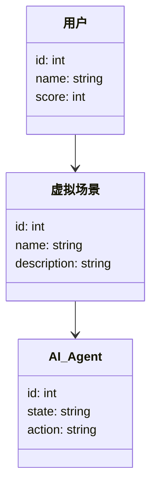
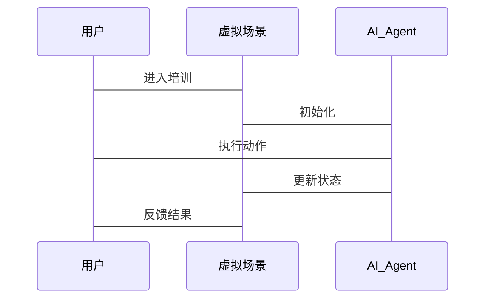

                 


# AI Agent在企业虚拟现实培训中的应用

## 关键词：AI Agent，虚拟现实，企业培训，系统架构，算法原理

## 摘要：AI Agent与虚拟现实技术的结合为企业培训提供了创新的解决方案。本文详细探讨了AI Agent在虚拟现实培训中的应用，分析了其算法原理、系统架构，并通过实际案例展示了其在提升企业培训效果中的潜力。

---

# 第一部分: AI Agent与虚拟现实概述

## 第1章: AI Agent与虚拟现实的背景介绍

### 1.1 问题背景

#### 1.1.1 企业培训的现状与挑战
企业培训是提升员工技能和企业竞争力的重要手段。然而，传统培训方式存在成本高、效率低、难以个性化等问题。此外，员工的时间和注意力有限，传统的课堂式培训难以满足多样化的需求。

#### 1.1.2 虚拟现实技术在企业培训中的应用
虚拟现实（VR）技术通过模拟真实环境，提供沉浸式的学习体验。它可以在安全的环境中进行高风险任务的培训，例如核电站操作或外科手术。此外，VR还可以用于团队协作训练，通过模拟复杂场景提升员工的协作能力。

#### 1.1.3 AI Agent在企业培训中的潜在价值
AI Agent（智能代理）能够根据员工的行为和表现提供实时反馈和指导。结合VR技术，AI Agent可以在虚拟环境中模拟真实的工作场景，为员工提供个性化的培训体验。例如，在销售培训中，AI Agent可以扮演客户，帮助员工练习沟通技巧。

### 1.2 问题描述

#### 1.2.1 传统企业培训的痛点
传统培训方式通常是一对多，难以满足每个员工的个性化需求。此外，培训效果难以量化，且员工在真实场景中的应用能力有限。

#### 1.2.2 虚拟现实技术如何解决企业培训问题
VR技术通过提供沉浸式体验，使员工能够在虚拟环境中反复练习，提升实际操作能力。同时，VR还可以记录员工的表现数据，为后续分析提供依据。

#### 1.2.3 AI Agent在虚拟现实培训中的具体应用
AI Agent可以作为虚拟导师，在VR培训中实时指导员工。例如，在领导力培训中，AI Agent可以模拟团队成员，帮助参训者练习决策和沟通技巧。

### 1.3 问题解决

#### 1.3.1 AI Agent在虚拟现实培训中的核心作用
AI Agent通过实时分析员工的行为数据，提供个性化的反馈和指导，帮助员工快速提升技能。同时，AI Agent还可以根据员工的表现调整培训内容，实现动态优化。

#### 1.3.2 虚拟现实技术与AI Agent的结合方式
AI Agent可以嵌入VR系统，实时分析员工的表现数据，并根据需要调整虚拟环境中的元素。例如，在客户服务培训中，AI Agent可以根据员工的表现动态生成新的客户角色。

#### 1.3.3 企业培训效果的提升路径
通过AI Agent与VR的结合，企业可以实现个性化、动态化的培训，提升员工的实际操作能力和问题解决能力。

### 1.4 边界与外延

#### 1.4.1 AI Agent在虚拟现实培训中的应用边界
AI Agent主要在虚拟环境中提供实时反馈和指导，其应用范围主要集中在技能训练和行为模拟方面。对于需要复杂情感交流的场景，AI Agent的能力可能有限。

#### 1.4.2 虚拟现实技术的其他应用场景
除了企业培训，虚拟现实技术还可以应用于游戏开发、建筑设计等领域。例如，在建筑设计中，VR可以用于展示建筑物的3D模型。

#### 1.4.3 AI Agent技术的其他应用领域
AI Agent还可以应用于智能家居、自动驾驶等领域。例如，在智能家居中，AI Agent可以根据用户的行为习惯自动调节室内温度。

### 1.5 概念结构与核心要素

#### 1.5.1 AI Agent的核心概念
AI Agent是一种能够感知环境并采取行动以实现目标的智能系统。它可以在虚拟环境中模拟人类的行为，提供实时反馈和指导。

#### 1.5.2 虚拟现实技术的核心概念
虚拟现实技术通过计算机生成的三维环境，提供沉浸式体验。用户可以通过头显设备和手柄与虚拟环境互动。

#### 1.5.3 两者的结合方式与系统架构
AI Agent嵌入VR系统，实时分析用户的交互数据，并根据需要调整虚拟环境中的元素。例如，在医疗培训中，AI Agent可以模拟患者症状，帮助医生练习诊断过程。

## 1.6 本章小结
本章介绍了AI Agent和虚拟现实技术的基本概念，分析了它们在企业培训中的应用价值和结合方式。通过结合AI Agent的实时反馈和VR的沉浸式体验，企业可以实现更高效、个性化的培训。

---

# 第2章: AI Agent与虚拟现实的核心概念与联系

## 2.1 核心概念原理

### 2.1.1 AI Agent的定义与基本原理
AI Agent是一种能够感知环境并采取行动以实现目标的智能系统。它可以通过机器学习算法不断优化其行为模式。

### 2.1.2 虚拟现实技术的定义与基本原理
虚拟现实技术通过计算机生成的三维环境，提供沉浸式体验。用户可以通过头显设备和手柄与虚拟环境互动。

### 2.1.3 两者的结合原理
AI Agent可以嵌入VR系统，实时分析用户的交互数据，并根据需要调整虚拟环境中的元素。例如，在客户服务培训中，AI Agent可以模拟客户的行为，帮助员工练习沟通技巧。

## 2.2 核心概念属性特征对比

### 2.2.1 AI Agent的属性特征
| 属性 | 描述 |
|------|------|
| 智能性 | 能够感知环境并采取行动 |
| 学习性 | 可以通过机器学习优化行为 |
| 实时性 | 可以实时分析数据并做出反馈 |

### 2.2.2 虚拟现实技术的属性特征
| 属性 | 描述 |
|------|------|
| 沉浸性 | 提供逼真的虚拟体验 |
| 互动性 | 用户可以与虚拟环境互动 |
| 可定制性 | 可以根据需求定制虚拟场景 |

### 2.2.3 两者属性特征对比分析
AI Agent和虚拟现实技术在实时性和互动性方面有相似之处，但在智能性和可定制性方面有所不同。AI Agent更注重智能性和学习性，而虚拟现实技术更注重沉浸性和互动性。

## 2.3 ER实体关系图架构
```mermaid
er
  actor(AI Agent, id, name)
  actor(虚拟现实系统, id, name)
  actor(企业培训场景, id, name)
  relation(参与, AI Agent, 虚拟现实系统)
  relation(应用于, AI Agent, 企业培训场景)
  relation(支持, 虚拟现实系统, 企业培训场景)
```

## 2.4 本章小结
本章详细分析了AI Agent和虚拟现实技术的核心概念和属性特征，并通过ER图展示了它们之间的关系。AI Agent和虚拟现实技术的结合为企业培训提供了新的可能性。

---

# 第3章: AI Agent在企业虚拟现实培训中的算法原理

## 3.1 算法原理概述

### 3.1.1 AI Agent的基本算法
AI Agent通常使用强化学习或监督学习算法。例如，Q-learning算法是一种常用的强化学习算法，适用于离散动作空间的情况。

### 3.1.2 虚拟现实技术中的算法应用
虚拟现实技术中的算法主要用于图形渲染和交互处理。例如，光线追踪技术用于提高图形的逼真度。

### 3.1.3 两者结合的算法框架
AI Agent和虚拟现实技术的结合需要实时分析用户的交互数据，并根据需要调整虚拟环境。这通常涉及到多模态数据的处理和实时反馈的生成。

## 3.2 算法原理详细讲解

### 3.2.1 AI Agent的算法实现
```python
import numpy as np

class AI_Agent:
    def __init__(self, state_space, action_space):
        self.state_space = state_space
        self.action_space = action_space
        self.Q_table = np.zeros((state_space, action_space))

    def take_action(self, state):
        if np.random.rand() < 0.1:
            action = np.random.randint(self.action_space)
        else:
            action = np.argmax(self.Q_table[state])
        return action

    def update_Q_table(self, state, action, reward, next_state):
        self.Q_table[state][action] += 0.1 * (reward + 0.9 * np.max(self.Q_table[next_state]))
```

### 3.2.2 虚拟现实技术的算法实现
```python
import pygame

class VR_System:
    def __init__(self, width, height):
        self.width = width
        self.height = height
        self.screen = pygame.display.set_mode((width, height))

    def render(self):
        self.screen.fill((0, 0, 0))
        # 绘制虚拟场景
        pygame.display.flip()
```

### 3.2.3 两者结合的算法流程
AI Agent通过感知虚拟环境中的状态，选择一个动作并执行。虚拟现实系统根据AI Agent的选择更新虚拟场景，并将新的状态反馈给AI Agent。这个过程不断循环，直到达到预设的目标。

## 3.3 算法实现的数学模型与公式

### 3.3.1 AI Agent的数学模型
$$ Q(s,a) = r + \gamma \max_{a'} Q(s',a') $$

其中：
- \( Q(s,a) \) 表示状态 \( s \) 下动作 \( a \) 的价值
- \( r \) 表示奖励
- \( \gamma \) 表示折扣因子
- \( s' \) 表示下一个状态
- \( a' \) 表示下一个动作

### 3.3.2 虚拟现实技术的数学模型
$$ I = \int_{-\infty}^{\infty} \int_{-\infty}^{\infty} \rho(x,y,z) dx dy dz $$

其中：
- \( I \) 表示光线积分
- \( \rho(x,y,z) \) 表示场景中的反射率
- \( x,y,z \) 表示空间坐标

## 3.4 本章小结
本章详细讲解了AI Agent和虚拟现实技术的算法原理，并通过代码示例和数学公式展示了它们的实现细节。AI Agent的强化学习算法和虚拟现实技术的图形渲染算法共同支持了企业虚拟现实培训的实现。

---

# 第4章: 系统分析与架构设计

## 4.1 问题场景介绍
企业虚拟现实培训系统需要支持多用户同时在线，提供个性化的培训体验。系统需要实时分析用户的交互数据，并根据需要调整虚拟环境。

## 4.2 系统功能设计

### 4.2.1 领域模型类图


### 4.2.2 系统架构设计


## 4.3 系统接口设计

### 4.3.1 API接口
```http
POST /api/train/start
POST /api/train/action
GET /api/train/state
```

## 4.4 系统交互流程图

### 4.4.1 序列图


## 4.5 本章小结
本章详细分析了企业虚拟现实培训系统的架构设计和接口设计。系统功能设计和交互流程图展示了AI Agent和虚拟现实技术的结合方式。

---

# 第5章: 项目实战

## 5.1 环境安装

### 5.1.1 安装Python
```bash
# 安装Python
sudo apt-get install python3 python3-pip
```

### 5.1.2 安装必要的库
```bash
# 安装必要的库
pip install numpy pygame
```

## 5.2 系统核心实现源代码

### 5.2.1 AI Agent实现
```python
import numpy as np

class AI_Agent:
    def __init__(self, state_space, action_space):
        self.state_space = state_space
        self.action_space = action_space
        self.Q_table = np.zeros((state_space, action_space))

    def take_action(self, state):
        if np.random.rand() < 0.1:
            action = np.random.randint(self.action_space)
        else:
            action = np.argmax(self.Q_table[state])
        return action

    def update_Q_table(self, state, action, reward, next_state):
        self.Q_table[state][action] += 0.1 * (reward + 0.9 * np.max(self.Q_table[next_state]))
```

### 5.2.2 虚拟现实系统实现
```python
import pygame

class VR_System:
    def __init__(self, width, height):
        self.width = width
        self.height = height
        self.screen = pygame.display.set_mode((width, height))

    def render(self):
        self.screen.fill((0, 0, 0))
        # 绘制虚拟场景
        pygame.display.flip()
```

## 5.3 代码应用解读与分析

### 5.3.1 AI Agent代码解读
AI Agent通过Q-learning算法实现，Q_table存储各个状态和动作的值。take_action方法根据当前状态选择动作，update_Q_table方法更新Q表。

### 5.3.2 虚拟现实系统代码解读
VR_System类初始化屏幕大小，render方法用于绘制虚拟场景。通过pygame库实现图形渲染。

## 5.4 实际案例分析和详细讲解剖析
以客户服务培训为例，AI Agent可以在虚拟场景中模拟客户，用户可以在VR环境中练习沟通技巧。AI Agent根据用户的交互数据实时调整客户的行为，提供个性化的反馈。

## 5.5 项目小结
本章通过实际案例展示了AI Agent和虚拟现实技术在企业培训中的应用。通过代码实现和案例分析，读者可以理解如何将理论应用于实际。

---

# 第6章: 最佳实践与总结

## 6.1 最佳实践 tips

### 6.1.1 系统设计
- 确保系统架构清晰，模块化设计便于维护和扩展。
- 使用高效的算法和数据结构，提升系统的运行效率。

### 6.1.2 代码实现
- 代码要注释清晰，便于理解和维护。
- 定期进行代码审查，避免潜在的bug。

### 6.1.3 测试与优化
- 进行充分的测试，确保系统稳定性和用户体验。
- 根据反馈不断优化系统功能和性能。

## 6.2 小结
AI Agent与虚拟现实技术的结合为企业培训提供了创新的解决方案。通过实时反馈和个性化的学习体验，企业可以更高效地提升员工的技能和能力。

## 6.3 注意事项

### 6.3.1 系统安全性
确保虚拟现实设备的安全性，避免用户在使用过程中发生意外。

### 6.3.2 数据隐私
保护员工的个人数据，确保系统的数据安全。

### 6.3.3 系统兼容性
确保系统在不同设备和平台上兼容，提升用户体验。

## 6.4 拓展阅读
- 探索AI Agent在其他领域的应用，如智能家居、自动驾驶等。
- 研究更先进的虚拟现实技术，如混合现实（MR）和增强现实（AR）。

---

# 作者：AI天才研究院/AI Genius Institute & 禅与计算机程序设计艺术 /Zen And The Art of Computer Programming

---

以上是《AI Agent在企业虚拟现实培训中的应用》的完整目录和内容概要。希望这篇文章能够为您提供有价值的信息和启发。

