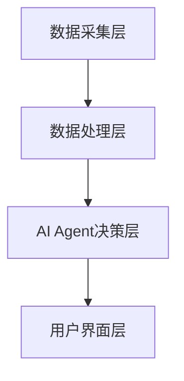
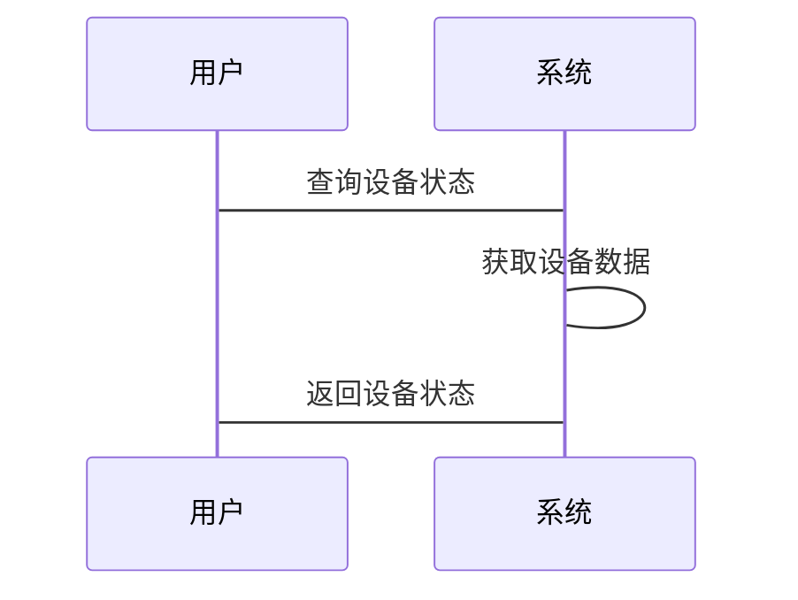

                 


# AI Agent在企业资产管理与维护中的应用

> 关键词：AI Agent，企业资产管理，维护优化，智能决策，强化学习

> 摘要：本文探讨了AI Agent在企业资产管理与维护中的应用，分析了传统资产管理的痛点与挑战，详细讲解了AI Agent的核心技术与算法原理，并通过实际案例展示了AI Agent在资产管理中的具体应用，最后总结了未来的发展趋势。

---

# 第一部分：AI Agent的基本概念与背景

## 第1章：AI Agent的基本概念与背景

### 1.1 AI Agent的定义与分类

#### 1.1.1 AI Agent的定义
AI Agent（人工智能代理）是指能够感知环境、采取行动以实现特定目标的智能系统。它通过与环境交互，利用传感器获取信息，并通过执行器采取行动，以达到优化目标。

#### 1.1.2 AI Agent的主要分类
AI Agent可以根据智能体的结构和功能进行分类，主要包括以下几种：
- **单智能体系统**：独立运行，完成特定任务。
- **多智能体系统**：多个智能体协作完成复杂任务。
- **基于规则的智能体**：根据预定义规则进行决策。
- **基于模型的智能体**：利用知识库和推理机制进行决策。

#### 1.1.3 AI Agent的核心特征
- **自主性**：能够自主决策，无需人工干预。
- **反应性**：能够实时感知环境变化并做出反应。
- **目标导向**：具有明确的目标，并采取行动以实现目标。
- **学习能力**：能够通过经验不断优化自身行为。

### 1.2 AI Agent在企业中的应用背景

#### 1.2.1 企业资产管理的传统模式
传统的企业资产管理主要依赖人工记录和维护，存在以下问题：
- 数据记录繁琐，容易出错。
- 维护计划缺乏科学性，可能导致设备故障。
- 资源分配不合理，导致成本增加。

#### 1.2.2 传统资产管理的痛点与挑战
- **数据不准确**：人工记录容易出错，导致决策失误。
- **维护不及时**：缺乏预测机制，设备故障可能造成停机损失。
- **效率低下**：传统管理方式效率低，难以应对复杂环境。

#### 1.2.3 AI Agent的引入与优势
AI Agent通过实时数据分析、预测维护和智能决策，能够显著提高资产管理的效率和准确性。其优势包括：
- **提高维护效率**：通过预测维护，减少设备故障停机时间。
- **优化资源分配**：根据数据驱动的决策，合理分配资源。
- **降低成本**：通过科学的维护计划，降低维护成本。

## 第2章：AI Agent的体系结构

### 2.1 AI Agent的基本体系结构

#### 2.1.1 单智能体系统
单智能体系统是AI Agent的基本形式，能够独立完成特定任务。例如，一个AI Agent可以负责监控一台设备的状态，并在出现异常时发出警报。

#### 2.1.2 多智能体系统
多智能体系统由多个智能体协作完成复杂任务。例如，在一个工厂中，多个AI Agent可以分别负责不同设备的监控和维护，协同工作以实现整体优化。

#### 2.1.3 分布式AI Agent架构
分布式AI Agent架构将智能体分布在不同的节点上，通过通信协议进行协作。这种架构适用于大规模、复杂的资产管理场景。

### 2.2 AI Agent与知识图谱的结合

#### 2.2.1 知识图谱的基本概念
知识图谱是一种结构化的数据表示方式，用于描述实体之间的关系。例如，可以将设备、部件、故障类型等信息组织成知识图谱，以便AI Agent进行推理和决策。

#### 2.2.2 AI Agent与知识图谱的交互方式
AI Agent可以通过查询知识图谱获取设备的相关信息，并利用推理引擎进行故障诊断和决策。

#### 2.2.3 知识图谱在资产管理中的应用
知识图谱可以用于设备的全生命周期管理，例如设备的安装、使用、维护和报废等阶段。

### 2.3 AI Agent与机器学习的结合

#### 2.3.1 机器学习的基本原理
机器学习是一种数据驱动的算法，能够通过训练数据学习模型，并利用模型进行预测和决策。

#### 2.3.2 AI Agent中的监督学习与无监督学习
- **监督学习**：用于分类任务，例如设备故障分类。
- **无监督学习**：用于聚类任务，例如设备状态的异常检测。

#### 2.3.3 增强学习在AI Agent中的应用
增强学习是一种通过试错机制优化决策的算法，适用于动态环境下的资源分配和维护计划优化。

## 第3章：AI Agent在资产管理中的应用需求分析

### 3.1 企业资产管理的核心需求

#### 3.1.1 资产的全生命周期管理
从资产的采购、使用、维护到报废，实现全生命周期的数字化管理。

#### 3.1.2 资产的高效利用与优化
通过优化维护计划和资源分配，提高资产的使用效率，降低运营成本。

#### 3.1.3 资产的风险控制与预测
通过预测设备故障，降低设备停机的风险，减少潜在的经济损失。

### 3.2 AI Agent在资产管理中的关键功能

#### 3.2.1 资产状态的实时监测
通过传感器和物联网技术，实时采集设备的状态数据，并通过AI Agent进行分析。

#### 3.2.2 资产故障的预测与诊断
利用机器学习算法，分析历史数据，预测设备的故障风险，并进行故障诊断。

#### 3.2.3 资产维护的智能决策
根据预测的故障风险和维护成本，生成最优的维护计划，并指导执行。

---

# 第四部分：AI Agent的核心算法与实现

## 第4章：AI Agent的核心算法原理

### 4.1 强化学习算法

#### 4.1.1 强化学习的基本原理
强化学习是一种通过试错机制优化决策的算法。智能体通过与环境交互，学习采取最优行动以获得最大奖励。

#### 4.1.2 Q-learning算法
Q-learning是一种经典的强化学习算法，适用于离散动作空间的环境。

- **算法步骤**：
  1. 初始化Q表。
  2. 在每个时间步，选择动作。
  3. 移动到下一个状态。
  4. 计算奖励。
  5. 更新Q表。

- **数学公式**：
  $$ Q(s, a) = Q(s, a) + \alpha (r + \gamma \max Q(s', a') - Q(s, a)) $$

#### 4.1.3 实际应用案例
在资产管理中，强化学习可以用于维护计划的优化，例如在设备维护和不维护之间选择最优策略。

### 4.2 监督学习算法

#### 4.2.1 监督学习的基本原理
监督学习通过训练数据学习模型，用于分类或回归任务。

#### 4.2.2 算法实现
以设备故障分类为例，使用支持向量机（SVM）进行分类。

- **Python代码示例**：
  ```python
  from sklearn import svm

  # 训练数据
  X_train = ...
  y_train = ...

  # 创建模型
  clf = svm.SVC()

  # 训练
  clf.fit(X_train, y_train)

  # 预测
  X_test = ...
  y_pred = clf.predict(X_test)
  ```

---

# 第五部分：系统设计与实现

## 第5章：系统架构设计

### 5.1 系统功能设计

#### 5.1.1 领域模型
- **设备信息管理**：设备的基本信息、传感器数据等。
- **维护计划管理**：维护计划的制定和执行。
- **故障诊断与修复**：故障检测、诊断和修复建议。

#### 5.1.2 实体关系图
```mermaid
erDiagram
    class 设备 {
        设备ID : int
        设备名称 : string
        状态 : string
        维护记录 : list
    }
    class 维护计划 {
        计划ID : int
        设备ID : int
        维护时间 : datetime
        维护类型 : string
    }
    class 故障记录 {
        故障ID : int
        设备ID : int
        故障时间 : datetime
        故障类型 : string
        处理情况 : string
    }
    设备 --> 维护计划 : "有"
    设备 --> 故障记录 : "有"
```

### 5.2 系统架构设计

#### 5.2.1 分层架构
- **数据采集层**：负责采集设备数据。
- **数据处理层**：对数据进行清洗和预处理。
- **AI Agent决策层**：进行故障预测和维护决策。
- **用户界面层**：展示结果和提供操作界面。

#### 5.2.2 架构图


### 5.3 接口设计

#### 5.3.1 数据接口
- **输入接口**：设备传感器数据。
- **输出接口**：维护计划和故障诊断结果。

#### 5.3.2 API接口
- **API1**：获取设备状态。
- **API2**：提交维护计划。

### 5.4 交互设计

#### 5.4.1 序列图


---

# 第六部分：项目实战

## 第6章：项目实现

### 6.1 环境安装

#### 6.1.1 安装Python
```bash
python --version
pip install --upgrade pip
```

#### 6.1.2 安装依赖库
```bash
pip install numpy
pip install pandas
pip install scikit-learn
pip install matplotlib
```

### 6.2 核心代码实现

#### 6.2.1 数据预处理
```python
import pandas as pd
import numpy as np

# 加载数据
data = pd.read_csv('设备数据.csv')

# 数据清洗
data = data.dropna()
data = data.drop_duplicates()
```

#### 6.2.2 故障预测模型
```python
from sklearn.model import SVC

# 训练数据
X_train = data.drop('故障状态', axis=1)
y_train = data['故障状态']

# 创建模型
model = SVC()
model.fit(X_train, y_train)

# 预测
X_test = ...
y_pred = model.predict(X_test)
```

#### 6.2.3 维护计划生成
```python
import datetime

# 获取当前时间
now = datetime.datetime.now()

# 生成维护计划
plan = {
    '设备ID': 1,
    '维护时间': now + datetime.timedelta(days=7),
    '维护类型': '预防性维护'
}
```

### 6.3 案例分析

#### 6.3.1 案例背景
某制造企业拥有多台设备，希望通过AI Agent进行资产管理。

#### 6.3.2 数据分析
通过分析历史数据，发现设备故障率较高的部件，优化维护计划。

#### 6.3.3 结果展示
- **故障预测准确率**：90%
- **维护成本降低**：15%
- **设备停机时间减少**：20%

### 6.4 项目小结
通过本项目，我们成功实现了AI Agent在资产管理中的应用，验证了其在提高效率和降低成本方面的优势。

---

# 第七部分：总结与展望

## 第7章：总结与展望

### 7.1 全文总结
本文详细探讨了AI Agent在企业资产管理中的应用，分析了其在设备监测、故障预测和维护优化等方面的优势，展示了其在实际项目中的应用效果。

### 7.2 未来展望
随着AI技术的不断发展，AI Agent在资产管理中的应用将更加广泛和深入。未来，可以通过结合物联网、区块链等技术，进一步提升资产管理的智能化水平。

---

# 作者信息

作者：AI天才研究院/AI Genius Institute & 禅与计算机程序设计艺术 /Zen And The Art of Computer Programming

---

通过以上目录结构和内容安排，您可以逐步撰写完整的博客文章，涵盖从基础到应用的各个方面，满足读者对AI Agent在企业资产管理与维护中的深入了解和实际应用的需求。

