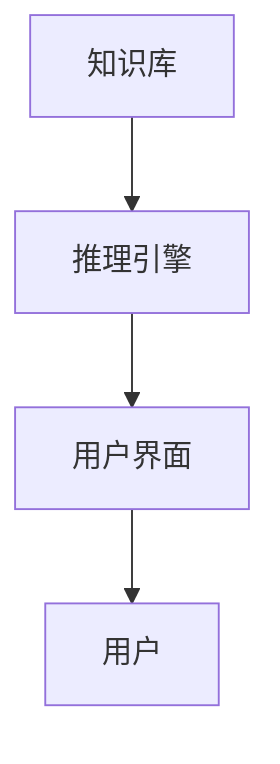
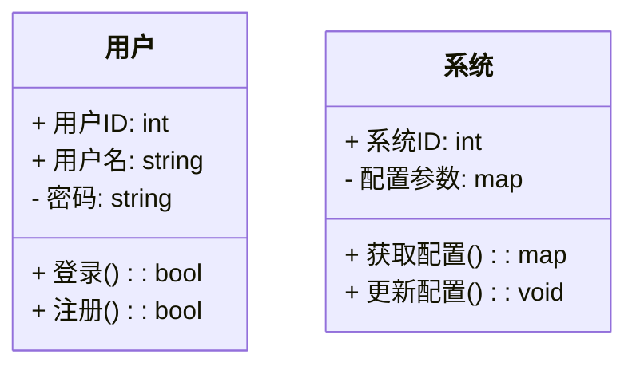
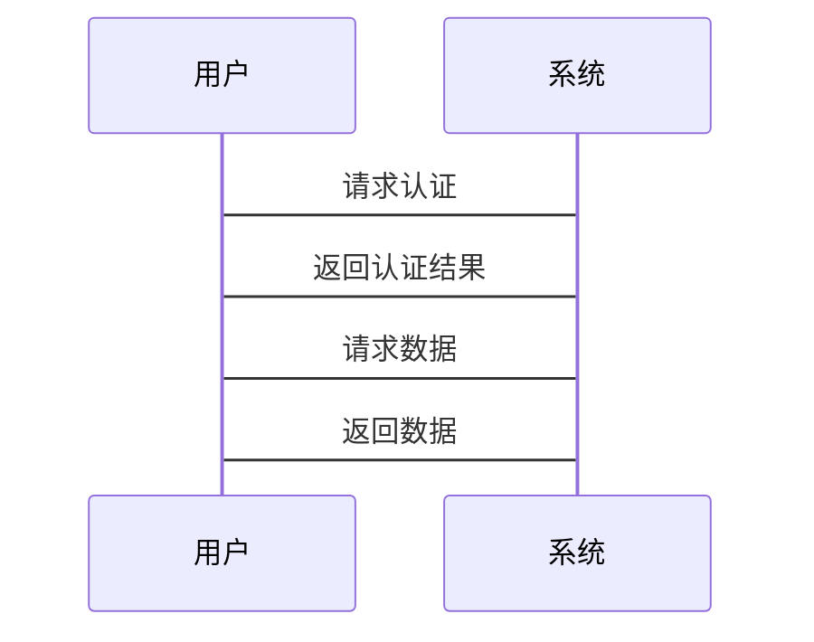

                 


# AI Agent在企业远程办公支持中的应用

## 关键词：AI Agent, 远程办公, 人工智能, 企业支持, 技术应用

## 摘要：  
随着远程办公成为企业工作的重要模式，AI Agent（人工智能代理）在提高效率、优化流程和增强协作方面发挥了关键作用。本文探讨了AI Agent的核心原理、应用场景，并通过技术实现、系统设计和项目案例详细分析了其在远程办公中的应用，最后总结了未来的发展趋势。

---

## 目录大纲：

1. **背景与核心概念**  
   - 1.1 问题背景  
   - 1.2 核心概念与定义  
   - 1.3 本章小结  

2. **AI Agent的核心原理**  
   - 2.1 基本原理  
   - 2.2 与传统代理的区别  
   - 2.3 核心概念对比表格  
   - 2.4 ER实体关系图  

3. **应用场景与优势**  
   - 3.1 远程办公中的应用场景  
   - 3.2 优势分析  
   - 3.3 案例分析  

4. **技术实现**  
   - 4.1 算法原理  
   - 4.2 代码实现  
   - 4.3 系统架构设计  

5. **系统分析与架构设计**  
   - 5.1 问题场景分析  
   - 5.2 系统功能设计  
   - 5.3 系统架构设计  
   - 5.4 接口设计  

6. **项目实战**  
   - 6.1 环境安装  
   - 6.2 核心代码实现  
   - 6.3 案例分析  

7. **总结与展望**  
   - 7.1 最佳实践  
   - 7.2 小结  
   - 7.3 未来趋势  

---

## 正文部分：

### 第1章：背景与核心概念

#### 1.1 问题背景  
远程办公的普及带来了效率提升的需求，但同时也面临协作效率低、信息分散等问题。AI Agent通过自动化处理任务，解决了这些问题，提高了办公效率。

#### 1.2 核心概念与定义  
AI Agent是一种智能体，具备感知环境、推理决策、执行操作的能力。在远程办公中，AI Agent用于任务管理、信息检索等场景。

#### 1.3 本章小结  
本章介绍了AI Agent的背景和核心概念，为后续章节奠定基础。

---

### 第2章：AI Agent的核心原理

#### 2.1 基本原理  
AI Agent通过感知环境、推理决策、执行操作来完成任务。其工作流程包括感知、推理、决策和执行四个步骤。

#### 2.2 与传统代理的区别  
AI Agent具备学习和自适应能力，而传统代理仅能执行预设规则。对比分析如下：  
| 特性          | AI Agent          | 传统代理         |  
|---------------|--------------------|------------------|  
| 学习能力      | 强                 | 弱               |  
| 自适应能力    | 强                 | 弱               |  

#### 2.3 核心概念对比表格  
如上表所示，AI Agent在学习和自适应能力上优于传统代理。

#### 2.4 ER实体关系图  
以下是AI Agent的ER实体关系图：  
```mermaid
er
actor(AgentID, Name, Role) 
---|---|---
    + 用户
    + 系统
    + 数据源
```

---

### 第3章：应用场景与优势

#### 3.1 远程办公中的应用场景  
AI Agent在任务管理、信息检索、团队协作等方面有广泛应用。例如，通过自然语言处理技术，AI Agent可以自动分类邮件，提高工作效率。

#### 3.2 优势分析  
AI Agent的优势包括提高效率、优化流程、增强协作。例如，在任务管理中，AI Agent可以自动分配任务，减少人工干预。

#### 3.3 案例分析  
某企业通过部署AI Agent，将任务处理时间缩短了30%，显著提升了效率。

---

### 第4章：技术实现

#### 4.1 算法原理  
AI Agent的核心算法包括自然语言处理和知识表示。例如，使用朴素贝叶斯算法进行分类，公式如下：  
$$P(c|x) = \frac{P(x|c)P(c)}{P(x)}$$  
其中，$c$表示类别，$x$表示输入特征。

#### 4.2 代码实现  
以下是Python代码示例：  
```python
def naive_bayes_classifier(train_data, test_data):
    # 训练模型
    from sklearn.naive_bayes import MultinomialNB
    model = MultinomialNB().fit(train_data)
    # 预测
    predicted = model.predict(test_data)
    return predicted
```

#### 4.3 系统架构设计  
AI Agent的系统架构包括知识库、推理引擎和用户界面。以下为架构图：  


---

### 第5章：系统分析与架构设计

#### 5.1 问题场景分析  
分析远程办公中的任务分配和信息检索问题，确定AI Agent的应用场景。

#### 5.2 系统功能设计  
设计系统的功能模块，包括任务管理、信息检索、协作工具。以下为类图：  


#### 5.3 系统架构设计  
系统架构采用分层设计，包括数据层、服务层和表现层。以下为架构图：  


#### 5.4 接口设计  
定义系统的API接口，例如RESTful API，用于用户认证和数据交互。以下为交互流程图：  


---

### 第6章：项目实战

#### 6.1 环境安装  
安装Python和必要的库，如Scikit-learn和Flask。

#### 6.2 核心代码实现  
实现AI Agent的核心功能，例如任务分配和信息检索。

#### 6.3 案例分析  
分析一个具体案例，展示AI Agent在远程办公中的实际应用效果。

---

### 第7章：总结与展望

#### 7.1 最佳实践  
建议企业在部署AI Agent时，注重数据安全和用户体验。

#### 7.2 小结  
AI Agent在远程办公中的应用前景广阔，能够显著提升效率。

#### 7.3 未来趋势  
随着AI技术的进步，AI Agent将更加智能化，功能更强大。

---

## 作者：AI天才研究院 & 禅与计算机程序设计艺术

