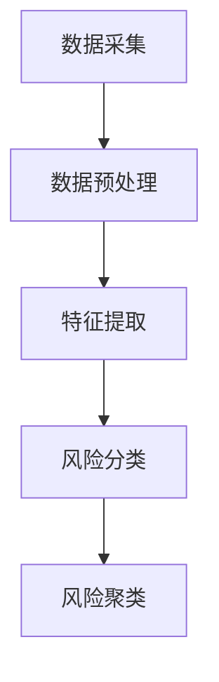
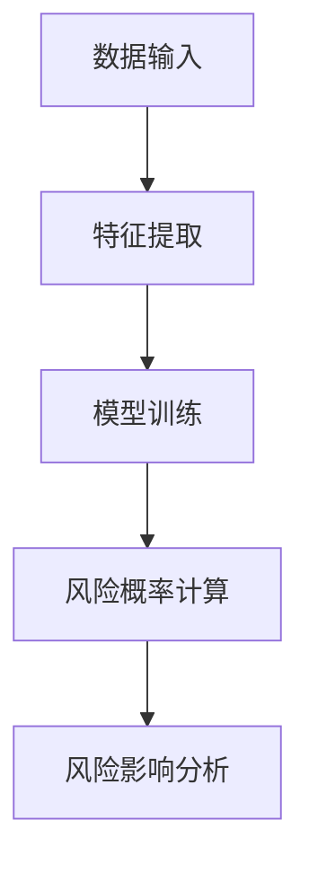
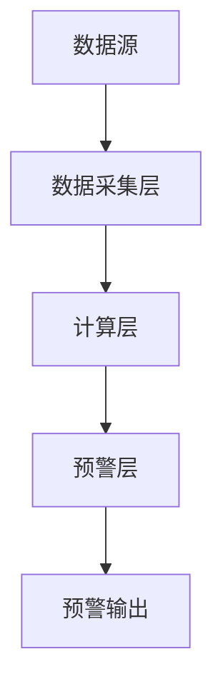
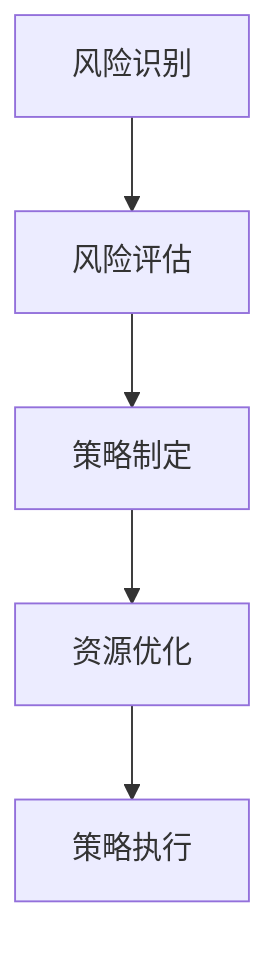

                 

# AI Agent在企业风险评估与管理中的应用

## 关键词：AI Agent, 企业风险管理, 风险评估, 人工智能, 机器学习, 系统架构

## 摘要：  
随着人工智能技术的快速发展，AI Agent（人工智能代理）在企业风险评估与管理中的应用日益广泛。本文从AI Agent的基本概念出发，深入探讨其在风险识别、评估、监控和应对等环节中的具体应用，结合实际案例和系统架构设计，详细分析了AI Agent在企业风险管理中的优势与挑战。通过本文的阐述，读者可以全面了解AI Agent在企业风险管理中的核心原理、应用场景和技术实现方案。

---

## 第一部分: AI Agent在企业风险评估与管理中的应用概述

### 第1章: AI Agent与企业风险管理概述

#### 1.1 AI Agent的基本概念  
AI Agent（人工智能代理）是指能够感知环境、自主决策并执行任务的智能实体。它通过传感器获取信息，利用算法进行分析和推理，并通过执行器完成目标。AI Agent的核心特点包括自主性、反应性、目标导向和学习能力。  

#### 1.2 企业风险管理的背景与挑战  
企业风险管理是指识别、评估和应对可能影响企业目标实现的各种风险的过程。随着全球化和数字化的加速，企业面临的风险种类和复杂性不断增加，传统的人工管理方式已难以满足需求。AI Agent的引入为企业风险管理提供了新的解决方案。  

#### 1.3 AI Agent在企业风险管理中的应用前景  
AI Agent可以通过实时数据分析、智能决策和自动化执行，显著提高企业风险管理的效率和准确性。其在风险识别、评估、监控和应对等环节中的应用前景广阔，尤其是在金融、制造和供应链等领域具有重要潜力。

---

## 第二部分: AI Agent在风险识别与评估中的应用

### 第2章: 风险识别的核心原理  

#### 2.1 数据采集与预处理  
风险识别的第一步是数据采集，包括企业内外部数据的收集。预处理步骤包括数据清洗、标准化和特征提取。  

#### 2.2 风险特征提取  
通过机器学习算法，从海量数据中提取与风险相关的特征，如市场波动、财务指标和客户行为等。  

#### 2.3 风险分类与聚类  
利用监督学习（如随机森林、支持向量机）和无监督学习（如K-means）方法，对风险进行分类和聚类分析。  

**图2-1: 风险分类与聚类流程图**  

---

### 第3章: 基于AI Agent的风险评估模型  

#### 3.1 模型构建与训练  
通过训练数据集构建风险评估模型，常用算法包括逻辑回归、XGBoost和神经网络。  

#### 3.2 风险概率计算  
基于模型输出，计算每个风险事件的发生概率，并结合其影响程度进行综合评估。  

#### 3.3 风险影响分析  
分析不同风险事件对企业的潜在影响，包括财务损失、声誉损失和法律风险等。  

**图3-1: 风险评估模型流程图**  

---

## 第三部分: AI Agent在风险监控与预警中的应用

### 第4章: 实时监控与预警系统  

#### 4.1 流数据处理  
通过流数据处理技术（如Kafka、Flink），实时采集和分析企业内外部数据。  

#### 4.2 基于AI Agent的预警机制  
利用时间序列分析和异常检测算法，识别潜在风险信号，并触发预警机制。  

#### 4.3 系统架构设计  
设计分布式实时监控系统，包括数据采集层、计算层和预警层。  

**图4-1: 实时监控系统架构图**  

---

## 第四部分: AI Agent在风险应对与优化中的应用

### 第5章: 风险缓解与应对策略  

#### 5.1 动态风险应对策略  
根据实时风险评估结果，动态调整应对策略，包括风险规避、风险降低和风险转移。  

#### 5.2 资源优化配置  
利用AI Agent优化资源配置，减少风险事件对企业的影响。  

#### 5.3 系统交互设计  
设计用户友好的交互界面，便于企业用户快速理解和执行风险应对策略。  

**图5-1: 风险应对策略流程图**  

---

## 第五部分: 系统安全与伦理考虑

### 第6章: 系统安全与数据隐私  

#### 6.1 数据加密与访问控制  
通过加密技术和访问控制，确保系统数据的安全性。  

#### 6.2 模型的透明度与可解释性  
提升AI Agent的可解释性，确保模型决策的透明性和合理性。  

#### 6.3 道德与伦理问题  
探讨AI Agent在企业风险管理中的道德与伦理问题，如数据偏见和隐私保护。  

---

## 第六部分: 项目实战与系统实现

### 第7章: 项目实战与系统实现  

#### 7.1 项目环境搭建  
介绍AI Agent开发环境的搭建，包括工具安装和依赖配置。  

#### 7.2 系统核心代码实现  
提供基于Python的AI Agent实现代码，包括数据预处理、模型训练和预警系统。  

#### 7.3 案例分析与经验总结  
通过具体案例分析，总结AI Agent在企业风险管理中的应用经验。  

---

## 第七部分: 总结与展望

### 第8章: 总结与展望  

#### 8.1 核心内容回顾  
总结本文的核心内容，包括AI Agent在企业风险管理中的应用和技术实现。  

#### 8.2 未来发展方向  
展望AI Agent在企业风险管理中的未来发展方向，如多模态数据处理和自适应学习。  

---

## 作者：AI天才研究院 & 禅与计算机程序设计艺术

